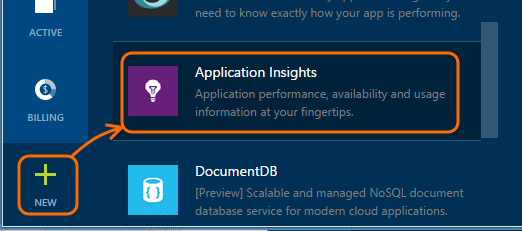
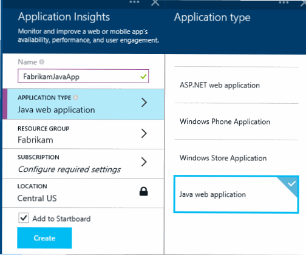
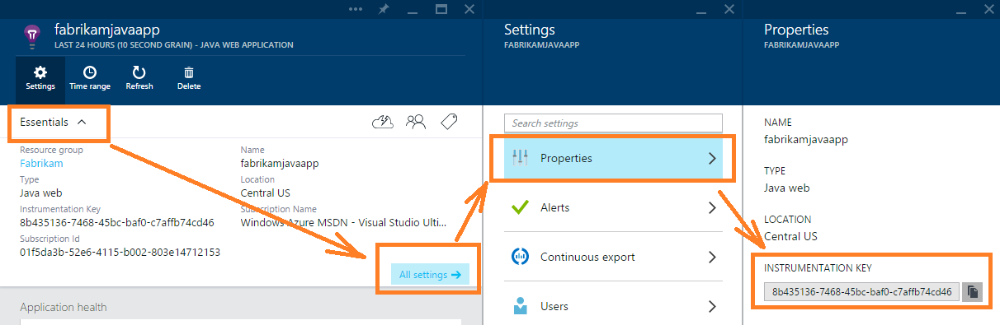

<properties 
	pageTitle="Get started with Application Insights with Java in Eclipse" 
	description="Use the Eclipse plug-in to add performance and usage monitoring to your Java website with Application Insights" 
	services="application-insights" 
    documentationCenter="java"
	authors="alancameronwills" 
	manager="keboyd"/>

<tags 
	ms.service="application-insights" 
	ms.workload="tbd" 
	ms.tgt_pltfrm="ibiza" 
	ms.devlang="na" 
	ms.topic="article" 
	ms.date="03/03/2015" 
	ms.author="awills"/>
 
# Get started with Application Insights with Java in Eclipse

The Application Insights SDK sends telemetry from your Java web application so that you can analyze usage and performance. The Eclipse plug-in for Application Insights automatically installs the SDK in your project so that you get out of the box telemetry, plus an API that you can use to write custom telemetry.   

## Prerequisites

Currently the plug-in works for Dynamic Web Projects in Eclipse. 
([Add Application Insights to other types of Java project][java].)

You'll need:

* Oracle JRE 1.6 or later
* A subscription to [Microsoft Azure](http://azure.microsoft.com/). (You could start with the [free trial](http://azure.microsoft.com/pricing/free-trial/).)
* [Eclipse IDE for Java EE Developers](http://www.eclipse.org/downloads/), Indigo or later.
* Windows 7 or later, or Windows Server 2008 or later

## Install the SDK on Eclipse (one time)

You only have to do this one time per machine. This step installs a toolkit which can then add the SDK to each Dynamic Web Project.

1. In Eclipse, click Help, Install New Software.

    

2. The SDK is in http://dl.msopentech.com/eclipse, under Azure Toolkit. 
3. Uncheck **Contact all update sites...**

    

Follow the remaining steps for each Java project.

## Get an Application Insights instrumentation key

Your usage and performance analytics will be displayed in an Azure resource in the Azure web portal. In this step, you set up an Azure resource for your application.

1. Log into the [Microsoft Azure Portal](https://portal.azure.com). (You'll need an [Azure subscription](http://azure.microsoft.com/).)
2. Create a new Application Insights resource

    
3. Set the application type to Java web application.

    
4. Find the instrumentation key of the new resource. You'll need to paste this into your project in Eclipse.

    

## Add the SDK to your Java project

1. Add Application Insights from the context menu of your web project.

    
2. Paste the instrumentation key that you got from the Azure portal.

    

The key is sent along with every item of telemetry and tells Application Insights to display it in your resource.

## Run the application and see metrics

Run your application.

Return to your Application Insights resource in Microsoft Azure.

HTTP requests data will appear on the overview blade. (If it isn't there, wait a few seconds and then click Refresh.)

 

Click through any chart to see more detailed metrics. 

[Learn more about metrics.][metrics]

 

And when viewing the properties of a request, you can see the telemetry events associated with it such as requests and exceptions.
 

## Client-side telemetry

From the Quick Start tile on the overview blade, you can get a script to add to your web pages. 

Page view, user, and session metrics will appear on the overview blade:

[Learn more about setting up client-side telemetry.][usage]

## Availability web tests

Application Insights can test your website at regular intervals to check that it's up and responding well. Click through the empty web tests chart on the overview blade, and provide your public URL. 

You'll get charts of response times, plus email notifications if your site goes down.

[Learn more about availability web tests.][availability] 

## Diagnostic logs

If you're using Logback or Log4J (v1.2 or v2.0) for tracing, you can have your trace logs sent automatically to Application Insights where you can explore and search on them.

[Learn more about diagnostic logs][javalogs]

## Custom telemetry 

Insert a few lines of code in your Java web application to find out what users are doing with it or to help diagnose problems. 

You can insert code both in web page JavaScript and in the server-side Java.

[Learn about custom telemetry][track]

## Next steps

#### Detect and diagnose issues

* [Add web client telemetry][usage] to get performance telemetry from the web client.
* [Set up web tests][availability] to make sure your application stays live and responsive.
* [Search events and logs][diagnostic] to help diagnose problems.
* [Capture Log4J or Logback traces][javalogs]

#### Track usage

* [Add web client telemetry][usage] to monitor page views and basic user metrics.
* [Track custom events and metrics][track] to learn about how your application is used, both at the client and the server.

<!--Link references-->

[availability]: app-insights-monitor-web-app-availability.md
[diagnostic]: app-insights-diagnostic-search.md
[java]: app-insights-java-get-started.md
[javalogs]: app-insights-java-trace-logs.md
[metrics]: app-insights-metrics-explorer.md
[track]: app-insights-custom-events-metrics-api.md
[usage]: app-insights-web-track-usage.md

