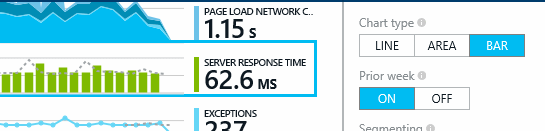
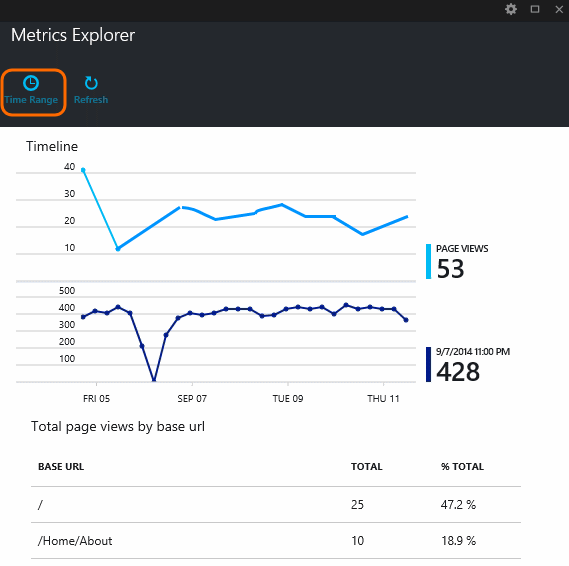
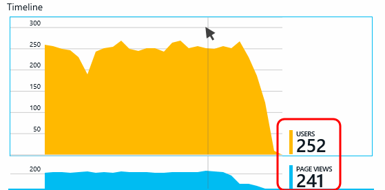
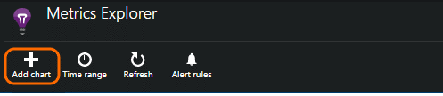

<properties title="Using Metrics Explorer in Application Insights" pageTitle="Metrics explorer" description="Analyze usage, availability and performance of your on-premises or Microsoft Azure web application with Application Insights." metaKeywords="analytics monitoring application insights" authors="awills" manager="kamrani"  />

<tags ms.service="application-insights" ms.workload="tbd" ms.tgt_pltfrm="ibiza" ms.devlang="na" ms.topic="article" ms.date="2015-01-09" ms.author="awills" />
 
# Using Metrics Explorer in Application Insights

Metrics in Application Insights help you detect performance issues and watch trends in how your application is being used.

Metrics are displayed as aggregated values such as sums, averages, or counts. (By contrast, in [Diagnostic Search][diagnostic], you can see individual events.)

Metrics Explorer appears when you click through from some of the charts in your Application Insights overview page. For example, from the Usage analytics lens:

Click on a chart to switch it to a different display style or to compare with the previous week:

Notice that you can adjust the time range that the charts cover:

### What do the figures mean?

With your mouse outside any graph, the numbers displayed at the right are aggregated values over the time range of the chart. 

For some metrics, the number is the sum over the time range, and in others, it's an average. Summed values will change significantly when you change the time range. 

To find out whether the value is a sum or an average, click the chart and scroll down to the selected value. You can also get a short description of the metric.

When you hover your mouse above the chart (but outside the shaded area) the legend shows the value of the metric at that point.

 

The value of a metric for a particular point is the sum or average of the metric over the preceding sampling interval. The interval varies with the time range of the chart, so that the height of the graph changes when you change the time range. This means that the absolute values of the figures aren't very meaningful. However, it's the spikes and troughs in the graph that are most interesting. If there's a sudden jump in the exception count immediately after you published a new version of your app, the message is clear enough.

## Add a new chart

## Select a chart's metrics

You can display more than one metric on a chart, though there are restrictions about the combinations that can be displayed together. As soon as you choose one metric, some of the others are disabled. 

## Set alerts

To be notified by email of unusual values of any metric, add an alert. You can choose either to send the email to the account administrators, or to specific email addresses.

Set the resource before the other properties. Don't choose the webtest resources if you want to set alerts on performance or usage metrics.

Be careful to note the units in which you're asked to enter the threshold value.

*I don't see the Add Alert button.* - Is this a group account to which you have read-only access? Check with the account administrator.

[AZURE.INCLUDE [app-insights-learn-more](../includes/app-insights-learn-more.md)]

