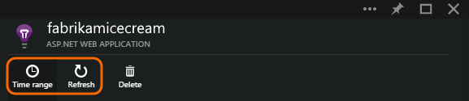
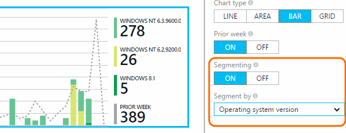
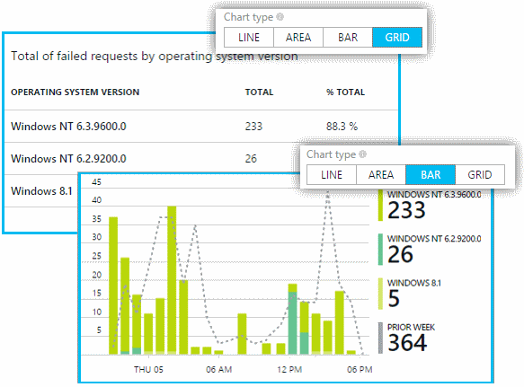

<properties 
	pageTitle="Exploring Metrics in Application Insights" 
	description="Analyze usage, availability and performance of your on-premises or Microsoft Azure web application with Application Insights." 
	services="application-insights" 
	authors="alancameronwills" 
	manager="kamrani"/>

<tags 
	ms.service="application-insights" 
	ms.workload="tbd" 
	ms.tgt_pltfrm="ibiza" 
	ms.devlang="na" 
	ms.topic="article" 
	ms.date="2015-02-05" 
	ms.author="awills"/>
 
# Exploring Metrics in Application Insights

Metrics in [Application Insights][start] are measured values and counts of events that are sent in telemetry from your application. They help you detect performance issues and watch trends in how your application is being used. There's a wide range of standard metrics, and you can also create your own custom metrics and events.

Metrics and event counts are displayed in charts of aggregated values such as sums, averages, or counts.

For example, if you add Application Insights to a web application, here's what you see near the top of the overview:

Some charts are segmented: the total height of the chart at any point is the sum of the metrics displayed. The legend by default shows the largest quantities.

Dotted lines show the value of the metric one week previously.

#### Point values

Hover your mouse over the chart to display the values of the metrics at that point.

The value of the metric at a particular point is averaged over the preceding sampling interval. This can vary depending on the time range of the whole chart. So relative heights are a better guide than absolute values.

#### Time range

You can change the Time range covered by most of the charts or grids on any blade.

Click Refresh if you're expecting some data that hasn't appeared yet. Charts don't update automatically. It can take a while for data to come through the analysis pipeline onto a chart.

## Metrics Explorer

Click through any chart on the overview blade to see a more detailed set of related charts and grids. You can edit these charts and grids to focus on the details you're interested in.

For example, click through the web app's Failed Requests chart:

#### What do the figures mean?

The legend at the side by default shows the aggregated value over the period of the chart.
Different metrics are aggregated in different ways: 

 * For a metric such as response time, values are **averaged** over the period of the chart.
 * For counts of events such as failed requests, the aggregate is the **sum** of counts over the period.
 * For counts of users, the aggregate is the number of **unique** users over the period. (If a user is tracked more than once in the period, they are counted only once.)

To find out whether the value is a sum, average, or unique click the chart and scroll down to the selected value. You can also get a short description of the metric.

 

## Editing charts and grids

To add a new chart to the blade:

Select an existing or new chart to edit what it shows:

You can display more than one metric on a chart, though there are restrictions about the combinations that can be displayed together. As soon as you choose one metric, some of the others are disabled. 

#### Segment your data

Select a chart or grid, switch on segmenting and pick a property to segment by:

#### Edit the chart type

In particular, notice that you can switch between grids and graphs:

##  Set alerts

To be notified by email of unusual values of any metric, add an alert. You can choose either to send the email to the account administrators, or to specific email addresses.

Set the resource before the other properties. Don't choose the webtest resources if you want to set alerts on performance or usage metrics.

Be careful to note the units in which you're asked to enter the threshold value.

*I don't see the Add Alert button.* - Are you using a group account? Do you have read-only access to this application resource? Take a look at the Roles tile near the bottom of the Overview blade. 

#### See your alerts

Alerts are emailed to you. 

They also appear in the Operations Events log:

*Are these "events" related to telemetry events or custom events?*

No. These operational events are just a log of things that have happened to this application resource. 

[AZURE.INCLUDE [app-insights-learn-more](../includes/app-insights-learn-more.md)]

