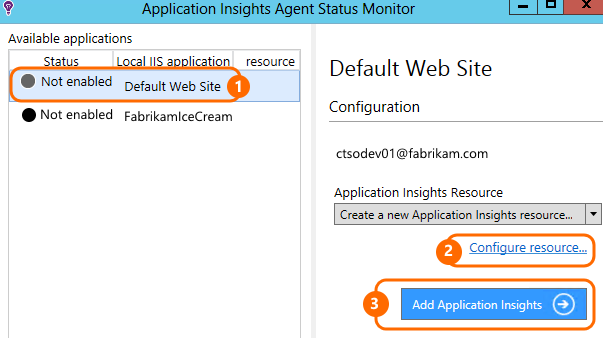
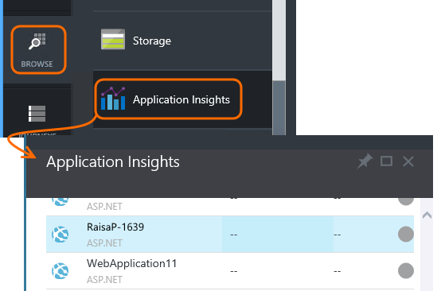
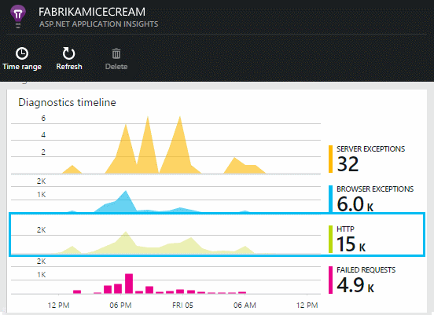
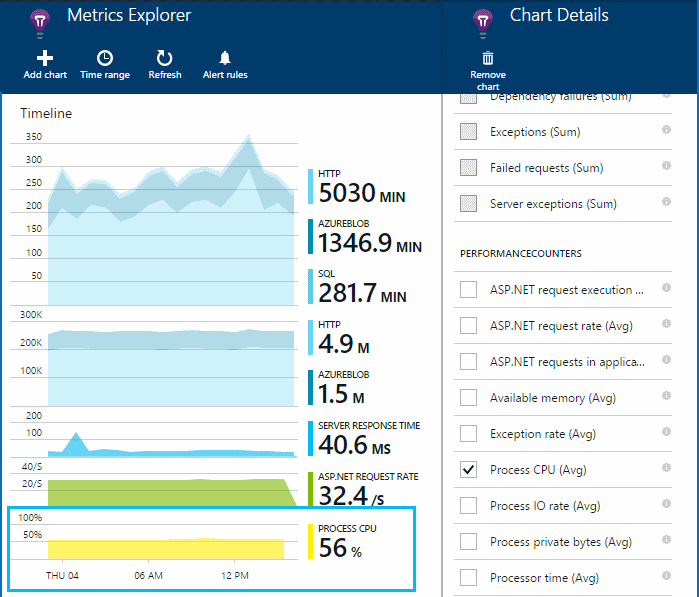

<properties title="Install Application Insights Status Monitor to monitor website performance" pageTitle="Diagnose performance issues on a running website" description="Monitor a website's performance without re-deploying it. Use standalone or with Application Insights SDK" metaKeywords="analytics monitoring application insights" authors="awills"  manager="kamrani" />

<tags ms.service="application-insights" ms.workload="tbd" ms.tgt_pltfrm="ibiza" ms.devlang="na" ms.topic="article" ms.date="2014-12-11" ms.author="awills" />
 

# Install Application Insights Status Monitor to monitor website performance

*Application Insights is in preview.*

Got a web application that's misbehaving? Diagnose exceptions and performance issues quickly without rebuilding or redeploying it. Install the Application Insights Status Monitor in the server, and you'll be able to find performance issues and get stack traces for any exceptions.

Status Monitor can be used either on its own, or as well as [adding Application Insights SDK][greenbrown] to your code. It  instruments your application to monitor calls to external dependencies such as SQL databases, other HTTP endpoints and Azure storage accounts. It also sends performance counters and exception traces.

Status Monitor works for ASP.NET applications hosted on an IIS server. 

You need admin access to the server, and a Microsoft Azure account. 

## Install Application Insights Status Monitor on your web server

1. You need a [Microsoft Azure account](http://azure.com) account. Your organization might have a group account, or you could sign up for a Pay-as-you-go account. While it's in Beta, Application Insights is a free service.

1. On your web server, login with administrator credentials.
2. Download and run the [Status Monitor installer](http://go.microsoft.com/fwlink/?LinkId=506648).

4. In the installation wizard, sign in to Microsoft Azure.

    

5. Pick the installed web application or website that you want to monitor, then configure the name under which you want to see the results in the Application Insights portal. .

    

    Normally, you should choose to configure a new resource.

    You might use an existing resource if, for example, if you already set up [web tests][availability] for your site.  

6. Restart IIS.
    

6. Notice that ApplicationInsights.config has been inserted into the websites that you want to monitor.

    

   There are also some changes to web.config.

### Want to (re)configure later?

After you complete the wizard, you can re-configure the agent whenever you want. You can also use this if you installed the agent but there was some trouble with the initial setup.

## View performance telemetry

Open your account in Azure, browse Application Insights and open the resource that you created.

You'll see data under Diagnostics.

Click through any chart to see more details.

#### Dependencies

The charts labeled HTTP, SQL, AZUREBLOB show the response times and counts of calls to dependencies: that is, external services that your application uses.

#### Performance counters

Click any performance counter chart to change what it shows. Or you can add a new chart. 
 
#### Exceptions

You can drill down to specific exceptions (from the last seven days) and get stack traces and context data.

### No telemetry?

  * Use your site, to generate some data.
  * Wait a few minutes to let the data arrive, then click Refresh.
  * Make sure your server firewall allows outgoing traffic on port 443 to dc.services.visualstudio.com 
  * See [Troubleshooting][qna].

## Next steps

* [Create web tests][availability] to make sure your site stays live.
* [Search events and logs][diagnostic] to help diagnose problems.
* [Add web client telemetry][usage] to see exceptions from web page code and to let you insert trace calls.
* [Add Application Insights SDK to your web service code][greenbrown] so that you can insert trace and log calls in the server code.

[AZURE.INCLUDE [app-insights-learn-more](../includes/app-insights-learn-more.md)]

