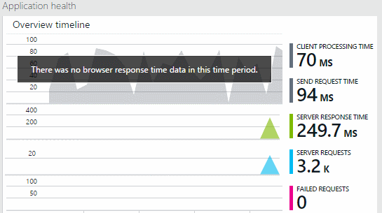

<properties title="Diagnose performance issues on a running website" pageTitle="Diagnose performance issues on a running website" description="Monitor a website's performance without re-deploying it." metaKeywords="analytics monitoring application insights" authors="awills"  manager="kamrani" />

<tags ms.service="application-insights" ms.workload="tbd" ms.tgt_pltfrm="ibiza" ms.devlang="na" ms.topic="article" ms.date="2014-09-24" ms.author="awills" />
 

# Monitor performance on a live website now

*Application Insights is in preview.*

Got a web application that's misbehaving? Diagnose exceptions and performance issues quickly without rebuilding or redeploying it. Install the Application Insights agent in the server and you'll be able to find performance bottlenecks and get stack traces for any exceptions. 

#### When should I use this method to set up Application Insights?

This approach is mainly for quickly diagnosing performance issues in a live IIS website.

You just install an agent in the server and see performance data on Application Insights.

- You can apply this to an ASP.NET app hosted on an IIS server.

- You need a [Microsoft Azure account](http://azure.com), so that you can see your data.

- You'll need admin access to the server where your web app is running. 

- You *don't* need the code of the web app, and you don't have to rebuild or redeploy the app. 

- This method instruments the web app as it stands. You don't insert trace or log code. (But you can do that later if you want.)

If you want to insert logging or diagnostic traces, don't continue here - instead, [add Application Insights to your project][greenbrown] and redeploy it. For the full range of options, read [Application Insights - getting started][start].

## Install the Application Insights agent on your web server

1. On your web server, login with administrator credentials.

2. Make sure you have version 5.0 or later of [Web Platform Installer](http://www.microsoft.com/web/downloads/platform.aspx).
3. Install Application Insights Agent, using Web Platform Installer.

    
4. In the installation wizard, sign in to Microsoft Azure.

    
5. Pick the installed web application or website that you want to monitor, then configure the name under which you want to see the results in the Application Insights portal. Finally, click the 'Add' button.

    

    Normally, you should choose to create a new resource.

    You might use an existing resource if, for example, if you already set up [web tests][availability] for your site.  

6. Notice that ApplicationInsights.config has been inserted into the websites that you want to monitor.

    

   There are also some changes to web.config.

### Want to (re)configure later?

After you complete the wizard, you can re-configure the agent whenever you want. You can also use this if you installed the agent but there was some trouble with the initial setup.

## View your data

Open your account in Azure, browse Application Insights and open the resource that you created.

You'll see data under Application Health.

#### No data?

  * Use your site, to generate some data.
  * Wait a few minutes to let the data arrive.
  * Make sure your server firewall allows outgoing traffic on port 443 to dc.services.visualstudio.com 

#### What can I do with the Application Health reports?
 * [Understand the data and configure the tiles][perf]

## Next steps

[View data][perf]

[Search diagnostic logs][diagnostic]

[Web tests][availability]

[Set up usage monitoring][start]

[Troubleshooting][qna]

[AZURE.INCLUDE [app-insights-learn-more](../includes/app-insights-learn-more.md)]

