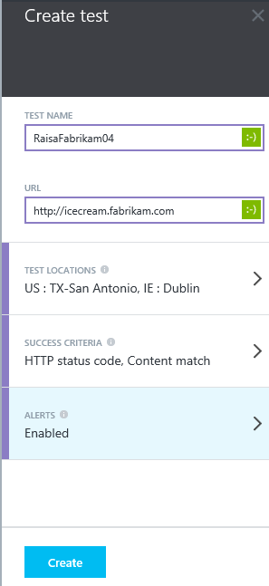
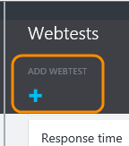
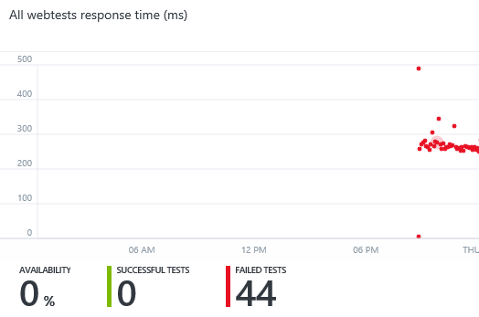
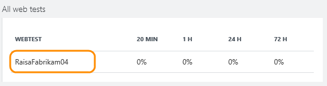
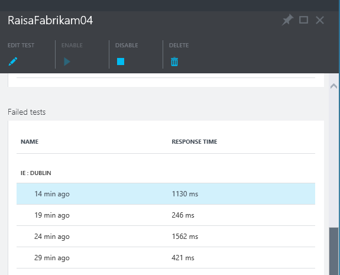
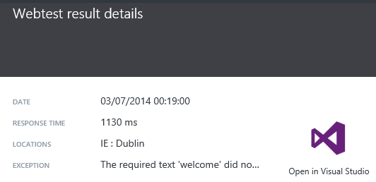
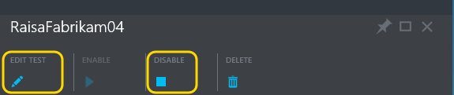

<properties title="Monitor your web app's availability and responsiveness" pageTitle="Web tests in Application Insights" description="Make sure your web application is available and responsive. Get alerts if it becomes unavailable or responds slowly." metaKeywords="analytics web test" authors="awills"  />

<tags ms.service="application-insights" ms.workload="tbd" ms.tgt_pltfrm="ibiza" ms.devlang="na" ms.topic="article" ms.date="01/01/1900" ms.author="awills" />
 
# Monitor your web app's availability and responsiveness

After you've deployed your web application, you can set up web tests to monitor its availability and responsiveness. Application Insights will send web requests at regular intervals from points around the world, and can alert you if your application responds slowly or not at all.

You can set up web tests for any HTTP endpoint that is accessible from the public internet.

1. [Create a new application?](#create)
+ [Set up a web test](#setup)
+ [See monitor reports](#monitor)
+ [Edit or disable a test](#edit)
+ [Video: Monitoring availability](#video)
+ [Next steps](#next)

## 1. Create a new application?

Skip this step if you're already [monitoring usage and health][start] for this web app, and you want to see the availability data in the same place.

But if you want to keep these results separate, login to Microsoft Azure preview and create a new application in Application Insights. 

## 2. Set up a web test

In the home blade for your application in Application Insights, click through the empty webtests tile. 

> *Already got web tests? Click through the webtests tile and then choose Add Webtest.*

Provide a name for the test, and the URL that you want to test. The URL has to be visible from the public internet.

- Test locations are the places from where our servers send web requests to your URL. Choose two or three so that you can distinguish problems in your website from network issues. You can't select more than three.

- Success criteria - Specify the acceptable HTTP return codes - 200 is usual. 

    You can also specify a string that should be found in every correct response. It must be a plain string, without wildcards. Don't forget that if your content changes you might have to update it.

- Alerts - By default, alerts are sent to you if there are repeated failures over 15 minutes. But you can change it to be more sensitive, and you can also change the notified email addresses.

### Test more URLs

You can add more tests for as many URLs as you like. For example, as well as testing your home page, you could make sure your database is running by testing the URL for a search.

## 3. See monitor reports

After 1-2 minutes, close and re-open the application blade. (In this release, it doesn't refresh automatically.)

This is a summary. If you've defined several web tests for this application, they're all combined here.

Click through to the Webtests blade to see a list of your web tests.

Open a specific web test.

In the specific web test blade, scroll down to **Failed tests** and pick a result.

The result shows the reason for failure.

For more detail, download the result file and inspect it in Visual Studio.

## 4. Edit or disable a test

Open an individual test to edit or disable it.

You might want to disable web tests while you are performing maintenance on your service.

## Monitoring availability

> [AZURE.VIDEO monitoring-availability-with-application-insights]

## Next steps

[Search diagnostic logs][diagnostic]

[Troubleshooting][qna]

## Learn more

* [Application Insights - get started][start]
* [Monitor a live web server now][redfield]
* [Monitor performance in web applications][perf]
* [Search diagnostic logs][diagnostic]
* [Availability tracking with web tests][availability]
* [Track usage][usage]
* [Q & A and troubleshooting][qna]

<!--Link references-->

[start]: ../app-insights-start-monitoring-app-health-usage/
[redfield]: ../app-insights-monitor-performance-live-website-now/
[perf]: ../app-insights-web-monitor-performance/
[diagnostic]: ../app-insights-search-diagnostic-logs/ 
[availability]: ../app-insights-monitor-web-app-availability/
[usage]: ../app-insights-web-track-usage/
[qna]: ../app-insights-troubleshoot-faq/

