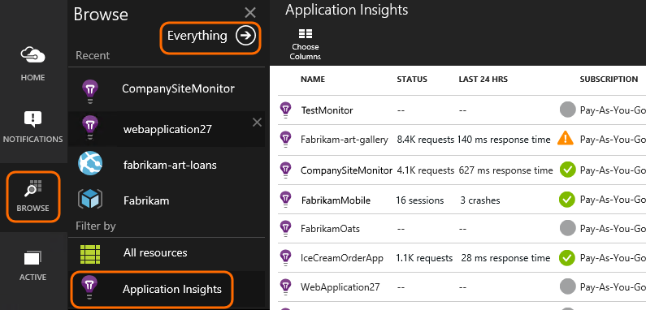

<properties 
	pageTitle="Resources, roles and access control in Application Insights" 
	description="Owners, contributors and readers of your organization's insights." 
	services="application-insights" 
    documentationCenter=""
	authors="alancameronwills" 
	manager="ronmart"/>

<tags 
	ms.service="application-insights" 
	ms.workload="tbd" 
	ms.tgt_pltfrm="ibiza" 
	ms.devlang="na" 
	ms.topic="article" 
	ms.date="04/21/2015" 
	ms.author="awills"/>
 
# Resources, roles, and access control in Application Insights

You can control who has read and update access to your data in Visual Studio [Application Insights][start], by using [Role-based access control in Microsoft Azure](role-based-access-control-configure.md).

> [AZURE.IMPORTANT] Assign access to users in the **resource group or subscription** to which your application resource belongs - not in the resource itself. Assign the **Application Insights component contributor** role. This ensures uniform control of access to web tests and alerts along with your application resource. [Learn more](#access).

## Resources, groups and subscriptions

First, some definitions:

* **Resource** - An instance of a Microsoft Azure service. Your Application Insights resource collects, analyzes and displays the telemetry data sent from your application.  Other types of Azure resources include web apps, databases, and VMs. 

    To see all your resources, go to the [Azure Portal][portal], sign in, and click Browse.

    

* [**Resource group**][group] - Every resource belongs to one group. A group is a convenient way to manage related resources, particularly for access control. For example, into one resource group you could put a Web App, an Application Insights resource to monitor the app, and a Storage resource to keep exported data.

    
    

* [**Subscription**](https://manage.windowsazure.com) - To use Application Insights or other Azure resources, you sign in to an Azure subscription. Every resource group belongs to one Azure subscription, where you choose your price package and, if it's an organization subscription, choose the members and their access permissions. 
* [**Microsoft account**][account] - The username and password that you use to sign in to Microsoft Azure subscriptions, XBox Live, Outlook.com, and other Microsoft services.

##  Control access in the resource group

It's important to understand that in addition to the resource you created for your application, there are also separate hidden resources for alerts and web tests. They are attached to the same [resource group](#resource-group) as your application. You might also have put other Azure services in there, such as websites or storage.

To control access to these resources it's therefore recommended to:

* Control access at the **resource group or subscription** level.
* Assign the **Application Insights Component contributor** role to users. This allows them to edit web tests, alerts, and Application Insights resources, without providing access to any other services in the group. 

## To provide access to another user

You must have Owner rights to the subscription or the resource group.

The user must have a [Microsoft Account][account]. You can provide access to individuals, and also to user groups defined in Azure Active Directory.

#### Navigate to the resource group

Add the user there.

Or you could go up another level and add the user to the Subscription.

#### Select a role

Role | In the resource group
---|---
Owner | Can change anything, including user access
Contributor | Can edit anything, including all resources
Application Insights Component contributor | Can edit Application Insights resources, web tests and alerts
Reader | Can view but not change anything

'Editing' includes creating, deleting and updating:

* Resources
* Web tests
* Alerts
* Continuous export

#### Select the user

If the user you want isn't in the directory, you can invite anyone with a Microsoft account. 
(If they use services like Outlook.com, OneDrive, Windows Phone, or XBox Live, they have a Microsoft account.)

## Users and roles

* [Role based access control in Azure](role-based-access-control-configure.md)

<!--Link references-->

[account]: https://account.microsoft.com
[group]: azure-preview-portal-using-resource-groups.md
[portal]: http://portal.azure.com/
[start]: app-insights-get-started.md

