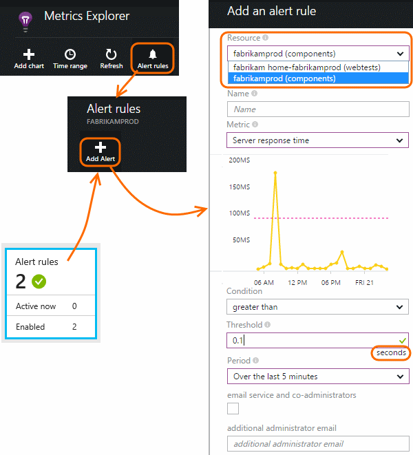

<properties 
	pageTitle="Set Alerts in Application Insights" 
	description="Get emails about crashes, exceptions, metric changes." 
	services="application-insights" 
    documentationCenter=""
	authors="alancameronwills" 
	manager="ronmart"/>

<tags 
	ms.service="application-insights" 
	ms.workload="tbd" 
	ms.tgt_pltfrm="ibiza" 
	ms.devlang="na" 
	ms.topic="article" 
	ms.date="04/17/2015" 
	ms.author="awills"/>
 
# Set Alerts in Application Insights

[Visual Studio Application Insights][start] can alert you to changes in performance or usage metrics in your app. 

Application Insights monitors your live app on a [wide variety of platforms][platforms] to help you diagnose performance issues and understand usage patterns.

There are two kinds of alerts:
 
* **Web tests** tell you when your site is unavailable on the internet, or responding slowly. [Learn more][availability].
* **Metric alerts** tell you when any metric crosses a threshold value for some period - such as failure counts, memory, or page views. 

There's a [separate page about web tests][availability], so we'll focus on metric alerts here.

## Metric alerts

If you haven't set up Application Insights for your app, [do that first][start].

To get an email when a metric crosses a threshold, start either from Metrics Explorer, or from the Alert rules tile on the overview blade.

Set the resource before the other properties. Don't choose the webtest resources if you want to set alerts on performance or usage metrics.

Be careful to note the units in which you're asked to enter the threshold value.

*I don't see the Add Alert button.* - Are you using an organizational account? You can set alerts if you have owner or contributor access to this application resource. Take a look at Settings -> Users. [Learn about access control][roles].

## See your alerts

Alerts are emailed to you. 

They also appear in the Operations Events log:

*Are these "events" related to telemetry events or custom events?*

* No. These operational events are just a log of things that have happened to this application resource. 

## Availability alerts

You can set up web tests that test any web site from points around the world. [Learn more][availability].

## What are good alerts to set?

It depends on your application. To start with, it's best not to set too many metrics. Spend some time looking at your metric charts while your app is running, to get a feel for how it behaves normally. This will help you find ways to improve its performance. Then set up alerts to tell you when the metrics go outside the normal zone. 

Popular alerts include:

* [Web tests][availability] are important if your application is a website or web service that is visible on the public internet. They tell you if your site goes down or responds slowly - even if it's the carrier's problem rather than your app. But they're synthetic tests, so they don't measure your users' actual experience.
* [Browser metrics][client], especially Browser page load times, are good for web applications. If your page has a lot of scripts, you'll want to look out for browser exceptions. In order to get these metrics and alerts, you have to set up [web page monitoring][client].
* Server response time and Failed requests for the server side of web applications. As well as setting up alerts, keep an eye on these metrics to see if they vary disproportionately with high request rates: that might indicate that your app is running out of resources.

<!--Link references-->

[availability]: app-insights-monitor-web-app-availability.md
[client]: app-insights-javascript.md
[platforms]: app-insights-platforms.md
[roles]: app-insights-resources-roles-access-control.md
[start]: app-insights-get-started.md

