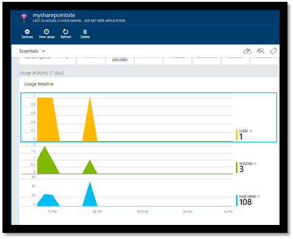
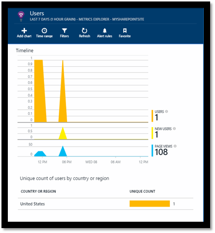

<properties 
	pageTitle="Monitor a SharePoint site with Application Insights" 
	description="Start monitoring a new application with a new instrumentation key" 
	services="application-insights" 
    documentationCenter=""
	authors="alancameronwills" 
	manager="ronmart"/>

<tags 
	ms.service="application-insights" 
	ms.workload="tbd" 
	ms.tgt_pltfrm="ibiza" 
	ms.devlang="na" 
	ms.topic="article" 
	ms.date="04/16/2015" 
	ms.author="awills"/>

# Monitor a SharePoint site with Application Insights

[AZURE.INCLUDE [app-insights-selector-get-started](../includes/app-insights-selector-get-started.md)]

Visual Studio Application Insights monitors the availability, performance and usage of your apps. Here you'll learn how to set it up for a SharePoint app.

## Create an Application Insights resource

In the [Azure portal](http://portal.azure.com), create a new Application Insights resource. Choose ASP.NET as the application type.

The blade that opens is the place where you'll see performance and usage data about your app. To get back to it next time you login to Azure, you should find a tile for it on the start screen. Alternatively click Browse to find it.
    

## Add our script to your web pages

In Quick Start, get the script for web pages:

Insert the script just before the &lt;/head&gt; tag of every page you want to track. If your website has a master page, you can put the script there. For example, in an ASP.NET MVC project, you'd put it in View\Shared\_Layout.cshtml

The script contains the instrumentation key that directs the telemetry to your Application Insights resource.

### Add the code to your site pages

#### On the master page

If you can edit the site's master page, that will provide monitoring for every page in the site.

Check out the master page and edit it using SharePoint Designer or any other editor.

Add the code just before the </head> tag. 

#### Or on individual pages

To monitor a limited set of pages, add the script separately to each page. 

Insert a web part and embed the code snippet in it.

## View data about your app

Return to your application blade in the [Azure portal](http://portal.azure.com).

The first events will appear in Diagnostic Search. 

Click Refresh after a few seconds if you're expecting more data.

**Usage analytics** provides a quick snapshot of users, sessions and page views:

Click through Page Views to see more details: 

Click through Users to see details about new users and their locations.

## Next Steps

* [Web tests](app-insights-monitor-web-app-availability.md) to monitor the availability of your site.

* [Application Insights](app-insights-get-started.md) for other types of app.

<!--Link references-->

[alerts]: app-insightss-alerts.md
[android]: https://github.com/Microsoft/AppInsights-Android
[api]: app-insights-custom-events-metrics-api.md
[apiproperties]: app-insights-custom-events-metrics-api.md#properties
[apiref]: http://msdn.microsoft.com/library/azure/dn887942.aspx
[availability]: app-insights-monitor-web-app-availability.md
[azure]: insights-perf-analytics.md
[azure-availability]: insights-create-web-tests.md
[azure-usage]: insights-usage-analytics.md
[azurediagnostic]: insights-how-to-use-diagnostics.md
[client]: app-insights-web-track-usage.md
[config]: app-insights-configuration-with-applicationinsights-config.md
[data]: app-insights-data-retention-privacy.md
[desktop]: app-insights-windows-desktop.md
[detect]: app-insights-detect-triage-diagnose.md
[diagnostic]: app-insights-diagnostic-search.md
[eclipse]: app-insights-java-eclipse.md
[exceptions]: app-insights-web-failures-exceptions.md
[export]: app-insights-export-telemetry.md
[exportcode]: app-insights-code-sample-export-telemetry-sql-database.md
[greenbrown]: app-insights-start-monitoring-app-health-usage.md
[java]: app-insights-java-get-started.md
[javalogs]: app-insights-java-trace-logs.md
[javareqs]: app-insights-java-track-http-requests.md
[knowUsers]: app-insights-overview-usage.md
[metrics]: app-insights-metrics-explorer.md
[netlogs]: app-insights-asp-net-trace-logs.md
[new]: app-insights-create-new-resource.md
[older]: http://www.visualstudio.com/get-started/get-usage-data-vs
[perf]: app-insights-web-monitor-performance.md
[platforms]: app-insights-platforms.md
[portal]: http://portal.azure.com/
[qna]: app-insights-troubleshoot-faq.md
[redfield]: app-insights-monitor-performance-live-website-now.md
[roles]: app-insights-role-based-access-control.md
[start]: app-insights-get-started.md
[trace]: app-insights-search-diagnostic-logs.md
[track]: app-insights-custom-events-metrics-api.md
[usage]: app-insights-web-track-usage.md
[windows]: app-insights-windows-get-started.md
[windowsCrash]: app-insights-windows-crashes.md
[windowsUsage]: app-insights-windows-usage.md

