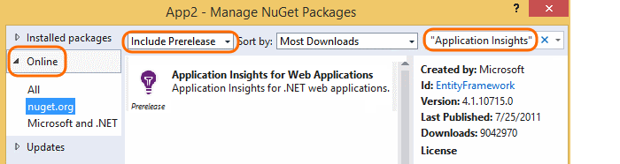

<properties 
	pageTitle="Add Application Insights SDK to monitor your ASP.NET app" 
	description="Analyze usage, availability and performance of your on-premises or Microsoft Azure web application with Application Insights." 
	services="application-insights" 
    documentationCenter=".net"
	authors="alancameronwills" 
	manager="keboyd"/>

<tags 
	ms.service="application-insights" 
	ms.workload="tbd" 
	ms.tgt_pltfrm="ibiza" 
	ms.devlang="na" 
	ms.topic="article" 
	ms.date="03/31/2015" 
	ms.author="awills"/>

# Add Application Insights SDK to monitor your ASP.NET app

*Application Insights is in preview.*

[AZURE.INCLUDE [app-insights-selector-get-started](../includes/app-insights-selector-get-started.md)]

Visual Studio Application Insights monitors your live application to help you [detect and diagnose performance issues and exceptions][detect], and [discover how your app is used][knowUsers]. It can be used with a wide variety of application types. It works for apps that are hosted on your own IIS servers or Azure VMs, as well as Azure web apps. ([Device apps and Java servers are also covered][start].)

For many application types, [Visual Studio can add Application Insights to your app](#ide) almost without you noticing. But since you're reading this to get a better understanding of what's going on, we'll take you through the steps manually.

#### Before you start

You need:

* A subscription to [Microsoft Azure](http://azure.com). If your team or organization has an Azure subscription, the owner can add you to it, using your [Microsoft account](http://live.com).
* Visual Studio 2013 or later.

##  1. Create an Application Insights resource

Sign in to the [Azure portal][portal], and create a new Application Insights resource. Choose ASP.NET as the application type. 

A [resource][roles] in Azure is an instance of a service. This resource is where telemetry from your app will be analyzed and presented to you.

The choice of application type sets the default content of the resource blades and the properties visible in [Metrics Explorer][metrics].

####  Take a copy of the Instrumentation Key.

The key identifies the resource, and you'll install it soon in the SDK to direct data to the resource.

##  2. Install the SDK in your application

1. In Visual Studio, edit the NuGet packages of your desktop app project.

    

2. Install Application Insights SDK for Web Apps.

    

3. Edit ApplicationInsights.config (which has been added by the NuGet install). Insert this just before the closing tag:

    `<InstrumentationKey>` *the instrumentation key you copied* `</InstrumentationKey>`

    (You can alternatively [set the key by writing some code][apikey] in your app.)

##  3. Run your project

Run your application with F5 and try it out: open different pages to generate some telemetry.

In Visual Studio, you'll see a count of the events that have been sent.

##  4. View your telemetry

Return to the [Azure portal][portal] and Browse to your Application Insights resource.

Look for data in the Overview charts. At first, you'll just see one or two points. For example:

Click through any chart to see more detailed metrics. [Learn more about metrics.][perf]

Now deploy your application and watch the data accumulate.

When you run in debug mode, telemetry is expedited through the pipeline, so that you should see data appearing within seconds. When you deploy your app, data accumulates more slowly.

[Next steps](#next-steps)

#### No data?

* Open the [Diagnostic Search][diagnostic] tile, to see individual events.
* Use the application, opening different pages so that it generates some telemetry.
* Wait a few seconds and click Refresh.
* See [Troubleshooting][qna].

#### Trouble on your build server?

Please see [this Troubleshooting item](app-insights-troubleshoot-faq.md#NuGetBuild).

##  The automated way

If you prefer to use Visual Studio to set things up, it's very simple.

You'll need [Visual Studio 2013 Update 3](http://go.microsoft.com/fwlink/?linkid=397827&clcid=0x409) or later and an account in [Microsoft Azure](http://azure.com).

#### If it's a new project...

When you create a new project in Visual Studio, make sure Application Insights is selected. 

Visual Studio creates a resource in Application Insights, adds the SDK to your project, and places the key in the `.config` file.

If your project has web pages, it also adds the [JavaScript SDK][client] to the master web page.

#### ... or if it's an existing project

Right click the project in Solution Explorer, and choose Add Application Insights.

Visual Studio creates a resource in Application Insights, adds the SDK to your project, and places the key in the `.config` file.

In this case, it doesn't add the [JavaScript SDK][client] to your web pages - we recommend you do that as the next step.

#### Setup options

If this is your first time, you'll be asked login or sign up to Microsoft Azure Preview. (It's separate from your Visual Studio Online account.)

If this app is part of a bigger application, you might want to use **Configure settings** to put it in the same resource group as the other components. 

*No Application Insights option? Check you're using Visual Studio 2013 Update 3 or later, that Application Insights Tools are enabled in Extensions and Updates, and that you're creating a web project.*

#### Open Application Insights from your project.

## Next steps

Now that you're sending data from the server side of your app, here are some steps to get a more 360-degree view:

* [Set up web tests][availability] to make sure your application stays live and responsive.
* [Add the JavaScript SDK to your web pages][client] to get browser-based telemetry such as page view counts, page load times, script exceptions, and to let you write custom telemetry in your page scripts.
* Add dependency tracking to diagnose issues caused by databases or other components used by your app 
 * [Add dependency tracking in your IIS server][redfield]
 * [Add dependency tracking in your Azure Web App][azure]
* [Capture log traces][netlogs] from your favorite logging framework
* [Track custom events and metrics][api] in client or server or both, to learn more about how your application is used.

## Video

> [AZURE.VIDEO getting-started-with-application-insights]

<!--Link references-->

[api]: app-insights-api-custom-events-metrics.md
[apikey]: app-insights-api-custom-events-metrics.md#ikey
[availability]: app-insights-monitor-web-app-availability.md
[azure]: insights-perf-analytics.md
[client]: app-insights-javascript.md
[detect]: app-insights-detect-triage-diagnose.md
[diagnostic]: app-insights-diagnostic-search.md
[knowUsers]: app-insights-overview-usage.md
[metrics]: app-insights-metrics-explorer.md
[netlogs]: app-insights-asp-net-trace-logs.md
[perf]: app-insights-web-monitor-performance.md
[portal]: http://portal.azure.com/
[qna]: app-insights-troubleshoot-faq.md
[redfield]: app-insights-monitor-performance-live-website-now.md
[roles]: app-insights-resources-roles-access-control.md
[start]: app-insights-get-started.md

