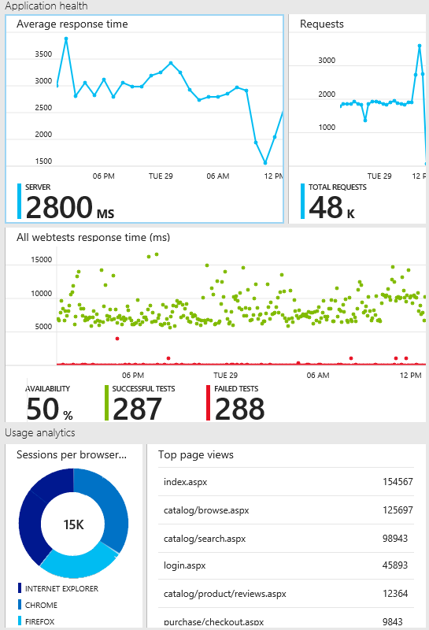

<properties title="Application Insights" pageTitle="Application Insights - start monitoring your app's health and usage" description="Analyze usage, availability and performance of your on-premises or Microsoft Azure web application with Application Insights." metaKeywords="analytics monitoring application insights" authors="awills"  manager="kamrani" />

<tags ms.service="application-insights" ms.workload="tbd" ms.tgt_pltfrm="ibiza" ms.devlang="na" ms.topic="article" ms.date="2014-09-24" ms.author="awills" />

# Application Insights - Start monitoring your app's health and usage

*Application Insights is in preview.*

Application Insights lets you monitor your live application for:

* **Availability** - We'll test your URLs every few minutes from around the world.
* **Performance**  - Detect and diagnose perf issues and exceptions.
* **Usage** - Find out what users are doing with your app, so that you can make it better for them.

For alternative ways in, read [Get Started with Application Insights][start].

## Add Application Insights to your project

You'll need [Visual Studio 2013 Update 3](http://go.microsoft.com/fwlink/?linkid=397827&clcid=0x409) (or later) and an account in [Microsoft Azure](http://azure.com).

### If it's a new project...

When you create a new project in Visual Studio 2013, make sure Application Insights is selected. 

If this is your first time, you'll be asked login or sign up to Microsoft Azure Preview. (It's separate from your Visual Studio Online account.)

Use **Configure settings** if you want the Azure resource to have a different name than your project, or if you want the resource to appear under the same group as a different project. 

*No Application Insights option? Check you're using Visual Studio 2013 Update 3, that Application Insights Tools are enabled in Extensions and Updates, and that you're creating a web, Windows Store, or Windows Phone project.*

### ... or if it's an existing project

Right click the project in Solution Explorer, and choose Add Application Insights.

*There's one more step if you want to set up web usage analytics, but let's see some data first...*

### 2. Run your project

Run your application with F5 and try it out - open different pages.

In Visual Studio, you'll see a count of the events that have been received.

### 3. See monitor data

Open Application Insights from your project.

Look for data in the **Application health** tiles. At first, you'll just see one or two points. For example:

Click any tile to see more detail. You can change what you see in the reports. [Learn more about configuring Application Health reports.][perf]

### 4. Deploy your application

Deploy your application and watch the data accumulate.

Once you have a live application, [set up web tests][availability] to make sure it stays live. 

### Want to change the name of your application in the portal?

You can change the resource to which your project sends telemetry. 

(The 'resource' is the named Application Insights blade where your results appear. You can put more than one resource into a group - for example if you have several projects that form part of one business application.) 

In Solution Explorer, right-click ApplicationInsights.config, and choose **Update Application Insights**. This opens a wizard where you can choose a different existing resource, or create a new one.

Afterwards, go back to the portal and delete the old resource.

## Video

> [AZURE.VIDEO getting-started-with-application-insights]

## Next steps

[Track usage of your web app][usage]

[Monitor performance in web applications][perf]

[Capture and search diagnostic logs][diagnostic]

[Troubleshooting][qna]

[AZURE.INCLUDE [app-insights-learn-more](../includes/app-insights-learn-more.md)]

