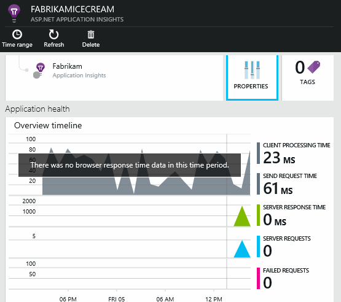

<properties 
	pageTitle="Add Application Insights SDK to your web project" 
	description="Analyze usage, availability and performance of your on-premises or Microsoft Azure web application with Application Insights." 
	services="application-insights" 
	authors="alancameronwills" 
	manager="kamrani"/>

<tags 
	ms.service="application-insights" 
	ms.workload="tbd" 
	ms.tgt_pltfrm="ibiza" 
	ms.devlang="na" 
	ms.topic="article" 
	ms.date="2015-02-03" 
	ms.author="awills"/>

# Add Application Insights SDK to your web project

*Application Insights is in preview.*

Add the Application Insights SDK to monitor your application for:

* **Performance**  - Detect and diagnose perf issues and exceptions.
* **Usage** - Find out what users are doing with your app.

(For more options, see [Get Started with Application Insights][start]).

## 1. Add Application Insights to your project

You'll need [Visual Studio 2013 Update 3](http://go.microsoft.com/fwlink/?linkid=397827&clcid=0x409) (or later) and an account in [Microsoft Azure](http://azure.com).

#### If it's a new project...

When you create a new project in Visual Studio 2013, make sure Application Insights is selected. 

#### ... or if it's an existing project

Right click the project in Solution Explorer, and choose Add Application Insights.

#### Setup options

If this is your first time, you'll be asked login or sign up to Microsoft Azure Preview. (It's separate from your Visual Studio Online account.)

If this app is part of a bigger application, you might want to use **Configure settings** to put it in the same resource group as the other components. 

*No Application Insights option? Check you're using Visual Studio 2013 Update 3, that Application Insights Tools are enabled in Extensions and Updates, and that you're creating a web project.*

## 2. Run your project

Run your application with F5 and try it out - open different pages.

In Visual Studio, you'll see a count of the events that have been received.

### 3. View telemetry

Open Application Insights from your project.

Look for data in the **Overview** charts. At first, you'll just see one or two points. For example:

Click through any chart to see more detailed metrics. [Learn more about metrics.][perf]

Now deploy your application and watch the data accumulate.

When you run in debug mode, telemetry is expedited through the pipeline, so that you should see data appearing within seconds. When you deploy your app, data accumulates more slowly.

#### No data?
* Wait a few seconds and click Refresh.
* Use the application, opening different pages so that it generates some telemetry.
* See [Troubleshooting][qna].

#### Trouble on your build server?

Please see [this Troubleshooting item](../app-insights-troubleshoot-faq/#NuGetBuild).

## Next steps

#### Detect and diagnose issues

* [Set up web tests][availability] to make sure your application stays live and responsive.
* [Install Status Monitor in your server][redfield] to get additional performance data and monitor your application's calls to external services.
* [Search events and logs][diagnostic] to help diagnose problems.
* [Add web client telemetry][usage] to see exceptions in web page code and to let you insert trace calls.

#### Track usage

* [Add web client telemetry][usage] to monitor page views and basic user metrics.
* [Track custom events and metrics][track] to learn about how your application is used.

## Video

> [AZURE.VIDEO getting-started-with-application-insights]

[AZURE.INCLUDE [app-insights-learn-more](../includes/app-insights-learn-more.md)]

