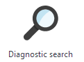
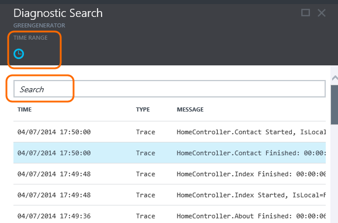
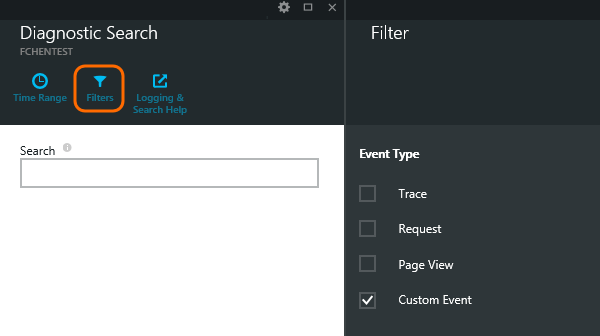
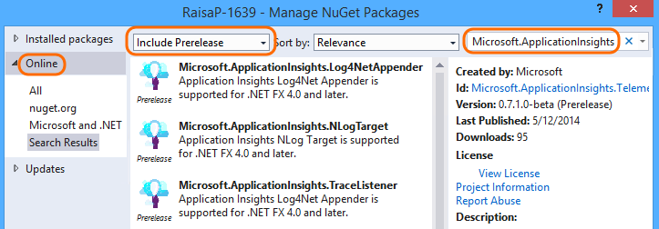
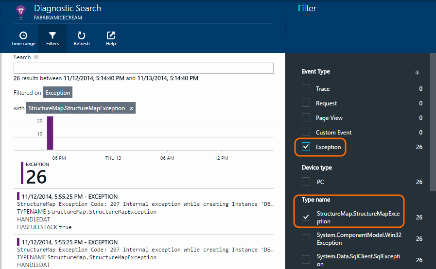

<properties 
	pageTitle="Detect and diagnose failures and exceptions in web apps" 
	description="Detect and diagnose failures and exceptions in web apps" 
	services="application-insights" 
    documentationCenter=""
	authors="alancameronwills" 
	manager="keboyd"/>

<tags 
	ms.service="application-insights" 
	ms.workload="tbd" 
	ms.tgt_pltfrm="ibiza" 
	ms.devlang="na" 
	ms.topic="article" 
	ms.date="03/31/2015" 
	ms.author="awills"/>
 
# Diagnose failures and exceptions in web apps with Application Insights

[Visual Studio Application Insights][start] is a powerful tool for detecting and diagnosing failures in applications. Here we'll focus on web applications (but you can also apply Application Insights to a [variety of other platforms][platforms]).

## Set up your app with Application Insights

Add the SDK to your application project. When your app is released and running, the SDK will send telemetry about the app's performance to the Application Insights portal.

* [Add Application Insights to ASP.NET apps][greenbrown]
* [Add Application Insights to Java apps][java]

If your web pages have substantial scripts you'll probably also want to:
* [Add Application Insights to web pages][track]


## Diagnostic search


Open Diagnostic Search to see the telemetry that the SDK automatically sends.





The details vary from one application type to another. You can click through any individual event to get more detail.

##<a name="events"></a>Custom events

Custom events show up both in [Diagnostic Search][diagnostic] and in [Metric Explorer][metrics]. You can send them from devices, web pages and server applications. They can be used both for diagnostic purposes and to [understand usage patterns][track].

A custom event has a name, and can also carry properties that you can filter on, together with numeric measurements.

JavaScript at client

    appInsights.trackEvent("WinGame",
         // String properties:
         {Game: currentGame.name, Difficulty: currentGame.difficulty},
         // Numeric measurements:
         {Score: currentGame.score, Opponents: currentGame.opponentCount}
         );

C# at server

    // Set up some properties:
    var properties = new Dictionary <string, string> 
       {{"game", currentGame.Name}, {"difficulty", currentGame.Difficulty}};
    var measurements = new Dictionary <string, double>
       {{"Score", currentGame.Score}, {"Opponents", currentGame.OpponentCount}};

    // Send the event:
    telemetry.TrackEvent("WinGame", properties, measurements);


VB at server

    ' Set up some properties:
    Dim properties = New Dictionary (Of String, String)
    properties.Add("game", currentGame.Name)
    properties.Add("difficulty", currentGame.Difficulty)

    Dim measurements = New Dictionary (Of String, Double)
    measurements.Add("Score", currentGame.Score)
    measurements.Add("Opponents", currentGame.OpponentCount)

    ' Send the event:
    telemetry.TrackEvent("WinGame", properties, measurements)

### Run your app and view the results.

Open Diagnostic Search.

Select Custom Event and select a particular event name.




Filter the data more by entering a search term on a property value.  


Drill into an individual event to see its detailed properties.


##<a name="trace"></a> Trace telemetry

Trace telemetry is code that you insert specifically to create diagnostic logs. 

For example, you could insert calls like this:

    var telemetry = new Microsoft.ApplicationInsights.TelemetryClient();
    telemetry.TrackTrace("Slow response - database01");


####  Install an adapter for your logging framework

You can also search logs generated with a logging framework - log4Net, NLog or System.Diagnostics.Trace. 

1. If you plan to use log4Net or NLog, install it in your project. 
2. In Solution Explorer, right-click your project and choose **Manage NuGet Packages**.
3. Select Online > All, select **Include Prerelease** and search for "Microsoft.ApplicationInsights"

    

4. Select the appropriate package - one of:
  + Microsoft.ApplicationInsights.TraceListener (to capture System.Diagnostics.Trace calls)
  + Microsoft.ApplicationInsights.NLogTarget
  + Microsoft.ApplicationInsights.Log4NetAppender

The NuGet package installs the necessary assemblies, and also modifies web.config or app.config.

#### <a name="pepper"></a>Insert diagnostic log calls

If you use System.Diagnostics.Trace, a typical call would be:

    System.Diagnostics.Trace.TraceWarning("Slow response - database01");

If you prefer log4net or NLog:

    logger.Warn("Slow response - database01");

Run your app in debug mode, or deploy it.

You'll see the messages in Diagnostic Search when you select the Trace filter.

### <a name="exceptions"></a>Exceptions

Getting exception reports in Application Insights provides a very powerful experience, especially since you can navigate between the failed requests and the exceptions, and read the exception stack.

You can write code to send exception telemetry:

JavaScript

    try 
    { ...
    }
    catch (ex)
    {
      appInsights.TrackException(ex, "handler loc",
        {Game: currentGame.Name, 
         State: currentGame.State.ToString()});
    }

C#

    var telemetry = new TelemetryClient();
    ...
    try 
    { ...
    }
    catch (Exception ex)
    {
       // Set up some properties:
       var properties = new Dictionary <string, string> 
         {{"Game", currentGame.Name}};

       var measurements = new Dictionary <string, double>
         {{"Users", currentGame.Users.Count}};

       // Send the exception telemetry:
       telemetry.TrackException(ex, properties, measurements);
    }

VB

    Dim telemetry = New TelemetryClient
    ...
    Try
      ...
    Catch ex as Exception
      ' Set up some properties:
      Dim properties = New Dictionary (Of String, String)
      properties.Add("Game", currentGame.Name)

      Dim measurements = New Dictionary (Of String, Double)
      measurements.Add("Users", currentGame.Users.Count)
  
      ' Send the exception telemetry:
      telemetry.TrackException(ex, properties, measurements)
    End Try

The properties and measurements parameters are optional, but are useful for filtering and adding extra information. For example, if you have an app that can run several games, you could find all the exception reports related to a particular game. You can add as many items as you like to each dictionary.

#### Viewing exceptions

You'll see a summary of exceptions reported on the Overview blade, and you can click through to see more details. For example:


[]

Click on any exception type to see specific occurrences:

[]

You can also open Diagnostic Search directly, filter on exceptions, and choose the exception type that you want to see.

### Reporting unhandled exceptions

Application Insights reports unhandled exceptions where it can, from devices, [web browsers][usage], or web servers, whether instrumented by [Status Monitor][redfield] or [Application Insights SDK][greenbrown]. 

> [AZURE.NOTE] In a web browser; if you include script files from CDNs or other domains, ensure your script tag has the attribute ```crossorigin="anonymous"``` and the server sends CORS headers to get a stack trace and detail for unhandled javascript execptions from these resources.

However, it isn't always able to do this in some cases because the .NET framework catches the exceptions.  To make sure you see all exceptions, you therefore have to write a small exception handler. The best procedure varies with the technology. Please see [this blog](http://blogs.msdn.com/b/visualstudioalm/archive/2014/12/12/application-insights-exception-telemetry.aspx) for details. 

### Correlating with a build

When you read diagnostic logs, it's likely that your source code will have changed since the live code was deployed.

It's therefore useful to put build information, such as the URL of the current version, into a property along with each exception or trace. 

Instead of adding the property separately to every exception call, you can set the information in the default context. 

    // Telemetry initializer class
    public class MyTelemetryInitializer : IContextInitializer
    {
        public void Initialize (TelemetryContext context)
        {
            context.Properties["AppVersion"] = "v2.1";
        }
    }

In the app initializer such as Global.asax.cs:

    protected void Application_Start()
    {
        // ...
        TelemetryConfiguration.Active.ContextInitializers
        .Add(new MyTelemetryInitializer());
    }

###<a name="requests"></a> Server Web Requests

Request telemetry is sent automatically when you [install Status Monitor on your web server][redfield], or when you [add Application Insights to your web project][greenbrown]. It also feeds into the request and response time charts in Metric Explorer and on the Overview page.

If you want to send additional events, you can use the TrackRequest() API.

## <a name="questions"></a>Q & A

### <a name="emptykey"></a>I get an error "Instrumentation key cannot be empty"

Looks like you installed the logging adapter Nuget package without installing Application Insights.

In Solution Explorer, right-click `ApplicationInsights.config` and choose **Update Application Insights**. You'll get a dialog that invites you to sign in to Azure and either create an Application Insights resource, or re-use an existing one. That should fix it.

### <a name="limits"></a>How much data is retained?

Up to 500 events per second from each application. Events are retained for seven days.

## <a name="add"></a>Next steps

* [Set up availability and responsiveness tests][availability]
* [Troubleshooting][qna]


<!--Link references-->

[availability]: app-insights-monitor-web-app-availability.md
[diagnostic]: app-insights-diagnostic-search.md
[greenbrown]: app-insights-start-monitoring-app-health-usage.md
[java]: app-insights-java-get-started.md
[metrics]: app-insights-metrics-explorer.md
[platforms]: app-insights-platforms.md
[qna]: app-insights-troubleshoot-faq.md
[redfield]: app-insights-monitor-performance-live-website-now.md
[start]: app-insights-get-started.md
[track]: app-insights-custom-events-metrics-api.md
[usage]: app-insights-web-track-usage.md

