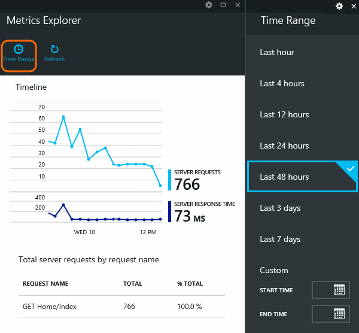
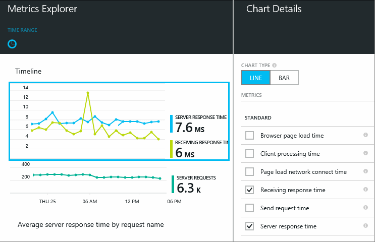

<properties 
	pageTitle="Monitor your app's health and usage with Application Insights" 
	description="Get started with Application Insights. Analyze usage, availability and performance of your on-premises or Microsoft Azure applications." 
	services="application-insights" 
    documentationCenter=""
	authors="alancameronwills" 
	manager="keboyd"/>

<tags 
	ms.service="application-insights" 
	ms.workload="tbd" 
	ms.tgt_pltfrm="ibiza" 
	ms.devlang="na" 
	ms.topic="article" 
	ms.date="04/02/2015" 
	ms.author="awills"/>
 
# Monitor performance in web applications

*Application Insights is in preview.*

Make sure your application is performing well, and find out quickly about any failures. [Application Insights][start] will tell you about any performance issues and exceptions, and help you find and diagnose the root causes.

Application Insights can monitor ASP.NET web applications and WCF services, hosted on-premise or on virtual machines, as well as Microsoft Azure websites. 

## Set up performance monitoring

If you haven't yet added Application Insights to your project (that is, if it doesn't have ApplicationInsights.config), choose one of these ways to get started:

* [Add Application Insights to your project in Visual Studio][greenbrown] - Recommended. As well as passive performance monitoring, you can insert diagnostic logging and track usage.
* [Monitor performance of a live website now][redfield] - This way, you don't need to update the application project or redeploy the website.
* [For a Microsoft Azure website](insights-how-to-customize-monitoring.md)  you can already see metrics on the website's Monitoring lens. 

Using either of these methods, you'll quickly see data on the overview blade in Application Insights.

## Exploring metrics

Click any  to see more detail, and to see results for a longer period. For example, click the Requests tile and then select a time range:

Click a chart to choose which metrics it displays, or add a new chart and select its metrics:

> [AZURE.NOTE] **Uncheck all the metrics** to see the full selection that is available. The metrics fall into groups; when any member of a group is selected, only the other members of that group appear.

## What does it all mean? Performance tiles and reports

There's a variety of performance metrics you can get. Let's start with those that appear by default on the application blade.

### Requests

The number of HTTP requests received in a specified period. Compare this with the results on other reports to see how your app behaves as the load varies.

HTTP requests include all GET or POST requests for pages, data and images.

Click on the tile to get counts for specific URLs.

### Average response time

Measures the time between a web request entering your application and the response being returned.

The points show a moving average. If there are a lot of requests, there might be some that deviate from the average without an obvious peak or dip in the graph.

Look for unusual peaks. In general, expect response time to rise with a rise in requests. If the rise is disproportionate, your app might be hitting a resource limit such as CPU or the capacity of a service it uses.

Click on the tile to get times for specific URLs.

### Slowest requests

Shows which requests might need performance tuning.

### Failed requests

A count of requests that threw uncaught exceptions.

Click the tile to see the details of specific failures, and select an individual request to see its detail. 

Only a representative sample of failures is retained for individual inspection.

### Other metrics

To see what other metrics you can display, click a graph, and then deselect all the metrics to see the full available set. Click (i) to see each metric's definition.

Selecting any metric will disable the others that can't appear on the same chart.

## Collect more performance counters

Some of the metrics you can choose from are [performance counters](http://www.codeproject.com/Articles/8590/An-Introduction-To-Performance-Counters). Windows provides a wide variety of them, and you can also define your own.

If the counters you want aren't on the list, you can add them to the set that the SDK collects. Open ApplicationInsights.config and edit the performance collector directive:

    <Add Type="Microsoft.ApplicationInsights.Extensibility.PerfCollector.PerformanceCollectorModule, Microsoft.ApplicationInsights.Extensibility.PerfCollector">
      <Counters>
        <Add PerformanceCounter="\Objects\Processes"/>
        <Add PerformanceCounter="\Sales(electronics)\# Items Sold" ReportAs="Item sales"/>
      </Counters>
    </Add>

The format is `\Category(instance)\Counter"` or for categories that don't have instances, just `\Category\Counter`. 

`ReportAs` is required for counter names that contain characters other than these: letters, round brackets, forward slahes, hyphens, underscores, spaces and dots.

If you specify an instance, it will be collected as a property "CounterInstanceName" of the reported metric.

If you prefer, you can write code to have the same effect:

    var perfCollector = new PerformanceCollectorModule();
    perfCollector.Counters = new List<CustomPerformanceCounterCollectionRquest>();
    perfCollector.Counters.Add(new CustomPerformanceCounterCollectionRquest(
      @"\Sales(electronics)\# Items Sold", "Items sold"));
    perfCollector.Initialize(TelemetryConfiguration.Active);
    TelemetryConfiguration.Active.TelemetryModules.Add(perfCollector);

## Set alerts

To be notified by email of unusual values of any metric, add an alert. You can choose either to send the email to the account administrators, or to specific email addresses.

Set the resource before the other properties. Don't choose the webtest resources if you want to set alerts on performance or usage metrics.

Be careful to note the units in which you're asked to enter the threshold value.

*I don't see the Add Alert button.* - Is this a group account to which you have read-only access? Check with the account administrator.

## Diagnosing issues

Here are a few tips for finding and diagnosing performance issues:

* Set up [web tests][availability] to be alerted if your web site goes down or responds incorrectly or slowly. 
* Compare the Request count with other metrics to see if failures or slow response are related to load.
* [Insert and search trace statements][diagnostic] in your code to help pinpoint problems.

## Next steps

[Web tests][availability] - Have web requests sent to your application at regular intervals from around the world.

[Capture and search diagnostic traces][diagnostic] - Insert trace calls and sift through the results to pinpoint issues.

[Usage tracking][usage] - Find out how people use your application.

[Troubleshooting][qna] - and Q & A

## Video

[AZURE.VIDEO app-insights-performance-monitoring]

<!--Link references-->

[availability]: app-insights-monitor-web-app-availability.md
[diagnostic]: app-insights-diagnostic-search.md
[greenbrown]: app-insights-start-monitoring-app-health-usage.md
[qna]: app-insights-troubleshoot-faq.md
[redfield]: app-insights-monitor-performance-live-website-now.md
[start]: app-insights-get-started.md
[usage]: app-insights-web-track-usage.md

