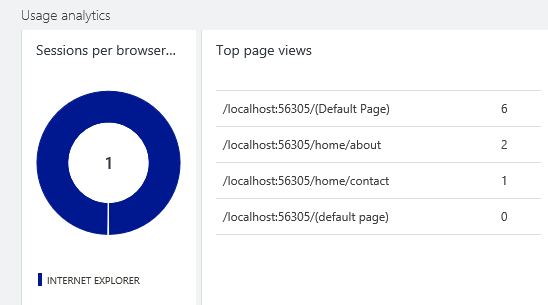

<properties title="Track custom usage events and metrics in your web app with Application Insights" pageTitle="Track usage events and metrics in your web app with Application Insights" description="Insert a few lines of code to find out what users are doing with your website." metaKeywords="analytics monitoring application insights" authors="awills" manager="kamrani"  />
 
<tags ms.service="application-insights" ms.workload="tbd" ms.tgt_pltfrm="ibiza" ms.devlang="na" ms.topic="article" ms.date="2014-10-01" ms.author="awills" />

# Track custom usage events and metrics in your web app

*Application Insights is in preview.*

Insert a few lines of code in your web application to find out what users are doing with it. You can track events, metrics, and page views. You'll see charts and tables of the data, aggregated across all your users. 

> [AZURE.NOTE] Currently the full user experience isn't in place. You can send custom events and metrics to Application Insights, and search the raw telemetry in [Diagnostic Search][diagnostic]. But you can't yet see the digested statistical charts - they're coming soon.

<!-- Sample pic -->

* [Client and server tracking](#clientServer)
* [Before you start](#prep)
* [Track metrics](#metrics)
* [Track events](#events)
* [Track page views](#pageViews)
* [Filter, search and segment your data with properties](#properties)
* [Combine metrics and events](#measurements)
* [Set default property values](#defaults)
* [Define multiple contexts](#contexts)
* [Switch telemetry off and on](#disable)
* [Next steps](#next)

##  Client and server tracking

You can send telemetry from the client (web page) or the server sides of your app, or both.

The client and server APIs are very similar. You can send the same types of telemetry both from your users' web browsers, and from your web server. The difference is in the scope of the data you can send.

* Tracking at the web client is particularly useful if you have richly active web pages with lots of JavaScript. For example, you could monitor how frequently users click a particular button or how often they encounter validation errors.
* Tracking at the web server is more useful for monitoring business metrics and events such as the value of a customer's shopping cart or the count of abandoned orders.

In a typical ASP.NET web application, you have the default JavaScript call to trackPageView() in the web master page, and you'll add some calls to track events and metrics in the server code. If your client-side code is quite rich, you might also add some calls to track events and metrics at the client.

## Before you start

If you haven't done these yet:

* To get telemetry from an ASP.NET web app:
    [Add Application Insights to your project][greenbrown]
    In your web server code, include:
    (C#) `using Microsoft.ApplicationInsights;`
	(VB) `Imports Microsoft.ApplicationInsights`
* [Set up web usage analytics][usage]. The JavaScript initialization code should be included in every web page where you want to write monitoring code, or in a master page. 
    If it's working, you should see data in on the Overview blade under Usage Analytics.

When you run your app on your development machine in debug mode, results will appear in Application Insights within seconds. When you deploy the app, data takes longer to move through the pipeline from your server and clients.

<!--
##  Track metrics

You don't have to do any more to get basic usage data such as page views. But you can write a few lines of code to find out more about what your users are doing with your app.

For example, if your app is a game, you might like to know the average score that users achieve, and see if they find it easier or more difficult after you publish a new version.

To track a metric – that is, a numeric value like a score - insert a line of script like this at a suitable place in your app:

JavaScript at client

    appInsights.trackMetric("Alerts", notifications.Count);

C# at server

    var telemetry = new TelemetryClient();
    telemetry.TrackMetric ("Users online", currentUsers.Count);

VB at server

    Dim telemetry = New TelemetryClient
    telemetry.TrackMetric ("Users online", currentUsers.Count)

Test the app, and use it so as to run your trackMetric() call.

Then go to your application in Application Insights and click through the [Metrics][metrics] tile. Select your metric to see the first results.

The graph shows the recent average over values logged from all your users. 

(By the way: metrics aren’t optimized for diagnosing problems. If that's what you need, look at [Diagnostic Logging][diagnostic].) -->

## Track events

Events tell you the frequency of an occurrence, averaged across your users. For example, suppose you'd like to know how often users complete your game. In the code that ends the game, insert a line like this:

JavaScript at client

    appInsights.trackEvent("EndOfGame");

C# at server
    
    var telemetry = new TelemetryClient();
    telemetry.TrackEvent("EndOfGame");

VB at server

    Dim telemetry = New TelemetryClient
    telemetry.TrackEvent("EndOfGame")

If you send telemetry from both the client and server, be sure to give the events different names.

## Page views (client only)

By default, the initialization script in the head of the web page logs a page view, naming the event with the relative URL of the page. These calls provide the basic page use statistics. 

### Custom page data

If you want, you can modify the call to change the name, or you can insert additional calls. For example, if your single-page web app displays multiple tabs, you might want to record a page view when the user switches to a different tab. For example:

JavaScript at client:

    appInsights.trackPageView("tab1");

If you have several tabs within different HTML pages, you can specify the URL too:

    appInsights.trackPageView("tab1", "http://fabrikam.com/page1.htm");

## Filter, search and segment your data with properties

You can attach properties and measurements to your events, page views, and other telemetry data. 

**Properties** are string values that you can use to filter your telemetry in the usage reports. For example if your app provides several games, you’ll want to attach the name of the game to each event, so that you can see which games are more popular.

**Measurements** are numeric values that you can get statistics from in the usage reports.

JavaScript at client

    appInsights.trackEvent("EndOfGame",
         // String properties:
         {Game: currentGame.name, Difficulty: currentGame.difficulty},
         // Numeric measurements:
         {Score: currentGame.score, Opponents: currentGame.opponentCount}
         );

C# at server

    // Set up some properties:
    var properties = new Dictionary <string, string> 
       {{"game", currentGame.Name}, {"difficulty", currentGame.Difficulty}};
    var measurements = new Dictionary <string, double>
       {{"Score", currentGame.Score}, {"Opponents", currentGame.OpponentCount}};

    // Send the event:
    telemetry.TrackEvent("endOfGame", properties, measurements);

VB at server

    ' Set up some properties:
    Dim properties = New Dictionary (Of String, String)
    properties.Add("game", currentGame.Name)
    properties.Add("difficulty", currentGame.Difficulty)

    Dim measurements = New Dictionary (Of String, Double)
    measurements.Add("Score", currentGame.Score)
    measurements.Add("Opponents", currentGame.OpponentCount)

    ' Send the event:
    telemetry.TrackEvent("endOfGame", properties, measurements)

Attach properties to page views in the same way:

JavaScript at client

    appInsights.trackPageView("Win", 
     {Game: currentGame.Name}, 
     {Score: currentGame.Score});

 

<!--
To see the filters, expand the parent event group, and select a particular event in the table – in this example, we expanded 'open' and selected 'buy':

////// pic //////
-->

> [WACOM.NOTE] Take care not to log personally identifiable information in properties.

## Timed page views and events

You can attach timing data to events and page views. Instead of calling trackEvent or trackPageView, use these calls:

JavaScript at client

    // At the start of the game:
    appInsights.startTrackEvent(game.id);

    // At the end of the game:
    appInsights.stopTrackEvent(game.id, {GameName: game.name}, {Score: game.score});

    // At the start of a page view:
    appInsights.startTrackPage(myPage.name);

    // At the completion of a page view:
    appInsights.stopTrackPage(myPage.name, "http://fabrikam.com/page", properties, measurements);

Use the same string as the first parameter in the start and stop calls.

## Set default property values (not at web client)

You can set default values in a TelemetryContext. They are attached to every metric and event sent from the context. 
    

C# at server

    var context = new TelemetryContext();
    context.Properties["Game"] = currentGame.Name;
    var telemetry = new TelemetryClient(context);
    // Now all telemetry will automatically be sent with the context property:
    telemetry.TrackEvent("EndOfGame");
    
VB at server

    Dim context = New TelemetryContext
    context.Properties("Game") = currentGame.Name
    Dim telemetry = New TelemetryClient(context)
    ' Now all telemetry will automatically be sent with the context property:
    telemetry.TrackEvent("EndOfGame")

    
    
Individual telemetry can override the default values.

If you want to switch between groups of default property values, set up multiple contexts.

## Next steps

[Search events and logs][diagnostic]

[Troubleshooting][qna]

[AZURE.INCLUDE [app-insights-learn-more](../includes/app-insights-learn-more.md)]

