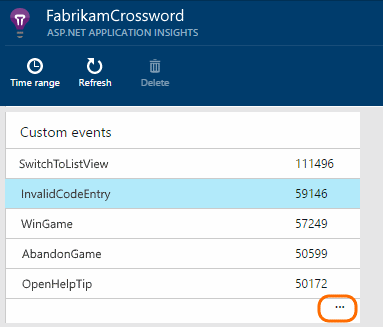
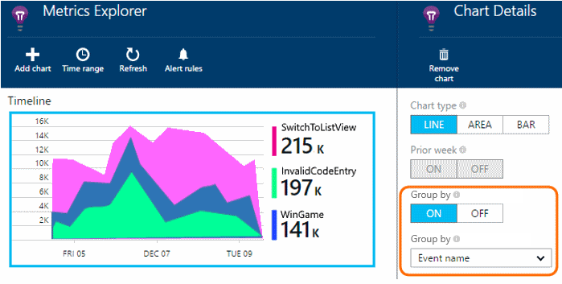
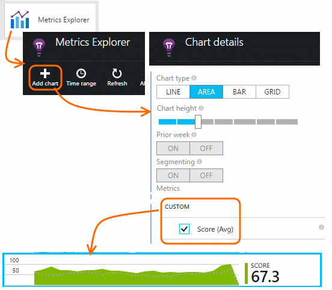
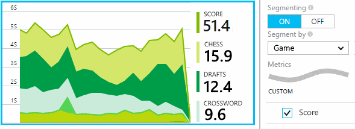

<properties 
	pageTitle="Trace usage and events in your app with Application Insights API" 
	description="Insert a few lines of code to track usage and diagnose issues." 
	services="application-insights"
    documentationCenter="" 
	authors="alancameronwills" 
	manager="keboyd"/>
 
<tags 
	ms.service="application-insights" 
	ms.workload="tbd" 
	ms.tgt_pltfrm="ibiza" 
	ms.devlang="na" 
	ms.topic="article" 
	ms.date="03/17/2015" 
	ms.author="awills"/>

# Write custom telemetry with Application Insights API

*Application Insights is in preview.*

Insert a few lines of code in your application to find out what users are doing with it, or to help diagnose issues. You can send telemetry from device and desktop apps, web clients, and web servers. 

The Application Insights data collectors use this API to send standard telemetry such as page views and exception reports, but you can also use it to send your own custom telemetry.

## API summary

The API is uniform across all platforms, apart from a few small variations.

Method | Used for
---|---
[`TrackPageView`](#pageViews) | Pages, screens, blades or forms
[`TrackEvent`](#track-event) | User actions and other events. Used to track user behavior or to monitor performance.
[`TrackMetric`](#track-metric) | Performance measurements such as queue lengths not related to specific events
[`TrackException`](#track-exception)|Log exceptions for diagnosis. Trace where they occur in relation to other events and examine stack traces.
[`TrackRequest`](#track-request)| Log the frequency and duration of server requests for performance analysis.
[`TrackTrace`](#track-trace)|Diagnostic log messages. You can also capture 3rd-party logs.

You can [attach properties and metrics](#properties) to most of these telemetry calls. 

## Before you start

If you haven't done these yet:

* Add the Application Insights SDK to your project:
 * [ASP.NET project][greenbrown]
 * [Windows project][windows]
 * [Java project][java]    

* To monitor web pages, [add the Application Insights script to each page][usage]. The JavaScript initialization code should be included in every web page you want to monitor. 

* In your device or web server code, include:

  *C#:* `using Microsoft.ApplicationInsights;`

  *VB:* `Imports Microsoft.ApplicationInsights`

  *Java:* `import com.microsoft.applicationinsights.TelemetryClient;`

* Construct an instance of TelemetryClient (except in JavaScript in web pages):

*C#:* 

    private TelemetryClient telemetry = new TelemetryClient();

*VB:* 

    Private Dim telemetry As New TelemetryClient

*Java*

    private TelemetryClient telemetry = new TelemetryClient();

## Page views, users and sessions

In a device or web page app, page view telemetry is sent by default when each screen or page is loaded. But you can change that to track page views at additional or different times. For example, in an app that displays tabs or blades, you might want to track a "page" whenever the user opens a new blade. 

User and session data is sent as properties along with page views, so the user and session charts come alive when there is page view telemetry.

#### Custom page views

*JavaScript*

    appInsights.trackPageView("tab1");

*C#*

    telemetry.TrackPageView("GameReviewPage");

*VB*

    telemetry.TrackPageView("GameReviewPage")

If you have several tabs within different HTML pages, you can specify the URL too:

    appInsights.trackPageView("tab1", "http://fabrikam.com/page1.htm");

#### Timed page views

By using this pair of methods calls instead of trackPageView, you can analyze how long users linger on your pages.

    // At the start of a page view:
    appInsights.startTrackPage(myPage.name);

    // At the completion of a page view:
    appInsights.stopTrackPage(myPage.name, "http://fabrikam.com/page", properties, measurements);

Use the same string as the first parameter in the start and stop calls.

Look at the Page Duration metric in [Metrics Explorer][metrics].

## Authenticated users

By default, users are counted by installing cookies in their browsers. But if your application requires users to login, you can use the authenticated user ids to provide more accurate figures.

As well as a user id, you can supply an [organizational account id](http://www.asp.net/visual-studio/overview/2013/creating-web-projects-in-visual-studio#orgauthoptions). This enables you to see how many companies or institutions have used your app.

*JavaScript* - insert this before first call to trackPageView:

    // Queue until all scripts are loaded:
    appInsights.queue.push(function(){

      // Individual user id:
      appInsights.context.user.id = "userId";

      // Organization account id:
      appInsights.context.user.accountId = "orgId";
    }); 

Since authentication is done in the server, you would insert the IDs on generating the web page. For example in a Razor script in ASP.NET MVC:

      appInsights.context.user.id = "@User.Identity.Name";

To see the resulting data in Application Insights, create new charts in [Metric Explorer][metrics] to display the Users and User Accounts metrics.

## Track Event

Events can be displayed on the portal as an aggregated count, and you can also display individual occurrences. 

For example, to count how many games have been won:

*JavaScript*

    appInsights.trackEvent("WinsGame");

*C#*
    
    telemetry.TrackEvent("WinGame");

*VB*

    telemetry.TrackEvent("WinGame")

*Java*

    telemetry.trackEvent("WinGame");

The top events show up on the overview blade:

Click through to see an overview chart and a complete list.

Select the chart and segment it by Event name to see the relative contributions of the most significant events.

From the list below the chart, select an event name to see individual occurrences of the event.

## Filter, search and segment your data with properties

You can attach properties and measurements to your metrics, events, page views, and other telemetry data. 

**Properties** are string values that you can use to filter your telemetry in the usage reports. For example if your app provides several games, you’ll want to attach the name of the game to each event, so that you can see which games are more popular.

**Metrics** are numeric values that can be presented graphically. For example, you might want to see if there's a gradual increase in the scores your gamers achieve. The graphs can be segmented by the properties sent with the event, so that you could get separate or stacked graphs for different games.

*JavaScript*

    appInsights.trackEvent // or trackPageView, trackMetric, ...
      ("WinGame",
         // String properties:
         {Game: currentGame.name, Difficulty: currentGame.difficulty},
         // Numeric metrics:
         {Score: currentGame.score, Opponents: currentGame.opponentCount}
         );

*C#*

    // Set up some properties:
    var properties = new Dictionary <string, string> 
       {{"game", currentGame.Name}, {"difficulty", currentGame.Difficulty}};
    var metrics = new Dictionary <string, double>
       {{"Score", currentGame.Score}, {"Opponents", currentGame.OpponentCount}};

    // Send the event:
    telemetry.TrackEvent("WinGame", properties, metrics);

*VB*

    ' Set up some properties:
    Dim properties = New Dictionary (Of String, String)
    properties.Add("game", currentGame.Name)
    properties.Add("difficulty", currentGame.Difficulty)

    Dim metrics = New Dictionary (Of String, Double)
    metrics.Add("Score", currentGame.Score)
    metrics.Add("Opponents", currentGame.OpponentCount)

    ' Send the event:
    telemetry.TrackEvent("WinGame", properties, metrics)

*Java*
    
    Map<String, String> properties = new HashMap<String, String>();
    properties.put("game", currentGame.getName());
    properties.put("difficulty", currentGame.getDifficulty());
    
    Map<String, Double> metrics = new HashMap<String, Double>();
    metrics.put("Score", currentGame.getScore());
    metrics.put("Opponents", currentGame.getOpponentCount());
    
    telemetry.trackEvent("WinGame", properties, metrics2/7/2015 12:05:25 AM );

> [AZURE.NOTE] Take care not to log personally identifiable information in properties.

**If you used metrics**, open Metric Explorer and select the metric from the Custom group:

*If your metric doesn't appear, close the selection blade, wait a while, and click Refresh.*

**If you used properties and metrics**, segment the metric by the property:

**In Diagnostic Search**, you can view the properties and metrics of individual occurrences of an event.

Use the Search field to see event occurrences with a particular property value.

[Learn more about search strings][diagnostic]

##  Timed events

Sometimes you'd like to chart how long it takes to perform some action. For example, you might like to know how long users take to consider choices in a game. 

You can attach timing data to events. In the web client, instead of calling trackEvent, use these calls:

*JavaScript at web client*

    // At the start of the game:
    appInsights.startTrackEvent(game.id);

    // At the end of the game:
    appInsights.stopTrackEvent(game.id, {GameName: game.name}, {Score: game.score});

Use the same string as the first parameter in the start and stop calls. 

This feature isn't built in to the other SDKs. But you can write your own code such as this:

*C#*

    var stopwatch = System.Diagnostics.Stopwatch.StartNew();

    // ... perform the timed action ...

    stopwatch.Stop();

    var metrics = new Dictionary <string, double>
       {{"processingTime", stopwatch.Elapsed.TotalMilliseconds}};

    // Set up some properties:
    var properties = new Dictionary <string, string> 
       {{"signalSource", currentSignalSource.Name}};

    // Send the event:
    telemetry.TrackEvent("SignalProcessed", properties, metrics);

## Track Metric

Use TrackMetric to send metrics that are not attached to particular events. For example, you could monitor a queue length at regular intervals. 

Metrics are displayed as statistical charts in metric explorer, but unlike events, you can't search for individual occurrences in diagnostic search.

*JavaScript*

    appInsights.trackMetric("Queue", queue.Length);

*C#*

    telemetry.TrackMetric("Queue", queue.Length);

*VB*

    telemetry.TrackMetric("Queue", queue.Length)

*Java*

    telemetry.trackMetric("Queue", queue.Length);

In fact, you might do this in a background thread:

*C#*

    private void Run() {
     var appInsights = new TelemetryClient();
     while (true) {
      Thread.Sleep(60000);
      appInsights.TrackMetric("Queue", queue.Length);
     }
    }

To see the results, open Metrics Explorer and add a new chart. Set it to display your metric.

## Pre-aggregation

If you have a large volume of metrics you want to send, you can save some bandwidth by aggregating them in your application. Send the results at intervals:

*C#*

    private double sum, min, max = 0;
    private int count = 0;

    // Call this instead of TrackMetric
    private void LogMyMetric(double value) {
      sum += value;
      if (value < min || count == 0) min = value;
      if (value > max || count == 0) max = value;
      count++;
      if (count >= 100)
      {
        appInsights.TrackMetric("MyMetric", 
          sum/count, // average
          count,
          min, max,
          properties);
        sum = count = 0;
      }
    }

## Track Request

Used by the server SDK to log HTTP requests. 

You can also call it yourself if you want to simulate requests in a context where you don't have the web service module running.

*C#*

    // At start of processing this request:

    // Operation Id is attached to all telemetry and helps you identify
    // telemetry associated with one request:
    telemetry.Context.Operation.Id = Guid.NewGuid().ToString();
    
    var stopwatch = System.Diagnostics.Stopwatch.StartNew();

    // ... process the request ...

    stopwatch.Stop();
    telemetryClient.TrackRequest(requestName, DateTime.Now,
       stopwatch.Elapsed, 
       "200", true);  // Response code, success

## Track Exception

Send exceptions to Application Insights: to [count them][metrics], as an indication of the frequency of a problem; and to [examine individual occurrences][diagnostic].

*C#*

    try
    {
        ...
    }
    catch (Exception ex)
    {
       telemetry.TrackException(ex);
    }

In Windows mobile apps, the SDK catches unhandled exceptions, so that you don't have to log them. 

## Track Trace 

Use this to help diagnose problems by sending a 'breadcrumb trail' to Application Insights. 

[Log adapters][trace] use this API to send third-party logs to the portal.

*C#*

    telemetry.TrackTrace(message, SeverityLevel.Warning, properties);

## Set default property values

You can set default values in a TelemetryClient. They are attached to every telemetry item sent from the context. 

*JavaScript* - insert before the first call to trackPageView on each page:

    // Queue until page and scripts are fully loaded:
    appinsights.queue.push(function(){

      // Default property map:
      appInsights.config.properties = {GameName: game.name};

      // Default metric map:
      appInsights.config.measurements = {Score: game.score};
    });

*C#*

    using Microsoft.ApplicationInsights.DataContracts;

    var gameTelemetry = new TelemetryClient();
    gameTelemetry.Context.Properties["Game"] = currentGame.Name;
    // Now all telemetry will automatically be sent with the context property:
    gameTelemetry.TrackEvent("WinGame");
    
*VB*

    Dim gameTelemetry = New TelemetryClient()
    gameTelemetry.Context.Properties("Game") = currentGame.Name
    ' Now all telemetry will automatically be sent with the context property:
    gameTelemetry.TrackEvent("WinGame")

*Java*

    import com.microsoft.applicationinsights.TelemetryClient;
    import com.microsoft.applicationinsights.TelemetryContext;
    ...

    TelemetryClient gameTelemetry = new TelemetryClient();
    TelemetryContext context = gameTelemetry.getContext();
    context.getProperties().put("Game", currentGame.Name);
    
    gameTelemetry.TrackEvent("WinGame");
    
Individual telemetry calls can override the default values in their property dictionaries.

### Set default properties for all new TelemetryClients

You can set up a universal initializer so that all new TelemetryClients automatically use your context.

This includes standard telemetry sent by the platform-specific telemetry modules, such as web server request tracking.

*C#*

    // Telemetry initializer class
    public class MyTelemetryInitializer : IContextInitializer
    {
        public void Initialize (TelemetryContext context)
        {
            context.Properties["AppVersion"] = "v2.1";
        }
    }

In the app initializer such as Global.asax.cs:

*C#*

    protected void Application_Start()
    {
        // ...
        TelemetryConfiguration.Active.ContextInitializers
        .Add(new MyTelemetryInitializer());
    }

## Set instrumentation key in code

Instead of getting the instrumentation key from the configuration file, you can set it in your code. You might want to do this, for example, to send telemetry from test installations to a different Application Insights resource than telemetry from the live application.

Set the key in an initialization method, such as global.aspx.cs in an ASP.NET service:

*C#*

    protected void Application_Start()
    {
      Microsoft.ApplicationInsights.Extensibility.
        TelemetryConfiguration.Active.InstrumentationKey = 
          // - for example -
          WebConfigurationManager.Settings["ikey"];
      ...

*JavaScript*

    appInsights.config.instrumentationKey = myKey; 

In web pages, you might want to set it from the web server's state, rather than coding it literally into the script. For example, in a web page generated in an ASP.NET app:

*JavaScript in Razor*

    <script type="text/javascript">
    // Standard Application Insights web page script:
    var appInsights = window.appInsights || function(config){ ...
    // Modify this part:
    }({instrumentationKey:  
      // Generate from server property:
      @Microsoft.ApplicationInsights.Extensibility.
         TelemetryConfiguration.Active.InstrumentationKey"
    }) // ...

## Developer mode

During debugging, it's useful to have your telemetry expedited through the pipeline so that you can see results immediately.

*JavaScript*

    // Insert this in the initialization script, just before trackPageView:
    appInsights.config.enableDebug = true;

*C#*
    
    TelemetryConfiguration.Active.TelemetryChannel.DeveloperMode = true;

*VB*

    TelemetryConfiguration.Active.TelemetryChannel.DeveloperMode = True

## Reference docs

* [ASP.NET reference](https://msdn.microsoft.com/library/dn817570.aspx)
* [Java reference](http://dl.windowsazure.com/applicationinsights/javadoc/)

## Next steps

[Search events and logs][diagnostic]

[Troubleshooting][qna]

[AZURE.INCLUDE [app-insights-learn-more](../includes/app-insights-learn-more.md)]

