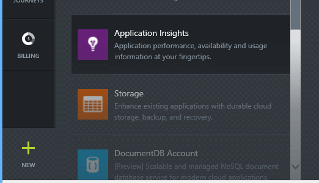
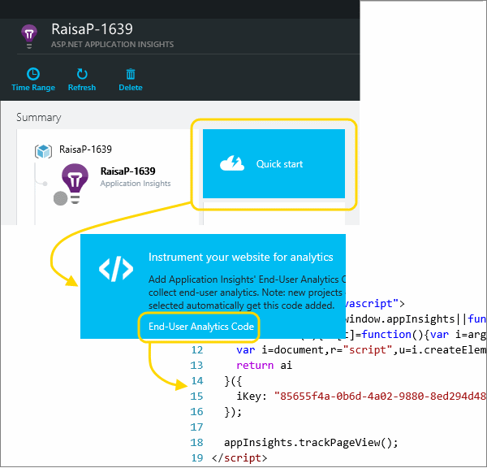
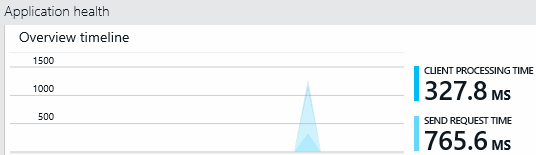
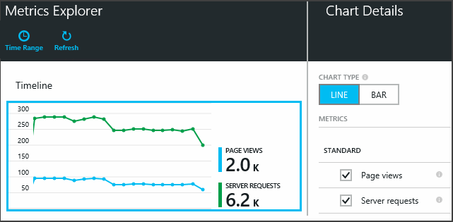
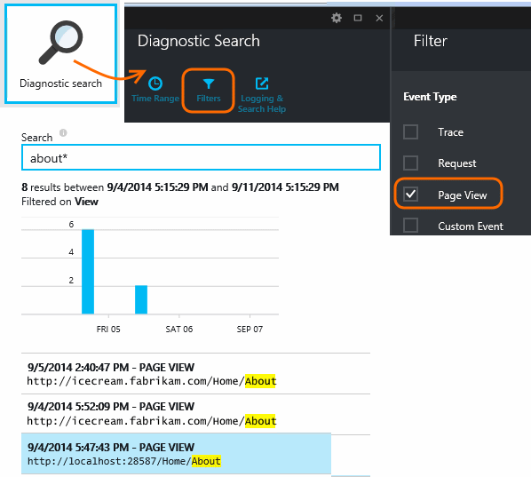

<properties title="Track usage in web applications with Application Insights" pageTitle="Track usage in web applications" description="Log user activities." metaKeywords="analytics monitoring application insights" authors="awills" manager="kamrani" />

<tags ms.service="application-insights" ms.workload="tbd" ms.tgt_pltfrm="ibiza" ms.devlang="na" ms.topic="article" ms.date="2014-11-21" ms.author="awills" />
 
# Track usage of web applications

Find out how your web application is being used. Set up usage analytics and you'll find out which pages are users looking at, how many of them come back, and how often they visit your site. Add a few [custom events and metrics][track], and you can analyse in detail the most popular features, the most common mistakes, and tune your app to success with your users.

Telemetry is gathered from both the client and the server. Client data is collected from all modern web browsers, and server data can be collected if your platform is ASP.NET. (It doesn't have to be running on Azure.) 

* [Set up web usage analytics](#webclient)
* [Usage analytics](#usage)
* [Custom page counts for single-page apps](#spa)
* [Inspecting individual page events](#inspect)
* [Detailed tracking with custom events and metrics](#custom)
* [Video](#video)

##  Setting up web client analytics

#### Get an Application Insights resource in Azure

**If you're developing an ASP.NET app** and you haven't done this yet, [add Application Insights to your web project][start]. 

**If your website platform isn't ASP.NET:** Sign up to [Microsoft Azure](http://azure.com), go to the [Preview portal](https://portal.azure.com), and add an Application Insights resource.

(You can get back to it later with the Browse button.)

#### Add our script to your web pages

In Quick Start, get the script for web pages.

Insert the script just before the &lt;/head&gt; tag of every page you want to track. If your website has a master page, you can put the script there. For example, in an ASP.NET MVC project, you'd put it in View\Shared\_Layout.cshtml

## Usage analytics

Run your website, use it a bit to generate telemetry, and wait 1-2 minutes. You can either run it with F5 on your development machine, or deploy it to your server.

In the application overview blade, you'll see these usage tiles:

*No data yet? Click **Refresh** at the top of the page.*

* **Sessions per browser**

    A *session* is a period that starts when a user opens any page on your website, and ends after the user has not sent any web request for a timeout period of 30 minutes. 

    Click through to zoom into the chart.

* **Top page views**

    Shows total counts in the last 24 hours.

    Click the page views tile to get a more detailed history. To get a longer history, you can change the time range of the report.

Click a chart to see other metrics that you can display, or add a new chart and select the metrics it displays.

> [AZURE.NOTE] Uncheck *all* the metrics to enable them all. Metrics can only be displayed in some combinations. When you select a metric, the incompatible ones are disabled.

##  Custom page counts for single-page apps

By default, a page count occurs each time a new page loads into the client browser.  But you might want to count additional page views. For example, a page might display its content in tabs and you want to count a page when the user switches tabs. Or JavaScript code in the page might load new content without changing the browser's URL. 

Insert a JavaScript call like this at the appropriate point in your client code:

    appInsights.trackPageView(myPageName);

The page name can contain the same characters as a URL, but anything after "#" or "?" will be ignored.

##  Inspecting individual page view events

Usually page view telemetry is analysed by Application Insights and you see only cumulative reports, averaged over all your users. But for debugging purposes, you can also look at individual page view events.

In the Diagnostic Search blade, set Filters to Page View.

Select any event to see more detail.

> [AZURE.NOTE] If you use [Search][diagnostic], notice that you have to match whole words: "Abou" and "bout" do not match "About", but "Abou* " does. And you cannot begin a search term with a wildcard. For example, searching for "*bou" would not match "About". 

> [Learn more about diagnostic search][diagnostic]

##  Detailed tracking with custom events and metrics

Want to find out what your users do with your app? By inserting calls in your client and server code, you can send your own telemetry to Application Insights. For example, you could find out the numbers of users who create orders without completing them, or which validation errors are hit most often, or the average score in a game.

[Learn about the custom events and metrics API][track].

##  Video: Tracking Usage

> [AZURE.VIDEO tracking-usage-with-application-insights]

##  Next steps

[Track usage with custom events and metrics][track]

[AZURE.INCLUDE [app-insights-learn-more](../includes/app-insights-learn-more.md)]

