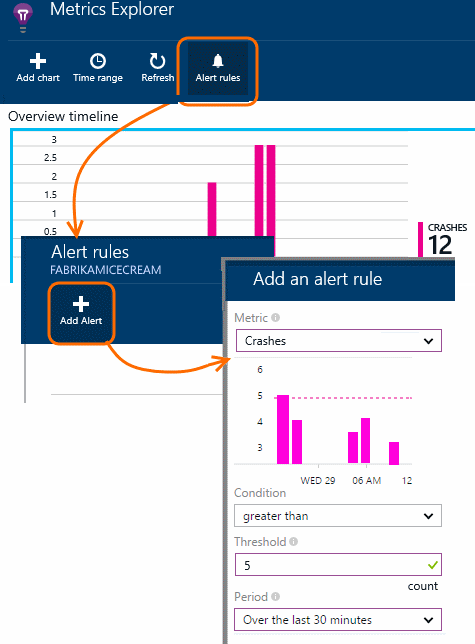
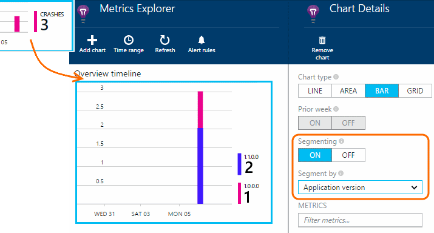
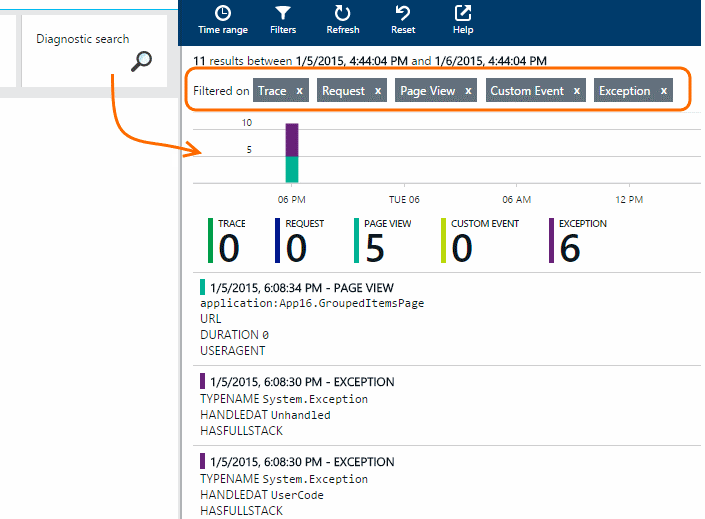
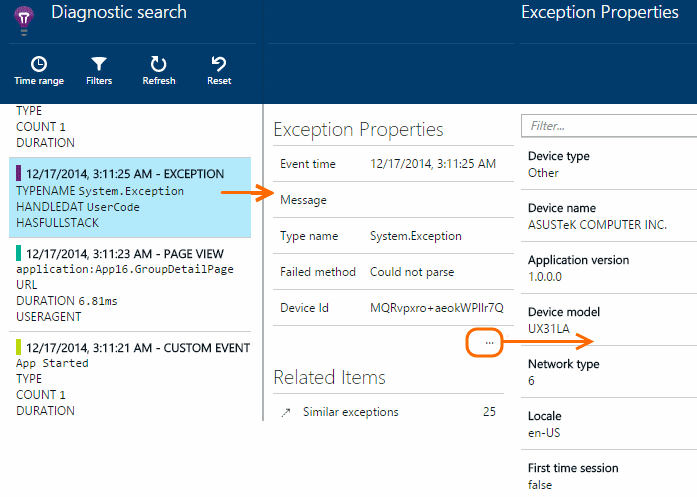

<properties 
	pageTitle="Detect and diagnose crashes in Windows Store and Phone apps with Application Insights" 
	description="Analyze performance issues in your Windows device app with Application Insights." 
	services="application-insights" 
    documentationCenter="windows"
	authors="alancameronwills" 
	manager="kamrani"/>

<tags 
	ms.service="application-insights" 
	ms.workload="tbd" 
	ms.tgt_pltfrm="ibiza" 
	ms.devlang="na" 
	ms.topic="article" 
	ms.date="02/28/2015" 
	ms.author="awills"/>

# Detect and diagnose crashes in Windows Store and Phone apps with Application Insights

*Application Insights is in preview.*

If your users experience crashes in your app, you'd like to know about it quickly, and you'd like details about what happened. With Application Insights, you can monitor how frequently crashes occur, get alerts when they occur, and investigate reports of individual incidents.

"Crash" means that the application terminates because of an uncaught exception. If your app catches an exception you can report it with the TrackException() API but continue running. In that case, it will not be logged as a crash.

## Monitor crash frequency

If you haven't done this already, add [Application Insights to your app project][windows], and republish it. 

Crashes show up on your application's overview blade in [the Application Insights portal][portal].

You can edit the time range shown by the chart.

## Set an alert to detect crashes

## Diagnose crashes

To find out if some versions of your app crash more than others, click through the crashes chart and then segment by Application Version:

To discover the exceptions that are causing crashes, open Diagnostic Search. You might want to remove other types of telemetry, to focus on the exceptions:

[Learn more about filtering in Diagnostic Search][diagnostic].
 

Click any exception to see its details, including associated properties and stack trace.

See the other exceptions and events that occurred close to that exception:

## Insert trace logs and events

To help diagnose problems, you can [insert trace calls and search the logs in Application Insights][diagnostic].

## Debug vs Release mode

#### Debug

If you build in debug mode, events are sent as soon as they are generated. If you lose internet connectivity and then exit the app before regaining connectivity, offline telemetry is discarded.

#### Release

If you build in release configuration, events are stored in the device and sent when the application resumes. Data is also sent on the application's first use. If there is no internet connectivity upon startup, previous telemetry as well as telemetry for the current lifecycle is stored and sent on the next resume.

## Next steps

[Detect, triage and diagnose issues with Application Insights][detect]

[Capture diagnostic logs][trace]

[Troubleshooting](app-insights-windows-troubleshoot.md)

<!--Link references-->

[detect]: app-insights-detect-triage-diagnose.md
[diagnostic]: app-insights-diagnostic-search.md
[portal]: http://portal.azure.com/
[trace]: app-insights-search-diagnostic-logs.md
[windows]: app-insights-windows-get-started.md

