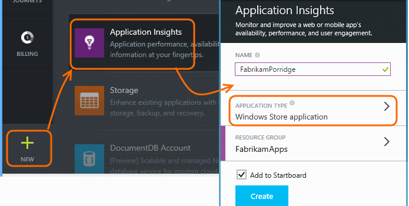
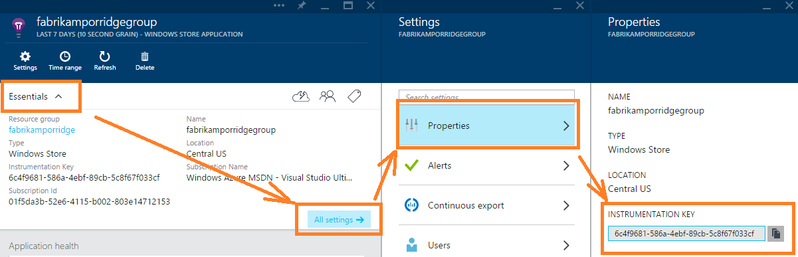
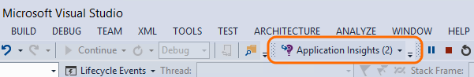

<properties 
	pageTitle="Application Insights for Windows desktop apps" 
	description="Analyze usage and performance of your Windows app with Application Insights." 
	services="application-insights" 
    documentationCenter="windows"
	authors="alancameronwills" 
	manager="keboyd"/>

<tags 
	ms.service="application-insights" 
	ms.workload="tbd" 
	ms.tgt_pltfrm="ibiza" 
	ms.devlang="na" 
	ms.topic="article" 
	ms.date="04/04/2015" 
	ms.author="awills"/>

# Application Insights on Windows Desktop apps

*Application Insights is in preview.*

[AZURE.INCLUDE [app-insights-selector-get-started](../includes/app-insights-selector-get-started.md)]

Application Insights lets you monitor your deployed application for usage and performance.

*Although the Application Insights SDK can be made to work in a desktop app, it isn't a scenario we currently support. But if you'd like to try it experimentally, here are some tips for doing so.*


## <a name="add"></a> Create an Application Insights resource


1.  In the [Azure portal][portal], create a new Application Insights resource. For application type, choose ASP.NET app or Windows Store app. 

    

    (Your choice of application type sets the content of the Overview blade and the properties available in [metric explorer][metrics].)

2.  Take a copy of the Instrumentation Key.

    

## <a name="sdk"></a>Install the SDK in your application


1. In Visual Studio, edit the NuGet packages of your desktop app project.
    

2. Install the Application Insights SDK core.

    

    (As an alternative, you could choose Application Insights SDK for Web Apps. This provides some built-in performance counter telemetry. )

3. Edit ApplicationInsights.config (which has been added by the NuGet install). Insert this just before the closing tag:

    &lt;InstrumentationKey&gt;*the key you copied*&lt;/InstrumentationKey&gt;

    As an alternative you can achieve the same effect with this code:
    
    `TelemetryConfiguration.Active.InstrumentationKey = "your key";`

4. If you installed the Web Apps SDK, you might also want to comment out the web telemetry modules from ApplicationInsights.config

## <a name="telemetry"></a>Insert telemetry calls

Create a `TelemetryClient` instance and then [use it to send telemetry][track].

Use `TelemetryClient.Flush` to send messages before closing the app. (This is not recommended for other types of app.)

For example, in a Windows Forms application, you could write:

```C#

    public partial class Form1 : Form
    {
        private TelemetryClient tc = new TelemetryClient();
        ...
        private void Form1_Load(object sender, EventArgs e)
        {
            tc.TrackPageView("Form1");
            ...
        }

        protected override void OnClosing(CancelEventArgs e)
        {
            stop = true;
            if (tc != null)
            {
                tc.Flush(); // only for desktop apps
            }
            base.OnClosing(e);
        }

```

Use any of the [Application Insights API][track] to send telemetry. In Windows Desktop applications, no telemetry is sent automatically. Typically you'd use:

* TrackPageView(pageName) on switching forms, pages, or tabs
* TrackEvent(eventName) for other user actions
* TrackTrace(logEvent) for [diagnostic logging][diagnostic]
* TrackException(exception) in catch clauses
* TrackMetric(name, value) in a background task to send regular reports of metrics not attached to specific events.

To see counts of users and sessions, set a context initializer:

    class TelemetryInitializer: IContextInitializer
    {
        public void Initialize(TelemetryContext context)
        {
            context.User.Id = Environment.UserName;
            context.Session.Id = DateTime.Now.ToFileTime().ToString();
            context.Session.IsNewSession = true;
        }
    }

    static class Program
    {
        ...
        static void Main()
        {
            TelemetryConfiguration.Active.ContextInitializers.Add(
                new TelemetryInitializer());
            ...


## <a name="run"></a>Run your project

[Run your application with F5](http://msdn.microsoft.com/library/windows/apps/bg161304.aspx) and use it, so as to generate some telemetry. 

In Visual Studio, you'll see a count of the events that have been sent.




## <a name="monitor"></a>See monitor data

Return to your application blade in the Azure portal.

The first events will appear in Diagnostic Search. 

Click Refresh after a few seconds if you're expecting more data.

If you used TrackMetric or the measurements parameter of TrackEvent, open [Metric Explorer][metrics] and open the Filters blade, where you'll see your metrics.


## <a name="usage"></a>Next Steps

[Track usage of your app][track]

[Capture and search diagnostic logs][diagnostic]

[Troubleshooting][qna]


<!--Link references-->

[diagnostic]: app-insights-diagnostic-search.md
[metrics]: app-insights-metrics-explorer.md
[portal]: http://portal.azure.com/
[qna]: app-insights-troubleshoot-faq.md
[track]: app-insights-custom-events-metrics-api.md

