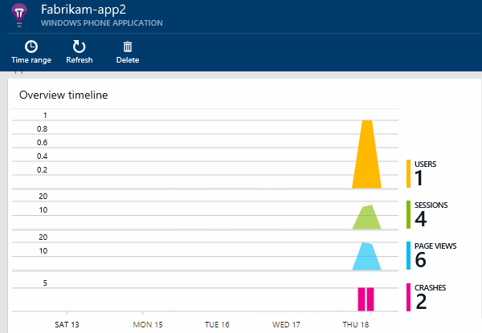
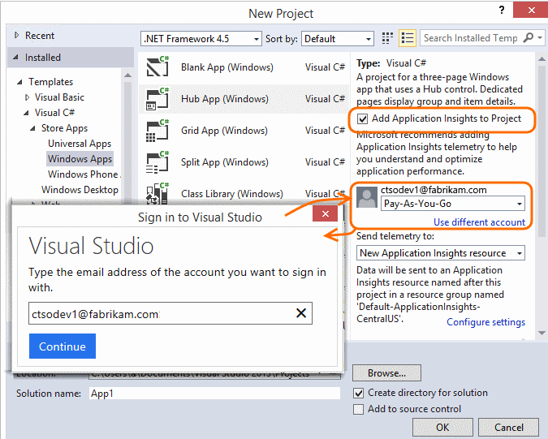

<properties 
	pageTitle="Application Insights for Windows Phone and Store apps" 
	description="Analyze usage and performance of your Windows device app with Application Insights." 
	services="application-insights" 
    documentationCenter="windows"
	authors="alancameronwills" 
	manager="keboyd"/>

<tags 
	ms.service="application-insights" 
	ms.workload="tbd" 
	ms.tgt_pltfrm="ibiza" 
	ms.devlang="na" 
	ms.topic="article" 
	ms.date="04/02/2015" 
	ms.author="awills"/>

# Application Insights for Windows Phone and Store apps

*Application Insights is in preview.*

[AZURE.INCLUDE [app-insights-selector-get-started](../includes/app-insights-selector-get-started.md)]

Visual Studio Application Insights lets you monitor your published application for:

* [**Usage**][windowsUsage] - Learn how many users you have and what they are doing with your app.
* [**Crashes**][windowsCrash] - Get diagnostic reports of crashes and understand their impact on users.

For many application types, [Visual Studio can add Application Insights to your app](#ide) almost without you noticing. But since you're reading this to get a better understanding of what's going on, we'll take you through the steps manually.

You'll need:

* A subscription to [Microsoft Azure][azure].
* Visual Studio 2013 or later.

## 1. Create an Application Insights resource 

In the [Azure portal][portal], create a new Application Insights resource.

A [resource][roles] in Azure is an instance of a service. This resource is where telemetry from your app will be analyzed and presented to you.

#### Copy the Instrumentation Key

The key identifies the resource. You'll need it soon, to configure the SDK to send the data to the resource.

## 2. Add the Application Insights SDK to your apps

In Visual Studio, add the appropriate SDK to your project.

If it's a Windows Universal app, repeat the steps for both the Windows Phone project and the Windows project.

1. Right-click the project in Solution Explorer and choose **Manage NuGet Packages**.

    

2. Select **Online**, **Include prerelease**, and search for "Application Insights".

    

3. Pick the latest version of the appropriate package - one of:
   * Application Insights for Windows applications - *for Windows Store apps*
   * Application Insights for Windows Phone applications
   * Application Insights for Web Apps - *use this for a desktop application* 
4. Edit ApplicationInsights.config (which has been added by the NuGet install). Insert this just before the closing tag:

    `<InstrumentationKey>`*the key you copied*`</InstrumentationKey>`

**Windows Universal apps**: Repeat the steps for both the Phone and the Store projecct.

## 3. Enable network access for your app

If your app doesn't already [request outgoing network access](https://msdn.microsoft.com/library/windows/apps/hh452752.aspx), you'll have to add that to its manifest as a [required capability](https://msdn.microsoft.com/library/windows/apps/br211477.aspx).

## 4. Run your project

[Run your application with F5](http://msdn.microsoft.com/library/windows/apps/bg161304.aspx) and use it, so as to generate some telemetry. 

In Visual Studio, you'll see a count of the events that have been received.

In debug mode, telemetry is sent as soon as it's generated. In release mode, telemetry is stored on the device and sent only when the app resumes.

## 5. See monitor data

Open Application Insights from your project.

At first, you'll just see one or two points. For example:

Click Refresh after a few seconds if you're expecting more data.

Click any chart to see more detail. 

## 5. Publish your application to Store

[Publish your application](http://dev.windows.com/publish) and watch the data accumulate as users download and use it.

## The automated way

If you prefer to use Visual Studio to perform the setup steps, you can do that with Windows Phone, Windows Store, and many other types of apps.

### If you're creating a new Windows app project ...

Select Application Insights in the New Project dialog. 

If you're asked to sign in, use the credentials for your Azure account (which is separate from your Visual Studio Online account).

### Or if it's an existing project ...

Add Application Insights from Solution Explorer.

## Next Steps

[Track usage of your app][windowsUsage]

[Detect and diagnose crashes in your app][windowsCrash]

[Capture and search diagnostic logs][diagnostic]

[Use the API to send custom telemetry][api]

[Troubleshooting][qna]

<!--Link references-->

[api]: app-insights-api-custom-events-metrics.md
[azure]: insights-perf-analytics.md
[diagnostic]: app-insights-diagnostic-search.md
[portal]: http://portal.azure.com/
[qna]: app-insights-troubleshoot-faq.md
[roles]: app-insights-resources-roles-access-control.md
[windowsCrash]: app-insights-windows-crashes.md
[windowsUsage]: app-insights-windows-usage.md

