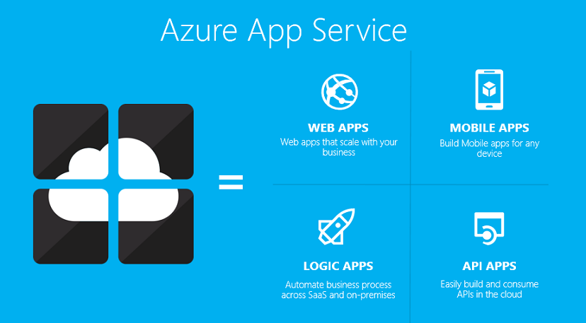

<properties 
	pageTitle="What are API Apps?" 
	description="Learn why Azure App Service is the best platform for developing, publishing, and hosting RESTful APIs." 
	services="app-service\api" 
	documentationCenter=".net" 
	authors="tdykstra" 
	manager="wpickett" 
	editor="jimbe"/>

<tags 
	ms.service="app-service-api" 
	ms.workload="web" 
	ms.tgt_pltfrm="na" 
	ms.devlang="na" 
	ms.topic="article" 
	ms.date="05/05/2015" 
	ms.author="tdykstra"/>

# What are API Apps?

API Apps are part of the [Azure App Service](app-service-value-prop-what-is.md) suite that also includes web apps, mobile apps, and logic apps. 

The API Apps part of this suite provides a rich platform and ecosystem for building, consuming and distributing APIs in the cloud and on-premises.

>[AZURE.NOTE] API Apps is currently in public preview. It's built on top of [App Service Web Apps](app-service-web-overview.md), which is a Generally Available (GA) service designed for building and hosting secure mission-critical applications at global scale. If you are looking for a GA service for building your API today, Web Apps is a great option. When API Apps goes GA, we'll provide a path for taking existing Web apps and leveraging features of API Apps.

## Why API Apps?

An API app is an [App Service web app](app-service-web-overview.md) with additional features that enhance the experience of developing, deploying, publishing, consuming, managing, and monetizing RESTful web APIs.

That means API apps share with web apps all the web hosting features of the Azure App Service platform:

- Automatic OS patching
- Enterprise grade security
- High availability
- Auto scaling and load balancing
- [WebJobs](websites-webjobs-resources.md) for background processing
- Quick and easy deployment, and many continuous delivery options - For information about the range of deployment options available for API apps, see [Deploy a web app in Azure App Service](web-sites-deploy.md). 

The additional features that the API Apps platform provides make it easy to develop, host, and consume APIs:

- **Bring your API as-is** - Use ASP.NET, Java, PHP, Node.js or Python for your APIs. Your APIs can take advantage of the API Apps platform with no changes.

- **Simple access control** - Configure your APIs for authentication by Azure Active Directory or third-party services such as Facebook and Twitter with no changes to your code. Use a simplified syntax for authorization code. For more information,see [Protect an API app](app-service-api-dotnet-add-authentication.md).

- **Easy connection to SaaS platforms** - [Connector API apps](app-service-logic-what-are-biztalk-api-apps.md) in the Azure Marketplace are provided by Microsoft and third parties to simplify the code you write for interacting with SalesForce, Office 365, Twitter, Facebook, Dropbox, and many others.

- **Access on-premises data** - API Apps can expose APIs that consume data from your own data center using [hybrid connections](integration-hybrid-connection-overview.md) and [VNET](web-sites-integrate-with-vnet.md).

- **Easy consumption** - Use integrated [Swagger](http://swagger.io/) support to make your APIs easily consumable by a variety of clients.  Or use the API Apps SDK to generate client code for your APIs in a variety of languages including C#, Java, and Javascript.

- **Integration with logic apps** - API apps that you create can be consumed by App Service logic apps.    

- **Visual Studio integration** - Dedicated tools in Visual Studio streamline the work of [creating](app-service-dotnet-create-api-app.md), [deploying](app-service-dotnet-deploy-api-app.md), [debugging](app-service-dotnet-remotely-debug-api-app), and managing API apps.

In the near future, the API Apps platform will also create a rich ecosystem of APIs by making it easy to share your code:  

- **Public and private marketplaces** - The [Azure Marketplace](http://azure.microsoft.com/marketplace/) will make it easy to find and deploy to your Azure subscription pre-packaged API apps developed by Microsoft and third parties. And you'll be able to package and publish your own API apps that you develop, so other developers can deploy them to their Azure subscriptions. When you publish your APIs to the Azure Marketplace, you'll be able to make them visible only to other members of your organization. 

- **Automatic dependency deployment** - Whenever you deploy an API app from the Marketplace to your Azure subscription, Azure will automatically deploy dependent API apps and create required resources. An API app package will specify the API apps that it depends on and the Azure resources that it requires.

- **Automatic updates** - When you update the code for one of your API app packages that you've shared, you'll be able to push the update out to everyone who has installed and is running your API app. This will work for non-breaking changes and users who have opted-in to receiving updates.

Many of these features, such the public marketplace and automatic updates, are already available for API apps provided by Microsoft.

## API Apps concepts ##

- **Gateway** - A web app that handles API administration functions and authentication for all API apps in a resource group. 
- **Swagger** - A framework for interactive documentation and discovery of a RESTful API, used by default in API apps. For more information, see [http://swagger.io/](http://swagger.io/).
- **Connector** - A type of API app that makes it easy to connect to SaaS platforms such as Salesforce and Office 365. For more information, see [What are connectors and BizTalk API apps](app-service-logic-what-are-biztalk-api-apps.md).
- **Trigger** - A REST API that [logic apps](app-service-logic-what-are-logic-apps.md) can call to initiate a workflow process when a certain condition is met. For example, an API app could provide a method that the logic app calls periodically to look for a certain phrase in a Twitter feed. For more information, see [API app triggers](app-service-api-dotnet-triggers.md).
- **Action** - A REST API that [logic apps](app-service-logic-what-are-logic-apps.md) can call to process data after a workflow has been started by a trigger. For example, an API app could provide a method that the logic app calls to respond to a tweet found by the Twitter trigger. Actions are API methods that are exposed by a Swagger API definition.

## Getting started

To get started with API apps, follow the [Create an API app tutorial](app-service-dotnet-create-api-app.md).

To see a list of known issues with API apps, please refer to [this MSDN forum post](https://social.msdn.microsoft.com/Forums/en-US/7f8b42f2-ac0d-48b8-a35e-3b4934e1c25e/api-app-known-issues?forum=AzureAPIApps).

For more information about the Azure App Service platform, see [Azure App Service](app-service-value-prop-what-is.md).

