<properties 
	pageTitle="Connect your app to an existing SaaS connector" 
	description="This article demonstrates how to connect to an existing SaaS connector" 
	services="app-service\api" 
	documentationCenter=".net" 
	authors="VinayaReddy" 
	manager="wpickett" 
	editor="jimbe"/>

<tags 
	ms.service="app-service-api" 
	ms.workload="web" 
	ms.tgt_pltfrm="dotnet" 
	ms.devlang="na" 
	ms.topic="article" 
	ms.date="03/20/2015" 
	ms.author="vinayr;tdykstra"/>

# Connect your app to an existing SaaS connector

## Overview
[Azure App Service](/documentation/services/app-service/) is a fully managed compute platform for professional developers that brings a rich set of capabilities to web, mobile, and integration scenarios. API apps are one part of the App Service suite and allow any technical user or developer to discover, host, manage and monetize API’s and SaaS connectors on a modern, feature rich, scalable, and globally available cloud platform. Read [What are API Apps](app-service-api-apps-why-best-platform.md) article to learn more about API Apps.  

This tutorial shows you how to consume a SaaS connector that’s in the Azure Marketplace. 

This tutorial walk you through the steps that you need to take to provision and configure Dropbox connector in the Azure portal and connect to your Dropbox account to view or modify the files. 

You'll perform the following steps to see the files in your Dropbox account.

* Provision Dropbox Connector 
* Configure Dropbox API App.
* Configure the gateway.
* Acquire and store the token in token store. 
* Call the Dropbox API’s and verify that authenticated access works.

## Provision Dropbox connector

1. Go to the preview portal home page and click Marketplace.

	

2. Search for Dropbox in the Marketplace gallery.

	
 
3. Click the Dropbox icon to provision the Dropbox Connector. Click the ‘create’ button to provision the Dropbox connector. Make sure you fill in the name and desired values for all the fields before you click the ‘Create’ button. Read [Using resource groups to manage your Azure resources](azure-preview-portal-using-resource-groups.md) and [Azure App Service plans in-depth overview](azure-web-sites-web-hosting-plans-in-depth-overview.md) articles to better understand the options you have before choosing the values. 

	 

4. Look at the resource group's blade in the [preview portal] (https://portal.azure.com/). You see the Dropbox connector and the gateway. When you provisioned an API App, you provisioned it to be a part of a resource group. When the portal created the resource group for you, it also created a gateway. A gateway is a special web app that handles all requests destined for API apps in the resource group.

	You can add web apps and other API apps to the same resource group, and each API app within the resource group can have one of three accessibility settings:

	* Public (anonymous) - Anyone can call the API app from outside the resource group without being logged in.
	* Public (authenticated) - Only authenticated users are allowed to call the API app from outside the resource group.
	* Internal - Only other API apps or web apps in the same resource group are allowed to call the API app.

## Configure Dropbbox API App

First, configure the Dropbox to accept only authenticated requests.  You'll set its accessibility to **Public (authenticated)** and you'll configure the gateway to require authentication from a provider such as Azure Active Directory, Google, or Facebook.

1.	In the Azure [preview portal](https://portal.azure.com/) click **Browse > API Apps**, and then click the name of the API app that you want to protect.

	 

	 
 
2.	In the API App blade, click Settings. 
 
	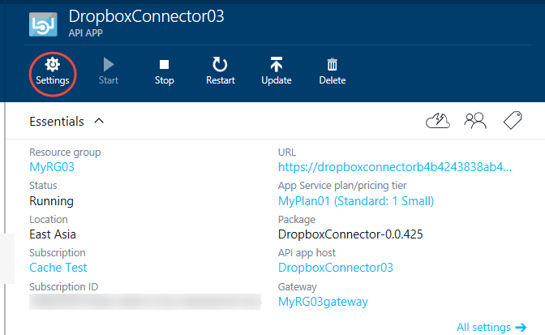 

3.  Select the Application settings option.

	 

4.	In the **Application Settings** blade, change **Access Level** to **Public (authenticated)**. 

	 

	You have now protected the Dropbox Connector from unauthenticated access. Now it is time to setup the Dropbox Authentication. 
    
	To fill in the right values in the next blade, please make sure you go to [Dropbox develop portal](https://www.dropbox.com/developers/apps) and click on the *App Console*. Create a *Dropbox API app*. Click on the API app link to see the *App Key* and *App Secret*.

	Fill in the *Client ID* (App Key) and "Client Secret* (App Secret) details in the UI shown below.

	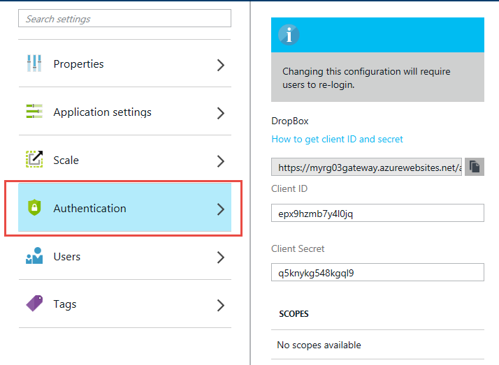 

Next you have to configure the gateway to specify which authentication provider to use.

## Configure the gateway

1. Go back to the Dropbox API App blade, and then click the link to the gateway.
 
	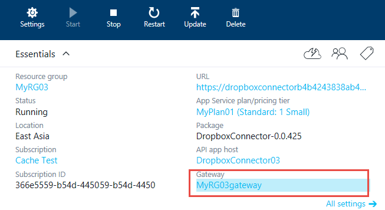 

	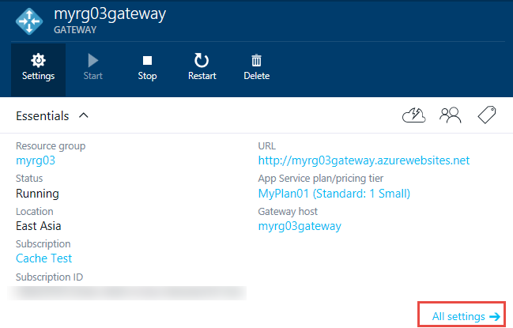

	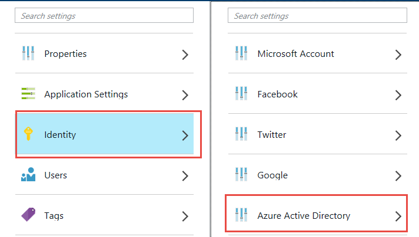 

2. Choose the identity provider you want to use, and follow the steps in the corresponding article to configure your API app with that provider. These articles were written for mobile apps, but the procedures are the same for API apps. Some of the procedures require you to use both the [management portal](https://manage.windowsazure.com/) and the [preview portal](https://portal.azure.com/).
  
	- [Microsoft Account](app-service-mobile-how-to-configure-microsoft-authentication-preview.md)
	- [Facebook login](app-service-mobile-how-to-configure-facebook-authentication-preview.md)
	- [Twitter login](app-service-mobile-how-to-configure-twitter-authentication-preview.md)
	- [Google login](app-service-mobile-how-to-configure-google-authentication-preview.md)
	- [Azure Active Directory](app-service-mobile-how-to-configure-active-directory-authentication-preview.md)

	Look at the “Protect an API app: Add Azure Active Directory or social provider authentication” article for step by step instructions on how to do the configuration . 

## Acquire and store the OAuth token in token store.

1.	In the browser, go to the login URL: 

	You can grab the URL from the gateway active directory setup blade.
	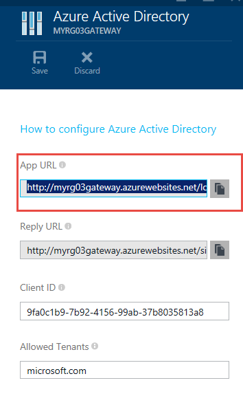 
	
	Your url will be in the following format...
	http://[resourcegroupname]gateway.azurewebsites.net/login/[providername]

	For example, if you named your resource group ‘MyResource’ and you configured the gateway for Azure Active Directory authentication, the URL would be the following:

		http://Myresourcegateway.azurewebsites.net/login/aad
	
	Make sure you launch the developer tools before you enter the URL in the browser and hit enter. We should recieve login complete message. 

	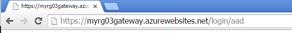 

	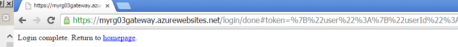 

	Grab the zumo auth token and value from the network tab (chrome).
	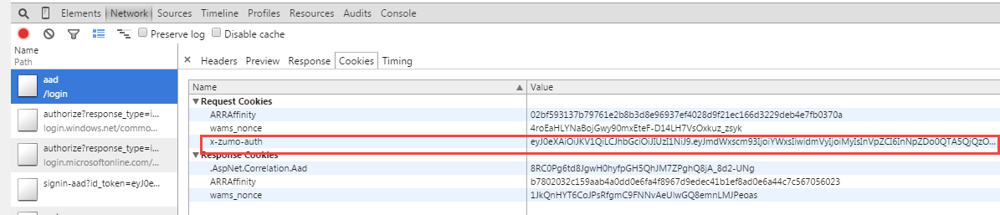 

	Bring up the postman extension in Chrome. Enter the gateway consent URL and Zumo auth token (header) and value and make POST request. 

	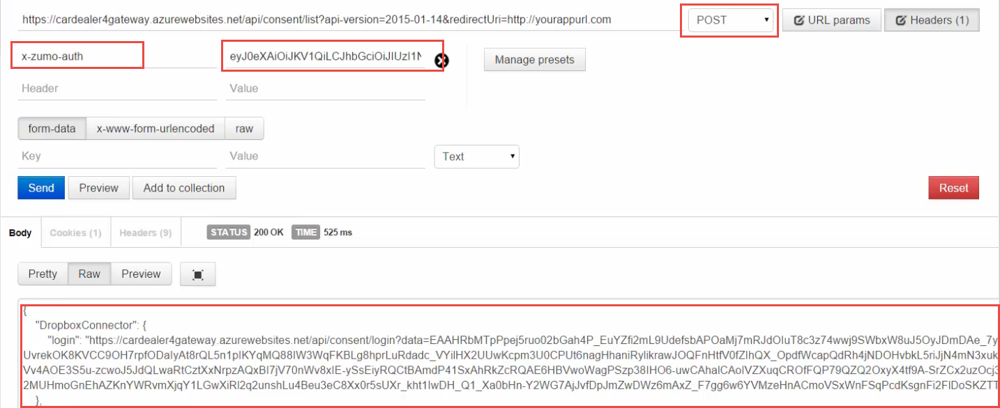 
 
	Grab the redirect url that comes back from the post request and verify that redirect URL works. 

	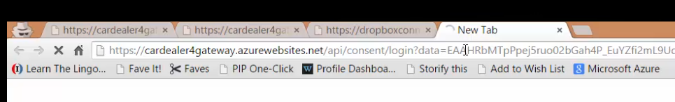

	If the redirect URL works that means the token is valid. Any calls that are made to the SaaS connector will use the token that we have established and verified. This token must be included with all requests from external sources that go through the gateway. When you access an API with a browser, the browser typically stores the token in a cookie and sends it along with all subsequent calls to the API.

The same flow is applicable for all SaaS connectors like Safesforce, Facebook, etc. 

## Call the Dropbox API’s and verify that authenticated access works.

1. Go back to the API App list and select the Dropbox Connector. 

1. Note the URL at the top.

2. Click the Dropbox Connector (as shown in the picture) to all see the supported API’s .

	 

	You can see what operations are supported in the API App in the API Definition blade. You can download swagger which you can consume in Visual Studio to generate strongly typed clients. Also, you can download swaddle that can be used in Sienna and PowerApp studio. 

2. In a browser window, type the URL that you copied from the portal and append with any of the supported API’s to access the files or other details in your Dropbox account. 

	Format:  <URL>/Operation

	For example:

		https://dropboxconnector7b47555bd6784237ad3e7736da769ffc.azurewebsites.net/folder/photos
   
	Given we have establised the right authentication already the call above succeeds and shows the photos folder details in the browser. 
	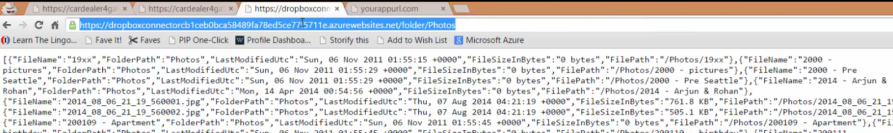 

<!--todo<Copy the image of the browser>-->

## Next steps

You've seen how to protect an API app and configure the gateway to access the SaaS connector using the token store. For more information, see [What are API apps?](app-service-api-apps-why-best-platform.md). 
