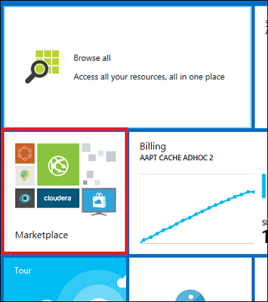
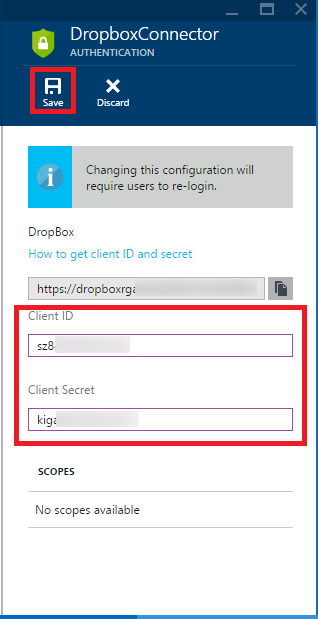
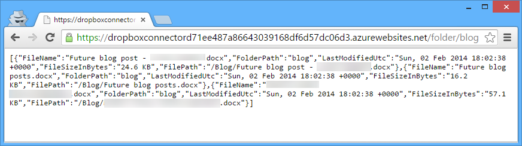

<properties 
	pageTitle="Use a SaaS connector from code" 
	description="Learn how to configure a SaaS connector that you install in your Azure subscription from the Azure Marketplace." 
	services="app-service\api" 
	documentationCenter=".net" 
	authors="tdykstra" 
	manager="wpickett" 
	editor="jimbe"/>

<tags 
	ms.service="app-service-api" 
	ms.workload="web" 
	ms.tgt_pltfrm="dotnet" 
	ms.devlang="na" 
	ms.topic="article" 
	ms.date="04/07/2015" 
	ms.author="tdykstra"/>

# Use a SaaS connector from code

## Overview

This tutorial shows how to install, configure, and test a [Software-as-a-Service (SaaS) connector](app-service-logic-what-are-bizTalk-api-apps.md) in [Azure App Service](/documentation/services/app-service/) for calling it programmatically, such as from a mobile app. A SaaS connector is an [API app](app-service-api-apps-why-best-platform.md) that simplifies interaction with a SaaS platform such as Office 365, Salesforce, Facebook, and Dropbox. 

For example, if you want to code HTTP requests to read and write files in your Dropbox account, the authentication process for working directly with Dropbox is complicated. A Dropbox connector takes care of the complexity of authentication so that you can focus on writing your business-specific code.

> [AZURE.WARNING] The instructions here **should *not* to be followed if you want to use a SaaS connector from a logic app**. Please see [Create a new logic app](app-service-logic-create-a-logic-app.md) for details on how to use SaaS connectors inside logic apps. This article is specifically if you want use *code* to call your connector.
 
This tutorial uses a DropBox connector as an example and walks you through the following steps:

* Install the Dropbox connector in a [resource group](resource-group-overview.md) in your Azure subscription. 
* Configure the Dropbox connector so that it can connect to the Dropbox service. (To complete this step you'll need a Dropbox account.)
* Configure the resource group so that only authenticated users can access API apps that are included in the resource group.
* Test to verify that both user authentication and Dropbox authentication work.

## Install the Dropbox connector

1. Go to the [Azure preview portal] home page and click **Marketplace**.

	

2. Search for Dropbox, and then click the **Dropbox Connector** icon.

	
 
3. Click **Create**.

	
 
5. In the **Dropbox Connector** blade, under **App Service plan** click **Create New**, and then in the **Create new App Service plan** box enter DropBoxPlan. 

	For more information about App Service plans, see [Azure App Service plans in-depth overview](azure-web-sites-web-hosting-plans-in-depth-overview.md). 

4. Under **Resource Group**, click **Create New**, and then in the **Create New Resource Group** box enter DropboxRG.

	For more information about resource groups, see [Using resource groups to manage your Azure resources](resource-group-overview.md).

7. Select the Free **Pricing Tier**. (If you don't see it in the list, click **View All**. After you click **F1 Free**, click the **Select** button.)

	You can use a paid pricing tier, but it isn't required for this tutorial.
 
11. Choose a **Location** close to you.  

9. Keep the default "DropboxConnector" as the **Name** of the connector, and then click **Create**. 

	 

	Azure App Service creates a resource group, and in the resource group it creates a Dropbox connector API app, and a *gateway* web app. The gateway's function is to manage access to all API apps in the resource group. 

	You can check the progress of resource creation by clicking **Notifications** on the Azure preview portal home page.

3. When Azure finishes creating the connector, click **Browse > Resource groups > DropboxRG**.
 
	The **Resource Group** blade for DropboxRG shows the connector and the gateway in the resource group.

	 

## Configure your Dropbox account and the Dropbox connector

To enable API access to your Dropbox account, you have to create a Dropbox app on the Dropbox developer site. Then you copy the client ID and client secret values from that Dropbox app to your Dropbox connector, and you set the connector to accept only authenticated requests.

### Create a Dropbox app

The following steps show the process for creating a Dropbox app using the Dropbox.com site. As the Dropbox.com site may change without notice, you might see differences in UI from what is shown.

1. Go to the [Dropbox developer portal](https://www.dropbox.com/developers/apps), click **App Console**, and then click **Create App**.

	 

2. Choose **Dropbox API app** and configure the other settings. 
 
	The file access options shown in the screenshot below will enable you to test access to your Dropbox account with a simple HTTP Get request if you have any files in your account. 

	The name of the Dropbox API app can be anything the Dropbox site will accept.

3. Click **Create app**.

	

	The next page shows the App key and App secret settings (named Client ID and Client secret in Azure) that you'll use for configuring your Azure Dropbox connector. 

	This page also has a field where you can enter a Redirect URI, the value of which you'll get in the next section.

	

### Copy the Dropbox app settings to the Azure Dropbox connector and vice versa 

4. In another browser window or tab, go to the [Azure preview portal].

3. Go to the **API App** blade for your Dropbox connector. (If you're still on the **Resource Group** blade, just click the Dropbox connector in the diagram.)

4. Click **Settings**, and in the **Settings** blade click **Authentication**.

	

	

5. In the Authentication blade, enter the client ID and client secret from the Dropbox site, and then click **Save**.

	

3. Copy the **Redirect URI** (the grey box above the client ID and client secret) and add the value to the page you left open in the previous step. 

	The redirect URI follows this pattern:

		[gatewayurl]/api/consent/redirect/[connectorname]

	For example:

		https://dropboxrgaeb4ae60b7.azurewebsites.net/api/consent/redirect/DropboxConnector

	

	

### Set the Dropbox connector to require authenticated access

By default the connector's **Access level** is set to **Internal**, meaning it can only be called by other API apps and web apps in the same resource group. But Dropbox allows only authenticated users to access your Dropbox account, so you have to change the access level setting to require user authentication.

1. Go back to the **Settings** blade, and click **Application settings**.

2. In the **Application settings** blade, set **Access level** to **Public (authenticated)**, and then click **Save**. 
	
	

You have now configured the Dropbox Connector so that outgoing calls can access your Dropbox account, and incoming calls must be from authenticated users. In the next section you specify which authentication provider you want to use to authenticate users.

## Configure the gateway

As explained [earlier](#gateway), the gateway is a special web app that manages access to all API apps in a resource group. To set up the gateway to authenticate users, you choose an authentication provider such as Azure Active Directory, Google, or Twitter. Users will then have to authenticate with the chosen provider before they can successfully call the Dropbox connector.

- To perform this step, go to the [Configure the gateway](app-service-api-dotnet-add-authentication.md#configure-the-gateway) section of the [Protect an API app](app-service-api-dotnet-add-authentication.md) tutorial, and follow the directions there to configure the gateway in your DropboxRG resource group.

## Test to verify user and Dropbox authentication

After you have configured the gateway in your DropboxRG resource group to use an authentication provider, you can test your Dropbox connector.

Most of the time you'll use a connector by calling it from code, and we're also writing tutorials that will show how to do that. But sometimes you'll want to validate that the connector is working before wiring up other parts of an app. This tutorial shows how to use a browser and a simple REST client tool to verify that you can interact with the Dropbox service through the Dropbox connector that you just installed and configured.

The following instructions show how to do these steps by using the Chrome browser developer tools and Postman REST client tool. This is just an example, and you can do the same procedures with other browsers and tools.

### Log in as an end user

Do the following steps in a new browser window. Depending on what authentication provider you're using, you might find that you need to use a private or incognito window.

2. Go to the login URL for the gateway and the authentication provider that you configured. The URL follows this pattern: 

    	http://[gatewayurl]/login/[providername]

	You can get the gateway URL from the **Gateway** blade in the [Azure preview portal]. (To get to the **Gateway** blade, click the gateway in the diagram shown on the **Resource group** blade.)

	

	The [providername] value is "facebook" for Facebook, "twitter" for Twitter, "aad" for Azure Active directory, etc.

	Here is a sample login URL for Azure Active Directory:

		https://dropboxrgaeb4ae60b7cb4f3d966dfa43.azurewebsites.net/login/aad/

3. Enter your credentials when the browser displays a login page. 
 
	If you configured Azure Active Directory login, log in as one of the users listed in the **Users** tab for the application you created in the Azure Active Directory tab of the [Azure portal], such as admin@contoso.onmicrosoft.com.

	When login is successful, you get a "Login complete" page.

	

### Provide the user's identity to Dropbox

To get Dropbox authorization to use the Dropbox API, you have to provide the user's credentials to Dropbox.  Azure will do that for you, but to trigger that process you have to go to a special URL in the browser.  To get that URL you make an HTTP Post request to the gateway.

The HTTP Post request to the gateway has to include the authentication token that Azure provided when you logged in. For browser requests, including the token is automatic because the token is stored in a cookie, but for an HTTP Post request using a REST client tool you have to get the token from the cookie and put it in the request header of the HTTP Post request.

1. In the browser window that has the "Login complete" message, go to the browser's developer tools and find the `x-zumo-auth` cookie. Keep this window open so you can copy the value of the cookie in the next step.
 
	To get the cookie value in Chrome, perform the following steps:

	- Press F12 to open developer tools.
	- Go to the **Resources** tab.
	- Find the cookies for your gateway site, and triple-click the **Value** of the `x-zumo-auth` cookie to select all of it. (Make sure you get all of the cookie's value. If you double-click, you might get only the first part of it.)  

	 

4. In a new browser tab or window, create and send an HTTP Post request to the gateway to request a consent URL. Include the `x-zumo-auth` token as an HTTP header.

	The URL follows this pattern:

		[gatewayurl]/api/consent/list?api-version=2015-01-14&redirecturl=[a URL you want the browser to go to after you authenticate]

	For example:

		https://dropboxrgaeb4ae60b7cb4f3d966dfa43.azurewebsites.net/api/consent/list?api-version=2015-01-14&redirecturl=https://portal.azure.com

	To send the request in Postman in Chrome, perform the following steps:

	- Enter the **Request URL** described above.
	- Set the method to **Post**.
	- Add a header named `x-zumo-auth`.
	- In the header **Value** field paste the value you copied from the `x-zumo-auth` cookie.
	- Click **Send**.
	 
	The following illustration shows the Postman tool in Chrome:

	

	The response includes a URL to use in order to authenticate the user with Dropbox. (If you get an error response that indicates the Get method is not supported although you have the method dropdown set to **Post**, you might have to use a different REST client tool.  "Advanced REST Client" is another Chrome add-in you can use.)

	

2. Go to the URL that you received in response to the HTTP Post request.

	Dropbox associates your user identity with your Dropbox API app, and then redirects the browser to the redirect URL that you specified (e.g., the Azure preview portal if you followed the example and used https://portal.azure.com).

	Because your Dropbox app is in developer mode, you may get a login page from Dropbox before the browser goes to the redirect URL.  After you log in using your Dropbox credentials, the user identity you used to log in to the gateway is associated with your Dropbox app, and in the future this Dropbox login step is no longer required for that user identity. 

3. Keep this browser window open, as you'll use it in the following section.

### Call the Dropbox connector API 

Azure is now managing three authentication tokens for you:

- One from the authentication provider you configured for the gateway, for example Azure Active Directory.
- One from Dropbox.
- One that Azure creates (the "zumo" token).

The only one you have to use when making HTTP requests to work with Dropbox is the zumo token. Behind the scenes Azure has associated that token with the other two, and the connector provides the other two on your behalf when it makes calls to Dropbox.

In the following steps you make a Get request to the Dropbox connector to look at files in your Dropbox account. Since you can use a browser window for a Get request, and since your browser window already has the zumo token in a cookie, all you have to do is go to a URL and you get back Dropbox data. 

1. In the browser window that has the Azure preview portal open, go back to the **API App** blade for your Dropbox connector. 

2. Copy the API app's URL.
 
4. Click the **API definition** icon to see the API methods available in the connector.

	 

	 

2. In the browser window that you used to authenticate to the gateway, call the GET method that retrieves file names from a folder. Here is the URL pattern:

		[connectorurl]/folder/[foldername]
   
3. For example, if your connector URL is https://dropboxrg784237ad3e7.azurewebsites.net and you want to see the files in your blog folder, the URL would be:

		https://dropboxrg784237ad3e7.azurewebsites.net/folder/blog

	Different browsers respond to API calls differently; if you're using Chrome you'll see a response similar to the following example:

	 

## Next steps

You've seen how to install, configure, and test a SaaS connector. For more information, see [Using connectors](app-service-logic-use-biztalk-connectors.md). 

[Azure preview portal]: https://portal.azure.com/
[Azure portal]: https://manage.windowsazure.com/