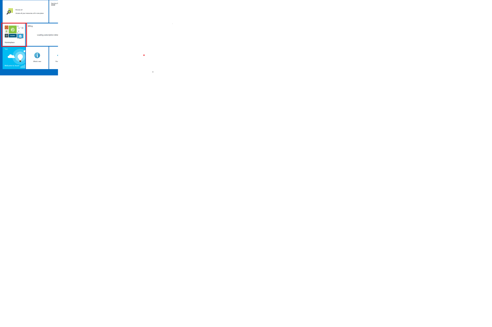
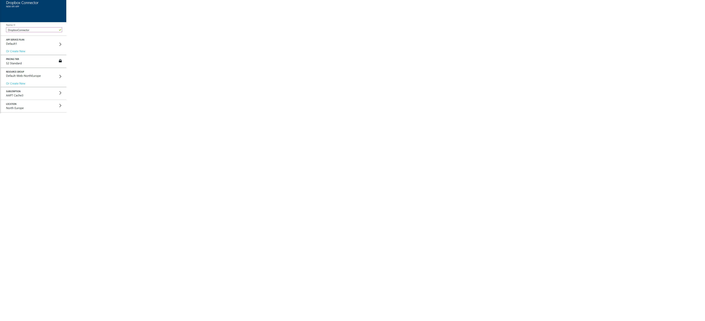
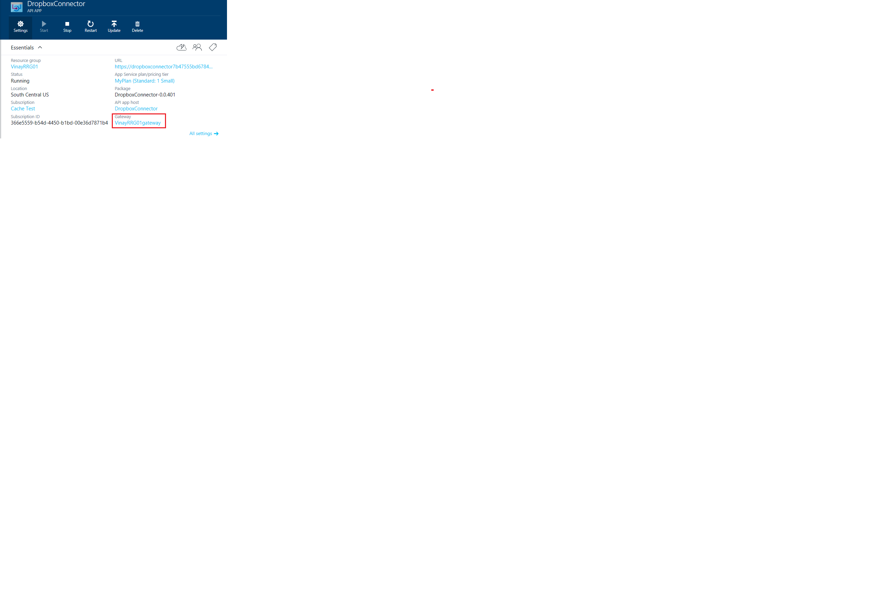
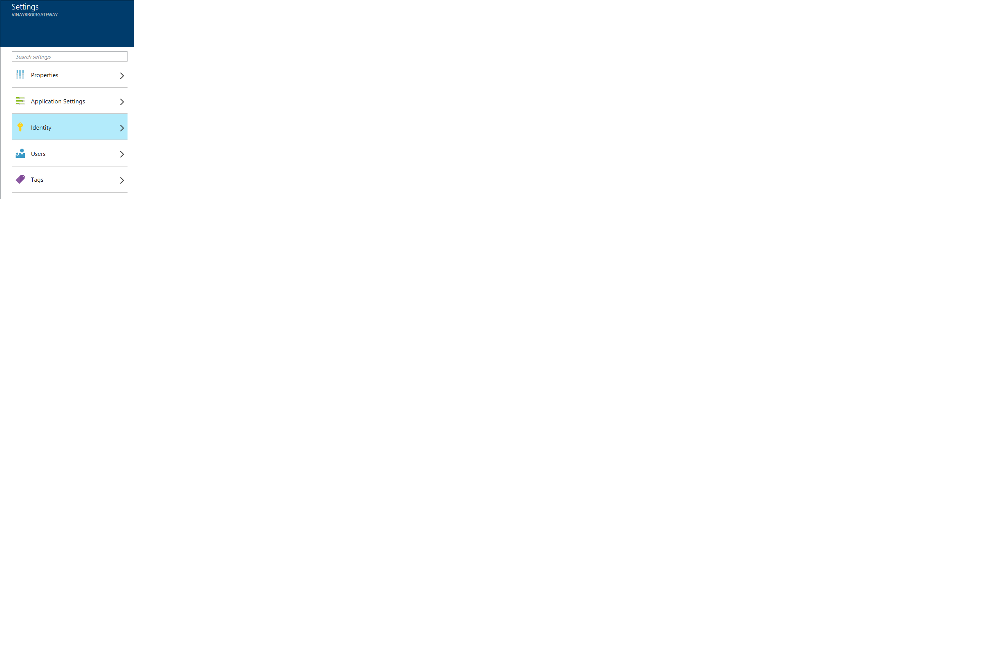
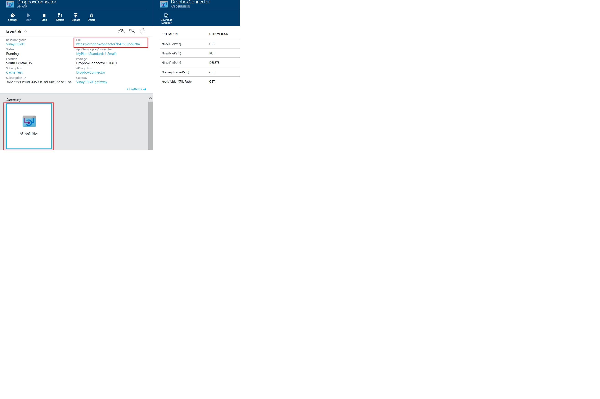

<properties 
	pageTitle="Connect your app to an existing SaaS connector" 
	description="This article demonstrates how to connect to an existing SaaS connector" 
	services="app-service\api" 
	documentationCenter=".net" 
	authors="VinayaReddy" 
	manager="wpickett" 
	editor="jimbe"/>

<tags 
	ms.service="app-service-api" 
	ms.workload="web" 
	ms.tgt_pltfrm="dotnet" 
	ms.devlang="na" 
	ms.topic="article" 
	ms.date="03/20/2015" 
	ms.author="vinayr;tdykstra"/>

# Connect your app to an existing SaaS connector

## Overview

This tutorial shows you how to consume a SaaS connector that’s in the Azure Marketplace. 

You'll perform the following steps:
- Provision Dropbox Connector.
- Configure Dropbox API App.
- Configure the gateway.
- Acquire and store the token in token store. 
- Call the Dropbox API’s and verify that authenticated access works.

## Provision Dropbox connector

1. Go to the preview portal home page and click Marketplace.

	

2. Search for Dropbox in the Marketplace gallery.

	
 
3. Click the Dropbox icon to provision the Dropbox Connector. Click the ‘create’ button to provision the Dropbox connector. Make sure you fill in the name and desired values for all the fields before you click the ‘Create’ button. 

	 

4. Look at the resource group's blade in the [preview portal] (https://portal.azure.com/). You see the Dropbox connector and the gateway. When you provisioned an API App, you provisioned it to be a part of a resource group. When the portal created the resource group for you, it also created a gateway. A gateway is a special web app that handles all requests destined for API apps in the resource group.

	You can add web apps and other API apps to the same resource group, and each API app within the resource group can have one of three accessibility settings:

	* Public (anonymous) - Anyone can call the API app from outside the resource group without being logged in.
	* Public (authenticated) - Only authenticated users are allowed to call the API app from outside the resource group.
	* Internal - Only other API apps or web apps in the same resource group are allowed to call the API app.

## Configure Dropbbox API App

First, configure the Dropbox to accept only authenticated requests.  You'll set its accessibility to **Public (authenticated)** and you'll configure the gateway to require authentication from a provider such as Azure Active Directory, Google, or Facebook.

1.	In the Azure [preview portal](https://portal.azure.com/) click **Browse > API Apps**, and then click the name of the API app that you want to protect.

	 

	 
 
2.	In the API app blade, click Settings, and then click Application settings.
 
	 

	 

3.	In the **Application Settings** blade, change **Access Level** to **Public (authenticated)**. 

	 

	You have now protected the Dropbox Connector from unauthenticated access. Next you have to configure the gateway to specify which authentication provider to use.

## Configure the gateway

1. Go back to the Dropbox API App blade, and then click the link to the gateway.
 
	 

	

	 

2. Choose the identity provider you want to use, and follow the steps in the corresponding article to configure your API app with that provider. These articles were written for mobile apps, but the procedures are the same for API apps. Some of the procedures require you to use both the [management portal](https://manage.windowsazure.com/) and the [preview portal](https://portal.azure.com/).
  
	- [Microsoft Account](https://github.com/Azure/azure-content-pr/blob/release-app-services/app-service-mobile-how-to-configure-microsoft-authentication-preview)
	- [Facebook login](https://github.com/Azure/azure-content-pr/blob/release-app-services/app-service-mobile-how-to-configure-facebook-authentication-preview)
	- [Twitter login](https://github.com/Azure/azure-content-pr/blob/release-app-services/app-service-mobile-how-to-configure-twitter-authentication-preview)
	- [Google login](https://github.com/Azure/azure-content-pr/blob/release-app-services/app-service-mobile-how-to-configure-google-authentication-preview)
	- [Azure Active Directory](https://github.com/Azure/azure-content-pr/blob/release-app-services/app-service-mobile-how-to-configure-active-directory-authentication-preview)

	Look at the “Protect an API app: Add Azure Active Directory or social provider authentication” article for step by step instructions on how to do the configuration . 

## Acquire and store the OAuth token in token store.

1.	In the browser, go to the login URL: 

		http://[resourcegroupname]gateway.azurewebsites.net/login/[providername]

	For example, if you named your resource group ‘MyResource’ and you configured the gateway for Azure Active Directory authentication, the URL would be the following:

		http://Myresourcegateway.azurewebsites.net/login/aad

	Note that this does not include your API app name. The gateway is doing the authentication, not the API app. The gateway handles authentication for all API apps in the resource group. 

2.	Enter your credentials when the browser displays a login page.
 
	If you configured Azure Active Directory login, use one of the users listed in the Users tab for the application you created in the Azure Active Directory tab of the [management portal](https://manage.windowsazure.com/).  

	 
 
When the login completes successfully, a token is acquired as part of the return URL and stored in the token store. The App Service backend is facilitating all the OAuth flows with all the SaaS providers. Any calls that are made to the SaaS connector will use the token in the token store to connect to the SaaS API’s. This token must be included with all requests from external sources that go through the gateway. When you access an API with a browser, the browser typically stores the token in a cookie and sends it along with all subsequent calls to the API.

The same flow is applicable for all SaaS connectors like Safesforce, Facebook, etc. 

## Call the Dropbox API’s and verify that authenticated access works.

1. Go back to the API App list and select the Dropbox Connector. 

1. Note the URL at the top.

2. Click the Dropbox Connector (as shown in the picture) to all see the supported API’s .

	 

	You can see what operations are supported in the API App in the API Definition blade. You can download swagger which you can consume in Visual Studio to generate strongly typed clients. Also, you can download swaddle that can be used in Sienna and PowerApp studio. 

2. In a browser window, type the URL that you copied from the portal and append with any of the supported API’s to access the files or other details in your Dropbox account. 

	Format:  <URL>/Operation

	For example:

		https://dropboxconnector7b47555bd6784237ad3e7736da769ffc.azurewebsites.net/file/test.txt

<!--todo<Copy the image of the browser>-->

## Next steps

You've seen how to protect an API app and configure the gateway to access the SaaS connector using the token store. For more information, see [What are API apps?](../app-service-api-apps-why-best-platform/). 