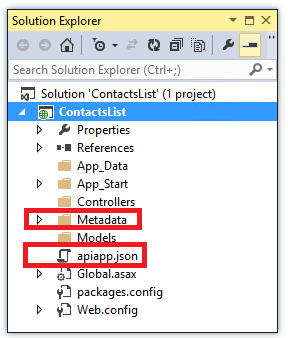
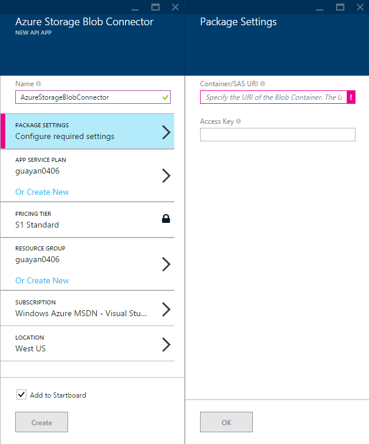
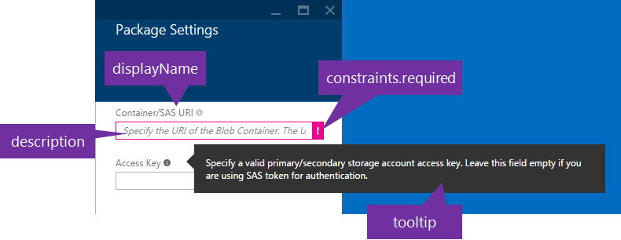

<properties 
	pageTitle="Create an API App Package" 
	description="Learn how to create an API app package." 
	services="app-service\api" 
	documentationCenter=".net"
	authors="guangyang"
	manager="wpickett" 
	editor="jimbe"/>

<tags 
	ms.service="app-service-api" 
	ms.workload="web" 
	ms.tgt_pltfrm="na" 
	ms.devlang="dotnet" 
	ms.topic="article" 
	ms.date="04/20/2015" 
	ms.author="guayan"/>

# Create an API App Package

## Overview

This article shows how to create API App package so that you can publish it to [Azure Marketplace](http://azure.microsoft.com/marketplace/api-apps/).

- To learn how to create an API app, see [Create an API app using Visual Studio](app-service-dotnet-create-api-app.md).
- To learn how to publish an API app package to Azure Marketplace, see [Publish an API app Package to Azure Marketplace](app-service-api-publish-package).

## Folder Structure

An Nuget package (*.nupkg* file) for an API app has the following files and folders under the *Content* folder:

    apiapp.json
    Metadata
        apiDefinition.swagger.json
        icons
            <icon files>
        screenshots
            <screenshot files>
        deploymentTemplates
            <template files>
        UIDefinition.json
    <other artifacts like source code, binary, etc.>

A *.nupkg* file is created with this folder structure when you package a Visual Studio project that has *apiapp.json* and *Metadata* in the project folder, as in the following illustration:

The following sections document each file and folder in the API app folder structure before showing how to package and deploy a project.

## apiapp.json

This is the manifest file for your API app.

|Name (bold=required)|Type|Format|Description|
|:---------------------|:-----|:-------|:------------|
|**id**|string|[a-zA-Z0-9_\.]|The ID of this package. Must be unique within a namespace and can only contain alphanumeric characters, "_" and ".". Must start with an alphanumeric character.|
|**namespace**|string|domain name|The namespace that along with the **id** property uniquely identifies the API app. Must be one of the domain names of the publisher's AAD tenant.|
|**version**|string|[semver](http://docs.nuget.org/Create/Versioning)|The version of this package. When automatic upgrade is enabled by users for this package, it will only apply to new versions within the same major version.|
|**gateway**|string|2015-01-14|The gateway API version this package is using. A gateway is a special web app through which all requests to API apps in a resource group are routed. One of its main functions is to handle authentication. At present the only gateway version is 2015-01-14. In the future when new gateway versions are released, this property will give you the opportunity to avoid breaking changes and continue to use the previous gateway API.| 
|**title**|string||The displayed name of the API app.|
|**summary**|string|max 100 characters|A short summary of the API app.
|description|string|max 1500 characters|The full description of the API app. Can contain HTML. Allowed elements and attributes are "h1", "h2", "h3", "h4", "h5", "p", "ol", "ul", "li", "a[target|href]", "br", "strong", "em", "b", "i".|
|**author**|string|max 256 characters|The author(s) of the API app.|
|homepage|string|URL|The home page of the API app.|
|endpoints|object||A list of endpoints that the API app platform can query for information about the API app's methods and status.|
|endpoints.apiDefinition|string|URL path|Relative URL of an API exposed by the API app which returns a Swagger 2.0 API definition on a GET request (for example, "/swagger/docs/v1"). If this is set, it will be used instead of the static apiDefinition.swagger.json file in the package if there is any.|
|endpoints.status|string|URL path|Relative URL of an API exposed by the API app which returns runtime status information about the API App on a GET request.|
|categories|string[]|community, social, enterprise, integration, protocol, app-datasvc, other|The Azure Marketplace category this API app package will show up in. By default, the API app will always show up under community category. After the API app is approved, it will show up in the specified category.|
|license|object||The license of the API app.|
|**license.type**|string||the SPDX license identifier, e.g., MIT.|
|license.url|string|URL|The absolute URL pointing to the full license text.|
|license.requireAcceptance|bool|true, false|Whether a license needs to be accepted before installing. Default: false.|
|links|object[]||An array of links to add to the Marketplace page.|
|**links.text**|string||The text of the link.|
|**links.url**|string|URL|The absolute URL of the link.|
|authentication|object[]||An array that indicates what kind of authentication this API app needs in order to make outgoing API calls. Right now, only one authentication is supported per API app package.|
|**authentication.type**|string|Box, DropBox, Facebook, Google, Office365, OneDrive, Quickbooks, Salesforce, SharePointOnline, Twitter, Yammer|The authentication required by the API app. Currently 11 authentication type is supported. More will be added in the future.| 
|authentication.scopes|string[]||An array of scopes that are specific to the authentication type.|
|copyright|string|The copyright notice of the API app.
|brandColor|string|Any CSS-compatible format|An optional brand color to drive the UI experience. For example, the Logic App designer uses this property to draw the background color of the card header.|

## metadata/apiDefinition.swagger.json

You can optionally provide a static Swagger 2.0 JSON file here to expose the API definition of your API app. The platform will first check whether the **endpoints.apiDefinition** property is configured in **apiapp.json**. If yes, it will get the API definition from the URL specified in the property. If not, it will try to find this file.

- For information about the Swagger 2.0 standard, see [http://swagger.io/](http://swagger.io/).
<!--todo provide URLs
- For information about how to customize the API definition to optimize it for Logic apps, see [title of doc]().
- For information about how to expose a dynamic API definition, see [title of doc]().
-->

## metadata/icons

You can optionally provide your own set of icons for your API app package. If the required icon files are not provided, a default icon will be used as shown below.

|File |Width|Height|Description|
|:--------------------|:----|:-----|:----------|
|metadata/icons/small.png|40px|40px|Required if you want to use your own icons.|
|metadata/icons/medium.png|90px|90px|Required if you want to use your own icons.|
|metadata/icons/large.png|115px|115px|Required if you want to use your own icons.|
|metadata/icons/wide.png|255px|115px|Required if you want to use your own icons.|
|metadata/icons/hero.png|815px|290px|Optional if you want to use your own icons.|

## metadata/screenshots

You can optionally provide up to 5 screen shots for your API app package.

|File|Width|Height|Description|
|:--------------------|:----|:-----|:----------|
|metadata/screenshots/*.png|533px|324px|Screen shots of your API app package.|

## metadata/deploymentTemplates

Sometimes an API app package requires some custom configuration during deployment. For example, the [Azure Storage Blob Connector](http://azure.microsoft.com/marketplace/partners/microsoft_com/azurestorageblobconnector/) requires the Azure Storage blob container URI. Optionally, you can also configure an access key.

To support this scenario, you can add a list of Azure Resource Manager (ARM) template JSON files in this folder to customize the API app deployment. The API App platform will merge your custom ARM templates with our system template to produce a final template for deployment. All the parameters defined in your custom ARM templates (expected for **$system**) will also be prompted in the Azure preview portal **create** blade automatically so that users of your API app can enter the values.

Below is a sample ARM template demonstrating how to ask for blob container URI and access key during API app deployment.

    {
      "$schema": "http://schemas.management.azure.com/schemas/2014-04-01-preview/deploymentTemplate.json#",
      "contentVersion": "1.0.0.0",
      "parameters": {
        "$system": {
          "type": "object"
        },
        "BlobConnector_ContainerUrl": {
          "type": "string"
        },
        "BlobConnector_AccessKey": {
          "type": "securestring"
        }
      },
      "resources": [
        {
          "apiVersion": "2015-04-01",
          "type": "Microsoft.Web/sites",
          "name": "[parameters('$system').siteName]",
          "location": "[parameters('$system').location]",
          "properties": {
            "siteConfig": {
              "appSettings": [
                {
                  "name": "BlobConnector_ContainerUrl",
                  "value": "[parameters('BlobConnector_ContainerUrl')]"
                },
                {
                  "name": "BlobConnector_AccessKey",
                  "value": "[parameters('BlobConnector_AccessKey')]"
                }
              ]
            }
          }
        }
      ]
    }

The corresponding Azure preview portal create blade is shown in the screen shot below. (The screen shot shows an API app package using UIDefinition.json to improve the create blade. For details, see [metadata/UIDefinition.json](#metadata-uidefinition-json).

For more information, see [Azure Resource Manager Template Language](https://msdn.microsoft.com/library/dn835138).

## metadata/UIDefinition.json

When you need to use custom ARM templates to specify custom configuration required for deploying an API app, the Azure preview portal **create** blade automatically prompts for the ARM template parameters so that users of your API app can enter the values. You can use the *UIDefinition.json* file to improve this **create** blade UI by providing default values, tooltips, validations, etc.

To provide a *UIDefinition.json file*, start with the following skeleton, then follow the table below to configure each parameter.

    {
      "parameters": {
        "<your API app package id>": {
            "<name of the ARM template parameter>": { },
            "<name of the ARM template parameter>": { }
        }
      }
    }

|Name |Type|Description|
|:---------------------|:-------|:------------|
|defaultValue|string|Default value of the input control in the Azure preview portal create blade.|
|displayName|string|Label of the input control in the Azure preview portal create blade. This should be short.|
|description|string|Description of the input control.|
|tooltip|string|Tooltip of the input control in the Azure preview portal create blade. This will show up when users click the information bubble on the right hand of the label. This can be long and comprehensive.|
|constraints|Object|Constraints to check against the parameter.|
|constraints.required|bool|Whether the parameter is required or not. Default is false.|

As an example, here is the *UIDefinition.json* file for the [Azure Storage Blob Connector](http://azure.microsoft.com/marketplace/partners/microsoft_com/azurestorageblobconnector/):

    {
      "parameters": {
        "AzureStorageBlobConnector": {
          "BlobConnector_ContainerUrl": {
            "defaultValue": "",
            "displayName": "Container/SAS URI",
            "description": "Specify the URI of the Blob Container. The URI may also include the SAS token. Example http://storageaccountname.blob.core.windows.net/containername or http://storageaccountname.blob.core.windows.net/containername?sr=c&si=mypolicy&sig=signatureblah",
            "tooltip": "Specify the URI of the Blob Container. The URI may also include the SAS token. Example http://storageaccountname.blob.core.windows.net/containername or http://storageaccountname.blob.core.windows.net/containername?sr=c&si=mypolicy&sig=signatureblah",
            "constraints": {
              "required": "true"
            }
          },
          "BlobConnector_AccessKey": {
            "defaultValue": "",
            "displayName": "Access Key",
            "description": "Specify a valid primary/secondary storage account access key. Leave this field empty if you are using SAS token for authentication.",
            "tooltip": "Specify a valid primary/secondary storage account access key. Leave this field empty if you are using SAS token for authentication.",
            "constraints": {
              "required": "false"
            }
          }
        }
      }
    }

This configures the Azure preview portal **create** blade to show the following **Package Settings** blade.

<!--todo add when ready to document status URI
A URI to a web service Get method that returns a value that indicates the API app's current status. If you provide this URI, the portal will show the API app's current operational status along with other information about the API app, for example:  running, nearing quota, SSL certificate expiring, etc. The format of the JSON the portal expects to receive is shown below, following the end of this table. If you don't provide an endpoints.status URI, the portal shows the Azure platform status as the API app's status.
Here is an example that shows the expected format of the JSON response from the Get method that `endpoints.status` points to:
		{
		  "status":[{ 
		    "name":"Nearing Quota", 
		    "message":"One or more quotas is nearing their limit", 
		    "level":"Warning" 
		  }, { 
		    "name":"Expiring Certificate", 
		    "message":"The SSL Certificate associated with this website is about to expire", 
		    "level":"Error"
		  }, {
		    "name":"Running", 
		    "message":"The website is handling traffic", 
		    "level":"Info"
		  }]
		}
The `name` property is a short description of the status, `message` is a longer description, and `level` can be "Error", "Warning", or "Info" for normal status.
-->

## Create an API app package

To create an API app package

1. [Download and Install Azure Cross-Platform Command-Line Interface](xplat-cli).
2. Switch to Azure Resource Manager mode by running the following command

        azure config mode arm

3. Create a nuget package for your API App by running the following command

        azure apiapp package create -p <package folder> -o <destination folder>

    For example:

        azure apiapp package create -p c:\ContactList\ContactList -o c:\ContactListPackage

This will validate the package content to make sure

- It follows the format described above
- Metadata\apiDefinition.swagger.json (if provided) contains valid Swagger 2.0 API definition

If there is any issue, it will bring out the details so that you can fix the issue and create a valid API App package.

## Next Steps

Your API App package is now ready to be published to Azure Marketplace. To learn how, please follow the [Publish an API app Package to Azure Marketplace](app-service-api-publish-package) tutorial.