<properties 
	pageTitle="Protect an Azure API app" 
	description="Learn how to protect an Azure API app using Visual Studio." 
	services="app-service\api" 
	documentationCenter=".net" 
	authors="tdykstra" 
	manager="wpickett" 
	editor="jimbe"/>

<tags 
	ms.service="app-service-api" 
	ms.workload="web" 
	ms.tgt_pltfrm="dotnet" 
	ms.devlang="na" 
	ms.topic="article" 
	ms.date="03/24/2015" 
	ms.author="tdykstra"/>

# Protect an API app: Add Azure Active Directory or social provider authentication

## Overview

In the [Deploy an API app](app-service-dotnet-deploy-api-app.md) tutorial, you deployed an API app with **Available to anyone** access level. This tutorial shows how to protect an API app so that only authenticated users can access it.

You'll perform the following steps:

- Call the API app to verify that it's working.
- Apply authentication rules to the API app.
- Call the API app again to verify that it rejects unauthenticated requests.
- Log in to the configured provider.
- Call the API app again to verify that authenticated access works.

## Prerequisites

This tutorial works with the API app that you created in [Create an API app](app-service-dotnet-create-api-app.md) and deployed in [Deploy an API app](app-service-dotnet-deploy-api-app.md).

## Use the browser to call the API app 

The simplest way to verify that your API app is publicly accessible is to call it from a browser.

1. In your browser, go to the [Azure preview portal].

3. From the home page click **Browse > API Apps** and then click the name of the API app you want to protect.

	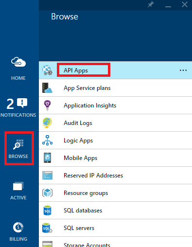

	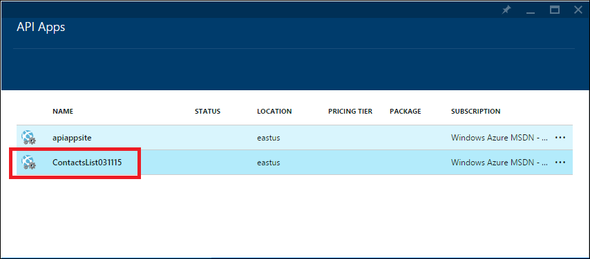

3. In the **API App** blade, click the **URL** to open a browser window that calls your API App.

	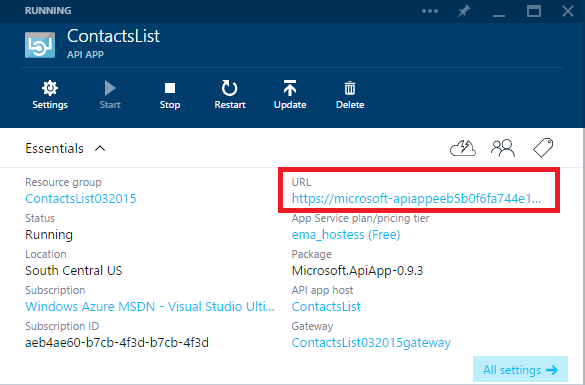

2. Add `/api/contacts/get/` to the URL in the browser address bar.

	For example, if your API app's URL is this:

    	https://microsoft-apiappeeb5bdsasd744e188be7fa26f239bd4b.azurewebsites.net/

	The complete URL would be this:

    	https://microsoft-apiappeeb5bdsasd744e188be7fa26f239bd4b.azurewebsites.net/api/contacts/get/

	Different browsers handle API calls differently. The image shows a successful call from a Chrome browser.

	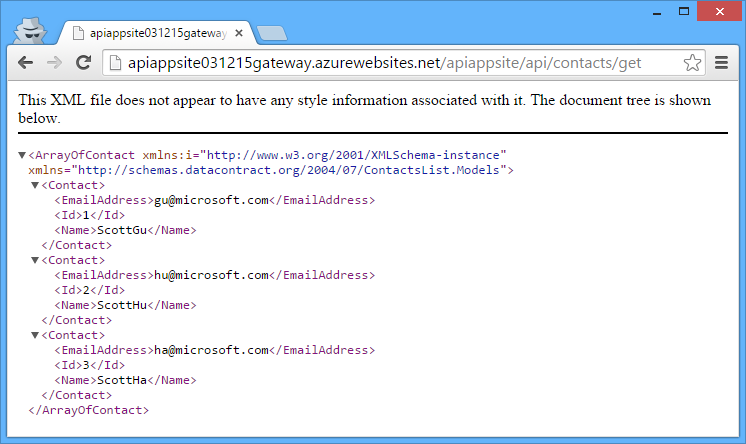

2. Save the URL you used; you'll use it again later in the tutorial.

## Protect the API app

When you deployed your API app, you deployed it to a resource group. You can add web apps and other API apps to the same resource group, and each API app within the resource group can have one of three accessibility settings:
<!--todo: diagram showing different accessibility settings-->

- **Public (anonymous)** - Anyone can call the API app from outside the resource group without being logged in.
- **Public (authenticated)** - Only authenticated users are allowed to call the API app from outside the resource group.
- **Internal** - Only other API apps in the same resource group are allowed to call the API app. (Calls from web apps are considered external even if the web apps are in the same resource group.)

When Visual Studio created the resource group for you, it also created a *gateway*.  A gateway is a special web app that handles all requests destined for API apps in the resource group.

When you go to the resource group's blade in the [Azure preview portal], you can see your API app and the gateway in the diagram.

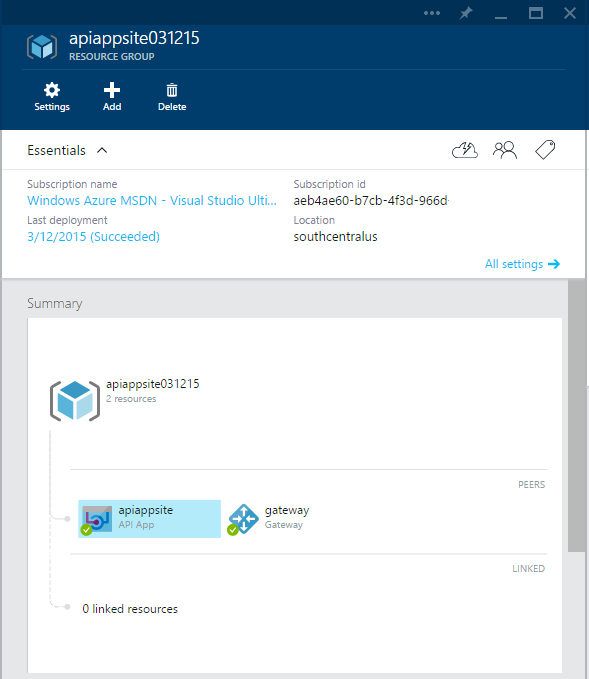

### Configure the API app to require authentication

To configure your API app to accept only authenticated requests, you'll set its accessibility to **Public (authenticated)** and you'll configure the gateway to require authentication from a provider such as Azure Active Directory, Google, or Facebook.

1. Go back to the **API App** blade for the API app that you want to protect.

2. In the **API App** blade, click **Settings**, and then click **Application settings**.

	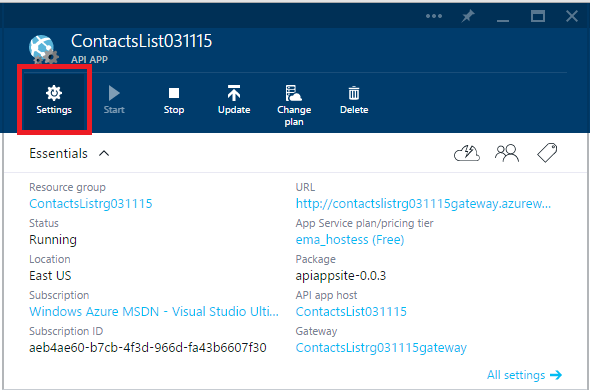

	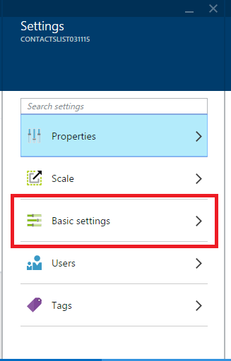

3. In the **Application Settings** blade, change **Access Level** to **Public (authenticated)**, and then click **Save**.

	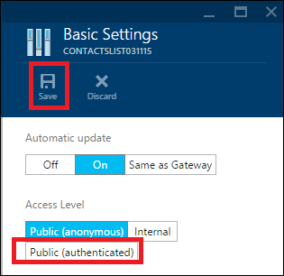

	You have now protected the API app from unauthenticated access. Next you have to configure the gateway to specify which authentication provider to use.

### Configure the gateway to use an authentication provider

4. Scroll left back to the **API App** blade, and then click the link to the gateway.

	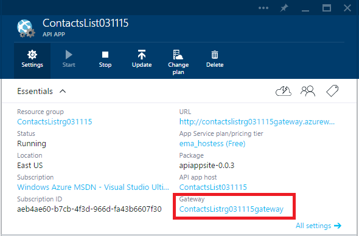

7. In the **Gateway** blade, click **Settings**, and then click **Identity**.

	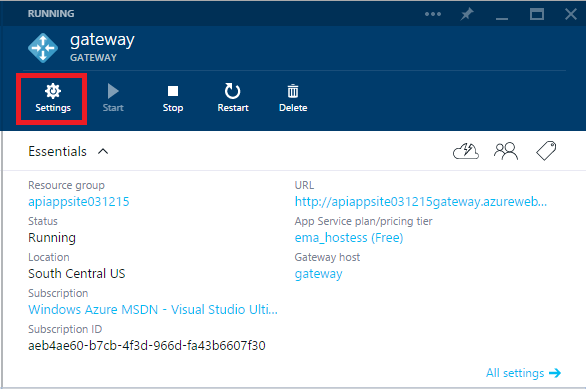

	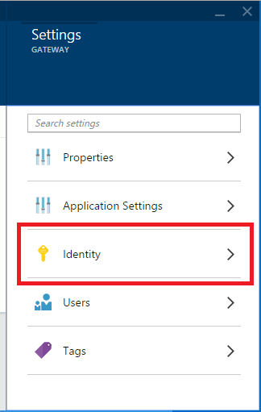

	From the **Identity** blade you can navigate to different blades for configuring authentication using Azure Active Directory and several other providers.

	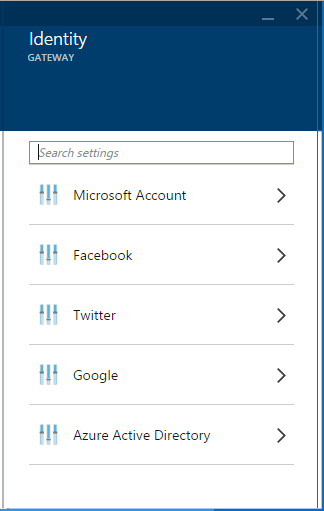
  
3. Choose the identity provider you want to use, and follow the steps in the corresponding article to configure your API app with that provider. These articles were written for mobile apps, but the procedures are the same for API apps. Some of the procedures require you to use the [Azure portal]. 

 - [Microsoft Account](app-service-mobile-how-to-configure-microsoft-authentication-preview.md)
 - [Facebook login](app-service-mobile-how-to-configure-facebook-authentication-preview.md)
 - [Twitter login](app-service-mobile-how-to-configure-twitter-authentication-preview.md)
 - [Google login](app-service-mobile-how-to-configure-google-authentication-preview.md)
 - [Azure Active Directory](app-service-mobile-how-to-configure-active-directory-authentication-preview.md)

As an example, the following screen shots show what you should see in the [Azure portal] pages and [Azure preview portal] blades after you have set up Azure Active Directory authentication.

In the Azure preview portal, The **Azure Active Directory** blade has a **Client ID** from the application you created in the Azure Active Directory tab of the Azure portal, and **Allowed Tenants** has your Azure Active Directory tenant (for example, "contoso.onmicrosoft.com").

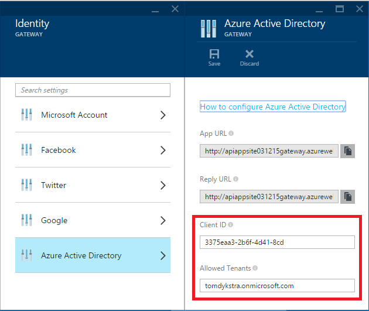

In the Azure portal, the **Configure** tab for the application you created in the **Azure Active Directory** tab has the **Sign-on URL**, **App ID URI**, and **Reply URL** from the **Azure Active Directory** blade in the Azure preview portal.

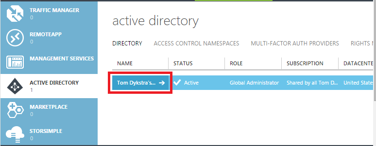

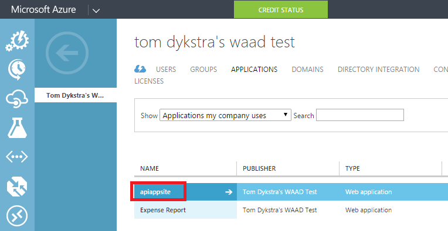

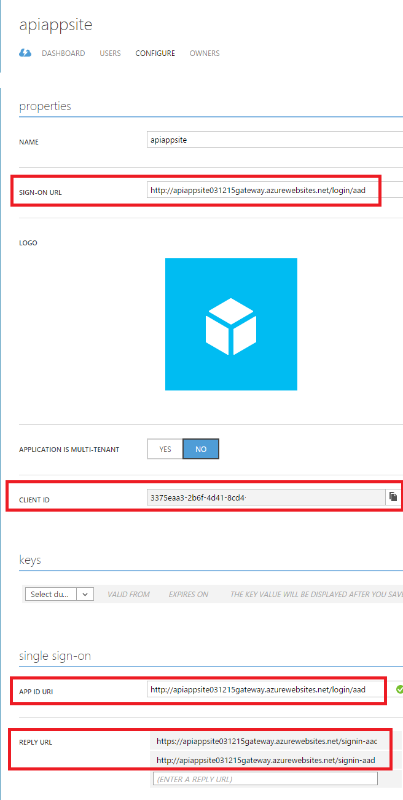

(The Reply URL in the image shows the same URL twice, once with `http:` and once with `https:`.)

## Verify that authentication works

**Note:** If you have a problem logging in when you do the following steps, try opening a private or incognito window.
 
1. Open a browser window, and in the address bar enter the URL that calls your API app's `Get` method, as you did earlier.

	This time the attempt to access the API app results in an error message.

	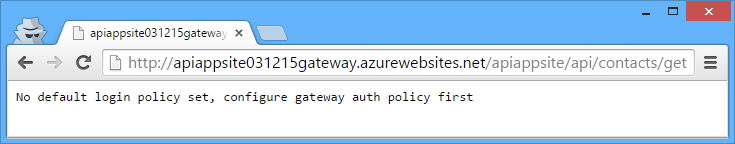

2. In the browser, go to the login URL. The URL follows this pattern: 

    	http://[gatewayurl]/login/[providername]

	You can get the gateway URL from the **Gateway** blade in the [Azure preview portal]. (To get to the **Gateway** blade, click the gateway in the diagram shown on the **Resource group** blade.)

	

	The [providername] value is "microsoftaccount", "facebook", "twitter", "google", or "aad".

	Here is a sample login URL for Azure Active Directory:

		https://dropboxrgaeb4ae60b7cb4f3d966dfa43.azurewebsites.net/login/aad/

	Notice that unlike the earlier URL, this one does not include your API app name:  the gateway is authenticating you, not the API app.  The gateway handles authentication for all API apps in the resource group.

3. Enter your credentials when the browser displays a login page. 
 
	If you configured Azure Active Directory login, use one of the users listed in the **Users** tab for the application you created in the Azure Active Directory tab of the [Azure portal], such as admin@contoso.onmicrosoft.com.

	

	

4. When the "login complete" message appears, enter the URL to your API app's Get method again.

	This time because you've authenticated, the call is successful. The gateway recognizes that you are an authenticated user and passes your request on to your API app.

	

	

## Use Postman to send a Post request

When you log in to the gateway, the gateway sends back an authentication token.  This token must be included with all requests from external sources that go through the gateway. When you access an API with a browser, the browser typically stores the token in a cookie and sends it along with all subsequent calls to the API.

So you can see what is happening in the background, in this section of the tutorial you use a browser tool to create and submit a Post request, and you get the authorization token from the cookie and include it in an HTTP header. This section is optional: in the previous section you already verified that the API app accepts only authenticated access.

These instructions show how to use the Postman tool in the Chrome browser, but you could do the same thing with any REST client tool and browser developer tools.

1. In a Chrome browser window, go through the steps shown in the previous section to authenticate, and then open developer tools (F12).

	

3. In the **Resources** tab of Chrome developer tools, find the cookies for your gateway, and triple-click the Value of the **x-zumo-auth** cookie to select all of it.

	**Note:**  Make sure you get all of the cookie's value. If you double-click, you'll get only the first part of it.

5. Right-click the **Value** of the **x-zumo-auth** cookie, and then click **Copy**.

	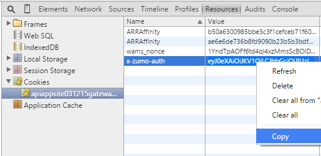

4. Install the Postman extension in your Chrome browser if you haven't done so yet.

6. Open the Postman extension.

7. In the Request URL field, enter the URL to your API app's Get method that you used previously, but omit `get/` from the end.
 
		http://[apiappurl]/api/contacts
    
8. Click **Headers**, and then add an *x-zumo-auth* header. Paste the token value from the clipboard into the **Value** field.

9. Add a *Content-Type* header with value *application/json*.

10. Click **form-data**, and then add a *contact* key with the following value:

		{   "Id": 0,   "Name": "Li Yan",   "EmailAddress": "yan@contoso.com" }

11. Click Send.

	The API app returns a *201 Created* response.

	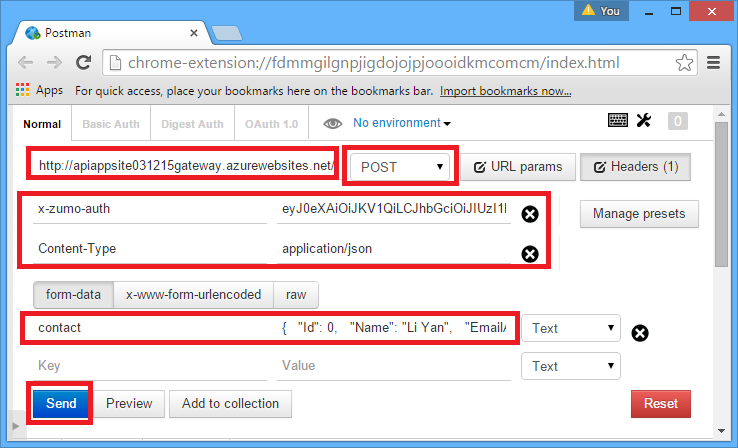

12. To verify that this request would not work without the authentication token, delete the authentication header and click Send again.

	You get a *403 Forbidden* response.

	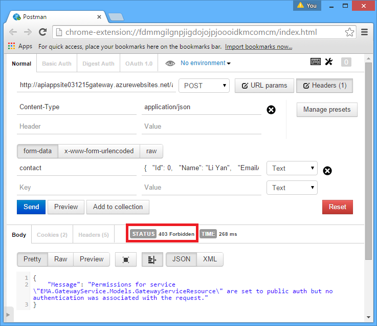

## Next steps

You've seen how to protect an Azure API app by requiring Azure Active Directory or social provider authentication. For more information, see [What are API apps?](app-service-api-apps-why-best-platform.md). 

[Azure portal]: https://manage.windowsazure.com/
[Azure preview portal]: https://portal.azure.com/

