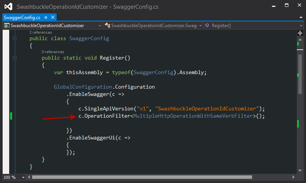
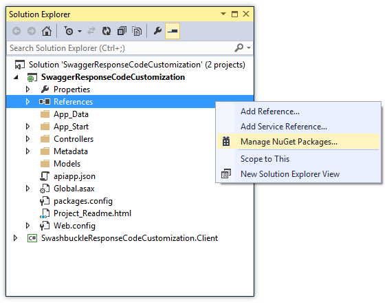
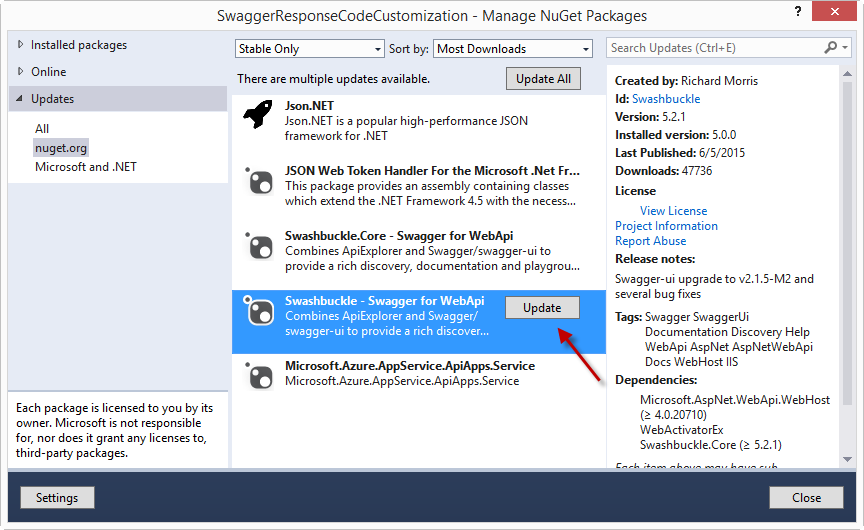

<properties 
	pageTitle="Customize Swashbuckle-generated operation identifiers" 
	description="Learn how to customize Swagger operation identifiers that are generated by Swashbuckle for an API app in Azure App Service." 
	services="app-service\api" 
	documentationCenter=".net" 
	authors="bradygaster" 
	manager="wpickett" 
	editor="jimbe"/>

<tags 
	ms.service="app-service-api" 
	ms.workload="web" 
	ms.tgt_pltfrm="dotnet" 
	ms.devlang="na" 
	ms.topic="article" 
	ms.date="05/16/2015" 
	ms.author="bradyg"/>

# Customize Swashbuckle-generated operation identifiers 

## Overview

Swashbuckle generates Swagger operation identifiers by concatenating controller name and method name. This pattern creates a problem when you have multiple overloads of a method: Swashbuckle  generates duplicate operation ids, which is invalid Swagger JSON.

For example, the following controller code causes Swashbuckle to generate three Contact_Get operation ids.

You can solve the problem manually by giving the methods unique names, such as the following for this example:

* Get
* GetById
* GetPage

The alternative is to extend Swashbuckle to make it automatically generate unique operation ids. This article shows how to do that.

## Extend Swashbuckle 

The following steps show how to customize Swashbuckle by using the *SwaggerConfig.cs* file that is included in the project by the Visual Studio API Apps Preview project template.  You can also customize Swashbuckle in a Web API project that you configure for deployment as an API app.

1. Create a custom `IOperationFilter` implementation 

	The `IOperationFilter` interface provides an extensibility point for Swashbuckle users who want to customize various aspects of the Swagger metadata process. The following code demonstrates one method of changing the operation-id-generation behavior. The code appends parameter names to the operation id name.  

		using Swashbuckle.Swagger;
		using System.Web.Http.Description;
		
		namespace ContactsList
		{
		    public class MultipleOperationsWithSameVerbFilter : IOperationFilter
		    {
		        public void Apply(
		            Operation operation,
		            SchemaRegistry schemaRegistry,
		            ApiDescription apiDescription)
		        {
		            if (operation.parameters != null)
		            {
		                operation.operationId += "By";
		                foreach (var parm in operation.parameters)
		                {
		                    operation.operationId += string.Format("{0}",parm.name);
		                }
		            }
		        }
		    }
		}

2. In *App_Start\SwaggerConfig.cs* file, call the `OperationFilter` method to cause Swashbuckle to use the new `IOperationFilter` implementation.

		c.OperationFilter<MultipleOperationsWithSameVerbFilter>();

	

	The *SwaggerConfig.cs* file that is dropped in by the Swashbuckle NuGet package contains many commented-out examples of extensibility points. The additional comments are not shown here. 

	After you make this change, your `IOperationFilter` implementation is used and causes unique operation ids to be generated.
 
	

	
## Add Multiple Swagger Responses

By default, Swashbuckle assumes that an HTTP 200 (OK) response is the *only* legitimate response from an individual Web API method. In some cases, you may want to return multiple response codes based on the behavior of your Web API code. Luckilly, Swashbuckle provides two ways of specifying the potential for multiple HTTP response codes coming out of your API. This section will cover both of these options. 

### Using Swashbuckle's XML Comment Support for Multiple Response Codes

The API Apps preview template available in Visual Studio 2013 includes Swashbuckle version 5.0.0.0. If you'd prefer to use the Swashbuckle version included with the template to specify multiple HTTP response codes, you can use special XML comments recognized by the Swashbuckle Swagger generation routine. 

The Web API Action code below demonstrates a scenario in which a Web API author will want to control the HTTP response codes coming from the server.

	[ResponseType(typeof(Contact))]
    public HttpResponseMessage Get(int id)
    {
        var contacts = GetContacts();

        var requestedContact = contacts.FirstOrDefault(x => x.Id == id);

        if (requestedContact == null)
        {
            return Request.CreateResponse(HttpStatusCode.NotFound);
        }
        else
        {
            return Request.CreateResponse<Contact>(HttpStatusCode.OK, requestedContact);
        }
    }

In this scenario, the Swagger emitted for the Web API controller contains only one legitimate HTTP status code, that being the HTTP 200 case. 

Since the Visual Studio code generation functionality looks explicitly at the valid HTTP response codes, anything other than an HTTP 200 will cause the generated code to throw an exception. The code below is from a C# client generated for this sample Web API method.

	if (statusCode != HttpStatusCode.OK)
    {
        HttpOperationException<object> ex = new HttpOperationException<object>();
        ex.Request = httpRequest;
        ex.Response = httpResponse;
        ex.Body = null;
        if (shouldTrace)
        {
            ServiceClientTracing.Error(invocationId, ex);
        }
        throw ex;
    } 

Swashbuckle 5.0.0.0 (which ships with the API Apps Preview Visual Studio template) has support for custom XML comments that specify the acceptable HTTP response codes from Web API methods. To enable multiple response codes using the XML flavor, there are four steps to implement. 

1. First, add XML documentation comments over the methods you wish to provide support for multiple HTTP response codes. Taking the original Web API action method above and applying the XML documentation to it would result in code like that below. 

		/// 

		/// Returns the specified contact.
		/// 

		/// <param name="id">The ID of the contact.</param>
		/// <returns>A contact record with an HTTP 200, or null with an HTTP 404.</returns>
		/// <response code="200">OK</response>
		/// <response code="404">Not Found</response>
		[ResponseType(typeof(Contact))]
		public HttpResponseMessage Get(int id)
		{
		    var contacts = GetContacts();
		
		    var requestedContact = contacts.FirstOrDefault(x => x.Id == id);
		
		    if (requestedContact == null)
		    {
		        return Request.CreateResponse(HttpStatusCode.NotFound);
		    }
		    else
		    {
		        return Request.CreateResponse<Contact>(HttpStatusCode.OK, requestedContact);
		    }
		}

1. Once the comments have been added to the action method, instructions must be provided in the *SwaggerConfig.cs* file to direct Swashbuckle to make use of the XML documentation file. To do this, open up SwaggerConfig.cs and create a method on the *SwaggerConfig* class to specify the path to the documentation XML file. 

		private static string GetXmlCommentsPath()
	    {
	        return string.Format(@"{0}\XmlComments.xml", 
	            System.AppDomain.CurrentDomain.BaseDirectory);
	    }
		
1. Once the method is added, scroll down in the *SwaggerConfig.cs* file until you see the commented-out line of code resembling the screen shot below. 

	
	
	Then, uncomment the line to enable the XML comments processing during Swagger generation. 
	
	
	
1. In order to generate the XML documentation file, go into the project's properties and enable the XML documentation file as shown in the screenshot below. 

	 

Once you perform these steps, the Swagger JSON generated by Swashbuckle will reflect multiple HTTP response codes. The screenshot below demonstrates this new JSON payload. 

Once you use Visual Studio to regenerate the client code for your REST API, the C# code compiled takes both the HTTP OK and Not Found status codes, allowing your consuming code to make decisions on how to handle the return of a null Contact record on your own. 

	if (statusCode != HttpStatusCode.OK && statusCode != HttpStatusCode.NotFound)
    {
        HttpOperationException<object> ex = new HttpOperationException<object>();
        ex.Request = httpRequest;
        ex.Response = httpResponse;
        ex.Body = null;
        if (shouldTrace)
        {
            ServiceClientTracing.Error(invocationId, ex);
        }
        throw ex;
    }

The code for this demonstration can be found in [this GitHub repository](https://github.com/Azure-Samples/API-Apps-DotNet-Swashbuckle-Customization-MultipleResponseCodes). Along with the Web API project marked up with XML documentation comments is a Console Application project that contains a generated client for this API. 

### Using Swashbuckle's SwaggerResponse Attribute

As of Swashbuckle version 5.1.5, there exist a new way to specify multiple response codes on Web API action methods known as the *[SwaggerResponseAttribute](https://github.com/domaindrivendev/Swashbuckle/blob/master/Swashbuckle.Core/Swagger/Annotations/SwaggerResponseAttribute.cs)*. This attribute provides a cleaner method of specifying HTTP response codes. This section will demonstrate how to upgrade the Swashbuckle NuGet package so that you can use the attribute-based method of specifying known HTTP response codes.

1. Right-click your Web API project and select the *Manage NuGet Packages* context menu. 

	

1. Click the *Update* button next to the *Swashbuckle* NuGet package. 

	

1. Add the *SwaggerResponse* attributes to the Web API action methods for which you want to specify known HTTP response codes. 

		[SwaggerResponse(HttpStatusCode.OK)]
	    [SwaggerResponse(HttpStatusCode.NotFound)]
	    [ResponseType(typeof(Contact))]
	    public HttpResponseMessage Get(int id)
	    {
	        var contacts = GetContacts();
	
	        var requestedContact = contacts.FirstOrDefault(x => x.Id == id);
	
	        if (requestedContact == null)
	        {
	            return Request.CreateResponse(HttpStatusCode.NotFound);
	        }
	        else
	        {
	            return Request.CreateResponse<Contact>(HttpStatusCode.OK, requestedContact);
	        }
	    }

1. Browse to the */swagger/docs/v1* URL of your project and the various HTTP response codes will be visible in the Swagger JSON. 

	

The code for this demonstration can be found in [this GitHub repository](https://github.com/Azure-Samples/API-Apps-DotNet-Swashbuckle-Customization-MultipleResponseCodes-With-Attributes). Along with the Web API project decorated with the *SwaggerResponse* attribute is a Console Application project that contains a generated client for this API. 

## Next steps

This article has shown how to customize Swashbuckle to make it generate unique operation ids. For more information, see [Swashbuckle on GitHub](https://github.com/domaindrivendev/Swashbuckle).
