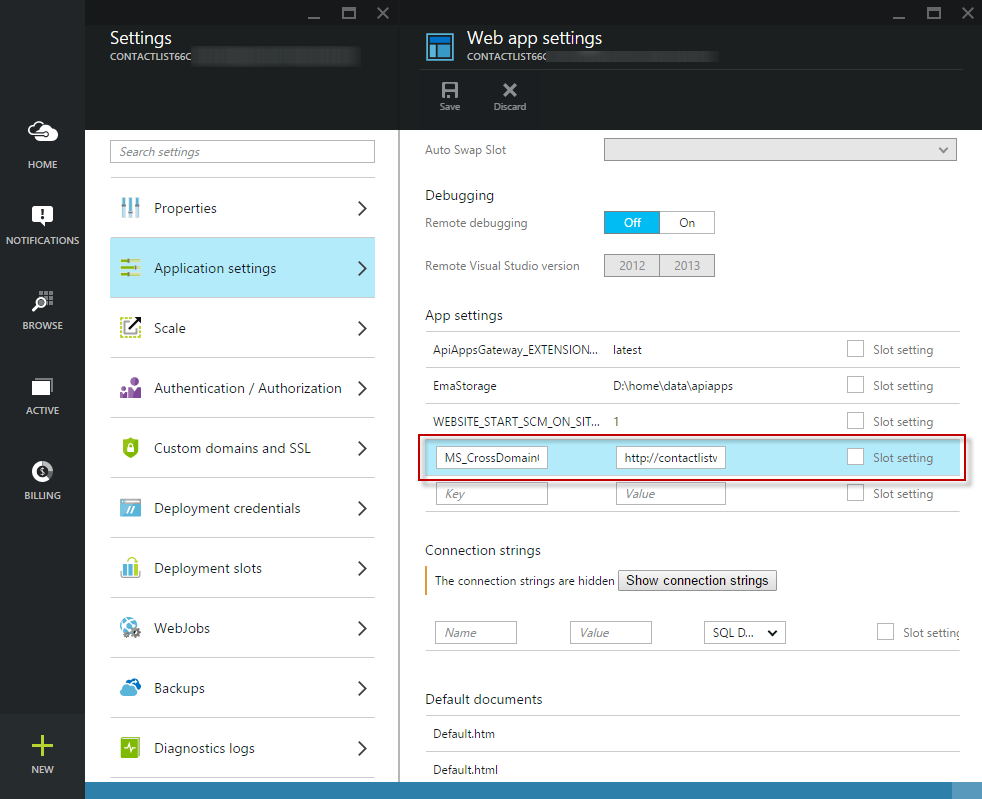
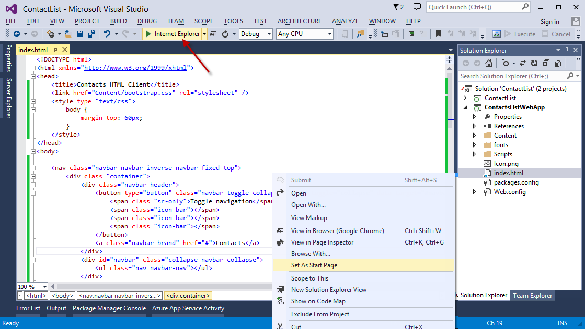
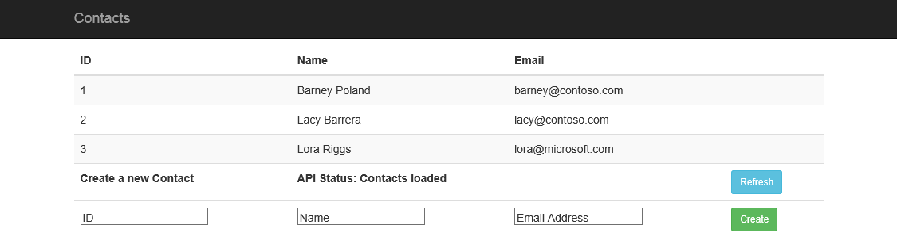
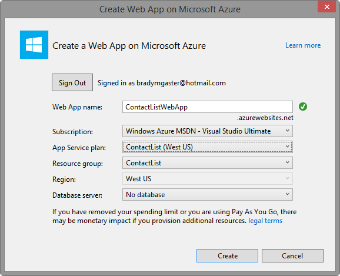

<properties 
	pageTitle="Access an Azure API App using HTML and JavaScript" 
	description="Learn how to access your API App back-end using HTML and JavaScript." 
	services="app-service\api" 
	documentationCenter=".net"
	authors="bradygaster"
	manager="mohisri" 
	editor="tdykstra"/>

<tags 
	ms.service="app-service-api" 
	ms.workload="web" 
	ms.tgt_pltfrm="na" 
	ms.devlang="JavaScript" 
	ms.topic="article" 
	ms.date="04/20/2015" 
	ms.author="bradygaster"/>

# Consume an Azure API App using HTML and JavaScript

## Overview

This article shows how to create an HTML and JavaScript client for an [API app](app-service-api-apps-why-best-platform.md) in [Azure App Service](/documentation/services/app-service/). This article assumes a working knowledge of HTML and JavaScript, and will focus on using the [AngularJS](https://angularjs.org/) JavaScript framework for making REST calls to the API App. 

Some articles to go through before this to help you get started. 

1. In [Create an API App](app-service-dotnet-create-api-app.md), you created an API App project.
2. In [Deploy an API App](app-service-dotnet-deploy-api-app.md), you deploy the API app to your Azure subscription.
3. In [Debug an API App](app-service-dotnet-remotely-debug-api-app.md), you use Visual Studio to remotely debug the code while it runs in Azure.

This article will build upon these previous articles by demonstrating how your HTML applications can use JavaScript to access your back-end API Apps. 

## Enabling CORS

Typically, CORS (Cross-Origin Resource Sharing) is needed in HTML applications that will be served from different hosts than the API itself. With API Apps, there are at least two options for enabling CORS. This section will outline these options. 

### Enabling CORS for API App Gateways

API App Gateways can be configured to enable CORS using the Azure prreview portal. By adding the **MS_CrossDomainOrigins** *appSetting* you can specify which URLs are allowed to call your API App. This section will explain how to use this *appSetting* to enable CORS at the API Gateway level. 

1. Navigate to the Azure preview portal blade for the API App you want to CORS-enable. Once there, click the *Gateway* icon for your API App. 

	

1. Click the **Gateway Host** link in the portal blade. 

	

1. Click the **All Settings** link in the portal blade. 

	

1. Click the **Application Settings** button in the portal blade.

	

1. Add the **MS_CrossDomainOrigins** application setting. Make the value of the setting the comma-separated list of HTTP hosts you want to provide access to your API App. If you want to provide access to multiple hosts, the value of the *appSetting* can be set to something like the code below. 

		http://foo.azurewebsites.net, https://foo.azurewebsites.net, http://contactlistwebapp.azurewebsites.net

	The section below will walk through the process of creating a separate web application containing a simple HTML page that calls the API App from a Web App running in the same Azure Resource Group as the API App. Since this is the only host that will be allowed access to the API App, the setting will be set to contain one host. 

		http://contactlistwebapp.azurewebsites.net

	The screen shot below demonstrates how this setting should look once you've saved it in the Azure preview portal. 

	

The **MS_CrossDomainOrigins** application setting is discussed in detail in the blog post [Azure Mobile Service .NET Updates](http://azure.microsoft.com/blog/2014/07/28/azure-mobile-services-net-updates/), so check this post for more details on the details of the setting.

### Enabling CORS in Web API Code

The process of enabling CORS in Web API is documented in the ASP.NET article [Enabling Cross-Origin Requests in ASP.NET Web API 2](http://www.asp.net/web-api/overview/security/enabling-cross-origin-requests-in-web-api) in depth. For API Apps built using ASP.NET Web API the process is exactly the same but will be summarized below. Skip this section if you've already enabled CORS, as your API App should already be set up properly. 

1. CORS functionality is provided by the [Microsoft.AspNet.WebApi.Cors](https://www.nuget.org/packages/Microsoft.AspNet.WebApi.Cors/) NuGet package. Install it by opening the **Package Manager Console**, and execute the following PowerShell script. 

		Install-Package Microsoft.AspNet.WebApi.Cors

1. Once the command executes, the Package Manager Console and **packages.config** will reflect the addition of the new NuGet package. 

	

1. Open up the *App_Start/WebApiConfig.cs* file. Add the line of code below to the **Register** method of the **WebApiConfig** class in the file. 

		config.EnableCors();

	Once the file is updated the code should look like the following:

		public static class WebApiConfig
	    {
	        public static void Register(HttpConfiguration config)
	        {
	            // Web API configuration and services
	            
				config.EnableCors(); /* -- NEW CODE -- */
	
	            // Web API routes
	            config.MapHttpAttributeRoutes();
	
	            config.Routes.MapHttpRoute(
	                name: "DefaultApi",
	                routeTemplate: "api/{controller}/{id}",
	                defaults: new { id = RouteParameter.Optional }
	            );
	        }
	    }

1. The final step to enable CORS is to demarcate the individual action methods you want to enable. Add the **EnableCors** attribute over each of the methods or on the entire controller, as demonstrated in the code below. 

	> **Note**: Use of wildcards for all of the parameters with the EnableCors attribute is intended only for demonstration purposes, and will open your API up to all origins and all HTTP requests. Please use this attribute with caution and understand the implications.

		using ContactList.Models;
		using System.Collections.Generic;
		using System.Web.Http;
		using System.Web.Http.Cors;
	
		namespace ContactList.Controllers
		{
		    [EnableCors(origins:"*", headers:"*", methods: "*")] /* -- NEW CODE -- */
		    public class ContactsController : ApiController
		    {
		        [HttpGet]
		        public IEnumerable<Contact> Get()
		        {
		            return new Contact[]
		            {
		                new Contact { Id = 1, EmailAddress = "barney@contoso.com", Name = "Barney Poland"},
		                new Contact { Id = 2, EmailAddress = "lacy@contoso.com", Name = "Lacy Barrera"},
		                new Contact { Id = 3, EmailAddress = "lora@microsoft.com", Name = "Lora Riggs"}
		            };
		        }
		
		        [HttpPost]
		        public Contact Post([FromBody] Contact contact)
		        {
		            return contact;
		        }
		    }
		}
1. If you'd already deployed your API App to Azure prior to adding support for CORS, re-deploy the code so that CORS will be enabled in your Azure-hosted API. 

## Creating a Web App to Consume the API App

In this section, you'll create a new Empty Web Application, install and use AngularJS into it, and bind a simple HTML front end to the API App. You'll deploy the consuming Web App into Azure App Service. The HTML Web App will bind to and display the data retrieved from the API App, and provide users a simple UI for the Contacts API. 

1. Right-click the solution and select **Add -> New Project**

	

1. Select the **ASP.NET Web Application** template. 

	

1. Select the **Empty** template from the One ASP.NET dialog.

	

1. Using either the **Package Manager** or by using the **Manage NuGet Packages** context menu item, install the [AngularJS](https://www.nuget.org/packages/angularjs) NuGet package.

	

1. Using either the **Package Manager** or by using the **Manage NuGet Packages** context menu item, install the [Bootstrap](https://www.nuget.org/packages/bootstrap) NuGet package.

	 

1. Add a new HTML file to the Web App project. 

	 

1. Name the file *index.html*. 

	

1. Add the bootstrap CSS and AngularJS JavaScript files to the HTML page, as well as use a simple Bootstrap template ([like this one](http://getbootstrap.com/examples/starter-template/)) and create an empty script tag to prepare the page. 
	
	> Note: The comments in the HTML and JavaScript code below are preludes to subsequent steps in this section.  

		<!DOCTYPE html>
		<html xmlns="http://www.w3.org/1999/xhtml">
		<head>
		    <title>Contacts HTML Client</title>
		    <link href="Content/bootstrap.css" rel="stylesheet" />
		    
		</head>
		<body>
		
		    <nav class="navbar navbar-inverse navbar-fixed-top">
		        

		            

		                <button type="button" class="navbar-toggle collapsed" data-toggle="collapse" data-target="#navbar" aria-expanded="false" aria-controls="navbar">
		                    Toggle navigation
		                    
		                    
		                    
		                </button>
		                <a class="navbar-brand" href="#">Contacts</a>
		            

		            

		                <ul class="nav navbar-nav"></ul>
		            

		        

		    </nav>
		
		    

		        <!-- contacts ui here -->
		    

		
		    
		    
		
		</body>
		</html>

1. Add the HTML table code shown below to the **container** *div* element in the HTML.

		<!-- contacts ui here -->
        <table class="table table-striped" ng-app="myApp" ng-controller="contactListCtrl">
            <thead>
                <tr>
                    <th>ID</th>
                    <th>Name</th>
                    <th>Email</th>
                    <th></th>
                </tr>
            </thead>
            <tbody>
                <tr ng-repeat="con in contacts">
                    <td>{{con.Id}}</td>
                    <td>{{con.Name}}</td>
                    <td>{{con.EmailAddress}}</td>
                    <td></td>
                </tr>
            </tbody>
            <tfoot>
                <tr>
                    <th>Create a new Contact</th>
                    <th colspan="2">API Status: {{status}}</th>
                    <th><button class="btn btn-sm btn-info" ng-click="refresh()">Refresh</button></th>
                </tr>
                <tr>
                    <td><input type="text" placeholder="ID" ng-model="newId" /></td>
                    <td><input type="text" placeholder="Name" ng-model="newName" /></td>
                    <td><input type="text" placeholder="Email Address" ng-model="newEmail" /></td>
                    <td><button class="btn btn-sm btn-success" ng-click="create()">Create</button></td>
                </tr>
            </tfoot>
        </table>

1. Right-click the *index.html* file and select the **Set as Start Page** menu item. Then debug the Web Project so that it will open up in your default browser. 

	

1. Take note of the template handlebars in the HTML output. You'll data-bind those HTML elements using AngularJS in the next step. 

	

1. Add the JavaScript code below to the *index.html* file to call the API and databind the HTML UI to the API output. 

		/* client javascript code here */
        angular.module('myApp', []).controller('contactListCtrl', function ($scope, $http) {
            $scope.baseUrl = 'http://localhost:1578';

            $scope.refresh = function () {
                $scope.status = "Refreshing Contacts...";
                $http({
                    method: 'GET',
                    url: $scope.baseUrl + '/api/contacts',
                    headers: {
                        'Content-Type': 'application/json'
                    }
                }).success(function (data) {
                    $scope.contacts = data;
                    $scope.status = "Contacts loaded";
                }).error(function (data, status) {
                    $scope.status = "Error loading contacts";
                });
            };

            $scope.create = function () {
                $scope.status = "Creating a new contact";

                $http({
                    method: 'POST',
                    url: $scope.baseUrl + '/api/contacts',
                    headers: {
                        'Content-Type': 'application/json'
                    },
                    data: {
                        'Id': $scope.newId,
                        'Name': $scope.newName,
                        'EmailAddress': $scope.newEmail
                    }
                }).success(function (data) {
                    $scope.status = "Contact created";
                    $scope.refresh();
                    $scope.newId = 0;
                    $scope.newName = '';
                    $scope.newEmail = '';
                });
            };

            $scope.refresh();
        });

	> **Note**: Your port number may vary, so if your API project is running on a different port, simply change the JavaScript above to reflect your own environment.

1. Make sure that the API App project is also running, or the JavaScript HTML will not function properly. Right-click the solution and select **Properties**. Then set both Web projects to **Start without Debugging**, and that the API project runs first. 

	

1. Debug the solution and you'll see that the HTML/JavaScript client can connect to and display data from the API App project. 

	

## Deploying the Web App

In this section you'll deploy the HTML/JavaScript client as an App Service Web App. Once the deployment is complete, you'll change the URL the JavaScript is using to consume the deployed API App. 

> Note: This section assumes you've read and completed the [Deploy an API App](app-service-dotnet-deploy-api-app.md) article or you've previously deployed your own API App. 

1. Open the API App's blade in the Azure preview portal. Click the URL in the blade to open it up in your browser. Once it opens, copy out the URL of the API App from the browser address bar. 

	

1. Paste the API App's URL to overwrite the previous value for the **$scope.baseUrl** property in the JavaScript code. 

		$scope.baseUrl = 'https://microsoft-apiappf7e042ba8e5233ab4312021d2aae5d86.azurewebsites.net';

	The use of HTTPS is not optional;  API Apps does not support HTTP.

1. Right-click the HTML/JavaScript Web Project and select the **Publish** context menu item.

	

1. Select the **Microsoft Azure Web Apps** option in the Publish Web dialog. 

	

1. Click the **New** button to create a new Web App.

	

1. Select the same App Hosting Plan and Resource Group in which your API App is already running.

	> **Note**: This isn't a requirement, but for demonstration purposes it makes it easier to clean up your Azure resources later if everything is contained in one Resource Group.

	

1. Complete the Web Publish steps to deploy the HTML/JavaScript client to App Service Web Apps. 
1. Once the Web App is deployed it should automatically open in your Web browser and display the data from the API App. 

	

1. At this point, if you browse to the Resource Group you'll see the new Web App running alongside the API App. 

	

## Summary 
This example demonstrated how you can use AngularJS as your JavaScript platform for accessing API App back ends. You can change the REST access functionality to use any other JavaScript framework.   
