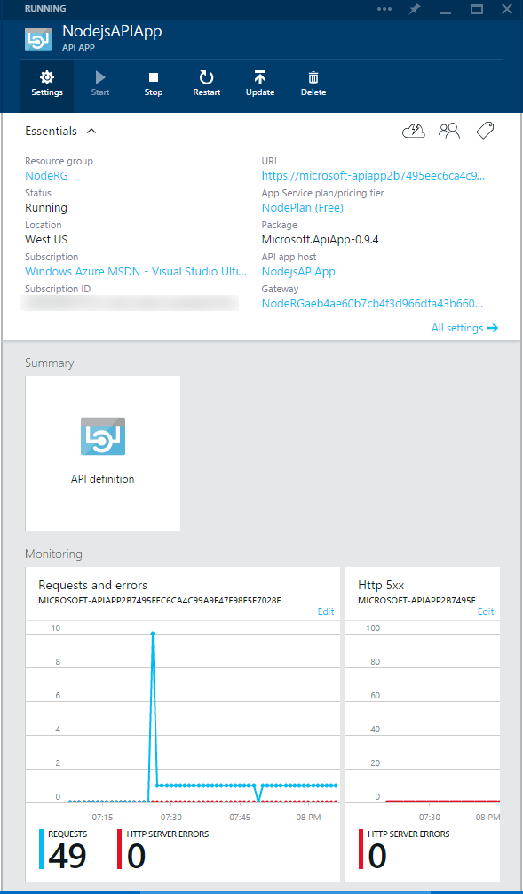
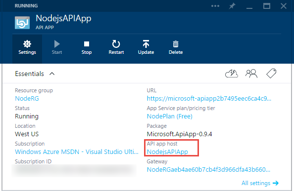

<properties 
	pageTitle="Manage an API app" 
	description="Learn how to manage API apps by using the Azure preview portal and Visual Studio Server Explorer." 
	services="app-service\api" 
	documentationCenter="" 
	authors="tdykstra" 
	manager="wpickett" 
	editor="jimbe"/>

<tags 
	ms.service="app-service-api" 
	ms.workload="web" 
	ms.tgt_pltfrm="na" 
	ms.devlang="na"
	ms.topic="article" 
	ms.date="04/20/2015" 
	ms.author="tdykstra"/>

# Manage an API app

This article shows how use the Azure preview portal to perform API app management tasks such as configuring authentication and setting up auto-scaling. The article also shows how to do some management tasks in the Server Explorer window in Visual Studio.

## Understanding API app architecture

In Azure App Service, an API app is a [web app](app-service-web-overview.md) that has additional features for hosting web services. In the Azure preview portal, there is an **API app** blade for managing the API-specific features, and an **API App host** blade for managing the underlying web app. 

Every resource group that contains at least one API app also includes a  *gateway*. The gateway acts as a proxy; handling authentication and other administrative functions for all API apps in a resource group. Like an API app, a gateway is a web app with extra functionality, so there are also two portal blades for managing the gateway: a **Gateway** blade for gateway-specific functions, and a **Gateway host** blade for managing the underlying web app.

### API app blade tasks 

You use the **API app** blade for the following tasks:

- Configure access level - Click **Settings > Application settings**. The default value is internal, which means only API apps in the same resource group are allowed to call the API app. For more information, see [Protect an API app](app-service-api-dotnet-add-authentication.md).   
- Configure update policy - Click **Settings > Application settings**. Default value is **On**. This means that when a new version of the API app is published to the marketplace, your API app will automatically be updated to the new version if it is a non-breaking change.  
- Configure authentication for outgoing calls from the API app - Click **Settings > Authentication**.  If the API app makes calls to an external service that requires authentication, the required configuration values are entered here. For example, a Dropbox connector requires a client ID and a client secret to access the Dropbox service.
- Configure [RBAC](role-based-access-control-configure.md) - Click **Settings > Users**. User access that you configure here determines only who can access the API-app-specific features. To configure RBAC for the web app features, use the **API app host** blade. Normally you would want to keep the RBAC settings for the API app and the API app host in sync. If you give someone access to the API app but not the API app host, they won't be able to use the features on the **API app** blade that actually pertain to the API app host. The relationship between the **API app** blade and the **API app host** blade is explained below.
- View API definition - Click **API definition** in the **Summary** section to see a list of the methods exposed by the **API app**.

### Common features of the API app and API app host blades 

The **API app** blade enables you to do many tasks that pertain to the underlying web app. For example, it provides buttons to stop, start, and restart the web app that hosts the API app.  However, these tasks can also be done by using the **API app host** blade.  This is why the two blades share much of the same UI. The **Stop**, **Start**, and **Restart** buttons on the **API app** blade have exactly the same effect as the **Stop**, **Start**, and **Restart** buttons on the **API App Host** blade. Likewise, the monitoring information provided on the **API app** blade is the same as what the **API app host** blade shows. 

The only functions provided on **API app** blade that are not duplicates from the **API app host** blade are listed in the previous section.

### API app host blade tasks

You use the **API app host** blade for all of the tasks that you would do for any web app. For more information, see [Manage web apps in the portal](web-sites-manage.md).  

### Gateway blade tasks

You use the **Gateway** blade for the following tasks:

- Authentication provider configuration for incoming calls to API apps - Click **Settings > Identity**. If the gateway needs to authenticate users before allowing them to call API apps in the resource group, the required configuration values are entered here. For more information, see [Configure and test a SaaS connector in Azure App Service](app-service-api-connnect-your-app-to-saas-connector.md). 
- Configure [RBAC](role-based-access-control-configure.md) - Click **Settings > Users**. The same comments above explaining the relationship between RBAC configuration entered on the API app and API app host blades applies to the Gateway and Gateway host blades.

### Gateway host blade tasks

You use the **Gateway Host** blade for all of the tasks that you would do for any web app. For more information, see [Manage web apps in the portal](web-sites-manage.md).  

## Navigate to the API app blade 

One way to get to the **API App** blade is through the Azure preview portal's browse feature.  In the portal home page, click **Browse > API Apps** to see all the API apps that you can manage. 

When you click a row in the **API Apps** list blade, the portal displays the **API App** blade.

## Navigate to the API app host blade

To get to the **API App Host** blade, click **API app host** in the **API App** blade.

## Navigate to the Gateway blade

To get to the **Gateway** blade, click the **Gateway** link in the **API App** blade.
   

## Navigate to the Gateway host blade

To get to the **Gateway Host** blade, click the **Gateway host** link in the **Gateway** blade.
   

## Access API apps in Server Explorer in Visual Studio

In Server Explorer in Visual Studio you can start a remote debugging session, view streaming logs, and click a menu entry that opens the API app blade in the portal.

To get to an API app in Server Explorer, click **Azure > App Service > [the resource group name] > [the API app name]**, as shown in the illustration.

## Summary

This article has shown how to use the Azure preview portal to perform API app management tasks. For more information, see [What are API apps?](app-service-api-apps-why-best-platform.md)

