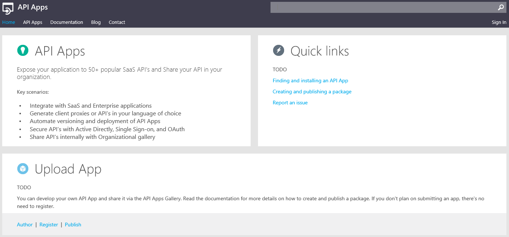
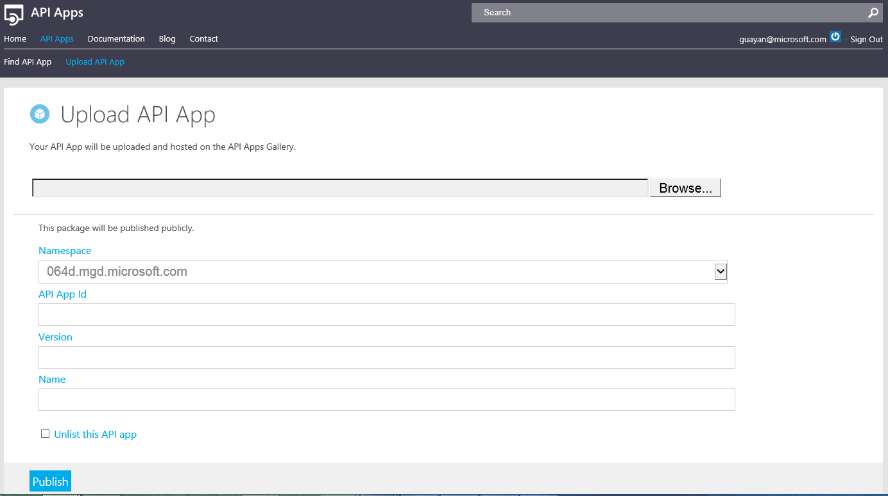
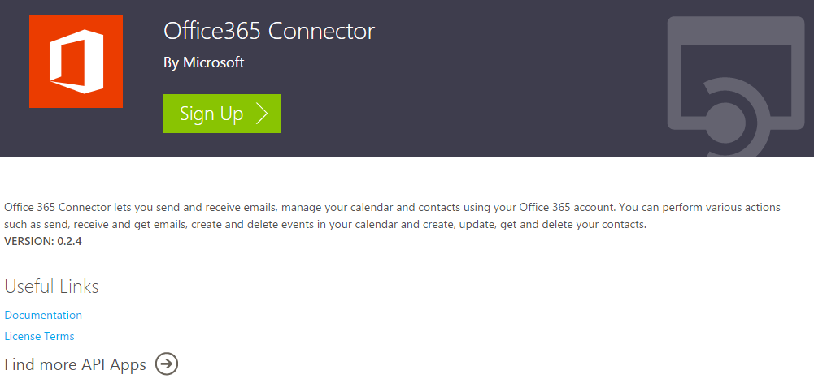

<properties 
	pageTitle="Create an API App Package" 
	description="Learn how to publish an API app package to Azure Marketplace." 
	services="app-service\api" 
	documentationCenter=".net"
	authors="guangyang"
	manager="wpickett" 
	editor="jimbe"/>

<tags 
	ms.service="app-service-api" 
	ms.workload="web" 
	ms.tgt_pltfrm="na" 
	ms.devlang="dotnet" 
	ms.topic="article" 
	ms.date="04/07/2015" 
	ms.author="guayan"/>

# Publish an API App Package to Azure Marketplace

## Overview

This article shows how to publish an API app package to [Azure Marketplace](http://azure.microsoft.com/marketplace/api-apps/).

- To learn how to create an API app, see [Create an API app using Visual Studio](app-service-dotnet-create-api-app.md).
- To learn how to create API App package, see [Create an API App Package](app-service-api-create-package).

## General publishing flow

Following is the general publishing flow

1. Create a Nuget package for your API app following the instructions in tutorial [Create an API App Package](app-service-api-create-package).
2. Publish it to a Nuget-backed gallery at https://apiapps.nuget.org.
3. It will then be synced to [Azure Marketplace](http://azure.microsoft.com/marketplace/api-apps/) automatically.
4. Go to [Azure Marketplace](http://azure.microsoft.com/marketplace/api-apps/) and [Azure preview portal](https://portal.azure.com) to verify end-to-end experience.

## Publish to Nuget-backed gallery

1. Go to https://apiapps.nuget.org.

    

2. Click **Sign in** and log in with your Azure account.
3. Click **API Apps** tab, click **Upload API App** and then upload your API app package.

    

4. For **Namespace**, the drop down list will show all the verified domains of your Azure account's Azure Active Directory tenants. Make sure you pick one which matches the namespace property in the apiapp.json file of your API app package. This is verified to make sure publishers claim valid namespaces for their API app packages.
5. Make sure **Unlist this API app** is unchecked.
6. Click **Publish**.
7. If there is any validation error, fix them and upload again.

## View your API app package in Azure Marketplace

After a few minutes, your API app package will be synced to Azure Marketplace. You can go [here](http://azure.microsoft.com/marketplace/api-apps/) to verify the title, description, icon, etc. If there is anything you need to change, simply change it in your API app package and re-publish.

 

## Deploy your API app package in Azure preview portal

You can also log into [Azure preview portal](https://portal.azure.com) using your Azure account (it can be a different account from the one you use to publish the API app package). Here you can verify the Azure preview portal create experience for your API app package. If there is anything you need to change, simply change it in your API app package and re-publish.

For details of how to deploy an API app package in Azure portal, see an example of deploy DropboxConnector [here](app-service-api-connnect-your-app-to-saas-connector.md).