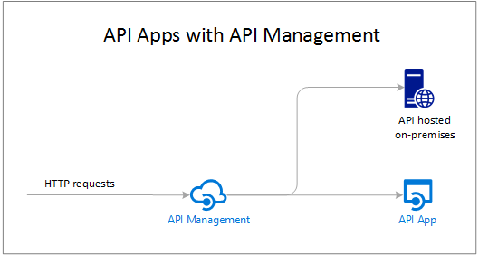

<properties 
	pageTitle="API Apps introduction | Microsoft Azure" 
	description="Learn how Azure App Service helps you develop, host, and consume RESTful APIs." 
	services="app-service\api" 
	documentationCenter=".net" 
	authors="tdykstra" 
	manager="wpickett" 
	editor=""/>

<tags 
	ms.service="app-service-api" 
	ms.workload="web" 
	ms.tgt_pltfrm="na" 
	ms.devlang="na" 
	ms.topic="get-started-article" 
	ms.date="05/03/2016" 
	ms.author="rachelap"/>

# API Apps overview

API apps in Azure App Service offer features that make it easier to develop, host, and consume APIs in the cloud and on-premises. With API apps you get enterprise grade security, simple access control, hybrid connectivity, automatic SDK generation, and seamless integration with [Logic Apps](../app-service-logic/app-service-logic-what-are-logic-apps.md).

[Azure App Service](../app-service/app-service-value-prop-what-is.md) is a fully managed platform for web, mobile, and integration scenarios. API Apps is one of four app types offered by [Azure App Service](../app-service/app-service-value-prop-what-is.md).

## Why use API Apps?

Here are some key features of API Apps:

- **Bring your existing API as-is** - You don't have to change any of the code in your existing APIs to take advantage of API Apps -- just deploy your code to an API app. Your API can use any language or framework supported by App Service, including ASP.NET and C#, Java, PHP, Node.js, and Python.

- **Easy consumption** - Integrated support for [Swagger API metadata](http://swagger.io/) makes your APIs easily consumable by a variety of clients.  Automatically generate client code for your APIs in a variety of languages including C#, Java, and Javascript. Easily configure [CORS](app-service-api-cors-consume-javascript.md) without changing your code. For more information, see [App Service API Apps metadata for API discovery and code generation](app-service-api-metadata.md) and [Consume an API app from JavaScript using CORS](app-service-api-cors-consume-javascript.md). 

- **Simple access control** - Protect an API app from unauthenticated access with no changes to your code. Built-in authentication services secure APIs for access by other services or by clients representing users. Supported identity providers include Azure Active Directory, Facebook, Twitter, Google, and Microsoft Account. Clients can use Active Directory Authentication Library (ADAL) or the Mobile Apps SDK. For more information, see [Authentication and authorization for API Apps in Azure App Service](app-service-api-authentication.md).

- **Visual Studio integration** - Dedicated tools in Visual Studio streamline the work of creating, deploying, consuming, debugging, and managing API apps. For more information, see [Announcing the Azure SDK 2.8.1 for .NET](/blog/announcing-azure-sdk-2-8-1-for-net/).

- **Integration with Logic Apps** - API apps that you create can be consumed by [App Service Logic Apps](../app-service-logic/app-service-logic-what-are-logic-apps.md).  For more information, see [Using your custom API hosted on App Service with Logic apps](../app-service-logic/app-service-logic-custom-hosted-api.md) and [New schema version 2015-08-01-preview](../app-service-logic/app-service-logic-schema-2015-08-01.md).

In addition, an API app can take advantage of features offered by [Web Apps](../app-service-web/app-service-web-overview.md) and [Mobile Apps](../app-service-mobile/app-service-mobile-value-prop.md). The reverse is also true: if you use a web app or mobile app to host an API, it can take advantage of API Apps features such as Swagger metadata for client code generation and CORS for cross-domain browser access. The only difference between the three app types (API, web, mobile) is the name and icon used for them in the Azure portal.

## What's the difference between API Apps and Azure API Management?

API Apps and [Azure API Management](../api-management/api-management-key-concepts.md) are complementary services:

* API Management is about managing APIs. You put an API Management front end on an API to monitor and throttle usage, manipulate input and output, consolidate several APIs into one endpoint, and so forth. The APIs being managed can be hosted anywhere.
* API Apps is about hosting APIs. The service includes features that facilitate developing and consuming APIs, but it doesn't do the kinds of monitoring, throttling, manipulating, or consolidating that API Management does. If you don't need API Management features, you can host APIs in API apps without using API Management.

Here's a diagram that illustrates API Management used for APIs hosted in API apps and elsewhere.

Some features of API Management and API Apps have similar functions.  For example, both can automate CORS support. When you use the two services together, you would use API Management for CORS since it functions as the front end to your API apps. 

## Getting started

To get started with API Apps by deploying sample code to one, see the tutorial for whichever framework you prefer:

* [ASP.NET](app-service-api-dotnet-get-started.md) 
* [Node.js](app-service-api-nodejs-api-app.md) 
* [Java](app-service-api-java-api-app.md) 

To ask questions about API apps, start a thread in the [API Apps forum](https://social.msdn.microsoft.com/Forums/en-US/home?forum=AzureAPIApps). 
