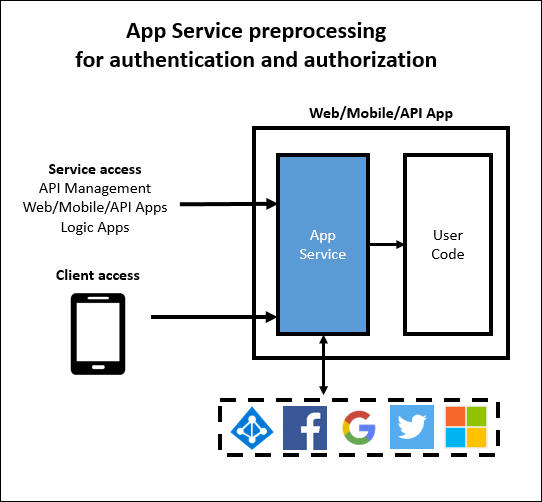
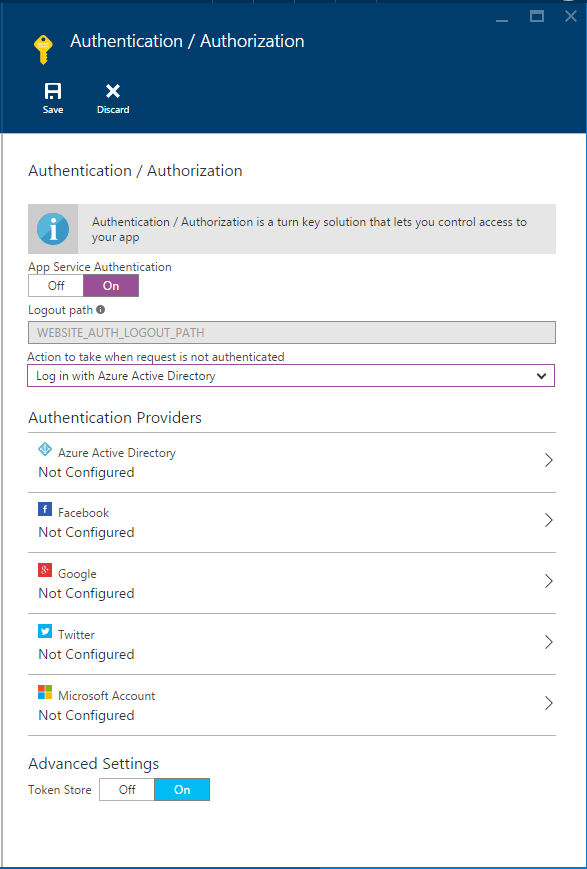
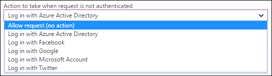

<properties
	pageTitle="Authentication and authorization for API Apps in Azure App Service | Microsoft Azure"
	description="Learn about the authentication and authorization services that Azure App Service provides for API Apps."
	services="app-service\api"
	documentationCenter=".net"
	authors="tdykstra"
	manager="wpickett"
	editor=""/>

<tags
	ms.service="app-service-api"
	ms.workload="na"
	ms.tgt_pltfrm="na"
	ms.devlang="na"
	ms.topic="article"
	ms.date="05/23/2016"
	ms.author="rachelap"/>

# Authentication and authorization for API Apps in Azure App Service

## Overview 

> [AZURE.NOTE] This topic will be migrated to a consolidated [App Service Authentication / Authorization](../app-service/app-service-authentication-overview.md) topic, which covers Web, Mobile, and API Apps.

Azure App Service offers built-in authentication and authorization services that implement [OAuth 2.0](#oauth) and [OpenID Connect](#oauth). This article describes the services and options that are available for API Apps in Azure App Service.

The following diagram illustrates some key characteristics of App Service authentication:

* It preprocesses incoming API requests, which means it works with any language or framework supported by App Service.
* It gives you several options for how much authentication work you want to do in your own code.
* It works for both end user and service account authentication. 
* It supports five identity providers: Azure Active Directory, Facebook, Google, Twitter, and Microsoft Account.
* It works the same for API Apps, Web Apps, and Mobile Apps.

## Language agnostic

App Service authentication processing happens before requests reach your API app, which means that the authentication features work for API apps written in any language or framework.  Your API can be based on ASP.NET, Java, Node.js, or any framework that App Service supports.

App Service passes on the JSON web token (JWT) in the Authorization header of an HTTP request, and code written in any language or framework can get the information it needs from the token. In addition, App Service gives you easier access to the most commonly used claims by setting some special headers, such as the following:

* X-MS-CLIENT-PRINCIPAL-NAME
* X-MS-CLIENT-PRINCIPAL-ID
* X-MS-TOKEN-FACEBOOK-ACCESS-TOKEN
* X-MS-TOKEN-FACEBOOK-EXPIRES-ON
 
In a .NET API, you can use the `Authorize` attribute, and for fine-grained authorization you can easily write code based on claims because claims information is populated for you in .NET classes.

## Multiple protection options

App Service can prevent anonymous HTTP requests from reaching your API app, it can pass on all requests and validate tokens for requests that include them, or it can let through all requests without taking any action on them:

1. Allow only authenticated requests to reach your API app.

	If an anonymous request is received from a browser, App Service will redirect to a logon page for the authentication provider (Azure AD, Google, Twitter, etc.) that you choose. 

	With this option, you don't need to write any authentication code at all in your app, and authorization code is simplified because the most important claims are provided in the HTTP headers.

2. Allow all requests to reach your API app, but validate authenticated requests and pass along authentication information in the HTTP headers.

	This option gives you more flexibility in handling anonymous requests, but you have to write code if you want to prevent anonymous users from using your API. Since the most popular claims are passed in the headers of HTTP requests, authorization code is relatively simple.
	
3. Allow all requests to reach your API, take no action on authentication information in the requests.

	This option leaves the tasks of authentication and authorization entirely up to your application code.

In the [Azure portal](https://portal.azure.com/), you select the option you want on the **Authentication / Authorization** blade.

For options 1 and 2, turn on **App Service Authentication**, and in the **Action to take when request is not authenticated** drop-down list choose **Log in** or **Allow request (no action)**.  If you choose **Log in**, you have to choose an authentication provider and configure that provider.

For detailed information about how to configure authentication, see [How to configure your App Service application to use Azure Active Directory login](../app-service-mobile/app-service-mobile-how-to-configure-active-directory-authentication.md). The article applies to API apps as well as mobile apps, and it links to other articles for the other authentication providers.
 
##  Service account authentication

App Service authentication works for internal scenarios such as for calling from one API app to another API app. In this scenario you get a token by using credentials for a service account instead of end user credentials. A service account is also known as a *service principal* in Azure Active Directory, and authentication using such an account is also known as a service-to-service scenario. 

For service-to-service scenarios, protect the called API app by using Azure Active Directory, and provide an AAD service principal authorization token when you call the API app. You get a token by providing the client ID and client secret from the AAD application. No special Azure-only code is required, such as used to be true for handling the Mobile Services Zumo token. An example of this scenario using ASP.NET API apps is covered by the tutorial [Service principal authentication for API Apps](app-service-api-dotnet-service-principal-auth.md).

If you want to handle a service-to-service scenario without using App Service authentication, you can use client certificates or basic authentication. For information about client certificates in Azure, see [How To Configure TLS Mutual Authentication for Web Apps](../app-service-web/app-service-web-configure-tls-mutual-auth.md). For information about basic authentication in ASP.NET, see [Authentication Filters in ASP.NET Web API 2](http://www.asp.net/web-api/overview/security/authentication-filters).

Service account authentication from an App Service logic app to an API app is a special case that is explained in [Using your custom API hosted on App Service with Logic apps](../app-service-logic/app-service-logic-custom-hosted-api.md).

## Mobile client authentication

For information about how to handle authentication from mobile clients, see the [documentation on authentication for mobile apps](../app-service-mobile/app-service-mobile-ios-get-started-users.md). App Service authentication works the same way for mobile apps and API apps.
  
## More information

For more information about authentication and authorization in Azure App Service, see the following resources:

* [Expanding App Service authentication / authorization](/blog/announcing-app-service-authentication-authorization/)
* [How to configure your App Service application to use Azure Active Directory login](../app-service-mobile/app-service-mobile-how-to-configure-active-directory-authentication.md) (Includes links for other authentication providers at the top of the page.) 

For more information about OAuth 2.0, OpenID Connect, and JSON Web Tokens (JWT), see the following resources.

* [Getting started with OAuth 2.0](http://shop.oreilly.com/product/0636920021810.do "Getting Started with OAuth 2.0") 
* [Introduction to OAuth2, OpenID Connect and JSON Web Tokens (JWT) - PluralSight Course](http://www.pluralsight.com/courses/oauth2-json-web-tokens-openid-connect-introduction) 
* [Building and Securing a RESTful API for Multiple Clients in ASP.NET - PluralSight course](http://www.pluralsight.com/courses/building-securing-restful-api-aspdotnet)

For more information about Azure Active Directory, see the following resources.

* [Azure AD scenarios](http://aka.ms/aadscenarios)
* [Azure AD developers' guide](http://aka.ms/aaddev)
* [Azure AD samples](http://aka.ms/aadsamples)

## Next steps

This article has explained authentication and authorization features of App Service that you can use for API apps. The next tutorial in the getting started series shows how to implement [user authentication in App Service API Apps](app-service-api-dotnet-user-principal-auth.md).
