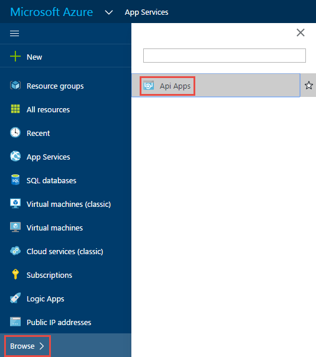
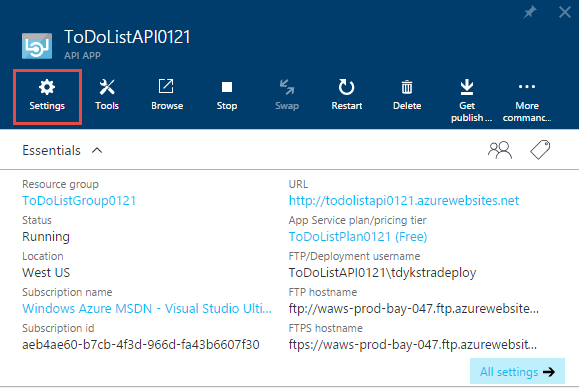
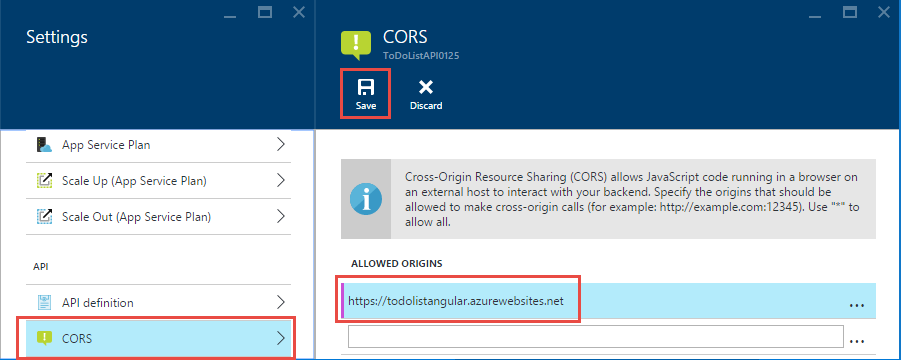
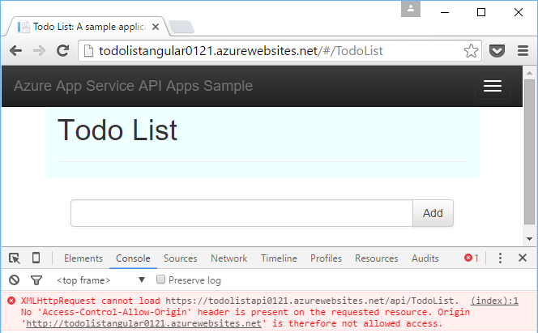
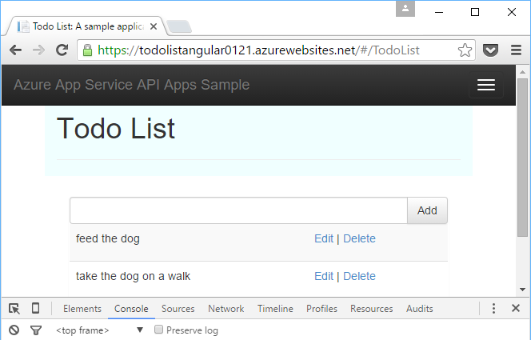

<properties
	pageTitle="Consume an API app from JavaScript using CORS | Microsoft Azure"
	description="Learn how to consume an API app in Azure App Service, from a JavaScript client and using CORS."
	services="app-service\api"
	documentationCenter=".net"
	authors="tdykstra"
	manager="wpickett"
	editor=""/>

<tags
	ms.service="app-service-api"
	ms.workload="na"
	ms.tgt_pltfrm="dotnet"
	ms.devlang="na"
	ms.topic="get-started-article"
	ms.date="03/04/2016"
	ms.author="tdykstra"/>

# Consume an API app from JavaScript using CORS

## Overview

App Service offers built-in support for Cross Origin Resource Sharing (CORS), which enables JavaScript clients to make cross-domain calls to App Service API apps.

For security reasons, browsers prevent JavaScript from making API calls to a domain other than the one that the JavaScript code comes from. For example, you can make a call from a contoso.com web page to a contoso.com API endpoint but not to a fabrikam.com endpoint. CORS is an internet protocol that is designed to enable scenarios where you need to make such cross-domain API calls. In Azure App Service, an example of such a scenario is where your JavaScript client is running in a web app while your API is running in an API app.

This article contains two sections:

* The [How to configure CORS](#corsconfig) section explains in general how to configure CORS for any API app and applies equally to all frameworks supported by App Service, including .NET, Node.js, and Java. 

* Starting with the [Continuing the .NET getting-started tutorials](#tutorialstart) section, the tutorial guides you through deploying a .NET sample application and configuring CORS so that the JavaScript front end can call the Web API back end. 

##  How to configure CORS in Azure App Service

You can configure CORS in the Azure portal or by using [Azure Resource Manager](../resource-group-overview.md) tools.

#### Configure CORS in the Azure portal

8. In a browser go to the [Azure portal](https://portal.azure.com/).

2. Click **App Services**, and then click the name of your API app.

	

10. In the **Settings** blade that opens to the right of the **API app** blade, find the **API** section, and then click **CORS**.

	

11. In the text box enter the URL(s) that you want to allow JavaScript calls to come from.

	For example, if you deployed your JavaScript application to a web app named todolistangular, enter "https://todolistangular.azurewebsites.net". As an alternative, you can enter an asterisk (*) to specify that all origin domains are accepted.

13. Click **Save**.

	

	After you click **Save**, the API app will accept JavaScript calls from the specified URL(s).

### Configure CORS by using Azure Resource Manager tools

You can also configure CORS for an API app by using [Azure Resource Manager templates](../resource-group-authoring-templates.md) in command line tools such as [Azure PowerShell](../powershell-install-configure.md) and the [Azure CLI](../xplat-cli-install.md). 

For an example of an Azure Resource Manager template that sets the CORS property, open the [azuredeploy.json file in the repository for this tutorial's sample application](https://github.com/azure-samples/app-service-api-dotnet-todo-list/blob/master/azuredeploy.json). Find the section of the template that looks like the following example:

		"cors": {
		    "allowedOrigins": [
		        "todolistangular.azurewebsites.net"
		    ]
		}

##  Continuing the .NET getting-started tutorial

If you are following the Node.js or Java getting-started series for API apps, skip to the next article, [authentication for App Service API apps](app-service-api-authentication.md).

The remainder of this article is a continuation of the .NET getting-started series and assumes that you successfully completed [the first tutorial](app-service-api-dotnet-get-started.md).

## Deploy the ToDoListAngular project to a new web app

In [the first tutorial](app-service-api-dotnet-get-started.md) you created a middle tier API app and a data tier API app. In this tutorial you create a single-page application (SPA) web app that calls the middle tier API app. For the SPA to work you will have to enable CORS on the middle tier API app. 

In the [ToDoList sample application](https://github.com/Azure-Samples/app-service-api-dotnet-todo-list), the ToDoListAngular project is a simple AngularJS client that calls the middle tier ToDoListAPI Web API project. The JavaScript code in the *app/scripts/todoListSvc.js* file calls the API by using the AngularJS HTTP provider. 

		angular.module('todoApp')
		.factory('todoListSvc', ['$http', function ($http) {
		    var apiEndpoint = "http://localhost:46439";
		
		    $http.defaults.useXDomain = true;
		    delete $http.defaults.headers.common['X-Requested-With']; 
		
		    return {
		        getItems : function(){
		            return $http.get(apiEndpoint + '/api/TodoList');
		        },

		        /* Get by ID, Put, and Delete methods not shown */

		        postItem : function(item){
		            return $http.post(apiEndpoint + '/api/TodoList', item);
		        }
		    };
		}]);

### Create a new web app for the ToDoListAngular project

The procedure to create a new web app and deploy a project to it is the same as you saw in the first tutorial in this series, except that the app type is **Web App** instead of **API App**.

1. In **Solution Explorer**, right-click the ToDoListAngular project, and then click **Publish**.

3.  In the **Profile** tab of the **Publish Web** wizard, click **Microsoft Azure App Service**.

5. In the **App Service** dialog box, click **New**.

3. In the **Hosting** tab of the **Create App Service** dialog box, enter a **Web App Name** that is unique in the *azurewebsites.net* domain. 

5. Choose the Azure **Subscription** you want to work with.

6. In the **Resource Group** drop-down, choose the same resource group you created earlier.

4. In the **App Service Plan** drop-down, choose the same plan you created earlier. 

7. Click **Create**.

	Visual Studio creates the web app, creates a publish profile for it, and displays the **Connection** step of the **Publish Web** wizard.

	Before you click **Publish** in the **Publish Web** wizard, you'll configure the new web app to call the middle tier API app that is running in App Service. 

### Set the middle tier URL in web app settings

1. Go to the [Azure portal](https://portal.azure.com/), and then navigate to the **Web App** blade for the web app that you created to host the TodoListAngular (front end) project.

2. Click **Settings > Application Settings**.

3. In the **App settings** section, add the following key and value:

	|Key|Value|Example
	|---|---|---|
	|toDoListAPIURL|https://{your middle tier API app name}.azurewebsites.net|https://todolistapi0121.azurewebsites.net|

4. Click **Save**.

	When the code runs in Azure, this value will now override the localhost URL that is in the Web.config file. 

	The code that gets the setting value is in *index.cshtml*:

		
		

	The code in *todoListSvc.js* uses the setting:

		return {
		    getItems : function(){
		        return $http.get(apiEndpoint + '/api/TodoList');
		    },
		    getItem : function(id){
		        return $http.get(apiEndpoint + '/api/TodoList/' + id);
		    },
		    postItem : function(item){
		        return $http.post(apiEndpoint + '/api/TodoList', item);
		    },
		    putItem : function(item){
		        return $http.put(apiEndpoint + '/api/TodoList/', item);
		    },
		    deleteItem : function(id){
		        return $http({
		            method: 'DELETE',
		            url: apiEndpoint + '/api/TodoList/' + id
		        });
		    }
		};

### Deploy the ToDoListAngular web project to the new web app

*  In Visual Studio, in the **Connection** step of the **Publish Web** wizard, click **Publish**.

	Visual Studio deploys the ToDoListAngular project to the new web app and opens a browser to the URL of the web app. 

### Test the application without CORS enabled 

2. In your browser Developer Tools, open the Console window.

3. In the browser window that displays the AngularJS UI, click the **To Do List** link.

	The JavaScript code tries to call the middle tier API app, but the call fails because the front end is running in a different domain (the web app URL) than the back end (the API app URL). The browser's Developer Tools Console window shows a cross-origin error message.

	

## Configure CORS for the middle tier API app

In this section you configure the ToDoListAPI API app to allow JavaScript calls from the web app that you created for the ToDoListAngular project.
 
8. In a browser go to the [Azure portal](https://portal.azure.com/).

2. Click **App Services**, and then click the ToDoListAPI (middle tier) API app.

	

10. In the **Settings** blade that opens to the right of the **API app** blade, find the **API** section, and then click **CORS**.

	

12. In the text box enter the URL for the ToDoListAngular (front end) web app. For example, if you deployed the ToDoListAngular project to a web app named todolistangular0121, allow calls from the URL `https://todolistangular0121.azurewebsites.net`.

	As an alternative, you can enter an asterisk (*) to specify that all origin domains are accepted.

13. Click **Save**.

	

	After you click **Save**, the API app will accept JavaScript calls from the specified URL(s). In this screen shot, the ToDoListAPI0223 API app will accept JavaScript client calls from the ToDoListAngular web app.

### Test the application with CORS enabled

* Open a browser to the HTTPS URL of the web app. 

	This time the application lets you view, add, edit, and delete to-do items. 

	

## App Service CORS versus Web API CORS

In a Web API project you can install the [Microsoft.AspNet.WebApi.Cors](https://www.nuget.org/packages/Microsoft.AspNet.WebApi.Cors/) NuGet package to specify in code which domains your API will accept JavaScript calls from.
 
Web API CORS support is more flexible than App Service CORS support. For example, in code you can specify different accepted origins for different action methods, while for App Service CORS you specify one set of accepted origins for all of an API app's methods.

> [AZURE.NOTE] Don't try to use both Web API CORS and App Service CORS in one API app. App Service CORS will take precedence and Web API CORS will have no effect. For example, if you enable one origin domain in App Service, and enable all origin domains in your Web API code, your Azure API app will only accept calls from the domain you specified in Azure.

### How to enable CORS in Web API code

The following steps summarize the process for enabling Web API CORS support. For more information, see [Enabling Cross-Origin Requests in ASP.NET Web API 2](http://www.asp.net/web-api/overview/security/enabling-cross-origin-requests-in-web-api).

1. In a Web API project, install the [Microsoft.AspNet.WebApi.Cors](https://www.nuget.org/packages/Microsoft.AspNet.WebApi.Cors/) NuGet package.

1. Include a `config.EnableCors()` line of code in the **Register** method of the **WebApiConfig** class, as in the following example. 

		public static class WebApiConfig
		{
		    public static void Register(HttpConfiguration config)
		    {
		        // Web API configuration and services
	            
		        // The following line enables you to control CORS by using Web API code
		        config.EnableCors();
	
		        // Web API routes
		        config.MapHttpAttributeRoutes();
	
		        config.Routes.MapHttpRoute(
		            name: "DefaultApi",
		            routeTemplate: "api/{controller}/{id}",
		            defaults: new { id = RouteParameter.Optional }
		        );
		    }
		}

1. In your Web API controller, add a `using` statement for the `System.Web.Http.Cors` namespace, and add the `EnableCors` attribute to the controller class or to individual action methods. In the following example, CORS support applies to the entire controller.

		namespace ToDoListAPI.Controllers 
		{
		    [HttpOperationExceptionFilterAttribute]
		    [EnableCors(origins:"*", headers:"*", methods: "*")]
		    public class ToDoListController : ApiController
 
	> **Note**: Use of wildcards for all of the parameters with the `EnableCors` attribute is intended only for demonstration purposes, and will open your API up to all origins and all HTTP requests. Use this attribute with caution.

## Next steps 

In this tutorial you saw how to enable App Service CORS support so that client JavaScript code can call an API in a different domain. In the next article in the API Apps getting started series, you'll learn about [authentication for App Service API apps](app-service-api-authentication.md).
