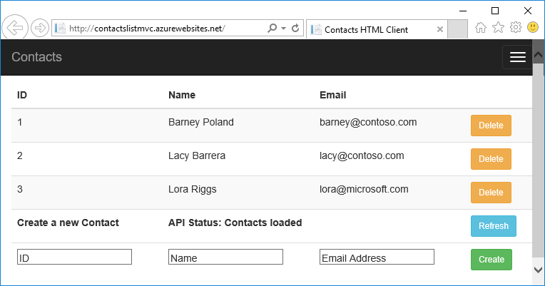
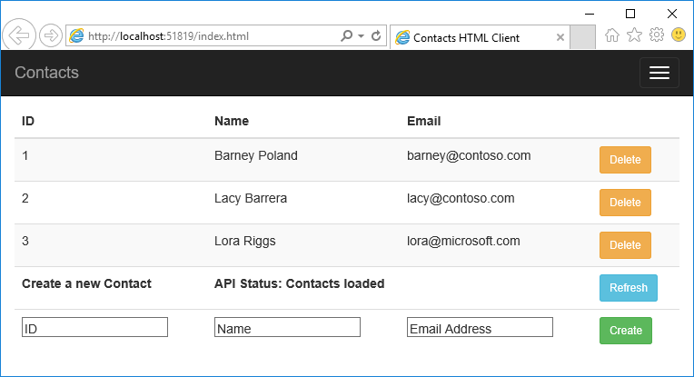
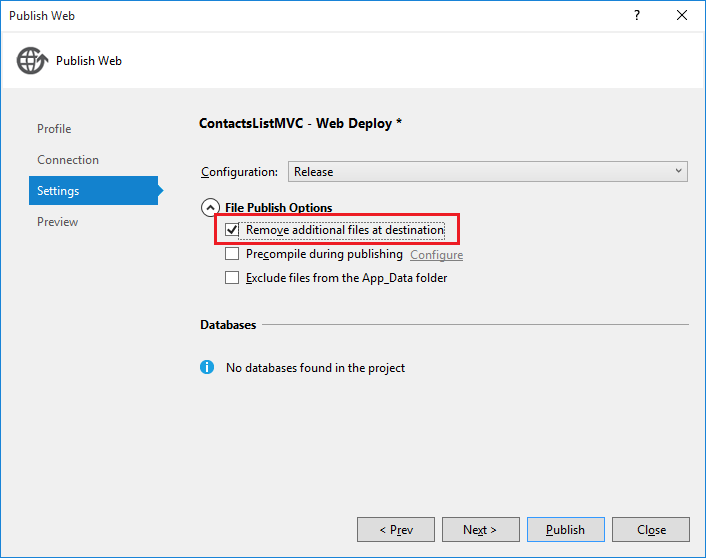
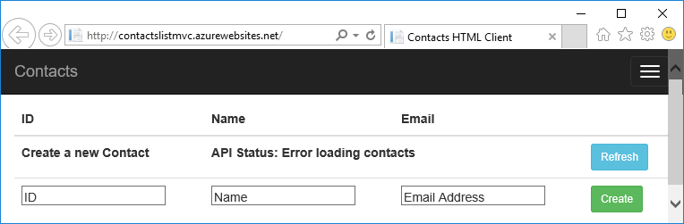

<properties
	pageTitle="Consume an API app from JavaScript using CORS | Microsoft Azure"
	description="Learn how to consume an API app in Azure App Service, from a JavaScript client and using CORS."
	services="app-service\api"
	documentationCenter=".net"
	authors="tdykstra"
	manager="wpickett"
	editor=""/>

<tags
	ms.service="app-service-api"
	ms.workload="na"
	ms.tgt_pltfrm="dotnet"
	ms.devlang="na"
	ms.topic="get-started-article"
	ms.date="11/27/2015"
	ms.author="tdykstra"/>

# Consume an API app from JavaScript using CORS

[AZURE.INCLUDE [app-service-api-get-started-selector](../../includes/app-service-api-get-started-selector.md)]

## Overview

This tutorial shows how to consume an API app from JavaScript code in a website that is served from a different domain than the API app. The sample client uses AngularJS.

 
This is the second in a series of tutorials that show how to work with API apps in Azure App Service. For information about the series, see [Get started with API Apps and ASP.NET in Azure App Service](app-service-api-dotnet-get-started.md).

## Introduction to CORS

For security reasons, browsers' default behavior prevents JavaScript from making API calls to a domain other than the one that the JavaScript comes from. For example, you can make a call from a contoso.com web page to a contoso.com API endpoint but not to a fabrikam.com endpoint. Cross Origin Resource Sharing (CORS) is an internet protocol that is designed to enable scenarios where you need to make such cross-domain API calls. In Azure App Service an example of such a scenario is where your JavaScript client is running in a web app while your API is running in an API app.  

In a Web API project you can install CORS NuGet packages that enable you to specify in code which domains your API will accept JavaScript calls from. Alternatively, you can use the CORS feature built into Azure App Service to specify which domains your API app will accept calls from. The first half of this tutorial shows how to use the Azure feature, which works for all languages that the API Apps service supports. The second half is optional and shows the NuGet package method which works with ASP.NET Web API. 

## The ContactsList.Angular sample project

In this tutorial you use the sample projects that you downloaded in the first tutorial in this series and the Azure resources (API app and web app) that you created in the first tutorial.

The ContactsList.Angular project is a simple AngularJS client for the ContactsList.API Web API project. The AngularJS JavaScript code that calls the API is in the *index.html* file in the ContactsList.Angular project. The code defines the functions and adds them to the `$scope` object, as shown here where the API's Get method is defined as `$scope.refresh()`.

		angular.module('myApp', []).controller('contactListCtrl', function ($scope, $http) {
		    $scope.baseurl = 'http://localhost:51864';
		
		    $scope.refresh = function () {
		        $scope.status = "Refreshing Contacts...";
		        $http({
		            method: 'GET',
		            url: $scope.baseUrl + '/api/contacts',
		            headers: {
		                'Content-Type': 'application/json'
		            }
		        }).then(function (results) {
		            $scope.contacts = results.data;
		            $scope.status = "Contacts loaded";
		        }, function (err) {
		            $scope.status = "Error loading contacts";
		        });
		    };
		
		    // POST and DELETE not shown
		
		    $scope.refresh();
		});

The code calls $scope.refresh() method when the page loads (at the end of of the snippet shown above) and is wired up to the **Refresh** button in the UI.

		<th><button class="btn btn-sm btn-info" ng-click="refresh()">Refresh</button></th>

## Run the AngularJS project locally

In this section you verify that you can run the client locally and can call the API while it too is running locally.

1. Set the ContactsList.API and ContactsList.Angular projects as startup projects, with ContactsList.API starting before ContactsList.Angular. 

2. Press F5 to start the projects.

	The AngularJS UI displays the contacts that are stored locally, and you can use the UI to add and delete contacts.

	

3. Close the browser windows.

## Change the AngularJS project to point to the Azure API app 

Next, you'll run the AngularJS frontend in the cloud and call the API backend that is running in the cloud. Before deploying the frontend to Azure you have to change the API endpoint in the AngularJS project so that the code calls the Azure API app that you created earlier.

1. In the ContactsList.Angular project, open *index.html*.

2. Comment out the line that sets `baseUrl` to the localhost URL, uncomment the line that sets `baseUrl` to an azurewebsites.net URL, and replace the placeholder with the actual name of the API app you created earlier.  If you named the API app ContactsListAPI, the code now looks like the following example.

		$scope.baseUrl = 'https://ContactsListAPI.azurewebsites.net';
		//$scope.baseUrl = 'http://localhost:51864';

### Deploy the ContactsList.Angular project to the web app

You could create a new web app to deploy the AngularJS project to, but for this tutorial you'll deploy to the same web app that you created earlier. The web app name may reflect the fact that you originally deployed an ASP.NET MVC project to it, but after this deployment it will be running the AngularJS code.

8. In **Solution Explorer**, right-click the ContactsList.Angular project, and then click **Publish**.

9. Click the **Profile** tab.

3.  In the **Profile** step of the **Publish Web** wizard, click **Microsoft Azure App Service**.

4. In the **App Service** dialog box, choose your subscription.

5. With **View** set to the default value **Resource Group**, expand the  resource group that you created for this tutorial series.

7. Select the web app that you created in the first tutorial (make sure you don't select the API app), and then click **OK**.

8. Click the **Settings** tab.

9. Expand **File Publish Options**, and then select **Remove additional files at destination**.

	

	Normally when you deploy a web project to an existing App Service web app you don't want the "remove additional files" option because any changes are typically updates or new files. In this case you're deploying a different project to the same web app, so there are likely to be many files from the earlier deployment that aren't needed in the new one. 

10. Click **Publish**.

	Visual Studio deploys the ContactsList.Angular project to the web app and opens a browser to the URL of the web app. The browser shows the same AngularJS UI that you saw running locally, except now it fails because your frontend is running in a different domain (the web app URL) than the backend (the API app URL). 

	

## Configure CORS for the target API app in Azure

8. In another browser window go to the [Azure portal](https://portal.azure.com/).

9. Navigate to the API app blade for the API app that you created in the first tutorial.

10. Click **Settings**.

11. Find the **API** section, and then click **CORS**.

12. In the text box enter the URL of the web app that you created in the first tutorial for the ASP.NET MVC frontend. For example, if you named the web app ContactsListMVC, enter "http://contactslistmvc.azurewebsites.net".

	Note that as an alternative to entering a URL, you can enter an asterisk (*) to specify that all origin domains are accepted.

13. Click **Save**.

	

14. Go back to the browser window that displays the AngularJS client running in the Azure web app, and refresh the page or click the **Refresh** button.

	The page now shows the contacts that are stored in the Azure API app's file system.

	

## Configure CORS for the target API app in Web API Code

If you don't want to use Azure App Service CORS support, an alternative is to enable CORS in your ASP.NET Web API code. This process is documented in [Enabling Cross-Origin Requests in ASP.NET Web API 2](http://www.asp.net/web-api/overview/security/enabling-cross-origin-requests-in-web-api) in depth. For API apps built using ASP.NET Web API the process is exactly the same but is summarized here.

In this section you'll disable Azure App Service CORS support, and then enable Web API CORS support. Note that disabling Azure CORS support is not an optional step before enabling Web API support. If you use both methods together, Azure CORS will take precedence and Web API CORS will have no effect.  For example, if you enable one origin domain in Azure, and enable all origin domains in your Web API code, your Azure API app will only accept calls from the domain you specified in Azure.

### Disable Azure CORS support

1. To disable Azure CORS support, go back to the Azure portal and clear the URL you entered on the CORS blade, and then click **Save**.
 
3.  Go back to the URL of the web app that you deployed the AngularJS app to, and refresh the page or click the **Refresh** button.

	You see "Error loading contacts" again.

	

### Enable Web API CORS support

CORS functionality for Web API is provided by the [Microsoft.AspNet.WebApi.Cors](https://www.nuget.org/packages/Microsoft.AspNet.WebApi.Cors/) NuGet package. The package is already installed in the downloaded sample application, and all you have to do to enable CORS is uncomment some code.

1. In the ContactsList.API project, open the *App_Start/WebApiConfig.cs* file. Uncomment the config.EnableCors line of code in the **Register** method of the **WebApiConfig**. 

	Once the file is updated the code looks like the following example:

		public static class WebApiConfig
	    {
	        public static void Register(HttpConfiguration config)
	        {
	            // Web API configuration and services
	            
		        // Uncomment the following line to control CORS by using Web API code
				config.EnableCors();
	
	            // Web API routes
	            config.MapHttpAttributeRoutes();
	
	            config.Routes.MapHttpRoute(
	                name: "DefaultApi",
	                routeTemplate: "api/{controller}/{id}",
	                defaults: new { id = RouteParameter.Optional }
	            );
	        }
	    }

1. Open the *Controllers/ContactsController.cs* file, and uncomment the line that adds the `EnableCors` attribute to the `ContactsController` class.

		namespace ContactList.Controllers
		{
		    [HttpOperationExceptionFilterAttribute]
		    [EnableCors(origins:"*", headers:"*", methods: "*")]
		    public class ContactsController : ApiController
 
	You can apply the attribute to individual action methods instead of the entire controller if you prefer.

	> **Note**: Use of wildcards for all of the parameters with the `EnableCors` attribute is intended only for demonstration purposes, and will open your API up to all origins and all HTTP requests. Use this attribute with caution.

### Deploy the API to Azure and retest the frontend

8. In **Solution Explorer**, right-click the ContactsList.API project, and then click **Publish**.

	The **Publish Web** wizard automatically opens at the **Preview** step for the publish profile for the API app that you created earlier, since that is the last target you deployed this project to.

3.  Click **Publish**.

	

	After the deployment is completed, the browser opens a window to the API app URL, which then displays a "web app successfully created" page.

3.  Go back to the URL of the web app that you deployed the AngularJS app to, and refresh the page or click the **Refresh** button.

	The page loads successfully again.

	

## Re-enable Azure CORS support

To use the built-in Azure authentication services in the following tutorials, you have to use Azure CORS rather than Web API CORS.
 
1. To enable Azure CORS support, go back to the Azure portal CORS blade for your API app, and re-enter the URL of the web app

13. Click **Save**.

	

## Next steps 

In this tutorial you saw two ways to enable CORS support so that the client JavaScript code can call to an API in a different domain. In the next tutorial, you'll learn how to [restrict access to your API app so that only authenticated users can access it](app-service-api-dotnet-user-principal-auth.md).
