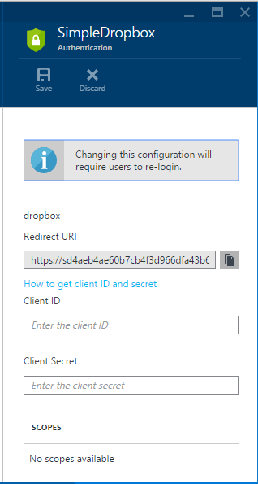
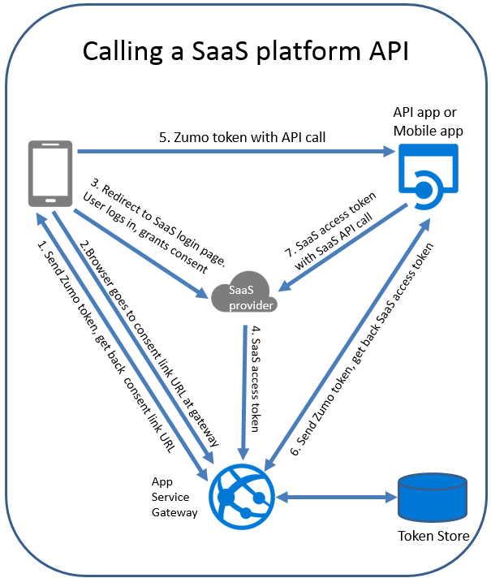
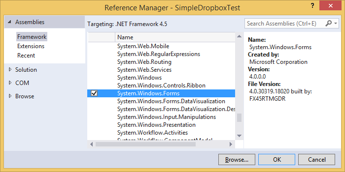
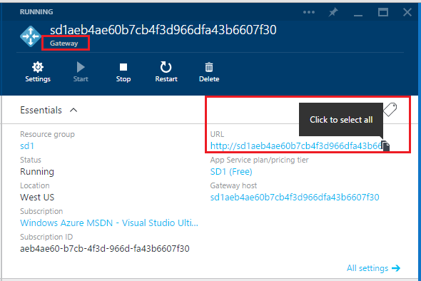
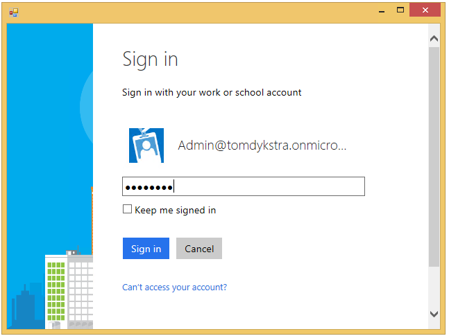
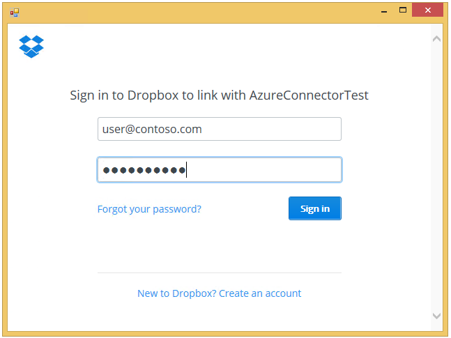
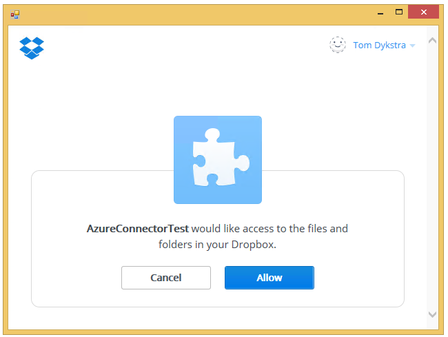
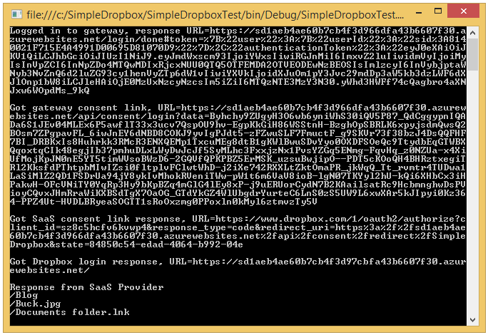
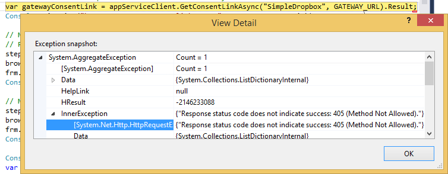

<properties 
	pageTitle="Custom SaaS connector ASP.NET API app in Azure App Service" 
	description="Learn how to write code that connects to a SaaS platform from an API app and how to call the API app from a .NET client." 
	services="app-service\api" 
	documentationCenter=".net" 
	authors="tdykstra" 
	manager="wpickett" 
	editor="jimbe"/>

<tags 
	ms.service="app-service-api" 
	ms.workload="web" 
	ms.tgt_pltfrm="dotnet" 
	ms.devlang="na" 
	ms.topic="article" 
	ms.date="09/22/2015" 
	ms.author="tdykstra"/>

# Connect to a SaaS platform from an ASP.NET API app in Azure App Service

## Overview

This tutorial shows how to code and configure an [API app](app-service-api-apps-why-best-platform.md) that connects to a [Software-as-a-Service (SaaS) platform](../app-service/app-service-authentication-overview.md#obotosaas) using the [App Service API app SDK for .NET](http://www.nuget.org/packages/Microsoft.Azure.AppService.ApiApps.Service/). The tutorial also shows how to call the API app from a .NET client by using the [App Service SDK for .NET](http://www.nuget.org/packages/Microsoft.Azure.AppService). At the end of the tutorial you'll have a .NET console app client that calls a .NET API app running in Azure App Service. The API app calls the Dropbox API and returns a list of files and folders in the user's Dropbox account.

As an alternative to writing code that calls a SaaS API directly from a custom API app, you can call a prepackaged [connector API app](../app-service-logic/app-service-logic-what-are-biztalk-api-apps.md). For information about how to do that, see [Deploy and configure a SaaS connector API app](app-service-api-connnect-your-app-to-saas-connector.md).

The tutorial walks you through the following steps:

* Create an API app project in Visual Studio. 
* Configure the *apiapp.json* file to enable the API app to connect to the Dropbox service.
* Add code that calls Dropbox and returns the results.
* Create a new API app in Azure.
* Deploy the project to the API app.
* Configure the API app.
* Configure the gateway.
* Create a test client.
* Run the test client.

## Prerequisites

The tutorial makes these assumptions:

* You have completed the [Create an API app](app-service-dotnet-create-api-app.md) and [Deploy an API app](app-service-dotnet-deploy-api-app.md) tutorials.
  
* You have a basic understanding of the Azure App Service gateway architecture for authentication, as presented in [Authentication for API apps and mobile apps](app-service-authentication-overview.md).

* You know how to work with API apps in the Azure preview portal, as explained in [How to navigate to API app and gateway blades](app-service-api-manage-in-portal.md#navigate).

## Create the API app project
 
When the instructions direct you to enter a name for the project, enter *SimpleDropbox*. 

[AZURE.INCLUDE [app-service-api-create](../../includes/app-service-api-create.md)]

## Configure the *apiapp.json* file

For an API app to make outgoing calls to a SaaS platform, the SaaS platform has to be specified in the *apiapp.json* file. 

1. Open the *apiapp.json* file and add an `authentication` property as shown here (you'll also have to add a comma after the preceding property):

		"authentication": [
		  {
		    "type": "dropbox"
		  }
		]

	The complete apiapp.json file will resemble this example: 

		{
		    "$schema": "http://json-schema.org/schemas/2014-11-01/apiapp.json#",
		    "id": "SimpleDropBox",
		    "namespace": "microsoft.com",
		    "gateway": "2015-01-14",
		    "version": "1.0.0",
		    "title": "SimpleDropBox",
		    "summary": "",
		    "author": "",
		    "endpoints": {
		        "apiDefinition": "/swagger/docs/v1",
		        "status": null
		    },
		    "authentication": [
		      {
		        "type": "dropbox"
		      }
		    ]
		}

2. Save the file.

Setting the `authentication` property has a couple effects:

* It causes the portal to display UI in the API app blade that enables you to enter the SaaS platform's client ID and client secret values.

	

* It enables the API app to retrieve the SaaS provider's access token from the gateway for use when calling the SaaS provider's API.

The `authentication` property is an array, but this preview release doesn't support specifying multiple providers.

For a list of the supported platforms, see [Getting user consent to access other SaaS platforms](../app-service/app-service-authentication-overview.md#obotosaas).

You can also specify scopes, as in this example:

		"authentication": [
		  {
		    "type": "google",
		    "scopes": ["https://www.googleapis.com/auth/userinfo.email", "https://www.googleapis.com/auth/userinfo.profile"]
		  }
		]

Available scopes are defined by each SaaS provider and can be found in the provider's developer portal.

## Add Code that calls Dropbox

1. Install the [DropboxRestAPI](https://www.nuget.org/packages/DropboxRestAPI) NuGet package in the SimpleDropbox project.

	* From the **Tools** menu, click **NuGet Package Manager > Package Manager Console**.

	* In the **Package Manager Console** window, enter this command:
	 
			install-package DropboxRestAPI  

1. Open *Controllers\ValuesController.cs* and replace all of the code in the file with the following code.

		using DropboxRestAPI;
		using Microsoft.Azure.AppService.ApiApps.Service;
		using System;
		using System.Collections.Generic;
		using System.Linq;
		using System.Net;
		using System.Net.Http;
		using System.Threading.Tasks;
		using System.Web.Http;
		
		namespace SimpleDropBox2.Controllers
		{
		    public class ValuesController : ApiController
		    {
		        public async Task<IEnumerable<string>> Get()
		        {
		            // Retrieve the token from the gateway
		            var runtime = Runtime.FromAppSettings(Request);
		            var dropboxTokenResult = await runtime.CurrentUser.GetRawTokenAsync("dropbox");
		
		            // Create a Dropbox client object that will send the token
		            // with REST API calls to Dropbox.
		            var dropboxClient = new Client(
		                new Options
		                {
		                    AccessToken = dropboxTokenResult.Properties["AccessToken"]
		                }
		            );
		
		            // Call the Dropbox API
		            var metadata = await dropboxClient.Core.Metadata.MetadataAsync("/");
		
		            // Return a list of files and folders.
		            return metadata.contents.Select(md => md.path);
		        }
		    }
		}

	Before the client calls this method, the user has logged in to Dropbox and granted consent for the API app to access the user's Dropbox account. Dropbox acknowledges that consent by providing an access token to the App Service gateway. This code retrieves the token from the gateway and includes it in a call to the Dropbox API, as shown in steps 6 and 7 in the diagram below.

	

2. Build the project.

## Create an API app in Azure

In this section you use the Visual Studio **Publish Web** wizard to create an API app in Azure. Where the instructions direct you to enter a name for the API app, enter *SimpleDropbox*.

[AZURE.INCLUDE [app-service-api-pub-web-create](../../includes/app-service-api-pub-web-create.md)]

## Deploy your code

You use the same **Publish Web** wizard to deploy your code to the new API app.

[AZURE.INCLUDE [app-service-api-pub-web-deploy](../../includes/app-service-api-pub-web-deploy.md)]

## Configure authentication for incoming calls

For Azure App Service to allow authenticated outgoing calls from the API app, the API app must also require that incoming calls come from authenticated users. This is not a general OAuth 2.0 requirement but is a requirement of the App Service gateway architecture as it is currently implemented.

The screenshots in this section show a ContactsList API app, but the process is the same for the SimpleDropbox API app that you're creating in this tutorial.

### Configure the API app to require that incoming calls be authenticated

[AZURE.INCLUDE [app-service-api-config-auth](../../includes/app-service-api-config-auth.md)]

### Configure an identity provider in the gateway

[AZURE.INCLUDE [app-service-api-gateway-config-auth](../../includes/app-service-api-gateway-config-auth.md)]

## Configure authentication for outgoing calls

To enable your API app to call the Dropbox API, you have to exchange settings between your API app and a Dropbox app that you create on the Dropbox developer site.

### Create a Dropbox app on the Dropbox.com site

[AZURE.INCLUDE [app-service-api-create-dropbox-app](../../includes/app-service-api-create-dropbox-app.md)]

### Exchange settings between Dropbox and your API app

The following steps refer to a Dropbox connector API app, but the procedures and UI are the same for the SimpleDropbox API app that you're creating in this tutorial.

> **Note:** If you don't see fields for the Dropbox client ID and client secret on the SimpleDropbox API app's **Authentication** blade as shown in the screenshot, make sure that you restarted the gateway as directed after deploying the API app project to the API app. The "dropbox" value in the `authentication` property of the *apiapp.json* file that you deployed earlier is what triggers the portal to display these fields.

[AZURE.INCLUDE [app-service-api-exchange-dropbox-settings](../../includes/app-service-api-exchange-dropbox-settings.md)]

## Create a test client

In this section you create a console app project that uses client code generated by Visual Studio to call the SimpleDropbox API app. The console app instantiates a Windows Forms browser control to handle user interaction with the gateway and Dropbox login web pages.

### Create the project

1. In Visual Studio, create a console application project and name it *SimpleDropboxTest*.

2. Set a reference to System.Windows.Forms.
 
	* In **Solution Explorer**, right-click **References**, then click **Add Reference**.

	* Select the check box at the left of **System.Windows.Forms**, and then click **OK**.
	 
	

	The console application will use the Windows Forms assembly to instantiate a browser control when it needs to enable the user to log in to the gateway and to Dropbox.

### Add generated client code

The screenshots in this section show a ContactsList project and API app, but for this tutorial select the SimpleDropboxTest project and SimpleDropbox API app.

[AZURE.INCLUDE [app-service-api-dotnet-add-generated-client](../../includes/app-service-api-dotnet-add-generated-client.md)]

### Add code to call the API app

3. Open *Program.cs* and replace the code in it with the following code.
		
		using Microsoft.Azure.AppService;
		using Newtonsoft.Json;
		using System;
		using System.Collections.Generic;
		using System.Diagnostics;
		using System.Linq;
		using System.Text;
		using System.Threading.Tasks;
		using System.Windows.Forms;
		
		namespace SimpleDropboxTest
		{
		    enum Step
		    {
		        GatewayLogin,
		        GetSaaSConsentLink,
		        GetUserConsent
		    }
		
		    class Program
		    {
		        private const string GATEWAY_URL = @"{gateway url}";
		        private const string URL_TOKEN = "#token=";
		        private const string SAAS_URL = "dropbox.com";
		        private static Form frm = new Form();
		        private static string responseURL = "";
		        private static Step step;
		        [STAThread]
		        static void Main(string[] args)
		        {
		            // Create the web browser control
		            WebBrowser browser = new WebBrowser();
		            browser.Dock = DockStyle.Fill;
		            browser.Navigated += CheckResponseURL;
		            frm.Controls.Add(browser);
		            frm.Width = 640;
		            frm.Height = 480;
		
		            // Create the gateway and API app clients.
		            AppServiceClient appServiceClient = new AppServiceClient(GATEWAY_URL);
		            SimpleDropbox simpleDropboxClient = appServiceClient.CreateSimpleDropbox();
		
		            // Navigate browser to gateway login URL for configured identity provider.
		            // Identity provider for this example is Azure Active Directory.
		            step = Step.GatewayLogin;
		            browser.Navigate(string.Format(@"{0}/login/aad", GATEWAY_URL));
		            frm.ShowDialog();
		            Console.WriteLine("Logged in to gateway, response URL=" + responseURL);
		
		            // Get user ID and Zumo token from return URL, then call 
		            // the gateway URL to log in the gateway client.
		            var encodedJson = responseURL.Substring(responseURL.IndexOf(URL_TOKEN) + URL_TOKEN.Length);
		            var decodedJson = Uri.UnescapeDataString(encodedJson);
		            var result = JsonConvert.DeserializeObject<dynamic>(decodedJson);
		            string userId = result.user.userId;
		            string userToken = result.authenticationToken;
		            appServiceClient.SetCurrentUser(userId, userToken);
		
		            // Call gateway API to get consent link URL for target SaaS platform.
		            // SaaS platform for this example is Dropbox.
		            // See the tutorial for an explanation of
		            // the redirectURL parameter for GetConsentLinkAsync
		            var gatewayConsentLink = appServiceClient.GetConsentLinkAsync("SimpleDropbox", GATEWAY_URL).Result;
		            Console.WriteLine("\nGot gateway consent link, URL=" + gatewayConsentLink);
		
		            // Navigate browser to consent link URL returned from gateway.
		            // Response URL will be the SaaS logon link
		            step = Step.GetSaaSConsentLink;
		            browser.Navigate(gatewayConsentLink);
		            frm.ShowDialog();
		            Console.WriteLine("\nGot SaaS consent link response, URL=" + responseURL);
		
		            // Navigate browser to login/consent link for SaaS platform.
		            step = Step.GetUserConsent;
		            browser.Navigate(responseURL);
		            frm.ShowDialog();
		            Console.WriteLine("\nGot Dropbox login response, URL=" + responseURL);
		
		            Console.WriteLine("\nResponse from SaaS Provider");
		            var response = simpleDropboxClient.Values.Get();
		            foreach (string s in response)
		            {
		                Console.WriteLine(s);
		            }
		            Console.Read();
		        }
		
		        static void CheckResponseURL(object sender, WebBrowserNavigatedEventArgs e)
		        {
		            if ((step == Step.GatewayLogin && e.Url.AbsoluteUri.IndexOf(URL_TOKEN) > -1)
		                || (step == Step.GetSaaSConsentLink && e.Url.AbsoluteUri.IndexOf(SAAS_URL) > -1)
		                || (step == Step.GetUserConsent && e.Url.AbsoluteUri.IndexOf(GATEWAY_URL) > -1))
		            {
		                responseURL = e.Url.AbsoluteUri;
		                frm.Close();
		            }
		        }
		
		    }
		}

1. Replace {gateway url} with the actual URL of your gateway.
 
	You can get the gateway URL from the **gateway** blade in the portal:

	

		private const string GATEWAY_URL = @"https://sd1aeb4ae60b7cb4f3d966dfa43b660.azurewebsites.net";

	> **Important**: Make sure the gateway URL begins with `https://`, not `http://`. **If you copy http:// from the portal, you have to change it to https:// when you paste it in the code.**

### Explanation of the code

This console application is designed to use a minimum amount of code to illustrate the steps that a client app has to go through. A production application would not typically be a console application and would implement error handling and logging.

Here's an overview of what the code is doing:

* Opens a browser to the gateway login URL for the configured identity provider, in this case Azure Active Directory. 
	 
* Handles expected response URL after user logs in:  extract user ID and Zumo token, provide them to App Service client object. 

* Uses App Service client object to retrieve a gateway URL that will redirect to the Dropbox  link for login and consent. Step 1 in the diagram.

* Opens a browser to the gateway consent URL. Browser gets redirected to Dropbox login and consent link. Step 2 in the diagram. 
	 
* Closes browser after user logs and gives consent at Dropbox.com. Step 3 in the diagram. 
 
* Calls the API app. Step 5 in the diagram. (Step 4 happens behind the scenes between Dropbox.com and the gateway, steps 6 and 7 are done from the API app, not the client.)

Additional notes:

* The `STAThread` attribute on the `Main` method is required by the web browser control and is not related to setting up for or calling the API app.

* The gateway login URL shown ends in `/aad` for Azure Active Directory.

		browser.Navigate(string.Format(@"{0}/login/aad", GATEWAY_URL));

	Here are the values to use for the other providers:
	* "microsoftaccount"
	* "facebook"
	* "twitter"
	* "google"
  

* The second parameter for the `GetConsentLinkAsync()` method is the callback URL that the consent server redirects to after the user logs in to Dropbox and gives consent to access the user's account. 

		var gatewayConsentLink = appServiceClient.GetConsentLinkAsync("SimpleDropbox", GATEWAY_URL).Result;

	For this parameter you would normally specify the next web page that the user should go to in the client application. Since this demo code is in a console app, there is no application page to go to, and the code specifies the gateway URL just as a convenient landing page. 

	The client application should verify that it gets redirected to this URL and that there is no error message. If the login/consent process fails, the redirect URL may contain an error message in the querystring. For more information, see the [Troubleshooting](#troubleshooting) section. 

## Test

1. Run the SimpleDropboxTest console application.

2. In the first logon page, sign in using your Azure Active Directory credentials (or credentials for another identity provider such as Google or Twitter if that's what you configured in the gateway).

	

3. In the Dropbox.com login page, sign in using your Dropbox credentials.

	

4. In the Dropbox consent page, give the application permission to access your data.

	

	The console app then calls the API app and it returns a list of the files in your Dropbox account.

	

## Troubleshooting

This section contains the following topics:

* [HTTP Error 405 after gateway login](#405)
* [HTTP Error 400 instead of Dropbox login page](#400)
* [HTTP Error 403 when calling the API app](#403)

###  HTTP Error 405 after gateway login

If you get HTTP Error 405 when the code calls GetConsentLinkAsync, verify that you used https://, not http:// for the gateway URL.

The 405 method not allowed error is received because the client attempts to make a non-SSL HTTP POST request, the gateway redirects to *https://*, and the redirect causes a GET request. The URL for retrieving a consent link only accepts POST requests.

### HTTP Error 400 instead of Dropbox login page

Make sure that you have the correct **client ID** in the API app's **Authentication** blade, and make sure there are no leading or trailing spaces. 

###  HTTP Error 403 when calling the API app

* Make sure that the **Access Level** of the API app is set to **Public (authenticated)**, not **Internal**.

* Make sure that you have the correct **client secret** in the API app's **Authentication** blade, and make sure there are no leading or trailing spaces.

The redirect URL after Dropbox login may look like this example:

	https://sd1aeb4ae60b7cb4f3d966dfa43b6607f30.azurewebsites.net/?error=RmFpbGVkIHRvIGV4Y2hhbmdlIGNvZGUgZm9yIHRva2VuLiBEZXRhaWxzOiB7ImVycm9yX2Rlc2NyaXB0aW9uIjogIkludmFsaWQgY2xpZW50X2lkIG9yIGNsaWVudF9zZWNyZXQiLCAiZXJyb3IiOiAiaW52YWxpZF9jbGllbnQifQ%3d%3d

If you remove the %3d%3d from the end of the `error` querystring value, this is a valid base64 encoded string. Decode the string to get the error message:

	Failed to exchange code for token. Details: {"error_description": "Invalid client_id or client_secret", "error": "invalid_client"}

## Next steps

You've seen how to code and configure an API app that connects to a SaaS platform.  For links to other tutorials about how to handle authentication in API apps, see [Authentication for API apps and mobile apps - Next steps](../app-service/app-service-authentication-overview.md#next-steps). 

[Azure preview portal]: https://portal.azure.com/
[Azure portal]: https://manage.windowsazure.com/
