<properties 
	pageTitle="Debug an API App in Azure App Service" 
	description="Learn how to debug an API App while it runs in Azure App Service, using Visual Studio." 
	services="app-service\api" 
	documentationCenter=".net" 
	authors="bradygaster" 
	manager="wpickett" 
	editor="jimbe"/>

<tags 
	ms.service="app-service-api" 
	ms.workload="web" 
	ms.tgt_pltfrm="dotnet" 
	ms.devlang="na" 
	ms.topic="article" 
	ms.date="07/08/2015" 
	ms.author="bradyg;tarcher"/>

# Debug an API App in Azure App Service

## Overview

In this tutorial, you'll learn how to debug ASP.NET Web API code that is configured to run in an [API app](app-service-api-apps-why-best-platform.md) in [Azure App Service](../app-service/app-service-value-prop-what-is.md). You’ll debug both locally and remotely (while it runs in Azure). The tutorial works with the API app that you [create](app-service-dotnet-create-api-app.md) and [deploy](app-service-dotnet-deploy-api-app.md) in the previous tutorials in this series.

## Debug an API app remotely 

The following steps enable you to debug your API app while it runs in the cloud using the Swagger UI as the test client.

1. In the Visual Studio **Solution Explorer**, right-click the project that you [deployed in the previous tutorial](app-service-dotnet-deploy-api-app.md), and select **Publish**.

	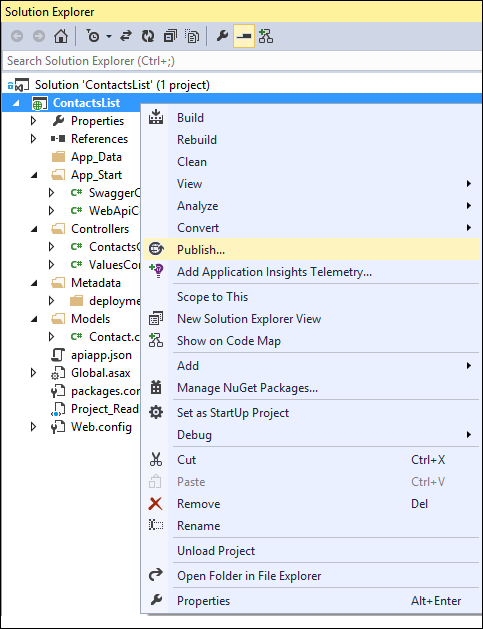

2. In the **Publish Web** dialog, select the Settings tab and verify that the **Debug** build configuration is selected. When finished, click **Publish** to push any changes to your Azure subscription.

	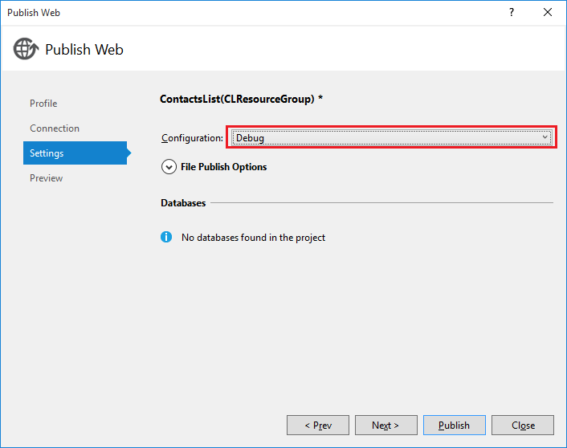

3. A browser window should open and display a message confirming that your API app has been successfully created.

4. In the browser address bar, add /swagger to the end of the URL and press &lt;Enter>. This will display the Swagger UI client.

	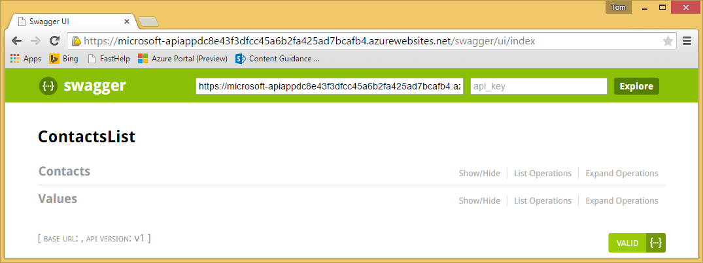

5. Return to Visual Studio, and from the **View** menu, select **Server Explorer**. 

6. In **Server Explorer**, expand the **Azure > App Service** node. 

7. Locate the resource group that you created when you deployed your API app. 

8. Under the resource group, right-click the node for your API app and select **Attach Debugger**. 

	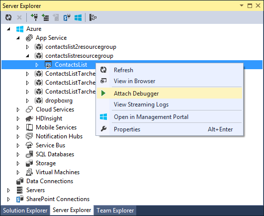

	The remote debugger will try to connect. In some cases, you may need to retry clicking **Attach Debugger** to establish a connection, so if it fails, try again.

	

9. After the connection is established, open the **ContactsController.cs** file in the API App project, and add breakpoints at the `Get` and `Post` methods. They may not appear as active at first, but if the remote debugger is attached, you're ready to debug. 

	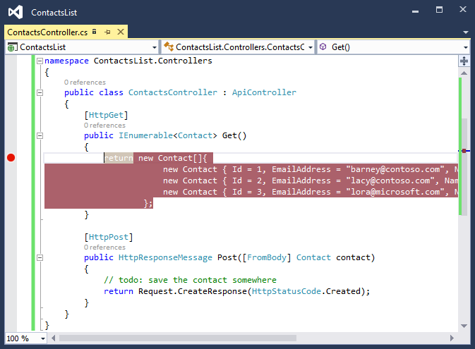

10. Return to the browser session, click the **Get** verb to display the schema for the *Contact* object, and then click **Try it Out**. If you set a breakpoint in the controller's **Get** method, Visual Studio will stop program execution, and you can debug your controller's logic. 

	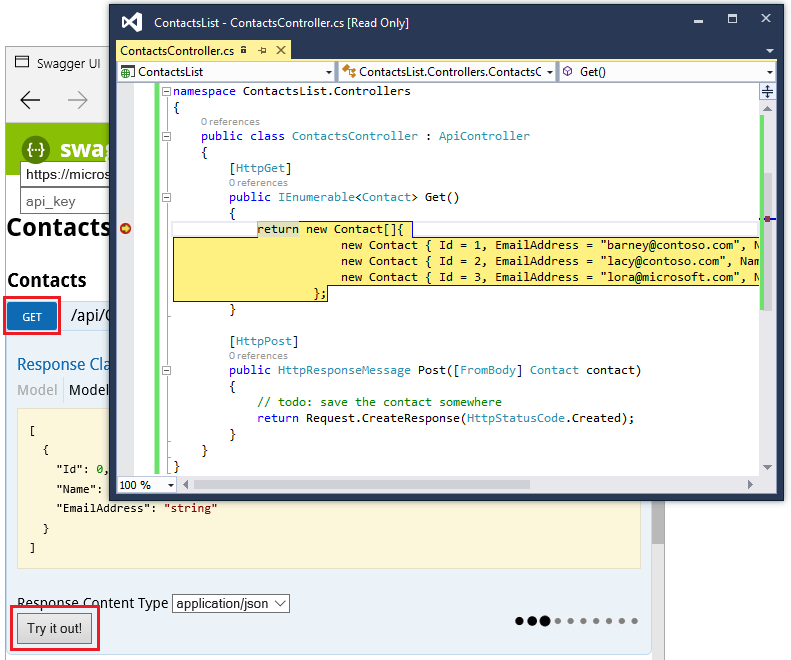

## Debug an API app locally 

There may be times when you want to debug your API app locally; for example, to avoid potentially slow round-trips during your test/debug cycle. The following steps illustrate how to debug your API app locally using the Swagger UI  as the test client.

1. In Visual Studio, open the API app project's *web.config* file. 
 
2. In your browser, navigate to the [Azure preview portal](https://portal.azure.com). 

3. Click the **Browse** button on the sidebar and select **API Apps**. 

	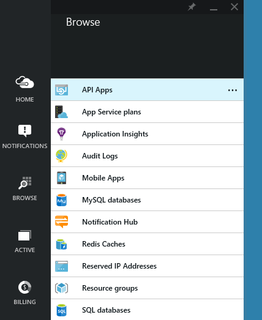

4. From the list of API apps in your subscription, select the API app you created.

	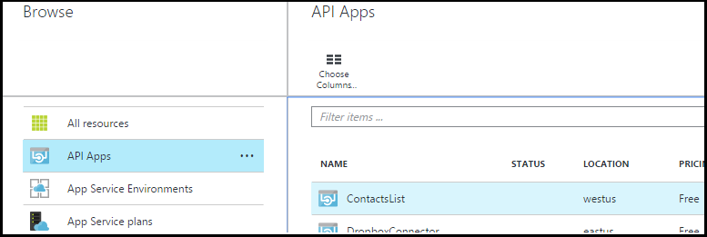

5. In the API app's blade, click the **API app host**.

	

6. In the API app host's blade, click **All Settings**.

	

7. In the **Settings** blade, click **Application settings**.

	

8. In the **Web app settings** blade, scroll down to the **App settings** section.

	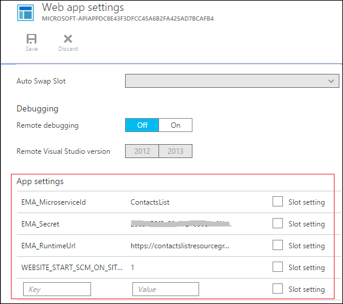

9. From **App settings**, locate each of the following values and add them to the *web.config* file's **appSettings** section.
	- **EMA\_MicroserviceId**
	- **EMA\_Secret**
	- **EMA\_RuntimeUrl**

	When done, the **appSettings** section of your *web.config* should resemble the following screenshot.

	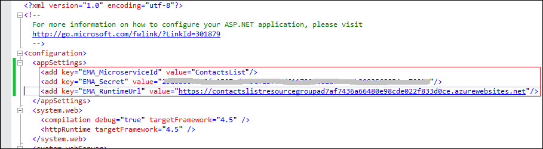

	**Note:** The *EMA_* values you added to your *web.config* file in this section contain sensitive authorization information. Therefore, it is recommended that you use caution when committing this file into a public source control medium (such as *github*) as these secrets will then be visible to others. See the article, [Best practices for deploying passwords and other sensitive data to ASP.NET and Azure App Service](http://www.asp.net/identity/overview/features-api/best-practices-for-deploying-passwords-and-other-sensitive-data-to-aspnet-and-azure) for more information.   

10. Place one or more breakpoints in your API app's controller code (in the `Get` and `Post` methods).

	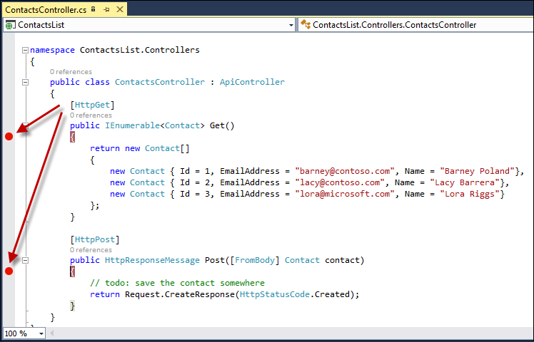

11. Press F5 to start a Visual Studio debugging session.
 
13.  If the API app's access level is set to **Public (anonymous)**, you can use the Swagger UI page to test.

	* When the browser loads the page, you see an error message. Add */swagger* to the end of the URL in your browser's address bar and press Enter.

	* Once the Swagger UI has loaded, click the **Get** verb on the browser window to display the schema for the Contact object, and then click **Try it Out**.

		Visual Studio will now stop program execution on the breakpoints you set earlier, and you can debug your controller's logic. 

		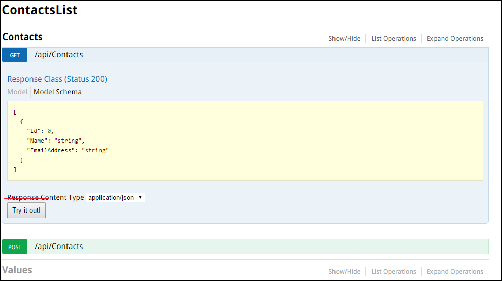

14.	If the API app's access level is set to **Public (authenticated)**, you'll need to authenticate and use a browser tool following the procedures shown in [Protect an API app](app-service-api-dotnet-add-authentication.md#use-postman-to-send-a-post-request) for a Post request, that is:

	* Go to the gateway login URL and enter credentials to log in.
	* Get the Zumo token value from the x-zumo-auth cookie.
	* Add an x-zumo-auth header to your request, and set its value to the x-zumo-auth cookie value.
	* Submit the request.

	**Note:** When you're running locally, Azure cannot control access to the API app to ensure that only authenticated users can execute its methods. When you run in Azure, all traffic intended for the API app is routed through the gateway, and the gateway doesn't pass on unauthenticated requests. There is no redirection when you run locally, which means that unauthenticated requests are not prevented from accessing the API app.  The value of authenticating as described above is that you can successfully execute authentication-related code in the API app, such as code that retrieves information about the logged-on user. For more information about how the gateway handles authentication for API apps, see [Authentication for API apps and mobile apps](../app-service/app-service-authentication-overview.md#azure-app-service-gateway).

## Next steps

Remote debugging for API Apps makes it easier to see how your code is running in Azure App Service. Rich diagnostic and debugging data is available right in the Visual Studio IDE for Azure API apps. 

App Service API apps are App Service web apps that have additional features for hosting web services, so you can use the same debugging and troubleshooting tools for API apps that you use for web apps.  For more information, see [Troubleshoot a web app in Azure App Service using Visual Studio](../app-service-web/web-sites-dotnet-troubleshoot-visual-studio.md). 

The API app you created in this series is publicly available for anyone to call. For information about how to protect API apps so that only authenticated users can call them, see [Authentication for API apps and mobile apps in Azure App Service](../app-service/app-service-authentication-overview.md).
 
