<properties
	pageTitle="Get started with Azure App Service and ASP.NET Web API 2 | Microsoft Azure"
	description="Learn how to create an ASP.NET Web API 2 project in Visual Studio and deploy it to a new API app in Azure App Service."
	services="app-service\api"
	documentationCenter=".net"
	authors="tdykstra"
	manager="wpickett"
	editor=""/>

<tags
	ms.service="app-service-api"
	ms.workload="web"
	ms.tgt_pltfrm="na"
	ms.devlang="dotnet"
	ms.topic="article"
	ms.date="04/13/2016"
	ms.author="rachelap"/>

# Get started with Azure App Service and ASP.NET Web API 2 using Visual Studio

## Overview

This tutorial shows how to deploy an ASP.NET Web API 2 application to an [API app](app-service-api-apps-why-best-platform.md)  in Azure App Service by using Visual Studio 2015. You'll create a Visual Studio project and deploy it to an API app, as shown in the diagram.

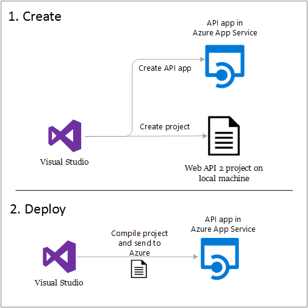

The tutorial assumes that you are an ASP.NET developer who has no prior experience with using Azure. On completing the tutorial, you'll have a simple Web API up and running in the cloud.

You'll learn:

* How to create a new App Service API app while you create a new Web API 2 project in Visual Studio.
* How to deploy a Web API 2 project to an App Service API app by using Visual Studio.
* How to use the [Azure Portal](/features/azure-portal/) to monitor and manage your API app.

At the end of the tutorial, a [Troubleshooting](#troubleshooting) section gives ideas on what to do if something doesn't work, and a [Next steps](#next-steps) section provides links to other tutorials that go into more depth about how to use Azure App Service.

## Prerequisites

### Azure account

You need an Azure account to complete the tutorial. You can:

* [Open an Azure account for free](/pricing/free-trial/?WT.mc_id=A261C142F). You get credits that can be used to try out paid Azure services. Even after the credits are used up, you can keep the account and use free Azure services and features.
* [Activate Visual Studio subscriber benefits](/pricing/member-offers/msdn-benefits-details/?WT.mc_id=A261C142F). Your MSDN subscription gives you credits every month that you can use for paid Azure services.

If you want to get started with Azure App Service before you sign up for an Azure account, go to [Try App Service](http://go.microsoft.com/fwlink/?LinkId=523751). There, you can immediately create a short-lived starter  app in App Service — no credit card required, and no commitments.

### Visual Studio 2015 with the Azure SDK for .NET

The tutorial is written for Visual Studio 2015 with the [Azure SDK for .NET](../dotnet-sdk.md) 2.8.2 or later. [Download the latest Azure SDK for Visual Studio 2015 here](http://go.microsoft.com/fwlink/?linkid=518003). Visual Studio is automatically installed with the SDK if you don't already have it.

If you have Visual Studio 2013, you can [download the latest Azure SDK for Visual Studio 2013](http://go.microsoft.com/fwlink/?LinkID=324322). Some screens may look different from the illustrations.

>[AZURE.NOTE] Depending on how many of the SDK dependencies you already have on your machine, installing the SDK could take a long time, from several minutes to a half hour or more.

### ASP.NET Web API 2

This tutorial is about using ASP.NET Web API 2 with Azure App Service; it doesn't teach how to develop an ASP.NET Web API. For an introduction to ASP.NET Web API 2, see [Getting Started with ASP.NET Web API 2](http://www.asp.net/web-api/overview/getting-started-with-aspnet-web-api/tutorial-your-first-web-api) on the [ASP.NET](http://asp.net/) site.

## Create a project and an API app in Azure App Service

Your first step is to create an ASP.NET Web API 2 project in Visual Studio and an API app in Azure App Service. When that's done, you deploy the project to the API app to make the Web API available on the Internet. 

1. Open Visual Studio 2015.

2. Click **File > New > Project**.

3. In the **New Project** dialog box, click **Visual C# > Web > ASP.NET Web Application**. (If you prefer, you can choose **Visual Basic**.)

3. Make sure that **.NET Framework 4.5.2** is selected as the target framework.

4.  [Azure Application Insights](../application-insights/app-insights-overview.md) monitors your API app for availability, performance, and usage. The **Add Application Insights to Project** check box is selected by default the first time you create a web project after installing Visual Studio. Clear the check box if it's selected but you don't want to try Application Insights.

4. Name the application **MyExample**.

5. Click **OK**.

	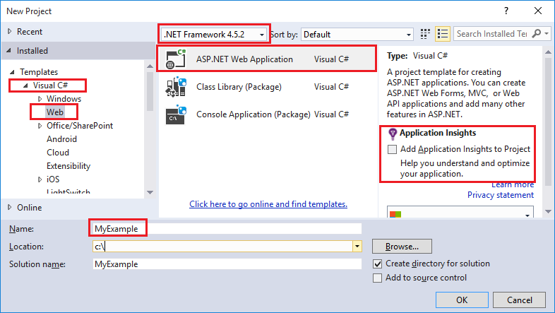

5. In the **New ASP.NET Project** dialog box, select the **Azure API App** template.

5. In the **Microsoft Azure** section of the **New ASP.NET Project** dialog box, make sure that **Host in the cloud** is selected and that **App Service** is selected in the drop-down list.

	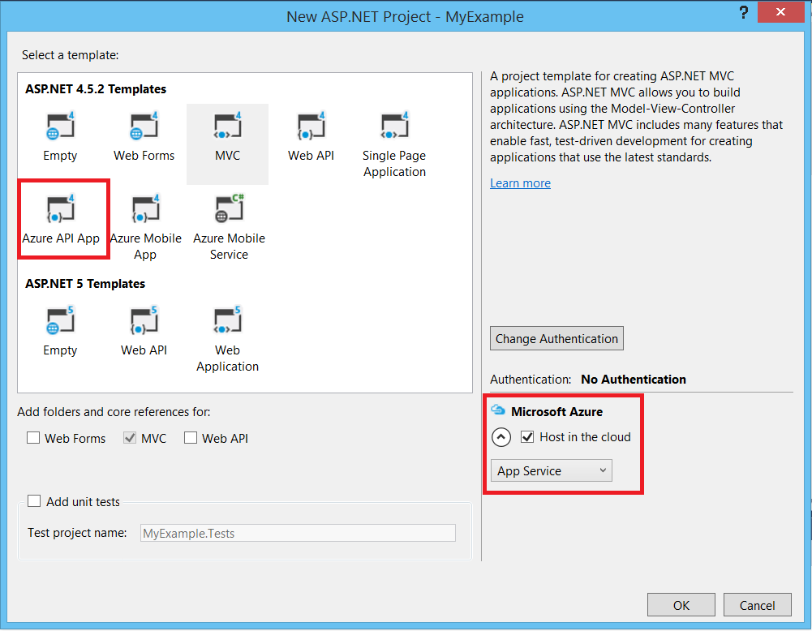

	These settings direct Visual Studio to create an Azure API app for your web project.

6. Click **OK**.

5. If you haven't already signed in to Azure, Visual Studio prompts you to do so. Sign in with the ID and password of the account that you use to manage your Azure subscription.

	When you're signed in, the **Create App Service** dialog box asks you what resources you want to create.

	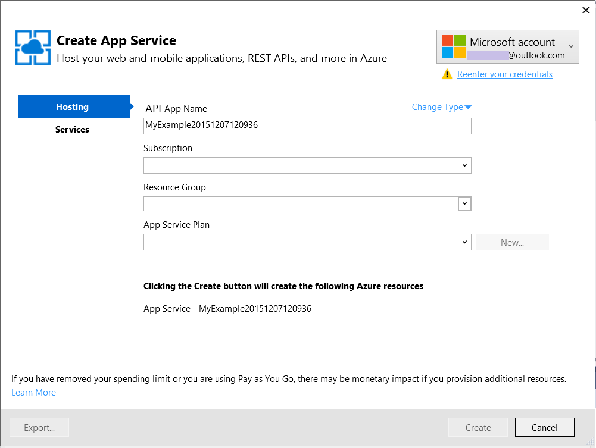

3. In the **Create App Service** dialog box, enter an **API App Name** that is unique in the *azurewebsites.net* domain. For example, you can name it MyExample with numbers to the right to make it unique, such as MyExample810. If a default name is created for you, it will be unique and you can use that.

	If someone else has already used the name that you enter, you see a red exclamation mark to the right instead of a green check mark, and you have to enter a different name.

	The base URL for your Web API is this name plus *.azurewebsites.net* (as shown next to the **Web App Name** text box). For example, if the name is `MyExample810`, the URL is `myexample810.azurewebsites.net`.

6. Next to the **Resource Group** box, click **New**, and then enter "MyExample" or another name if you prefer. 

	This combo box lets you select an existing resource group or create a new one by typing in a name that is different from any existing resource group in your subscription.

	A resource group is a collection of Azure resources such as API apps, databases, and VMs. For a tutorial, it's generally best to create a new resource group because that makes it easy to delete in one step any Azure resources that you create for the tutorial. For more information, see [Azure Resource Manager overview](../resource-group-overview.md).

4. Click the **New** button next to the **App Service Plan** drop-down.

	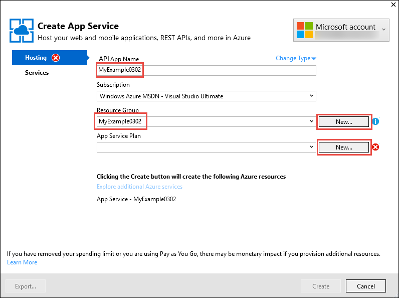

	The screen shot shows sample values for **Web App Name**, **Subscription**, and **Resource Group** -- your values will be different.

	In the following steps, you create an App Service plan for the new resource group. An App Service plan specifies the compute resources that your API app runs on. For example, if you choose the free tier, your API app runs on shared VMs, while for some paid tiers it runs on dedicated VMs. For more information, see [App Service plans overview](../app-service/azure-web-sites-web-hosting-plans-in-depth-overview.md).

5. In the **Configure App Service Plan** dialog, enter "MyExamplePlan" or another name if you prefer.

5. In the **Location** drop-down list, choose the location that is closest to you.

	This setting specifies which Azure datacenter your app will run in. For this tutorial, you can select any region and it won't make a noticeable difference. But for a production app, you want your server to be as close as possible to the clients that are accessing it, to minimize [latency](http://www.bing.com/search?q=web%20latency%20introduction&qs=n&form=QBRE&pq=web%20latency%20introduction&sc=1-24&sp=-1&sk=&cvid=eefff99dfc864d25a75a83740f1e0090).

5. In the **Size** drop-down, click **Free**.

	For this tutorial, The free pricing tier will provide sufficient performance.

6. In the **Configure App Service Plan** dialog, click **OK**.

	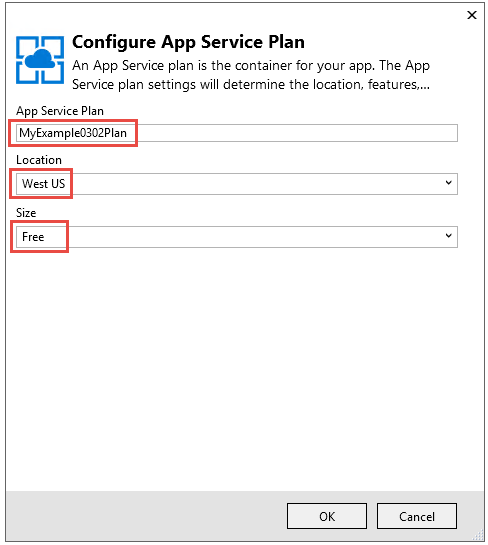

7. In the **Create App Service** dialog box, click **Create**.

	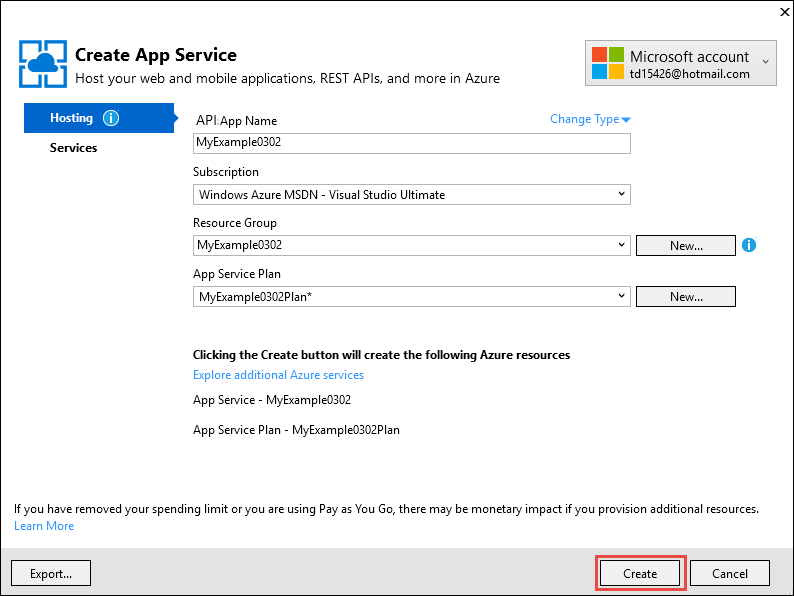

	In a short time, usually less than a minute, Visual Studio creates the web project and the API app.  

	The **Solution Explorer** window shows the files and folders in the new project.

	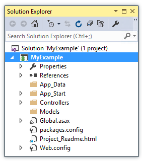

	The **Azure App Service Activity** window shows that the API app has been created. (Although the message might call it a web app.)

	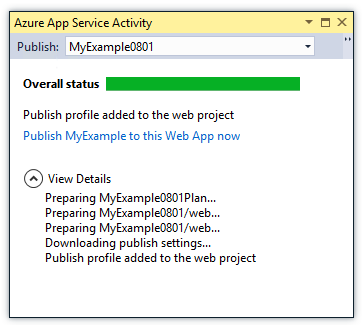

	And you can see the API app in the Visual Studio **Cloud Explorer** window.

	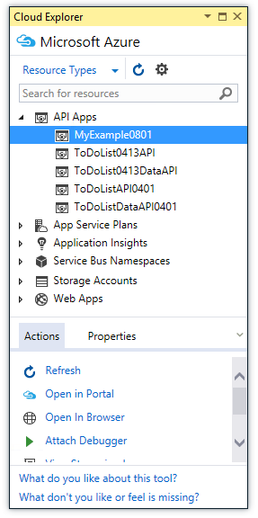
	
	This window lets you view and manage a wide range of Azure resources. You might see different resource types in your **Cloud Explorer** window than the ones in this example. Right-click a resource such as your API app to see the options you have for managing it.

## Deploy the Visual Studio project to the Azure API app

In this section, you deploy web project to the API app, as illustrated in step 2 of the diagram.

1. In **Solution Explorer**, right-click the project, and choose **Publish**.

	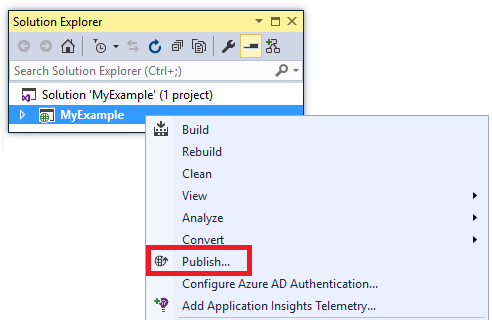

	In a few seconds, the **Publish Web** wizard appears. The wizard opens to a *publish profile* that has settings for deploying the project to the new API app. If you wanted to deploy to a different API app, you could click the **Profile** tab to create a different profile. For this tutorial, you accept the settings that deploy to the API app that you created earlier.

	The publish profile includes a user name and password for deployment. These credentials have been generated for you, and you don't have to enter or change them. The password is encrypted in a hidden user-specific file in the `Properties\PublishProfiles` folder.  

8. On the **Connection** tab of the **Publish Web** wizard, click **Next**.

	

	The next tab is the **Settings** tab (shown below). Here you can change the build configuration tab to deploy a debug build for [remote debugging](../app-service-web/web-sites-dotnet-troubleshoot-visual-studio.md#remotedebug). The tab also offers several **File Publish Options**:

	* Remove additional files at destination
	* Precompile during publishing
	* Exclude files from the App_Data folder

	For this tutorial you don't need any of these. For detailed explanations of what they do, see [How to: Deploy a Web Project Using One-Click Publish in Visual Studio](https://msdn.microsoft.com/library/dd465337.aspx).

10. On the **Settings** tab, click **Next**.

	

	The **Preview** tab (shown below) is next. Here you have an opportunity to see what files are going to be copied from your project to the API app. When you're deploying a project to an API app that you already deployed to earlier, only changed files are copied. If you want to see a list of what will be copied, you can click the **Start Preview** button.

11. On the **Preview** tab, click **Publish**.

	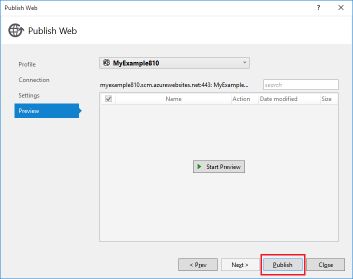

	When you click **Publish**, Visual Studio begins the process of copying the files to the Azure server. This may take a minute or two.

	The **Output** and **Azure App Service Activity** windows show what deployment actions were taken and report successful completion of the deployment.

	

	Upon successful deployment, the default browser automatically opens to the base URL of the deployed API app. The browser displays a page with a message that indicates "This web app has been successfully created". 

	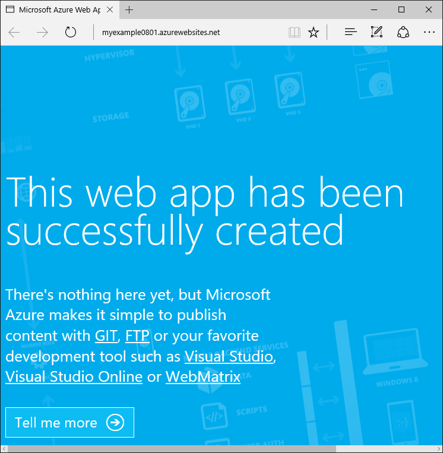

> [AZURE.TIP] You can enable the **Web One Click Publish** toolbar for quick deployment. Click **View > Toolbars**, and then select **Web One Click Publish**. You can use the toolbar to select a profile, click a button to publish, or click a button to open the **Publish Web** wizard.
> 

## Test the deployed Web API

1. Send an HTTP GET request to the URL *{your API app name}.azurewebsites.net/api/values*, using whichever HTTP client tool you prefer.

	The Web API project template defines a `Values` controller that returns an array of two strings in JSON format for a GET request. The following illustration shows a request sent by [Postman](http://www.getpostman.com/), with the JSON returned in the body of the response.

	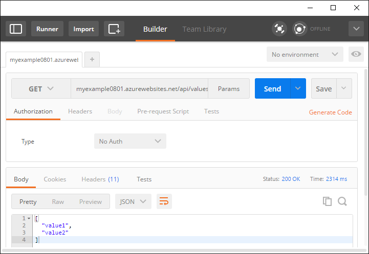

2. You can now make changes to the code, redeploy the project the same way as for initial deployment, and see your changes working in Azure in seconds.

##  Optional: Monitor and manage the API app in the Azure Portal

The [Azure portal](/services/management-portal/) is a web interface that you can use to manage and monitor your Azure services, such as the API app that you just created. In this section of the tutorial, you look at some of what you can do in the portal.

1. In your browser, go to [https://portal.azure.com](https://portal.azure.com), and sign in with the credentials you use for managing your Azure account.
	
2. Click **App Services**, and then click the name of your API app.

	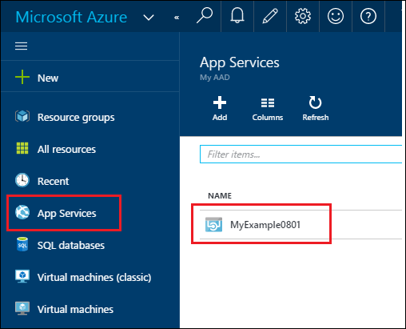

	The **API app** blade displays an overview of settings and usage statistics for your API app. (Windows that open to the right in the portal are called *blades*.)

	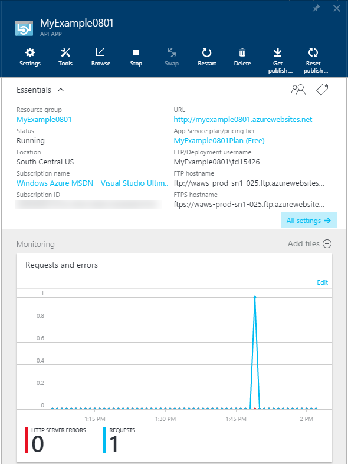

	Your API app hasn't had much traffic yet and may not show anything in the graph. If you make some more requests to your Web API and then refresh the portal page, you'll see some statistics show up.

3. The **Settings** blade shows more options for configuring your API app.

	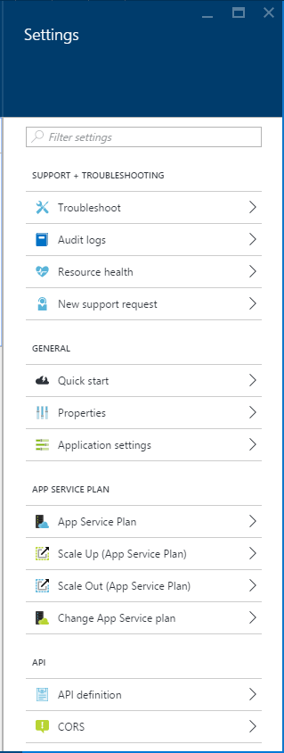

	The **API** section links to blades for configuring an API metadata endpoint and CORS. See the [Next steps](#next-steps) section for tutorials that introduce these features.

	Notice the **Deployment credentials** link in the **Publishing** section. That's where you can create a custom user name and password for deployment. Click the **Save** button at the top of the blade to submit your change. If you create a new user name and password, you have to enter the same values on the **Connection** tab of the **Publish Web** wizard in your web project.
	
	The screen shot is only a partial view of the **Settings** blade. There are more sections to this blade than are shown.

These are just a few of the Portal's features. You can create new API apps, delete existing API apps, stop and restart API apps, and manage other kinds of Azure services, such as databases and virtual machines.

## Optional: Delete the Azure API app

When you no longer need the API app that you created for this tutorial, you can delete it. 

An easy way to delete your API app is to click the **Delete** button at the top of its **API app** blade in the Azure portal. A better way is to delete the resource group that you created to contain the API app. For this tutorial, the resource group contains only the API app, but typically a resource group contains a collection of related resources. For instance, your API app might use a database or Azure storage account that is no longer needed when you delete the API app. When you delete a resource group, everything it contains is deleted. To delete a resource group by using the Azure portal, perform the following steps.

1. Go to the home page of [the Azure portal](https://portal.azure.com).

2. Click **Resource Groups**.

3. In the list of resource groups, click the resource group that you want to delete.

	When the **Resource Group** blade appears, it includes a list of the resources that it contains.

4. On the **Resource Group** blade, click **Delete**.

	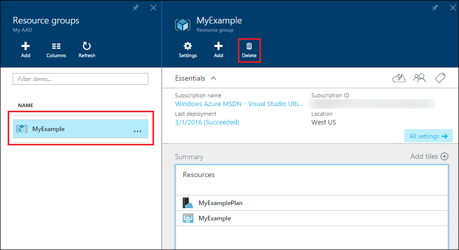

## Troubleshooting

If you run into a problem as you go through this tutorial, make sure that you're using the latest version of the Azure SDK for .NET. The easiest way to do that is to [download the Azure SDK for Visual Studio 2015](http://go.microsoft.com/fwlink/?linkid=518003) -- if you have the current version installed, the Web Platform Installer lets you know that no installation is needed.

If you're on a corporate network and are trying to deploy to Azure App Service through a firewall, make sure that ports 443 and 8172 are open for Web Deploy. If you can't open those ports, see the following Next steps section for other deployment options.

After you have your ASP.NET API app running in Azure App Service, you may want to learn more about Visual Studio features that simplify troubleshooting. For information about logging, remote debugging, and more, see  [Troubleshooting Azure API apps in Visual Studio](../app-service-web/web-sites-dotnet-troubleshoot-visual-studio.md).

## Next steps

In this tutorial, you've seen how to create a simple Web API and deploy it to an API app in Azure App Service. For an introduction to App Service features that make it easier to develop and consume Web APIs, see the tutorial series that starts with [Get started with API Apps and ASP.NET](app-service-api-dotnet-get-started.md).
