<properties
	pageTitle="Get started with API Apps and ASP.NET in App Service | Microsoft Azure"
	description="Learn how to create, deploy, and consume an ASP.NET API app in Azure App Service, by using Visual Studio 2015."
	services="app-service\api"
	documentationCenter=".net"
	authors="tdykstra"
	manager="wpickett"
	editor=""/>

<tags
	ms.service="app-service-api"
	ms.workload="na"
	ms.tgt_pltfrm="dotnet"
	ms.devlang="na"
	ms.topic="hero-article"
	ms.date="05/27/2016"
	ms.author="rachelap"/>

# Get started with API Apps, ASP.NET, and Swagger in Azure App Service

[AZURE.INCLUDE [selector](../../includes/app-service-api-get-started-selector.md)]

This is the first in a series of tutorials that show how to use features of Azure App Service that are helpful for developing and hosting RESTful APIs.  This tutorial covers support for API metadata in Swagger format.

You'll learn:

* How to create and deploy [API apps](app-service-api-apps-why-best-platform.md) in Azure App Service by using tools built into Visual Studio 2015.
* How to automate API discovery by using the Swashbuckle NuGet package to dynamically generate Swagger API metadata.
* How to use Swagger API metadata to automatically generate client code for an API app.

## Sample application overview

In this tutorial, you work with a simple to-do list sample application. The application has a single-page application (SPA) front end, an ASP.NET Web API middle tier, and an ASP.NET Web API data tier.

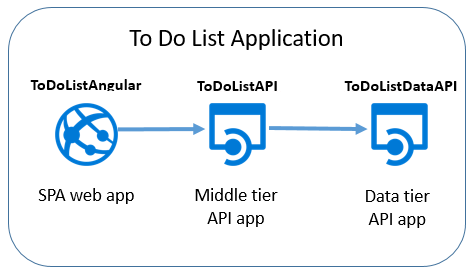

Here's a screen shot of the [AngularJS](https://angularjs.org/) front end.

The Visual Studio solution includes three projects:

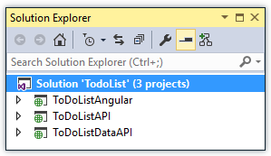

* **ToDoListAngular** - The front end: an AngularJS SPA that calls the middle tier. 

* **ToDoListAPI** - The middle tier: an ASP.NET Web API project that calls the data tier to perform CRUD operations on to-do items.

* **ToDoListDataAPI** - The data tier:  an ASP.NET Web API project that performs CRUD operations on to-do items. 

The three-tier architecture is one of many architectures that you can implement by using API Apps and is used here only for demonstration purposes. The code in each tier is as simple as possible to demonstrate API Apps features; for example, the data tier uses server memory rather than a database as its persistence mechanism.

On completing this tutorial, you'll have the two Web API projects up and running in the cloud in App Service API apps.

The next tutorial in the series deploys the SPA front end to the cloud.

## Prerequisites

* ASP.NET Web API - The tutorial instructions assume you have a basic knowledge of how to work with ASP.NET [Web API 2](http://www.asp.net/web-api/overview/getting-started-with-aspnet-web-api/tutorial-your-first-web-api) in Visual Studio.

* Azure account - You can [Open an Azure account for free](/pricing/free-trial/?WT.mc_id=A261C142F) or [Activate Visual Studio subscriber benefits](/pricing/member-offers/msdn-benefits-details/?WT.mc_id=A261C142F).

	If you want to get started with Azure App Service before you sign up for an Azure account, go to [Try App Service](http://go.microsoft.com/fwlink/?LinkId=523751). There, you can immediately create a short-lived starter app in App Service — no credit card required, and no commitments.

* Visual Studio 2015 with the [Azure SDK for .NET](http://go.microsoft.com/fwlink/?linkid=518003) - The SDK installs Visual Studio 2015 automatically if you don't already have it.

	>[AZURE.NOTE] Depending on how many of the SDK dependencies you already have on your machine, installing the SDK could take a long time, from several minutes to a half hour or more.

## Download the sample application 

1. Download the [Azure-Samples/app-service-api-dotnet-to-do-list](https://github.com/Azure-Samples/app-service-api-dotnet-todo-list) repository.

	You can click the **Download ZIP** button or clone the repository on your local machine. 

2. Open the ToDoList solution in Visual Studio 2015 or 2013.

2. Build the solution to restore the NuGet packages.

	If you want to see the application in operation before you deploy it, you can run it locally. Just make sure that all three projects are startup projects. You'll need to use Internet Explorer or Edge since those browsers permit cross-origin JavaScript calls to `http://localhost` URLs. 

## Use Swagger API metadata and UI

Support for [Swagger](http://swagger.io/) 2.0 API metadata is built into Azure App Service. Each API app can specify a URL endpoint that returns metadata for the API in Swagger JSON format. The metadata returned from that endpoint can be used to generate client code. 

An ASP.NET Web API project can dynamically generate Swagger metadata by using the [Swashbuckle](https://www.nuget.org/packages/Swashbuckle) NuGet package. The Swashbuckle NuGet package is already installed in the ToDoListDataAPI and ToDoListAPI projects that you downloaded.

In this section of the tutorial, you look at the generated Swagger 2.0 metadata, and then you try out a test UI that is based on the Swagger metadata.

2. Set the ToDoListDataAPI project (**not** the ToDoListAPI project) as the startup project. 
 
4. Press F5 or click **Debug > Start Debugging** to run the project in debug mode.

	The browser opens and shows the HTTP 403 error page.

12. In your browser address bar, add `swagger/docs/v1` to the end of the line, and then press Return. (The URL is `http://localhost:45914/swagger/docs/v1`.)

	This is the default URL used by Swashbuckle to return Swagger 2.0 JSON metadata for the API. 

	If you're using Internet Explorer, the browser prompts you to download a *v1.json* file.

	

	If you're using Chrome, Firefox, or Edge, the browser displays the JSON in the browser window. Different browsers handle JSON differently, and your browser window may not look exactly like the example.

	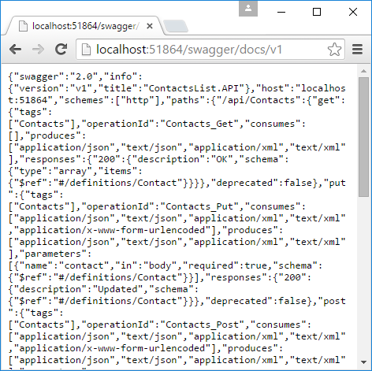

	The following sample shows the first section of the Swagger metadata for the API, with the definition for the Get method. This metadata is what drives the Swagger UI that you use in the following steps, and you use it in a later section of the tutorial to automatically generate client code.

		{
		  "swagger": "2.0",
		  "info": {
		    "version": "v1",
		    "title": "ToDoListDataAPI"
		  },
		  "host": "localhost:45914",
		  "schemes": [ "http" ],
		  "paths": {
		    "/api/ToDoList": {
		      "get": {
		        "tags": [ "ToDoList" ],
		        "operationId": "ToDoList_GetByOwner",
		        "consumes": [ ],
		        "produces": [ "application/json", "text/json", "application/xml", "text/xml" ],
		        "parameters": [
		          {
		            "name": "owner",
		            "in": "query",
		            "required": true,
		            "type": "string"
		          }
		        ],
		        "responses": {
		          "200": {
		            "description": "OK",
		            "schema": {
		              "type": "array",
		              "items": { "$ref": "#/definitions/ToDoItem" }
		            }
		          }
		        },
		        "deprecated": false
		      },

1. Close the browser and stop Visual Studio debugging.

3. In the ToDoListDataAPI project in **Solution Explorer**, open the *App_Start\SwaggerConfig.cs* file, then scroll down to the following code and uncomment it.

		/*
		    })
		.EnableSwaggerUi(c =>
		    {
		*/

	The *SwaggerConfig.cs* file is created when you install the Swashbuckle package in a project. The file provides a number of ways to configure Swashbuckle.

	The code you've uncommented enables the Swagger UI that you use in the following steps. When you create a Web API project by using the API app project template, this code is commented out by default as a security measure.

5. Run the project again.

3. In your browser address bar, add `swagger` to the end of the line, and then press Return. (The URL is `http://localhost:45914/swagger`.)

4. When the Swagger UI page appears, click **ToDoList** to see the methods available.

	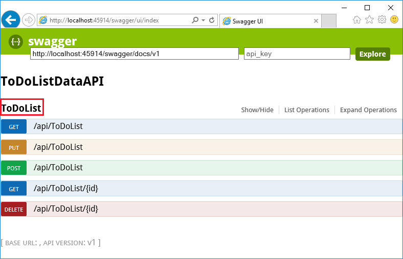

5. Click the first **Get** button in the list.

6. In the **Parameters** section, enter an asterisk as the value of the `owner` parameter, and then click **Try it out**.

	When you add authentication in later tutorials, the middle tier will provide the actual user ID to the data tier. For now, all tasks will have asterisk as their owner ID while the application runs without authentication enabled.

	

	The Swagger UI calls the ToDoList Get method and displays the response code and JSON results.

	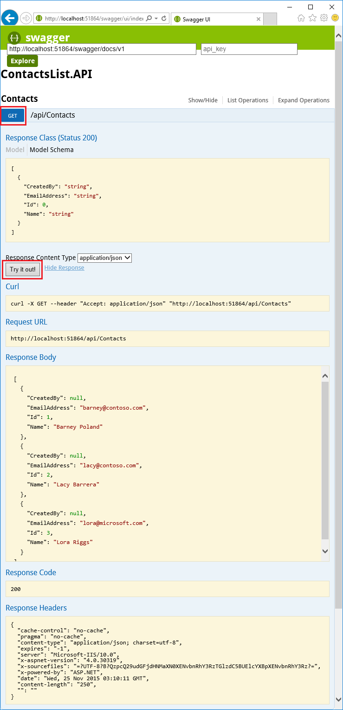

6. Click **Post**, and then click the box under **Model Schema**.

	Clicking the model schema prefills the input box where you can specify the parameter value for the Post method. (If this doesn't work in Internet Explorer, use a different browser or enter the parameter value manually in the next step.)  

	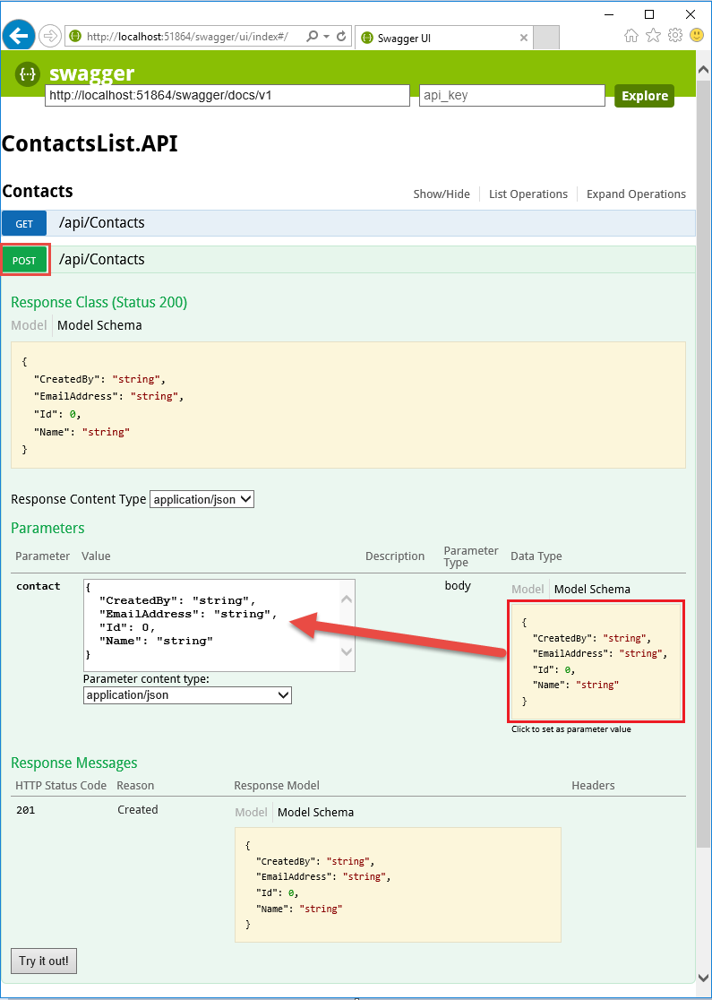

7. Change the JSON in the `todo` parameter input box so that it looks like the following example, or substitute your own description text:

		{
		  "ID": 2,
		  "Description": "buy the dog a toy",
		  "Owner": "*"
		}

10. Click **Try it out**.

	The ToDoList API returns an HTTP 204 response code that indicates success.

11. Click the first **Get** button, and then in that section of the page click the **Try it out** button.

	The Get method response now includes the new to do item. 

12. Optional: Try also the Put, Delete, and Get by ID methods.

14. Close the browser and stop Visual Studio debugging.

Swashbuckle works with any ASP.NET Web API project. If you want to add Swagger metadata generation to an existing project, just install the Swashbuckle package. 

**Note:** Swagger metadata includes a unique ID for each API operation. By default, Swashbuckle may generate duplicate Swagger operation IDs for your Web API controller methods. This happens if your controller has overloaded HTTP methods, such as `Get()` and `Get(id)`. For information about how to handle overloads, see [Customize Swashbuckle-generated API definitions](app-service-api-dotnet-swashbuckle-customize.md). If you create a Web API project in Visual Studio by using the Azure API App template, code that generates unique operation IDs is automatically added to the *SwaggerConfig.cs* file.  

##  Create an API app in Azure and deploy code to it

In this section, you use Azure tools that are integrated into the Visual Studio **Publish Web** wizard to create a new API app in Azure. Then you deploy the ToDoListDataAPI project to the new API app and call the API by running the Swagger UI.

1. In **Solution Explorer**, right-click the ToDoListDataAPI project, and then click **Publish**.

	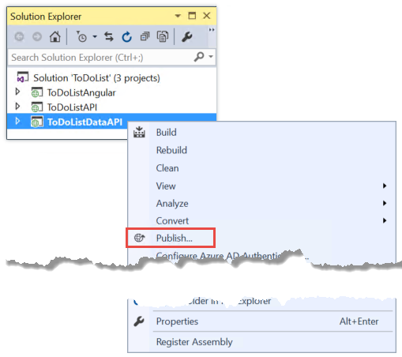

3.  In the **Profile** step of the **Publish Web** wizard, click **Microsoft Azure App Service**.

	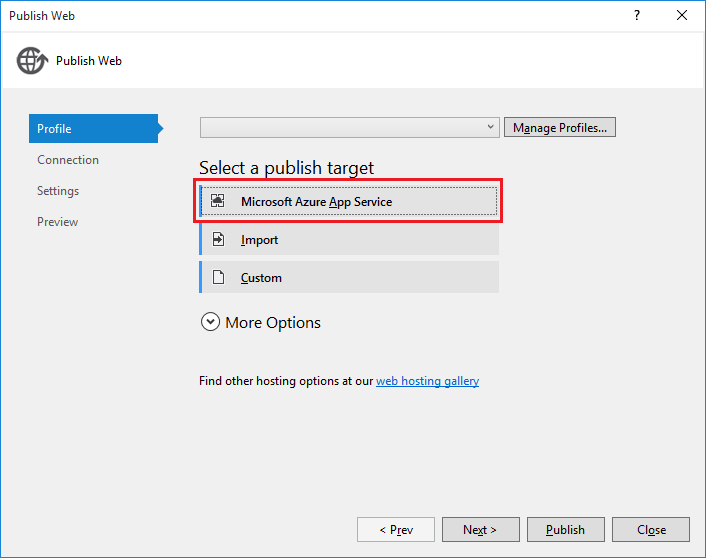

4. Sign in to your Azure account if you have not already done so, or refresh your credentials if they're expired.

4. In the App Service dialog box, choose the Azure **Subscription** you want to use, and then click **New**.

	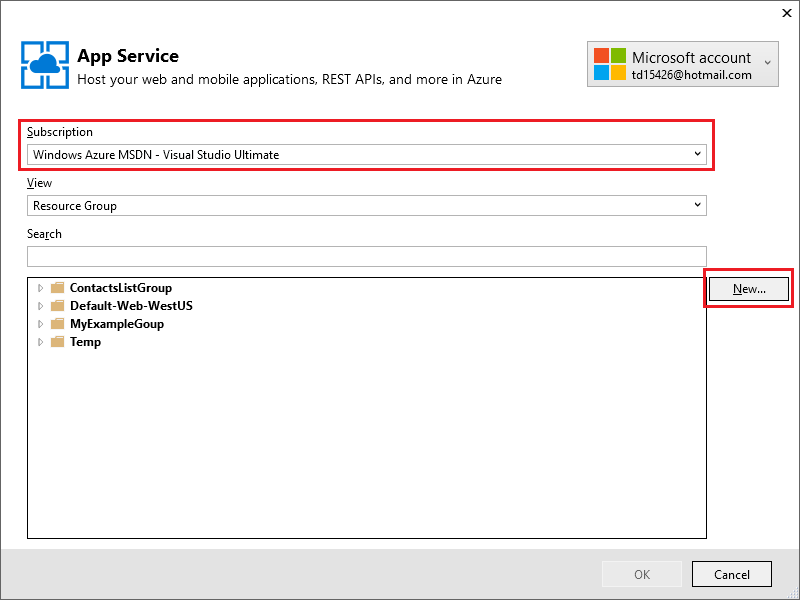

	The **Hosting** tab of the **Create App Service** dialog box appears.

	Because you're deploying a Web API project that has Swashbuckle installed, Visual Studio assumes that you want to create an API App. This is indicated by the **API App Name** title and by the fact that the **Change Type** drop-down list is set to **API App**.

	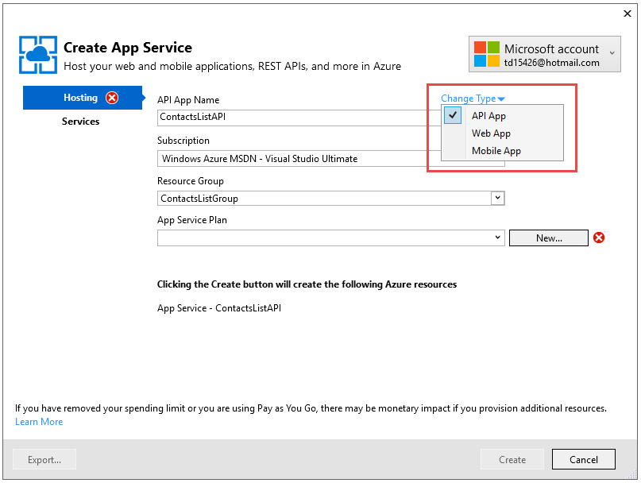

4. Enter an **API App Name** that is unique in the *azurewebsites.net* domain. You can accept the default name that Visual Studio proposes.

	If you enter a name that someone else has already used, you see a red exclamation mark to the right.

	The URL of the API app will be `{API app name}.azurewebsites.net`.

6. In the **Resource Group** drop-down, click **New**, and then enter "ToDoListGroup" or another name if you prefer. 

	A resource group is a collection of Azure resources such as API apps, databases, VMs, and so forth.	For this tutorial, it's best to create a new resource group because that makes it easy to delete in one step all the Azure resources that you create for the tutorial.

	This box lets you select an existing [resource group](../resource-group-overview.md) or create a new one by typing in a name that is different from any existing resource group in your subscription.

4. Click the **New** button next to the **App Service Plan** drop-down.

	The screen shot shows sample values for **API App Name**, **Subscription**, and **Resource Group** -- your values will be different.

	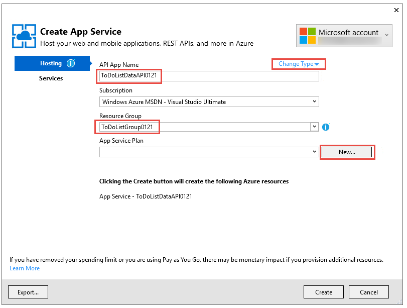

	In the following steps you create an App Service plan for the new resource group. An App Service plan specifies the compute resources that your API app runs on. For example, if you choose the free tier, your API app runs on shared VMs, while for some paid tiers it runs on dedicated VMs. For information about App Service plans, see [App Service plans overview](../app-service/azure-web-sites-web-hosting-plans-in-depth-overview.md).

5. In the **Configure App Service Plan** dialog, enter "ToDoListPlan" or another name if you prefer.

5. In the **Location** drop-down list, choose the location that is closest to you.

	This setting specifies which Azure datacenter your app will run in. Choose a location close to you to minimize [latency](http://www.bing.com/search?q=web%20latency%20introduction&qs=n&form=QBRE&pq=web%20latency%20introduction&sc=1-24&sp=-1&sk=&cvid=eefff99dfc864d25a75a83740f1e0090).

5. In the **Size** drop-down, click **Free**.

	For this tutorial, the free pricing tier will provide sufficient performance.

6. In the **Configure App Service Plan** dialog, click **OK**.

	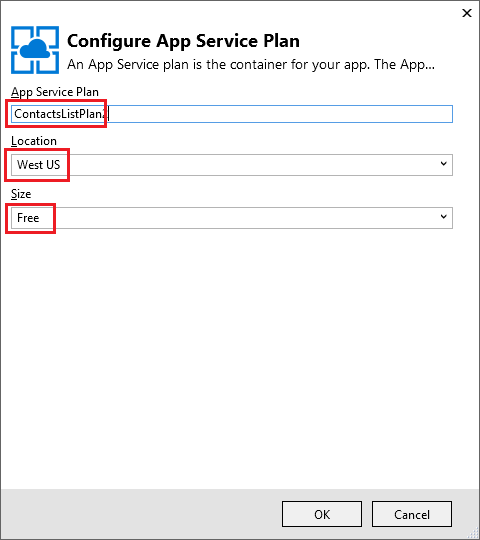

7. In the **Create App Service** dialog box, click **Create**.

	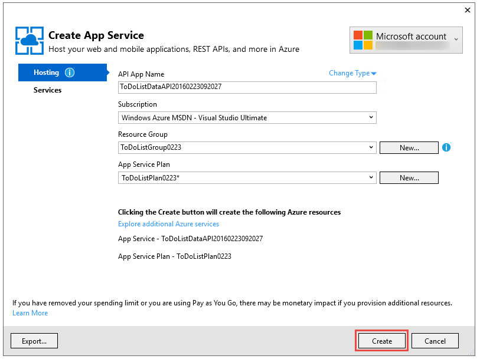

	Visual Studio creates the API app and a publish profile that has all of the required settings for the API app. Then it opens the **Publish Web** wizard, which you'll use to deploy the project.

	The **Publish Web** wizard opens on the **Connection** tab (shown below). 

	On the **Connection** tab, the **Server** and **Site name** settings point to your API app. The **User name** and **Password** are deployment credentials that Azure creates for you. After deployment, Visual Studio opens a browser to the **Destination URL** (that's the only purpose for **Destination URL**).  

8. Click **Next**. 

	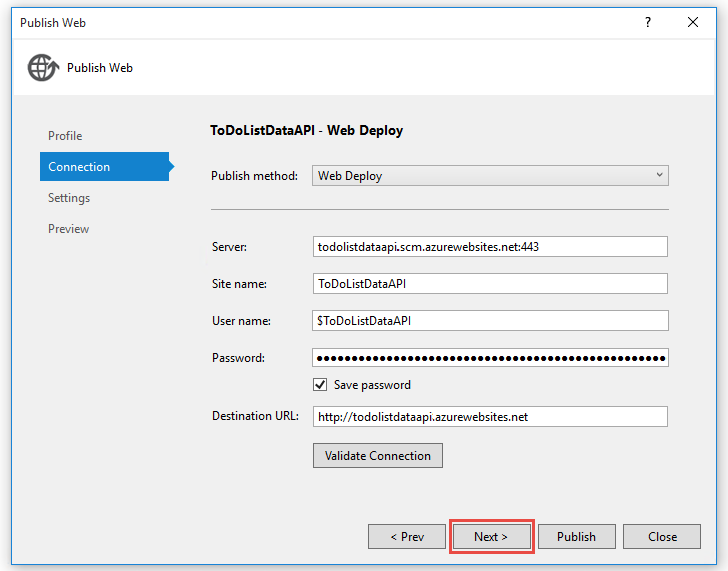

	The next tab is the **Settings** tab (shown below). Here you can change the build configuration tab to deploy a debug build for [remote debugging](../app-service-web/web-sites-dotnet-troubleshoot-visual-studio.md#remotedebug). The tab also offers several **File Publish Options**:

	* Remove additional files at destination
	* Precompile during publishing
	* Exclude files from the App_Data folder

	For this tutorial you don't need any of these. For detailed explanations of what they do, see [How to: Deploy a Web Project Using One-Click Publish in Visual Studio](https://msdn.microsoft.com/library/dd465337.aspx).

14. Click **Next**.

	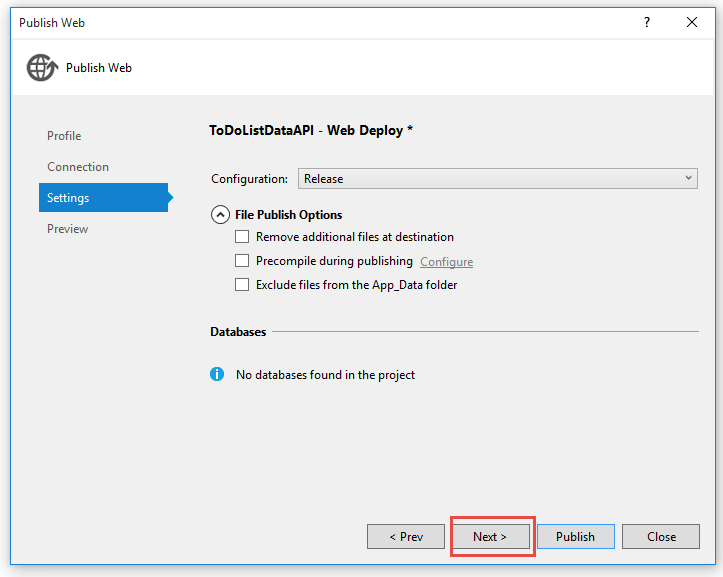

	Next is the **Preview** tab (shown below), which gives you an opportunity to see what files are going to be copied from your project to the API app. When you're deploying a project to an API app that you already deployed to earlier, only changed files are copied. If you want to see a list of what will be copied, you can click the **Start Preview** button.

15. Click **Publish**.

	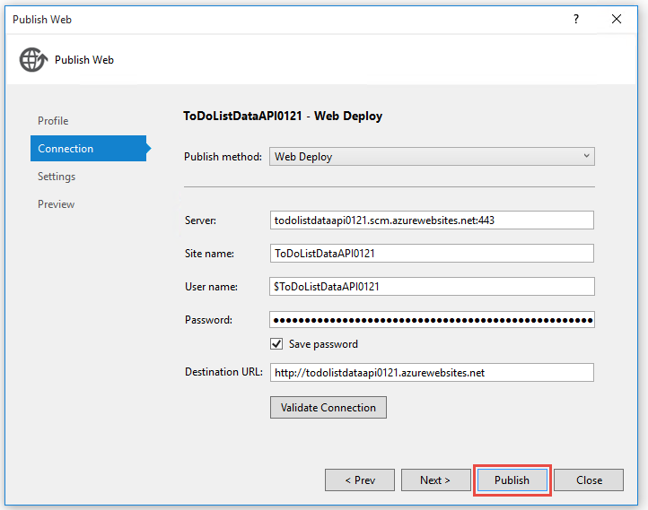

	Visual Studio deploys the ToDoListDataAPI project to the new API app. The **Output** window logs successful deployment, and a "successfully created" page appears in a browser window opened to the URL of the API app.

	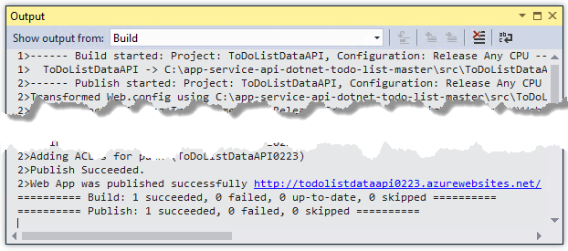

	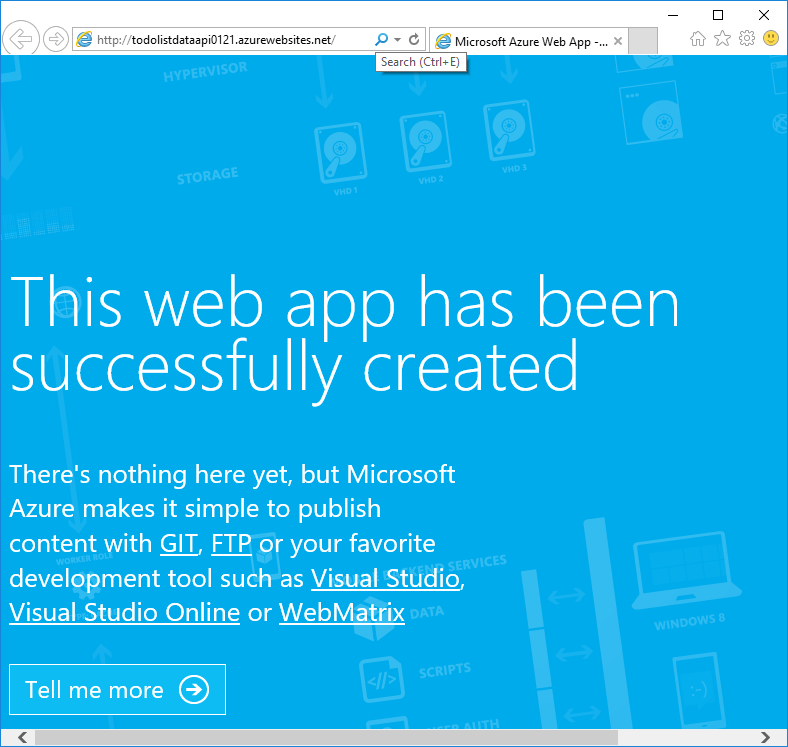

11. Add "swagger" to the URL in the browser's address bar, and then press Enter. (The URL is `http://{apiappname}.azurewebsites.net/swagger`.)

	The browser displays the same Swagger UI that you saw earlier, but now it's running in the cloud. Try out the Get method, and you see that you're back to the default 2 to-do items. The changes you made earlier were saved in memory in the local machine.

12. Open the [Azure portal](https://portal.azure.com/).

	The Azure portal is a web interface for managing Azure resources such as API apps.
 
14. Click **Browse > App Services**.

	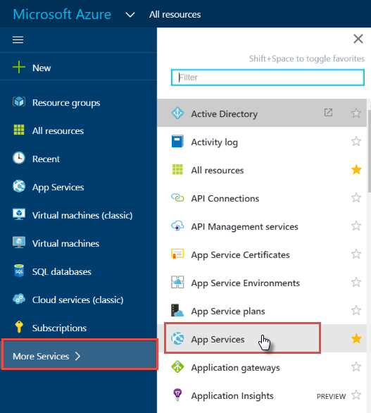

15. In the **App Services** blade, find and click your new API app. (In the Azure portal, windows that open to the right are called *blades*.)

	

	Two blades open. One blade has an overview of the API app, and one has a long list of settings that you can view and change.

16. In the **Settings** blade, find the **API** section and click **API Definition**. 

	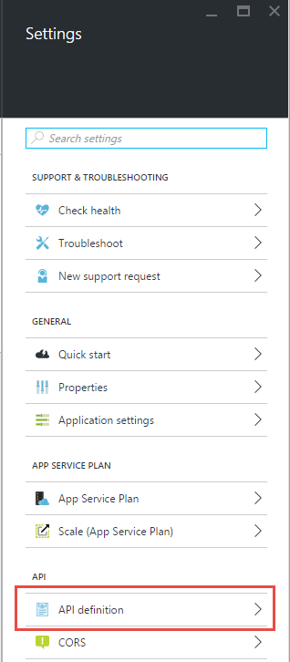

	The **API Definition** blade lets you specify the URL that returns Swagger 2.0 metadata in JSON format. When Visual Studio creates the API app, it sets the API definition URL to the default value for Swashbuckle-generated metadata that you saw earlier, which is the API app's base URL plus `/swagger/docs/v1`. 

	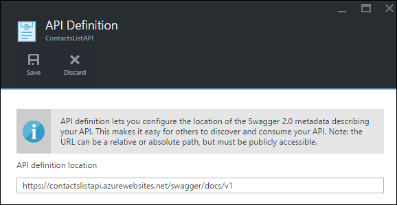

	When you select an API app to generate client code for it, Visual Studio retrieves the metadata from this URL. 

##  Generate client code for the data tier

One of the advantages of integrating Swagger into Azure API apps is automatic code generation. Generated client classes make it easier to write code that calls an API app.

The ToDoListAPI project already has the generated client code, but in the following steps you'll delete it and regenerate it to see how to do the code generation.

1. In Visual Studio **Solution Explorer**, in the ToDoListAPI project, delete the *ToDoListDataAPI* folder. **Caution: Delete only the folder, not the ToDoListDataAPI project.**

	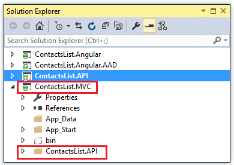

	This folder was created by using the code generation process that you're about to go through.

2. Right-click the ToDoListAPI project, and then click **Add > REST API Client**.

	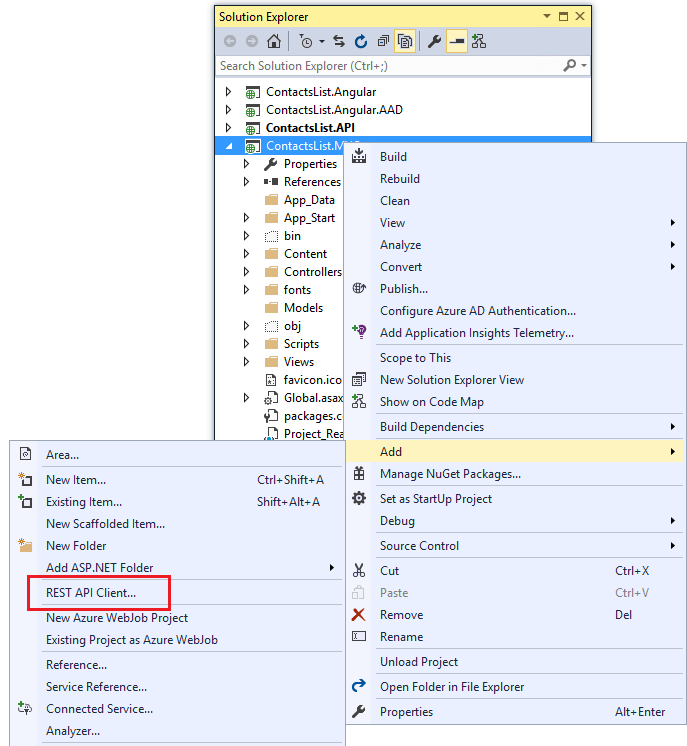

3. In the **Add REST API Client** dialog box, click **Swagger URL**, and then click **Select Azure Asset**.

	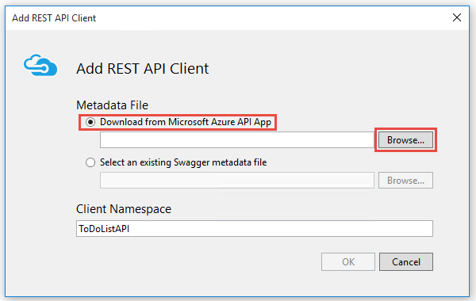

8. In the **App Service** dialog box, expand the resource group you're using for this tutorial and select your API app, and then click **OK**.

	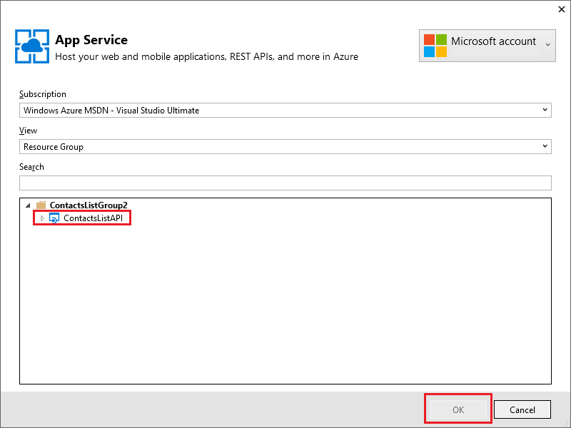

	Notice that when you return to the **Add REST API Client** dialog, the text box has been filled in with the API definition URL value that you saw earlier in the portal. 

	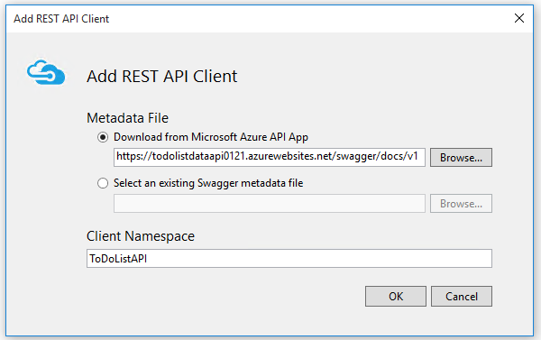

	>[AZURE.TIP] An alternative way to get metadata for code generation is to enter the URL directly instead of going through the browse dialog. Or if you want to generate client code before deploying to Azure, you could run the Web API project locally, go to the URL that provides the Swagger JSON file, save the file, and use the **Select an existing Swagger metadata file** option.

9. In the **Add REST API Client** dialog box, click **OK**.

	Visual Studio creates a folder named after the API app and generates client classes.

	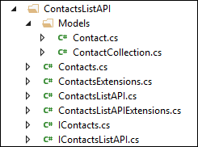

5. In the ToDoListAPI project, open *Controllers\ToDoListController.cs* to see the code that calls the API by using the generated client. 

	The following snippet shows how the code instantiates the client object and calls the Get method.

		private static ToDoListDataAPI NewDataAPIClient()
		{
		    var client = new ToDoListDataAPI(new Uri(ConfigurationManager.AppSettings["toDoListDataAPIURL"]));
		    return client;
		}
		
		public async Task<IEnumerable<ToDoItem>> Get()
		{
		    using (var client = NewDataAPIClient())
		    {
		        var results = await client.ToDoList.GetByOwnerAsync(owner);
		        return results.Select(m => new ToDoItem
		        {
		            Description = m.Description,
		            ID = (int)m.ID,
		            Owner = m.Owner
		        });
		    }
		}

	The constructor parameter gets the endpoint URL from  the `toDoListDataAPIURL` app setting. In the Web.config file, that value is set to the local IIS Express URL of the API project so that you can run the application locally. If you omit the constructor parameter, the default endpoint is the URL that you generated the code from.

6. Your client class will be generated with a different name based on your API app name; change the code in *Controllers\ToDoListController.cs* so that the type name matches what was generated in your project. For example, if you named your API App ToDoListDataAPI071316, you would change this code:

		private static ToDoListDataAPI NewDataAPIClient()
		{
		    var client = new ToDoListDataAPI(new Uri(ConfigurationManager.AppSettings["toDoListDataAPIURL"]));

to this:

		private static ToDoListDataAPI071316 NewDataAPIClient()
		{
		    var client = new ToDoListDataAPI071316(new Uri(ConfigurationManager.AppSettings["toDoListDataAPIURL"]));

## Create an API app to host the middle tier

Earlier you [created the data tier API app and deployed code to it](#createapiapp).  Now you follow the same procedure for the middle tier API app. 

1. In **Solution Explorer**, right-click the middle tier ToDoListAPI  project (not the data tier ToDoListDataAPI), and then click **Publish**.

	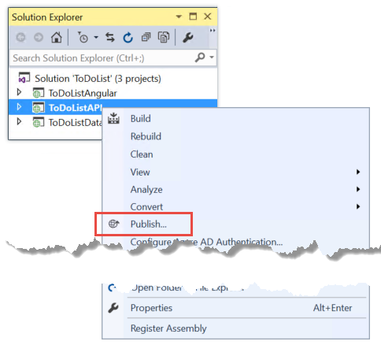

3.  In the **Profile** tab of the **Publish Web** wizard, click **Microsoft Azure App Service**.

5. In the **App Service** dialog box, click **New**.

3. In the **Hosting** tab of the **Create App Service** dialog box, accept the default **API App Name** or enter a name that is unique in the *azurewebsites.net* domain. 

5. Choose the Azure **Subscription** you have been using.

6. In the **Resource Group** drop-down, choose the same resource group you created earlier.

4. In the **App Service Plan** drop-down, choose the same plan you created earlier. It will default to that value. 

7. Click **Create**.

	Visual Studio creates the API app, creates a publish profile for it, and displays the **Connection** step of the **Publish Web** wizard.

3.  In the **Connection** step of the **Publish Web** wizard, click **Publish**.

	Visual Studio deploys the ToDoListAPI project to the new API app and opens a browser to the URL of the API app. The "successfully created" page appears.

## Configure the middle tier to call the data tier

If you called the middle tier API app now, it would try to call the data tier using the localhost URL that is still in the Web.config file. In this section you enter the data tier API app URL into an environment setting in the middle tier API app. When the code in the middle tier API app retrieves the data tier URL setting, the environment setting will override what's in the Web.config file. 
 
1. Go to the [Azure portal](https://portal.azure.com/), and then navigate to the **API App** blade for the API app that you created to host the TodoListAPI (middle tier) project.

2. In the API App's **Settings** blade, click **Application settings**.
 
4. In the API App's **Application Settings** blade, scroll down to the **App settings** section and add the following key and value:

	| **Key** | toDoListDataAPIURL |
	|---|---|
	| **Value** | https://{your data tier API app name}.azurewebsites.net |
	| **Example** | https://todolistdataapi.azurewebsites.net |

4. Click **Save**.

	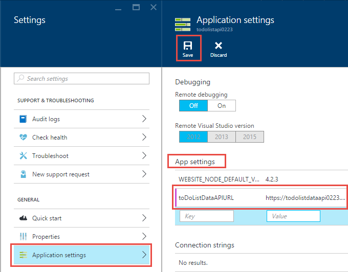

	When the code runs in Azure, this value will now override the localhost URL that is in the Web.config file. 

## Test

11. In a browser window, browse to the URL of the new middle tier API app that you just created for ToDoListAPI. You can get there by clicking the URL in the API app's main blade in the portal.

13. Add "swagger" to the URL in the browser's address bar, and then press Enter. (The URL is `http://{apiappname}.azurewebsites.net/swagger`.)

	The browser displays the same Swagger UI that you saw earlier for ToDoListDataAPI, but now `owner` is not a required field for the Get operation, because the middle tier API app is sending that value to the data tier API app for you. (When you do the authentication tutorials, the middle tier will send actual user IDs for the `owner` parameter; for now it is hard-coding an asterisk.)

12. Try out the Get method and the other methods to validate that the middle tier API app is successfully calling the data tier API app.

	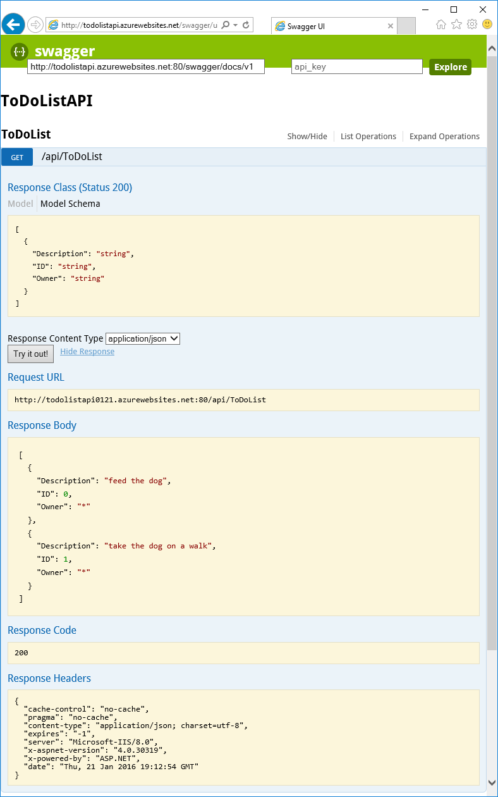

## Troubleshooting

In case you run into a problem as you go through this tutorial here are some troubleshooting ideas:

* Make sure that you're using the latest version of the [Azure SDK for .NET](http://go.microsoft.com/fwlink/?linkid=518003).

* Two of the project names are similar (ToDoListAPI, ToDoListDataAPI). If things don't look as described in the instructions when you are working with a project, make sure you have opened the correct project.

* If you're on a corporate network and are trying to deploy to Azure App Service through a firewall, make sure that ports 443 and 8172 are open for Web Deploy. If you can't open those ports, you can use other deployment methods.  See [Deploy your app to Azure App Service](../app-service-web/web-sites-deploy.md).

* "Route names must be unique" errors -- you could get these if you accidentally deploy the wrong project to an API app and then later deploy the correct one to it. To correct this, redeploy the correct project to the API app, and on the **Settings** tab of the **Publish Web** wizard select **Remove additional files at destination**.

After you have your ASP.NET API app running in Azure App Service, you may want to learn more about Visual Studio features that simplify troubleshooting. For information about logging, remote debugging, and more, see  [Troubleshooting Azure App Service apps in Visual Studio](../app-service-web/web-sites-dotnet-troubleshoot-visual-studio.md).

## Next steps

You've seen how to deploy existing Web API projects to API apps, generate client code for API apps, and consume API apps from .NET clients. The next tutorial in this series shows how to [use CORS to consume API apps from JavaScript clients](app-service-api-cors-consume-javascript.md).
 
For more information about client code generation, see the [Azure/AutoRest](https://github.com/azure/autorest) repository on GitHub.com. For help with problems using the generated client, open an [issue in the AutoRest repository](https://github.com/azure/autorest/issues).

If you want to create new API app projects from scratch, use the **Azure API App** template.

The **Azure API App** project template is equivalent to choosing the **Empty** ASP.NET 4.5.2 template, clicking the check box to add Web API support, and installing the Swashbuckle NuGet package. In addition, the template adds some Swashbuckle configuration code designed to prevent the creation of duplicate Swagger operation IDs. Once you've created an API App project, you can deploy it to an API app the same way you saw in this tutorial.
