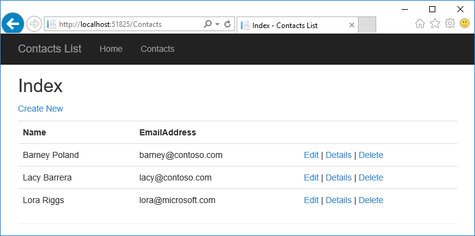
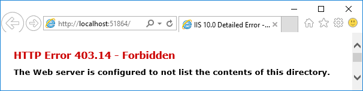
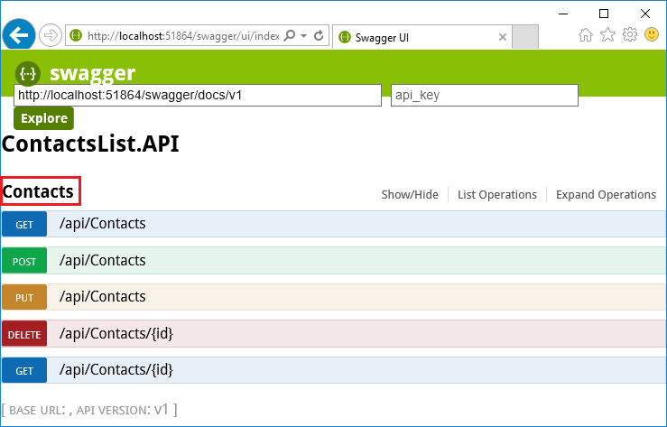
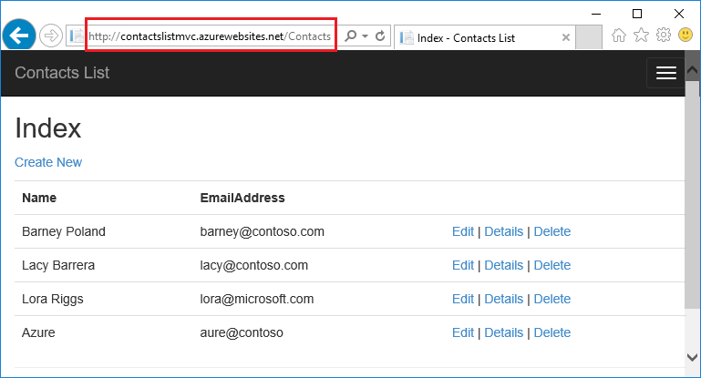

<properties
	pageTitle="Get started with API Apps and ASP.NET in Azure App Service | Microsoft Azure"
	description="Learn how to create, deploy, and consume an ASP.NET API app in Azure App Service, by using Visual Studio 2015."
	services="app-service\api"
	documentationCenter=".net"
	authors="tdykstra"
	manager="wpickett"
	editor=""/>

<tags
	ms.service="app-service-api"
	ms.workload="na"
	ms.tgt_pltfrm="dotnet"
	ms.devlang="na"
	ms.topic="hero-article"
	ms.date="11/25/2015"
	ms.author="tdykstra"/>

# Get started with API Apps and ASP.NET in Azure App Service

[AZURE.INCLUDE [app-service-api-get-started-selector](../../includes/app-service-api-get-started-selector.md)]

## Overview

In this tutorial, you create an [App Service API app](app-service-api-apps-why-best-platform.md), deploy an ASP.NET Web API to the API app, and consume the API app from an ASP.NET MVC client. The tutorial assumes that you are familiar with ASP.NET but have no prior experience with Microsoft Azure. On completing the tutorial, you'll have a Web API and client application up and running in the cloud.

The sample application is a simple contacts list. The following illustration shows how the MVC app displays data received from the API.

## What you'll learn

Three features of Azure App service are particularly helpful for developing and hosting APIs:

* Integrated support for API metadata
* CORS support
* Authentication and authorization support
 
This is the first tutorial in a series that introduces these features. This tutorial focuses on API metadata, the second focuses on CORS, and the third and fourth focus on authentication and authorization.

In these tutorials, you'll learn:

* How to prepare your machine for Azure development by installing the Azure SDK for .NET.
* How to work with API apps and web apps in Azure App Service by using tools built into Visual Studio 2015.
* How to automate API discovery by using the Swashbuckle NuGet package to dynamically generate Swagger API definition JSON.
* How to use automatically generated client code to consume an API app from a .NET client.
* How to use the Azure portal to configure the endpoint for API app metadata.
* How to use CORS to call an API app from a JavaScript client when the client is from a different domain than the API.
* How to use Azure Active Directory to protect an API from unauthenticated access.
* How to consume a protected API for users logged in to Azure Active Directory.
* How to consume a protected API by using a service principal.

## Prerequisites

### ASP.NET Web API

The tutorial assumes that you are familiar with ASP.NET Web API; if you need an introduction, see [Getting Started with ASP.NET Web API 2](http://www.asp.net/web-api/overview/getting-started-with-aspnet-web-api/tutorial-your-first-web-api).

## Visual Studio 2015

The instructions and screen shots assume you're using Visual Studio 2015, but the same guidance works for Visual Studio 2013.

## Azure account

You need an Azure account to complete the tutorial. You can:

* [Open an Azure account for free](/pricing/free-trial/?WT.mc_id=A261C142F). You get credits that can be used to try out paid Azure services. Even after the credits are used up, you can keep the account and use free Azure services and features, such as the Web Apps feature in Azure App Service.
* [Activate Visual Studio subscriber benefits](/pricing/member-offers/msdn-benefits-details/?WT.mc_id=A261C142F). Your MSDN subscription gives you credits every month that you can use for paid Azure services.

If you want to get started with Azure App Service before you sign up for an Azure account, go to [Try App Service](http://go.microsoft.com/fwlink/?LinkId=523751). There, you can immediately create a short-lived starter  app in App Service — no credit card required, and no commitments.

[AZURE.INCLUDE [install-sdk-2015-2013](../../includes/install-sdk-2015-2013.md)]

This tutorial requires version 2.8.1 or later of the Azure SDK for .NET.

## Overview of the sample application

The code that you'll deploy to an API app and a web app for this tutorial is in the [Azure-Samples/app-service-api-dotnet-contact-list](https://github.com/Azure-Samples/app-service-api-dotnet-contact-list) GitHub repository. The ContactsList Visual Studio solution includes the following projects:

* **ContactsList.API** - An ASP.NET Web API project that returns a list of names and email addresses. The initial call to the Get method returns 3 hard-coded contacts, then subsequent calls to Put, Post, and Delete methods save changes in a local JSON file.
* **ContactsList.MVC** - An ASP.NET MVC client for the ContactsList API.
* **ContactsList.Angular** - A simple AngularJS UI client for the ContactsList API. Demonstrates how to call an unprotected (no authentication) API app.
* **ContactsList.Angular.AAD** - An AngularJS client that shows how to use Azure Active Directory to authenticate users.
* **CompanyContacts.API** - An ASP.NET Web API project that returns a hardcoded list of contacts in response to a Get request. Called by the **ContactsList.API** Get method to demonstrate how to call an API by using service-to-service (service principal) authentication.
 
## Download the sample application 

1. Download the [Azure-Samples/app-service-api-dotnet-contact-list](https://github.com/Azure-Samples/app-service-api-dotnet-contact-list) repository.

	You can [Download a .zip file](https://github.com/Azure-Samples/app-service-api-dotnet-contact-list/archive/master.zip) or clone the repository on your local machine. 

2. Open the ContactsList solution in Visual Studio 2015 or 2013.

2. Build the solution to restore the NuGet packages.

## Use Swagger metadata and UI

Support for [Swagger](http://swagger.io/) 2.0 API metadata is built into Azure App Service. Each API app can define a URL endpoint that returns metadata for the API in Swagger JSON format. The metadata returned from that endpoint can be used to generate client code that makes it easier to consume the API. 

In this section of the tutorial, you'll see how to automatically generate metadata for an ASP.NET Web API project, and you'll run an API test tool. For these tasks you won't use Azure App Service yet; you'll see later how API Apps makes use of the metadata.

To provide Swagger 2.0 metadata for an ASP.NET Web API project, you can install the [Swashbuckle](https://www.nuget.org/packages/Swashbuckle) NuGet package. Swashbuckle uses Reflection to dynamically generate metadata. The Swashbuckle NuGet package is already installed in the ContactsList.API project that you downloaded, and it is already installed when you create a new project by using the **Azure API App** project template. (In Visual Studio: **File > New > Project > ASP.NET Web Application > Azure API App**.)

In this section of the tutorial you take a look at the generated Swagger 2.0 metadata, and then you try out a test UI that is based on the Swagger metadata. 

2. Set the ContactsList.API project as the startup project. (Not the CompanyContacts.API project; that project is used in one of the later tutorials.)
 
4. Press F5 to run the project in debug mode.

	The browser opens and shows the 403 Forbidden page.

	

12. In your browser address bar, add `swagger/docs/v1` to the end of the line, and then press Return. (The URL will be `http://localhost:51864/swagger/docs/v1`.)

	This is the default URL used by Swashbuckle to return Swagger 2.0 JSON metadata for the API. If you're using Internet Explorer, the browser prompts you to download a v1.json file.

	

	If you're using Chrome or Edge, the browser displays the JSON in the browser window.

	

	The following sample shows the first section of the Swagger metadata for the API, with the definition for the Get method. This metadata is what drives the Swagger UI that you'll use in the following steps, and you'll use it in a later section of the tutorial to automatically generate client code.

		{
		  "swagger": "2.0",
		  "info": {
		    "version": "v1",
		    "title": "ContactsList.API"
		  },
		  "host": "localhost:51864",
		  "schemes": [ "http" ],
		  "paths": {
		    "/api/Contacts": {
		      "get": {
		        "tags": [ "Contacts" ],
		        "operationId": "Contacts_Get",
		        "consumes": [ ],
		        "produces": [ "application/json", "text/json", "application/xml", "text/xml" ],
		        "responses": {
		          "200": {
		            "description": "OK",
		            "schema": {
		              "type": "array",
		              "items": { "$ref": "#/definitions/Contact" }
		            }
		          }
		        },
		        "deprecated": false
		      },

1. Close the browser.

3. In the ContactsList.API project in **Solution Explorer**, open the *App_Start\SwaggerConfig.cs* file, then scroll down to the following code and uncomment it.

		/*
		    })
		.EnableSwaggerUi(c =>
		    {
		*/

	The SwaggerConfig.cs file is created when you install the Swashbuckle package in a project. The file provides a number of ways to configure Swashbuckle.

	The code you've uncommented enables the Swagger UI that you'll use in the following steps. When you create a Web API project by using the API app project template this code is commented out by default as a security measure.

5. Run the project again.

3. In your browser address bar, add `swagger` to the end of the line, and then press Return. (The URL will be `http://localhost:51864/swagger`.)

4. When the Swagger UI page appears, click **Contacts** to see the methods available.

	

5. Click **Get > Try it out**.

	The Swagger UI calls the ContactsList Get method and displays the JSON results.

	

6. Click **Post**, and then click the box under **Model Schema**.

	Clicking the model schema prefills the input box where you can specify the parameter value for the Post method.

	

7. Change the JSON in the `contact` parameter input box so that it looks like the following example, or substitute your own name and email address:

		{
		  "CreatedBy": "",
		  "EmailAddress": "carson@contoso.com",
		  "Id": 4,
		  "Name": "Alexander Carson"
		} 

10. Click **Try it out**.

	The ContactsList API returns an HTTP 200 and a response body that confirms what was added.

11. Click **Get > Try it out**.

	The Get method response now includes the new contact. 

12. Try also the Put, Delete, and Get by ID methods, and then close the browser.

Swashbuckle works with any ASP.NET Web API project. If you want to add Swagger metadata generation to an existing project, just install the Swashbuckle package. If you want to create a new project to be deployed as an App Service API app, use the ASP.NET **Azure API App** project template, shown in the following illustration.

This template creates a Web API project with Swashbuckle installed.

**Note:** By default, Swashbuckle may generate duplicate Swagger operation IDs for your controller methods. This happens if your controller has overloaded HTTP methods, for example: `Get()` and `Get(id)`. For information about how to handle overloads, see [Customize Swashbuckle-generated API definitions](app-service-api-dotnet-swashbuckle-customize.md). If you create a Web API project in Visual Studio by using the Azure API App template, code that generates unique operation IDs is automatically added to the *SwaggerConfig.cs* file.  

## Create an API app in Azure and deploy the ContactsList.API project to it

In this section you use Azure tools that are integrated into the Visual Studio **Publish Web** wizard to create a new API app in Azure. Then you deploy the ContactsList.API project to the new API app and call the API by running the Swagger UI again, this time while it runs in the cloud.

1. In **Solution Explorer**, right-click the ContactsList.API project, and then click **Publish**.

3.  In the **Profile** step of the **Publish Web** wizard, click **Microsoft Azure App Service**.

	

4. Sign in to your Azure account if you have not already done so, or refresh your credentials if they're expired.

4. In the App Service dialog box, choose the Azure **Subscription** you want to use, and then click **New**.

	

3. In the **Hosting** tab of the **Create App Service** dialog box, click **Change Type**, and then click **API App**.

	

4. Enter an **API App Name** that is unique in the *azurewebsites.net* domain. 

	Visual Studio proposes a unique name by appending a date-time string to the project name.  You can accept that name if you prefer. 

	If you enter a name that someone else has already used, you'll see a red exclamation mark to the right instead of a green check mark, and you'll need to enter a different name.

	Azure will use this name as the prefix for your application's URL. The complete URL will consist of this name plus *.azurewebsites.net*. For example, if the name is `ContactsListAPI`, the URL will be `contactslistapi.azurewebsites.net`.

6. In the **Resource Group** drop-down, Enter "ContactsListGroup" or another name if you prefer.

	This box lets you select an existing [resource group](../azure-preview-portal-using-resource-groups.md) or create a new one by typing in a name that is different from any existing resource group in your subscription.

	For this tutorial it's best to create a new one because that will make it easy to delete in one step all the Azure resources that you create for the tutorial.

4. Click the **New** button next to the **App Service Plan** drop-down. 

	

	For information about App Service plans, see [App Service plans overview](../app-service/azure-web-sites-web-hosting-plans-in-depth-overview.md).

5. In the **Configure App Service Plan** dialog, enter "ContactsListPlan" or another name if you prefer.

5. In the **Location** drop-down list, choose the location that is closest to you.

	This setting specifies which Azure datacenter your app will run in. For this tutorial, you can select any region and it won't make a noticeable difference. But for a production app, you want your server to be as close as possible to the clients that are accessing it in order to minimize [latency](http://www.bing.com/search?q=web%20latency%20introduction&qs=n&form=QBRE&pq=web%20latency%20introduction&sc=1-24&sp=-1&sk=&cvid=eefff99dfc864d25a75a83740f1e0090).

5. In the **Size** drop-down, click **Free**.

	For this tutorial, The free pricing tier will provide sufficient performance.

6. In the **Configure App Service Plan** dialog, click **OK**.

	

7. In the **Create App Service** dialog box, click **Create**.

	Visual Studio creates the API app and creates a publish profile that has all of the required settings for the new API app. In the following steps you use the new publish profile to deploy the project. 
 
	**Note:** There are other ways to create API apps in Azure App Service. In Visual Studio the same dialogs are available while you're creating a new project. You can also create API apps by using the Azure portal, [Azure cmdlets for Windows PowerShell](../powershell-install-configure.md), or the [cross-platform command-line interface](../xplat-cli.md).

8. In the **Connection** tab of the **Publish Web** wizard, click **Publish**.

	

	Visual Studio deploys the ContactsList.API project to the new API app and opens a browser to the URL of the API app. A "successfully created" page appears in the browser.

	

11. Add "swagger" to the URL in the browser's address bar, and then press Enter. (The URL will be `http://{apiappname}.azurewebsites.net/swagger`.)

	The browser displays the same Swagger UI that you saw earlier, but it is now running in the cloud. Try out the Get method, and you see that you're back to the default 3 contacts, because the changes you made earlier were saved in a local file; any changes you make now will be saved in the file system of the Azure API app.

12. Open the [Azure portal](https://portal.azure.com/).
 
14. Click **Browse > API Apps > {your new API app}**.

	

16. Click **Settings**, and then in the **Settings** blade find the API section and click **API Definition**. 

	

	The API Definition blade lets you specify the URL that returns Swagger 2.0 metadata in JSON format. When Visual Studio creates the API app, it sets the API definition URL to the default value that you saw earlier, which is the API app's base URL plus `/swagger/docs/v1`. 

	

	When you select an API app to generate client code for it, Visual Studio retrieves the metadata from this URL. 

##  Consume from .NET by using generated client code 

One of the advantages of integrating Swagger into Azure API apps is automatic code generation. Generated client classes make it easier to write code that calls an API app.

In this section you see how to consume an API app from an ASP.NET MVC web app. You'll run the MVC client and Web API locally first, then deploy the client to a new web app in Azure App Service and run it in the cloud.

### Generate client code

You can generate client code for an API app by using Visual Studio or from the command line. For this tutorial you'll use Visual Studio. For information about how to do it from the command line, see the readme file of the [Azure/autorest](https://github.com/azure/autorest) repository on GitHub.com.

The ContactsList.MVC project already has the generated client code, but you'll delete it and regenerate it to make your own API app's URL be the default target URL.

1. In Visual Studio **Solution Explorer**, in the ContactsList.MVC project, delete the *ContactsList.API* folder.

	This folder was created by using the code generation process that you're about to go through.

	

2. Right-click the ContactsList.MVC project, and then click **Add > REST API Client**.

	

3. In the **Add REST APi Client** dialog box, click **Download from Microsoft Azure API App**, and then click **Browse**.

	

8. In the **App Service** dialog box, expand the **ContactsListGroup** resource group and select your API app, and then click **OK**.

	This dialog box gives more than one way to organize API apps in the list, in case you have too many to scroll through. It also lets you enter a search string to filter API apps by name.

	

	Notice that when you return to the **Add REST API Client** dialog, the text box has been filled in with the API definition URL value that you saw earlier in the portal. 

	

	As an alternative, you could enter the URL directly instead of going through the browse dialog. For example, if you deployed your API to a web app and it doesn't show up in the browse dialog, you can manually enter the URL that returns Swagger metadata here.

	Notice also the **Select an existing Swagger metadata file** option. If you want to generate code before deploying to Azure, you could run locally, download the Swagger JSON file, and select it here. 

9. In the **Add REST API Client** dialog box, click **OK**.

	Visual Studio creates a folder named after the API app and generates client classes.

	

5. Open *Controllers\ContactsController.cs* to see the code that calls the API by using the generated client. 

	The following snippet shows how to instantiate the client object and call the Get method.

		private ContactsListAPI db = new ContactsListAPI(new Uri("http://localhost:51864"));
		
		public ActionResult Index()
		{
		    return View(db.Contacts.Get());
		}

	This code passes in to the local IIS Express URL of thet API project to the client class constructor so that you can run the MVC web project and the API project locally. If you omit the constructor parameter, the default endpoint is the URL that you generated the code from. 

6. Your client class will be generated with a different name based on your API app name; change this code so that the type name matches what was generated in your project. For example, if you named your API App ContactsListAPIContoso, the code would look like the following example:

		private ContactsListAPIContoso db = new ContactsListAPIContoso(new Uri("http://localhost:51864"));
		
		public ActionResult Index()
		{
		    return View(db.Contacts.Get());
		}

7. Build the solution.

The controller and views of the MVC project look similar to controller and views that have been scaffolded for Entity Framework because that's how they were created -- by scaffolding an Entity Framework data model and then making minor changes to use the REST API client instead of an Entity Framework database context.

### Run locally

1. Set the ContactsList.API and ContactsList.MVC projects as startup projects, with ContactsList.API starting before ContactsList.MVC. (Right-click the solution, click **Properties**, click **Multiple startup projects**, and set each project to **Start**. Use the up/down arrow icons to ensure that ContactsList.API is first in the list.) 

2. Press F5 to start the projects.

	One browser displays the 403 page for the API and one displays the home page of the MVC app.

3. Click **Contacts** in the menu bar of the browser that displays the MVC app's home page.

	The MVC UI displays the contacts that are stored locally, and you can use the UI to add and delete contacts.

	

### Create a web app in Azure and deploy the ContactsList.MVC project to it

In this section you use the same method to create a web app that you did earlier to create an API app, and the same method to deploy a web project to the Azure web app.

#### Change the MVC project to point to the Azure API app 

Before deploying to Azure, change the API endpoint in the MVC project so that when the code is deployed it will call the Azure API app that you created earlier instead of localhost.

1. In the ContactsList.MVC project, open *Controllers\ContactsController.cs*.

2. Comment out the line that sets the API base URL to the localhost URL, uncomment the line that has no constructor parrameter. The code now looks like the following example, except that in both lines the class name reflects the name of your API app that you generated the code from.

		private ContactsListAPI db = new ContactsListAPI();
		//private ContactsListAPI db = new ContactsListAPI(new Uri("http://localhost:51864"));

	The default target URL is your Azure API app because you generated the code from there; if you used a different method to generate the code you might have to specify the Azure API app URL the same way you specified the local URL. 

#### Create a web app to host the MVC site

1. In **Solution Explorer**, right-click the ContactsList.MVC project, and then click **Publish**.

2. In the **Publish Web** wizard, click the **Profile** tab.

3.  In the **Profile** tab of the **Publish Web** wizard, click **Microsoft Azure App Service**.

5. In the **App Service** dialog box, click **New**.

3. In the **Hosting** tab of the **Create App Service** dialog box, click **Change Type**, and make sure the type is **Web App**.

4. Enter a **Web App Name** that is unique in the *azurewebsites.net* domain. 

5. Choose the Azure **Subscription** you want to work with.

6. In the **Resource Group** drop-down, choose the same resource group you created earlier.

4. In the **App Service Plan** drop-down, choose the same plan you created earlier. 

7. Click **Create**.

	Visual Studio creates the web app, creates a publish profile for it, and displays the **Connection** step of the **Publish Web** wizard.

### Deploy the ContactsList.Web project to the new web app

3.  In the **Connection** step of the **Publish Web** wizard, click **Publish**.

	Visual Studio deploys the ContactsList.MVC project to the new web app and opens a browser to the URL of the web app. The same MVC UI appears that you saw running locally, except now it is showing the contacts that are stored in the Azure API app's file system.

	

## Next steps

In this tutorial, you've seen how to create API apps, deploy code to them, and consume them from .NET clients. The next tutorial in the API Apps getting started series shows how to [consume API apps from JavaScript clients, using CORS](app-service-api-cors-consume-javascript.md).