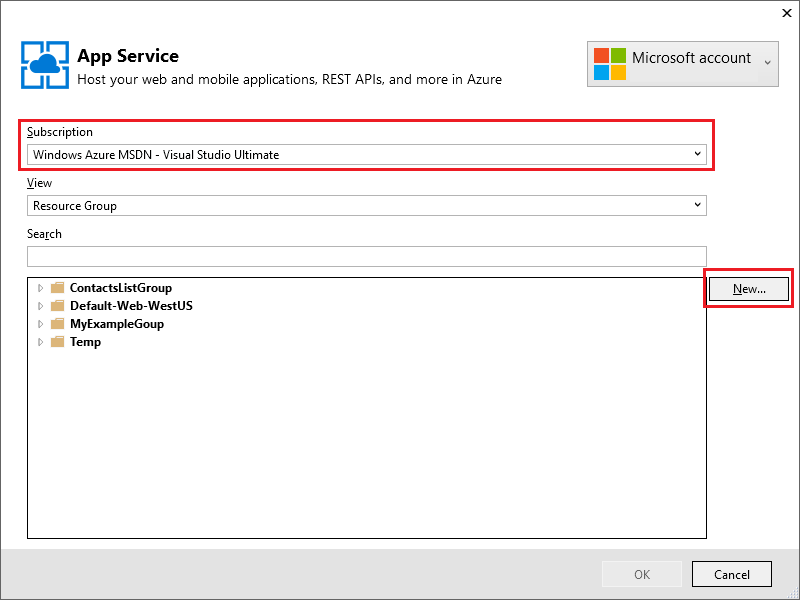
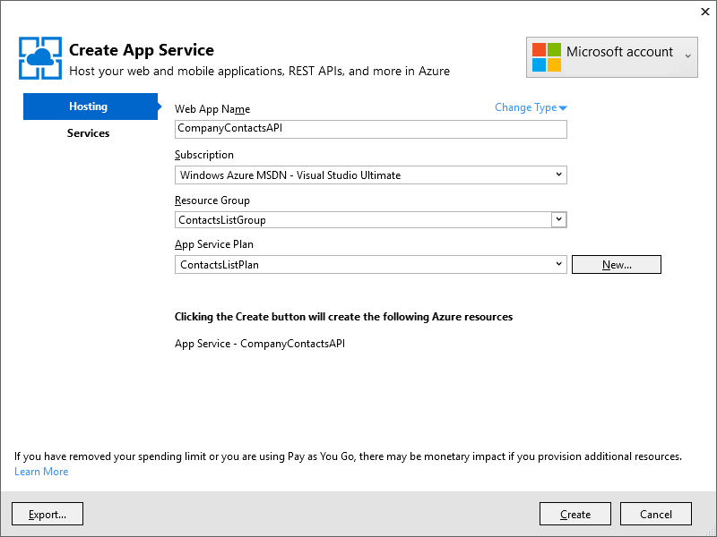
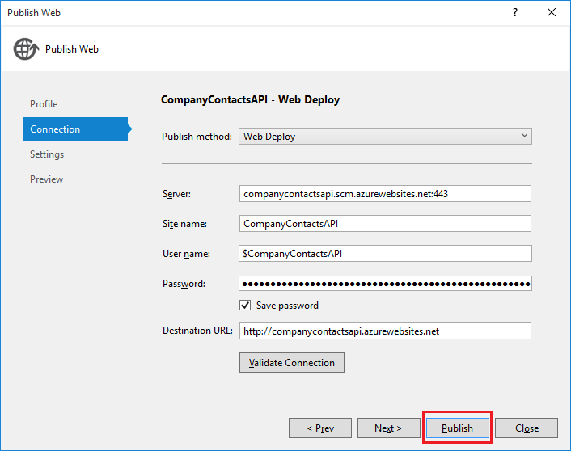
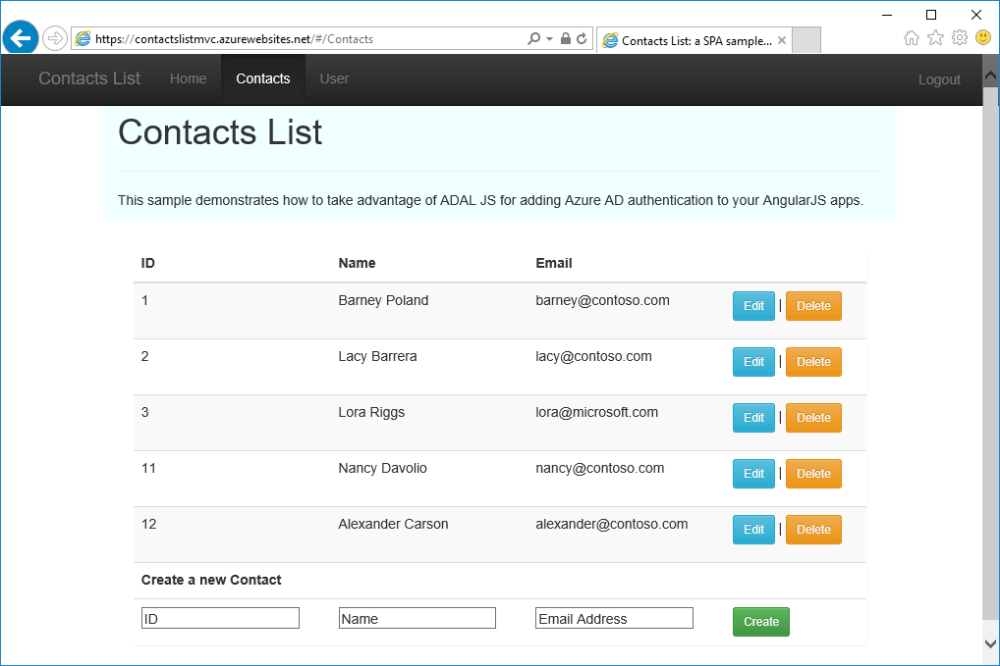

<properties
	pageTitle="Service principal authentication for API Apps in Azure App Service | Microsoft Azure"
	description="Learn how to protect an API app in Azure App Service for service-to-service scenarios."
	services="app-service\api"
	documentationCenter=".net"
	authors="tdykstra"
	manager="wpickett"
	editor=""/>

<tags
	ms.service="app-service-api"
	ms.workload="na"
	ms.tgt_pltfrm="dotnet"
	ms.devlang="na"
	ms.topic="get-started-article"
	ms.date="11/28/2015"
	ms.author="tdykstra"/>

# Service principal authentication for API Apps in Azure App Service

[AZURE.INCLUDE [app-service-api-get-started-selector](../../includes/app-service-api-get-started-selector.md)]

## Overview

This tutorial shows how to use the Authentication and Authorization features of Azure App Service to protect an API app, and how to consume a protected API app on behalf of a service account. The authentication provider shown in the tutorial is Azure Active Directory, and the sample client is an ASP.NET Web API running in an API app.

## Authentication and authorization in App Service

For an introduction to authentication features used in this tutorial, see the previous tutorial in this series, [authentication and authorization for API Apps in Azure App Service](app-service-api-dotnet-get-started.md).

## How to follow this tutorial

This tutorial builds on a sample application that you download and create an API app for in the [first tutorial of the ASP.NET version of this series](app-service-api-dotnet-get-started.md). If you are following the Node or Java getting started series, the instructions for configuring authentication in Azure apply to all API languages and frameworks.

## The CompanyUsers.API sample project

In the [ContactsList sample application](https://github.com/Azure-Samples/app-service-api-dotnet-contact-list), the CompanyUsers.API project is a simple Web API project that contains one Get method that returns a hard-coded list of contacts. To demonstrate a service-to-service scenario, the Get method in  ContactsList.API calls the Get method in CompanyContacts.API and adds the contacts it gets back to whatever it has it in its own data store, then returns the combined list.

Here is the Get method in CompanyUsers.API.

		public async Task<IEnumerable<Contact>> Get()
		{
		    var contacts = new Contact[]{
		                new Contact { Id = 1, EmailAddress = "nancy@contoso.com", Name = "Nancy Davolio"},
		                new Contact { Id = 2, EmailAddress = "alexander@contoso.com", Name = "Alexander Carson"}
		            };
		
		    return contacts;
		}

And here is the Get method in ContactsList.API, showing how it calls CompanyContacts.API and adds the results to what it returns. (Some code is omitted for clarity here.)

		private async Task<IEnumerable<Contact>> GetContacts()
		{
		    var contacts = await _storage.Get(FILENAME);
		
		    var contactsList = contacts.ToList<Contact>();
		    using (var client = CompanyContactsAPIClientWithAuth())
		    {
		        var results = await client.Contacts.GetAsync();
		        foreach (Contact c in results)
		        {
		            contactsList.Add(c);
		        }
		    }
		
		    return contactsList;
		}

The client object for CompanyContacts.API is a modification of the generated API app client code that adds a token to the HTTP request.

		private static CompanyContactsAPI CompanyContactsAPIClientWithAuth()
		{
		    var client = new CompanyContactsAPI(new Uri(ConfigurationManager.AppSettings["CompanyContactsAPIUrl"]));
		    client.HttpClient.DefaultRequestHeaders.Authorization =
		        new AuthenticationHeaderValue("Bearer", ServicePrincipal.GetS2SAccessTokenForProdMSA().AccessToken);
		    return client;
		}

## Create an API app in Azure and deploy the CompanyContacts.API project to it

1. In **Solution Explorer**, right-click the CompanyContacts.API project, and then click **Publish**.

3.  In the **Profile** step of the **Publish Web** wizard, click **Microsoft Azure App Service**.

	

4. Sign in to your Azure account if you have not already done so, or refresh your credentials if they're expired.

4. In the App Service dialog box, choose the Azure **Subscription** you want to use, and then click **New**.

	

3. In the **Hosting** tab of the **Create App Service** dialog box, click **Change Type**, and then click **API App**.

4. Enter an **API App Name** that is unique in the *azurewebsites.net* domain. 

6. In the **Resource Group** drop-down, select the resource group that you have been using for these tutorials.

4. In the **App Service Plan** drop-down, select the plan that you have been using for these tutorials. 

7. Click **Create**.

	

	Visual Studio creates the API app and creates a publish profile that has all of the required settings for the new API app. 

8. In the **Connection** tab of the **Publish Web** wizard, click **Publish**.

	

	Visual Studio deploys the project to the new API app and opens a browser to the URL of the API app. A "successfully created" page appears in the browser.

9. Close the browser.

## Update the generated client code in the ContactsList.API project

The ContactsList.API project already has the generated client code, but you'll delete it and regenerate it from your own API app.

1. In Visual Studio **Solution Explorer**, in the ContactsList.API project, delete the *CompanyContactsAPI* folder.

2. Right-click the ContactsList.API project, and then click **Add > REST API Client**.

3. In the **Add REST API Client** dialog box, click **Download from Microsoft Azure API App**, and then click **Browse**.

8. In the **App Service** dialog box, expand the resource group that you're using for this tutorial, and then select the API app that you just created

10. Click **OK**.

9. In the **Add REST API Client** dialog box, click **OK**.

	Visual Studio creates a folder named after the API app and generates client classes.

## Update code in ContactsList.API and deploy the project

The code in ContactsList.API that calls CompanyContacts.API is commented out for the earlier tutorials. In this section you uncomment that code and deploy the app.

1. In the ContactsList.API project, open *Controllers/ContactsController.cs*.

2. Near the top of the `ContactsController` class, in the code that uses the generated client class to add an authorization token, replace the class name `CompanyContactsAPI` with the name of the class generated from your API app.

	For example, if your API app is named CompanyContactsAPI3, the code would look like this:

		 private static CompanyContactsAPI3 CompanyContactsAPIClientWithAuth()
		 {
		     var client = new CompanyContactsAPI3(new Uri(ConfigurationManager.AppSettings["CompanyContactsAPIUrl"]));
		     client.HttpClient.DefaultRequestHeaders.Authorization =
		         new AuthenticationHeaderValue("Bearer", ServicePrincipal.GetS2SAccessTokenForProdMSA().AccessToken);
		     return client;
		 }
 
4. In the Get method, uncomment the block of code that uses the client object returned by `CompanyContactsAPIClientWithAuth`.

		using (var client = CompanyContactsAPIClientWithAuth())
		{
		    var results = await client.Contacts.GetAsync();
		    foreach (Contact c in results)
		    {
		        contactsList.Add(c);
		    }
		}

2. Right-click the ContactsList.API project, and click **Publish**.

	The **Publish Web** wizard opens to the publish profile you used earlier.

3. In the **Publish Web** wizard, click **Publish**.

## Set up authentication and authorization in Azure for the new API app

1. In the [Azure portal](https://portal.azure.com/), navigate to the API App blade of the API app that you created in this tutorial for the CompanyContacts.API project, and then click **Settings**.

2. Find the **Features** section, and then click **Authentication/ Authorization**.

3. In the **Authentication / Authorization** blade, click **On**.

4. In the **Action to take when request is not authenticated** drop-down list, select **Log in with Azure Active Directory**.

5. Under **Authentication Providers**, click **Azure Active Directory**.

6. In the **Azure Active Directory Settings** blade, click **Express**.

	Azure will automatically create an AAD application in your AAD tenant. Make a note of the name of the new AAD application, as you'll select it later when you go to the Azure classic portal to get its client ID.

7. Click **OK**.

10. In the **Authentication / Authorization** blade, click **Save**.
 
11. In the [Azure classic portal](https://manage.windowsazure.com/), go to **Azure Active Directory**.

12. On the **Directory** tab, click your AAD tenant.

14. Click **Applications > Application my company owns**, and then click the check mark.

15. In the list of applications, click the name of the one that Azure created for you when you enabled authentication for your API app.

16. Click **Configure**.

15. At the bottom of the page, click **Manage manifest > Download manifest**, and save the file in a location where you can edit it.

16. In the downloaded manifest file, search for the  `oauth2AllowImplicitFlow` property. Change the value of this property from `false` to `true`, and then save the file.

16. Click **Manage manifest > Upload manifest**, and upload the file that you updated in the preceding step.

17. Keep this page open so you can copy and paste values from it and update values on the page in later steps of the tutorial.

## Update settings in the API app that runs the ContactsList.API project code

1. In the [Azure portal](https://portal.azure.com/), navigate to the API app blade for the API app that you deployed the ContactsList.API project to.  This is the calling API app, not the one being called, which you just created in this tutorial).

2. Click **Settings > Application Settings**.

	You'll add some settings here, but you have to get them from another page on the classic Azure portal.

3. In the [classic Azure portal](https://manage.windowsazure.com/), go to the **Configure** tab for the AAD application that you created for the ContactsList.API API app.

5. Under **keys**, select **1 year** from the **Select duration** drop-down list.

6. Click **Save**.

	

7. Copy the key value.

	

3. In the Azure portal **Application settings** blade, **App settings** section, add a key named ida:ClientSecret, and in the value field paste in the key you just created.

3. In the classic Azure portal, go to the **Configure** tab for the AAD application that you created for the CompanyContacts.API API app.

4. Copy the Client ID.

3. In the Azure portal **Application settings** blade, **App settings** section, add a key named ida:Resource, and in the value field paste in the Client ID you just copied.

4. Add a key named CompanyContactsAPIUrl, and in the value field enter https://{your api app name}.azurewebsites.net, for example:  https://companycontactsapi.azurewebsites.net.

6. Click Save.

	

## Test in Azure

1. Go to the URL of the web app that you deployed the ContactsList.Angular.AAD project to.

2. Click the **Contacts** tab, and then log in.

	You see the Contacts page with the additional contacts that have been retrieved from the CompanyContacts.API API app.

	

## Next steps

This is the last tutorial in the getting started with API Apps series. This section offers additional suggestions for learning more about how to work with API apps.

* Other ways to deploy an App Service app

	For information about other ways to deploy web projects to web apps, by using Visual Studio or by [automating deployment](http://www.asp.net/aspnet/overview/developing-apps-with-windows-azure/building-real-world-cloud-apps-with-windows-azure/continuous-integration-and-continuous-delivery) from a [source control system](http://www.asp.net/aspnet/overview/developing-apps-with-windows-azure/building-real-world-cloud-apps-with-windows-azure/source-control), see [How to deploy an Azure web app](web-sites-deploy.md).

	Visual Studio can also generate Windows PowerShell scripts that you can use to automate deployment. For more information, see [Automate Everything (Building Real-World Cloud Apps with Azure)](http://www.asp.net/aspnet/overview/developing-apps-with-windows-azure/building-real-world-cloud-apps-with-windows-azure/automate-everything).

* How to troubleshoot an App Service app

	Visual Studio provides features that make it easy to view Azure logs as they are generated in real time. You can also run in debug mode remotely in Azure. For more information, see [Troubleshooting Azure web apps in Visual Studio](web-sites-dotnet-troubleshoot-visual-studio.md).

* How to add a custom domain name and SSL

	For information about how to use SSL and your own domain (for example, www.contoso.com instead of contoso.azurewebsites.net), see the following resources:

	* [Configure a custom domain name in Azure App Service](web-sites-custom-domain-name.md)
	* [Enable HTTPS for an Azure website](web-sites-configure-ssl-certificate.md)
