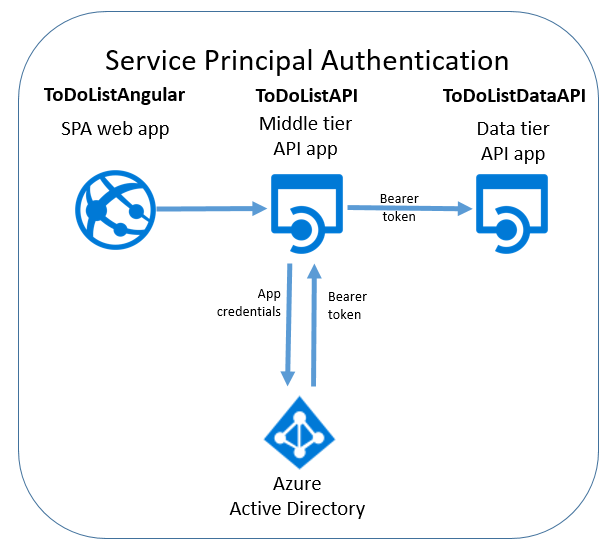
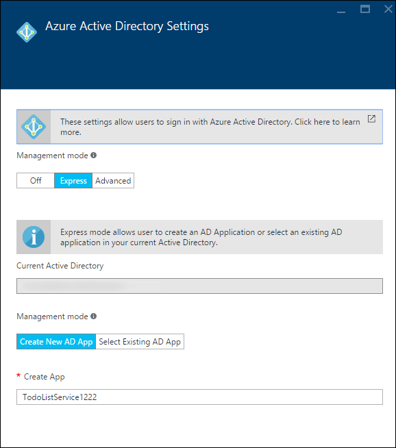
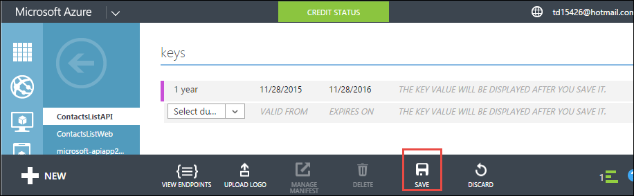
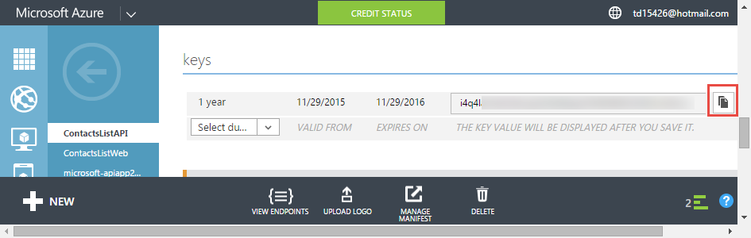
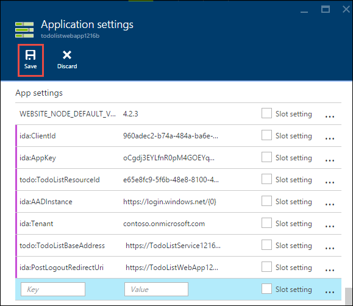
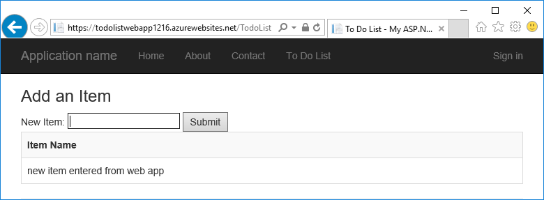
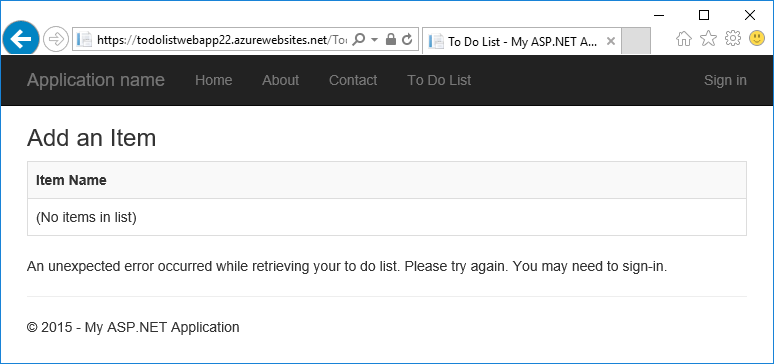
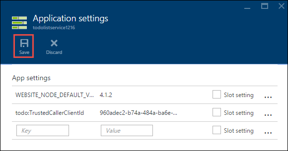

<properties
	pageTitle="Service principal authentication for API Apps in Azure App Service | Microsoft Azure"
	description="Learn how to protect an API app in Azure App Service for service-to-service scenarios."
	services="app-service\api"
	documentationCenter=".net"
	authors="tdykstra"
	manager="wpickett"
	editor=""/>

<tags
	ms.service="app-service-api"
	ms.workload="na"
	ms.tgt_pltfrm="dotnet"
	ms.devlang="na"
	ms.topic="article"
	ms.date="06/30/2016" 
	ms.author="rachelap"/>

# Service principal authentication for API Apps in Azure App Service

## Overview

This article explains how to use App Service authentication for *internal* access to API apps. An internal scenario is where you have an API app that you want to be consumable only by your own application code. The recommended way to implement this scenario in App Service is to use Azure AD to protect the called API app. You call the protected API app with a bearer token that you get from Azure AD by providing application identity (service principal) credentials. For alternatives to using Azure AD, see the **Service-to-service authentication** section of the [Azure App Service authentication overview](../app-service/app-service-authentication-overview.md#service-to-service-authentication).

In this article, you'll learn:

* How to use Azure Active Directory (Azure AD) to protect an API app from unauthenticated access.
* How to consume a protected API app from an API app, web app, or mobile app by using Azure AD service principal (app identity) credentials. For information about how to consume from a logic app, see [Using your custom API hosted on App Service with Logic apps](../app-service-logic/app-service-logic-custom-hosted-api.md).
* How to make sure that the protected API app can't be called from a browser by logged on users.
* How to make sure that the protected API app can only be called by a specific Azure AD service principal.

The article contains two sections:

* The [How to configure service principal authentication in Azure App Service](#authconfig) section explains in general how to configure authentication for any API app, and how to consume the protected API app. This section applies equally to all frameworks supported by App Service, including .NET, Node.js, and Java.

* Starting with the [Continuing the .NET getting-started tutorials](#tutorialstart) section, the tutorial guides you through configuring an "internal access" scenario for a .NET sample application running in App Service. 

##  How to configure service principal authentication in Azure App Service

This section provides general instructions that apply to any API app. For steps specific to the To Do List .NET sample application, go to [Continuing the .NET API Apps tutorial series](#tutorialstart).

1. In the [Azure portal](https://portal.azure.com/), navigate to the **Settings** blade of the API app that you want to protect, and then find the **Features** section and click **Authentication/ Authorization**.

	

3. In the **Authentication / Authorization** blade, click **On**.

4. In the **Action to take when request is not authenticated** drop-down list, select **Log in with Azure Active Directory** .

5. Under **Authentication Providers**, select **Azure Active Directory**.

	

6. Configure the **Azure Active Directory Settings** blade to create a new Azure AD application, or use an existing Azure AD application if you already have one that you want to use.

	Internal scenarios typically involve an API app calling an API app. You can use separate Azure AD applications for each API app or just one Azure AD application.

	For detailed instructions on this blade, see [How to configure your App Service application to use Azure Active Directory login](../app-service-mobile/app-service-mobile-how-to-configure-active-directory-authentication.md).

7. When you're done with the authentication provider configuration blade, click **OK**.

7. In the **Authentication / Authorization** blade, click **Save**.

	

When this is done, App Service only allows requests from callers in the configured Azure AD tenant. No authentication or authorization code is required in the protected API app. The bearer token is passed to the API app along with commonly used claims in HTTP headers, and you can read that information in code to validate that requests are from a particular caller, such as a service principal.

This authentication functionality works the same way for all languages that App service supports, including .NET, Node.js, and Java. 

#### How to consume the protected API app

The caller must provide an Azure AD bearer token with API calls. To get a bearer token using service principal credentials, the caller uses Active Directory Authentication Library (ADAL for [.NET](https://www.nuget.org/packages/Microsoft.IdentityModel.Clients.ActiveDirectory), [Node.js](https://github.com/AzureAD/azure-activedirectory-library-for-nodejs), or [Java](https://github.com/AzureAD/azure-activedirectory-library-for-java)). To get a token, the code that calls ADAL provides to ADAL the following information:

* The name of your Azure AD tenant.
* The client ID and client secret (app key) of the Azure AD app associated with the caller.
* The client ID of the Azure AD application associated with the protected API app. (If just one Azure AD application is used, this is the same client ID as the one for the caller.)

These values are available in the Azure AD pages of the [Azure classic portal](https://manage.windowsazure.com/).

Once the token has been acquired, the caller includes it with HTTP requests in the Authorization header.  App Service validates the token and allows the requests to reach the protected API app.

#### How to protect the API app from access by users in the same tenant

Bearer tokens for users in the same tenant are considered valid for the protected API app.  If you want to ensure that only a service principal can call the protected API app, add code in the protected API app to validate the following claims from the token:

* `appid` should be the client ID of the Azure AD application that is associated with the caller. 
* `oid` (`objectidentifier`) should be the service principal ID of the caller. 

App Service also provides the `objectidentifier` claim in the X-MS-CLIENT-PRINCIPAL-ID header.

### How to protect the API app from browser access

If you don't validate claims in code in the protected API app, and if you use a separate Azure AD application for the protected API app, make sure that the Azure AD application's Reply URL is not the same as the API app's base URL. If the Reply URL points directly to the protected API app, a user in the same Azure AD tenant could browse to the API app, log on, and successfully call the API.

##  Continuing the .NET API Apps tutorial series

If you are following the Node.js or Java tutorial series for API apps, skip to the [Next steps](#next-steps) section. 

The remainder of this article continues the .NET API Apps tutorial series and assumes that you have completed the [user authentication tutorial](app-service-api-dotnet-user-principal-auth.md) and have the sample application running in Azure with user authentication enabled.

## Set up authentication in Azure

In this section you configure App Service so that the only HTTP requests it allows to reach the data tier API app are the ones that have valid Azure AD bearer tokens. 

In the following section, you configure the middle tier API app to send application credentials to Azure AD, get back a bearer token, and send the bearer token to the data tier API app. This process is illustrated in the diagram.

If you run into problems while following the tutorial directions, see the [Troubleshooting](#troubleshooting) section at the end of the tutorial. 

1. In the [Azure portal](https://portal.azure.com/), navigate to the **Settings** blade of the API app that you created for the ToDoListDataAPI (data tier) API app, and then click **Settings**.

2. In the **Settings** blade, find the **Features** section, and then click **Authentication / Authorization**.

	

3. In the **Authentication / Authorization** blade, click **On**.

4. In the **Action to take when request is not authenticated** drop-down list, select **Log in with Azure Active Directory**.

	This is the setting that causes App Service to ensure that only authenticated requests reach the API app. For requests that have valid bearer tokens, App Service passes the tokens along to the API app and populates HTTP headers with commonly used claims to make that information more easily available to your code.

5. Under **Authentication Providers**, click **Azure Active Directory**.

	

6. In the **Azure Active Directory Settings** blade, click **Express**.

	With the **Express** option Azure can automatically create an AAD application in your Azure AD [tenant](https://msdn.microsoft.com/en-us/library/azure/jj573650.aspx#BKMK_WhatIsAnAzureADTenant). 

	You don't have to create a tenant, because every Azure account automatically has one.

7. Under **Management mode**, click **Create New AD App** if it isn't already selected.

	The portal plugs the **Create App** input box with a default value. By default, the Azure AD application is named the same as the API app. If you prefer, you can enter a different name.
	
	

	**Note**: As an alternative, you could use a single Azure AD application for both the calling API app and the protected API app. If you chose that alternative, you would not need the **Create New AD App** option here because you already created an Azure AD application earlier in the user authentication tutorial. For this tutorial, you'll use separate Azure AD applications for the calling API app and the protected API app.

8. Make a note of the value that is in the **Create App** input box; you'll look up this AAD application in the Azure classic portal later.

7. Click **OK**.

10. In the **Authentication / Authorization** blade, click **Save**.

	

	App Service creates an Azure Active Directory application with **Sign-on URL** and **Reply URL** automatically set to the URL of your API app. The latter value enables users in your AAD tenant to log in and access the API app.

### Verify that the API app is protected

1. In a browser go to the URL of the API app: in the **API app** blade in the Azure portal, click the link under **URL**. 

	You are redirected to a login screen because unauthenticated requests are not allowed to reach the API app. 

	If your browser does go to the Swagger UI, your browser might already be logged on -- in that case, open an InPrivate or Incognito window and go to the Swagger UI URL.

18. Log in with credentials of a user in your AAD tenant.

	When you're logged on, the "successfully created" page appears in the browser.

## Configure the ToDoListAPI project to acquire and send the Azure AD token

In this section you do the following tasks:

* Add code in the middle tier API app that uses Azure AD application credentials to acquire a token and send it with HTTP requests to the data tier API app.
* Get the credentials you need from Azure AD.
* Enter the credentials into Azure App Service runtime environment settings in the middle tier API app. 

### Configure the ToDoListAPI project to acquire and send the Azure AD token

Make the following changes in the ToDoListAPI project in Visual Studio.

1. Uncomment all of the code in the *ServicePrincipal.cs* file.

	This is the code that uses ADAL for .NET to acquire the Azure AD bearer token.  It uses several configuration values that you'll set in the Azure runtime environment later. Here's the code: 

		public static class ServicePrincipal
		{
		    static string authority = ConfigurationManager.AppSettings["ida:Authority"];
		    static string clientId = ConfigurationManager.AppSettings["ida:ClientId"];
		    static string clientSecret = ConfigurationManager.AppSettings["ida:ClientSecret"];
		    static string resource = ConfigurationManager.AppSettings["ida:Resource"];
		
		    public static AuthenticationResult GetS2SAccessTokenForProdMSA()
		    {
		        return GetS2SAccessToken(authority, resource, clientId, clientSecret);
		    }
		
		    static AuthenticationResult GetS2SAccessToken(string authority, string resource, string clientId, string clientSecret)
		    {
		        var clientCredential = new ClientCredential(clientId, clientSecret);
		        AuthenticationContext context = new AuthenticationContext(authority, false);
		        AuthenticationResult authenticationResult = context.AcquireToken(
		            resource,
		            clientCredential);
		        return authenticationResult;
		    }
		}

	**Note:** This code requires the ADAL for .NET NuGet package (Microsoft.IdentityModel.Clients.ActiveDirectory), which is already installed in the project. If you were creating this project from scratch, you would have to install this package. This package is not automatically installed by the API app new-project template.

2. In *Controllers/ToDoListController*, uncomment the code in the `NewDataAPIClient` method that adds the token to HTTP requests in the authorization header.

		client.HttpClient.DefaultRequestHeaders.Authorization =
		    new AuthenticationHeaderValue("Bearer", ServicePrincipal.GetS2SAccessTokenForProdMSA().AccessToken);

3. Deploy the ToDoListAPI project. (Right-click the project, then click **Publish > Publish**.)

	Visual Studio deploys the project and opens a browser to the web app's base URL. This will show a 403 error page, which is normal for an attempt to go to a Web API base URL from a browser.

4. Close the browser.

### Get Azure AD configuration values

11. In the [Azure classic portal](https://manage.windowsazure.com/), go to **Azure Active Directory**.

12. On the **Directory** tab, click your AAD tenant.

14. Click **Applications > Applications my company owns**, and then click the check mark.

15. In the list of applications, click the name of the one that Azure created for you when you enabled authentication for the ToDoListDataAPI (data tier) API app.

16. Click the **Configure** tab.

5. Copy the **Client ID** value and save it someplace you can get it from later. 

8. In the Azure classic portal go back to the list of **Applications my company owns**, and click the AAD application that you created for the middle tier ToDoListAPI API app (the one you created in the previous tutorial, not the one you created in this tutorial).

16. Click the **Configure** tab.

5. Copy the **Client ID** value and save it someplace you can get it from later.

6. Under **keys**, select **1 year** from the **Select duration** drop-down list.

6. Click **Save**.

	

7. Copy the key value and save it someplace you can get it from later.

	

### Configure Azure AD settings in the middle tier API app's runtime environment

1. Go to the [Azure portal](https://portal.azure.com/), and then navigate to the **API App** blade for the API app that hosts the TodoListAPI (middle tier) project.

2. Click **Settings > Application Settings**.

3. In the **App settings** section, add the following keys and values:

	| **Key** | ida:Authority |
	|---|---|
	| **Value** | https://login.microsoftonline.com/{your Azure AD tenant name} |
	| **Example** | https://login.microsoftonline.com/contoso.onmicrosoft.com |

	| **Key** | ida:ClientId |
	|---|---|
	| **Value** | Client ID of the calling application (middle tier - ToDoListAPI) |
	| **Example** | 960adec2-b74a-484a-960adec2-b74a-484a |

	| **Key** | ida:ClientSecret |
	|---|---|
	| **Value** | App key of the calling application (middle tier - ToDoListAPI) |
	| **Example** | e65e8fc9-5f6b-48e8-e65e8fc9-5f6b-48e8 |

	| **Key** | ida:Resource |
	|---|---|
	| **Value** | Client ID of the called application (data tier - ToDoListDataAPI) |
	| **Example** | e65e8fc9-5f6b-48e8-e65e8fc9-5f6b-48e8 |

	**Note**: For `ida:Resource`, make sure you use the called application's **client ID** and not its **App ID URI**.

	`ida:ClientId` and `ida:Resource` are different values for this tutorial because you're using separate Azure AD applicaations for the middle tier and data tier. If you were using a single Azure AD application for the calling API app and the protected API app, you would use the same value in both `ida:ClientId` and `ida:Resource`.

	The code uses ConfigurationManager to get these values, so they could be stored in the project's Web.config file or in the Azure runtime environment. While an ASP.NET application is running in Azure App Service, environment settings automatically override settings from Web.config. Environment settings are generally a [more secure way to store sensitive information compared to a Web.config file](http://www.asp.net/identity/overview/features-api/best-practices-for-deploying-passwords-and-other-sensitive-data-to-aspnet-and-azure).

6. Click **Save**.

	

### Test the application

1. In a browser go to the HTTPS URL of the AngularJS front end web app.

2. Click the **To Do List** tab and log in with credentials for a user in your Azure AD tenant. 

4. Add to-do items to verify that the application is working.

	

	If the application doesn't work as expected, double-check all of the settings you entered in the Azure portal. If all of the settings appear to be correct, see the [Troubleshooting](#troubleshooting) section later in this tutorial.

## Protect the API app from browser access

For this tutorial you created a separate Azure AD application for the ToDoListDataAPI (data tier) API app. As you've seen, when App Service creates an AAD application, it configures the AAD application in a way that enables a user to go to the API app's URL in a browser and log on. That means it's possible for an end user in your Azure AD tenant, not just a service principal, to access the API. 

If you want to prevent browser access without writing any code in the protected API app, you can change the **Reply URL** in the AAD application so that it's different from the API app's base URL. 

### Disable browser access

1. In the classic portal's **Configure** tab for the AAD application that was created for the TodoListService, change the value in the **Reply URL** field so that it is a valid URL but not the API app's URL.
 
2. Click **Save**.

### Verify browser access no longer works

Earlier you verified that you can go to the API app URL from a browser by logging on with an individual user's credentials. In this section, you verify that this is no longer possible. 

1. In a new browser window, go to the URL of the API app again.

2. Log in when prompted to do so.

3. Login succeeds but leads to an error page.

	You've configured the AAD app so that users in the AAD tenant cannot log in and access the API from a browser. You can still access the API app by using a service principal token, which you can verify by going to the web app's URL and adding more to-do items.

## Restrict access to a particular service principal  

Right now, any caller that can get a token for a user or service principal in your Azure AD tenant can call the TodoListDataAPI (data tier) API app. You might want to make sure that the data tier API app only accepts calls from the TodoListAPI (middle tier) API app, and only from a particular service principal. 

You can add these restrictions by adding code to validate the `appid` and `objectidentifier` claims on incoming calls.

For this tutorial you put the code that validates app ID and service principal ID directly in your controller actions.  Alternatives are to use a custom `Authorize` attribute or to do this validation in your startup sequences (e.g. OWIN middleware). For an example of the latter, see [this sample application](https://github.com/mohitsriv/EasyAuthMultiTierSample/blob/master/MyDashDataAPI/Startup.cs). 

Make the following changes to the TodoListDataAPI project.

2. Open the *Controllers/TodoListController.cs* file.

3. Uncomment the lines that set `trustedCallerClientId` and `trustedCallerServicePrincipalId`.

		private static string trustedCallerClientId = ConfigurationManager.AppSettings["todo:TrustedCallerClientId"];
		private static string trustedCallerServicePrincipalId = ConfigurationManager.AppSettings["todo:TrustedCallerServicePrincipalId"];

4. Uncomment the code in the CheckCallerId method. This method is called at the start of every action method in the controller. 

		private static void CheckCallerId()
		{
		    string currentCallerClientId = ClaimsPrincipal.Current.FindFirst("appid").Value;
		    string currentCallerServicePrincipalId = ClaimsPrincipal.Current.FindFirst("http://schemas.microsoft.com/identity/claims/objectidentifier").Value;
		    if (currentCallerClientId != trustedCallerClientId || currentCallerServicePrincipalId != trustedCallerServicePrincipalId)
		    {
		        throw new HttpResponseException(new HttpResponseMessage { StatusCode = HttpStatusCode.Unauthorized, ReasonPhrase = "The appID or service principal ID is not the expected value." });
		    }
		}

5. Redeploy the ToDoListDataAPI project to Azure App Service.

6. In your browser, go to the AngularJS front end web app's HTTPS URL, and in the home page click the **To Do List** tab.

	The application doesn't work because calls to the back end are failing. The new code is checking actual appid and objectidentifier but it doesn't yet have the correct values to check them against. The browser Developer Tools Console reports that the server is returning an HTTP 401 error.

	

	In the following steps you configure the expected values.

8. Using Azure AD PowerShell, get the value of the service principal for the Azure AD application that you created for the TodoListWebApp project.

	a. For instructions on how to install Azure PowerShell and connect to your subscription, see [Using Azure PowerShell with Azure Resource Manager](../powershell-azure-resource-manager.md).

	b. To get a list of service principals, execute the `Login-AzureRmAccount` command and then the `Get-AzureRmADServicePrincipal` command.

	c. Find the objectid for the service principal of the TodoListAPI application, and save it in a location you can copy from later.

7. In the Azure portal, navigate to the API app blade for the API app that you deployed the ToDoListDataAPI project to.

9. Click **Settings > Application settings**.

3. In the **App settings** section, add the following keys and values:

	| **Key** | todo:TrustedCallerServicePrincipalId |
	|---|---|
	| **Value** | Service principal id of calling application |
	| **Example** | 4f4a94a4-6f0d-4072-4f4a94a4-6f0d-4072 |

	| **Key** | todo:TrustedCallerClientId |
	|---|---|
	| **Value** | Client ID of calling application - copied from the TodoListAPI Azure AD application |
	| **Example** | 960adec2-b74a-484a-960adec2-b74a-484a |

6. Click **Save**.

	

6. In your browser, return to the web app's URL, and in the home page click the **To Do List** tab.

	This time the application works as expected because the trusted caller app ID and service principal ID are the expected values.

	

## Building the projects from scratch

The two Web API projects were created by using the **Azure API App** project template and replacing the default Values controller with a ToDoList controller. For acquiring Azure AD service principal tokens in the ToDoListAPI project, the [Active Directory Authentication Library (ADAL) for .NET](https://www.nuget.org/packages/Microsoft.IdentityModel.Clients.ActiveDirectory/) NuGet package was installed.
 
For information about how to  create an AngularJS single-page application with a Web API back end like ToDoListAngular, see  [Hands On Lab: Build a Single Page Application (SPA) with ASP.NET Web API and Angular.js](http://www.asp.net/web-api/overview/getting-started-with-aspnet-web-api/build-a-single-page-application-spa-with-aspnet-web-api-and-angularjs). For information about how to add Azure AD authentication code, see [Securing AngularJS Single Page Apps with Azure AD](../active-directory/active-directory-devquickstarts-angular.md).

## Troubleshooting

[AZURE.INCLUDE [troubleshooting](../../includes/app-service-api-auth-troubleshooting.md)]

* Make sure that you don't confuse ToDoListAPI (middle tier) and ToDoListDataAPI (data tier). For example, in this tutorial you add authentication to the data tier API app, **but the app key must come from the Azure AD application that you created for the middle tier API app**.

## Next steps

This is the last tutorial in the API Apps series. 

For more information about Azure Active Directory, see the following resources.

* [Azure AD developers' guide](http://aka.ms/aaddev)
* [Azure AD scenarios](http://aka.ms/aadscenarios)
* [Azure AD samples](http://aka.ms/aadsamples)

	The [WebApp-WebAPI-OAuth2-AppIdentity-DotNet](http://github.com/AzureADSamples/WebApp-WebAPI-OAuth2-AppIdentity-DotNet) sample is similar to what is shown in this tutorial, but without using App Service authentication.

For information about other ways to deploy Visual Studio projects to API apps, by using Visual Studio or by [automating deployment](http://www.asp.net/aspnet/overview/developing-apps-with-windows-azure/building-real-world-cloud-apps-with-windows-azure/continuous-integration-and-continuous-delivery) from a [source control system](http://www.asp.net/aspnet/overview/developing-apps-with-windows-azure/building-real-world-cloud-apps-with-windows-azure/source-control), see [How to deploy an Azure App Service app](../app-service-web/web-sites-deploy.md).
