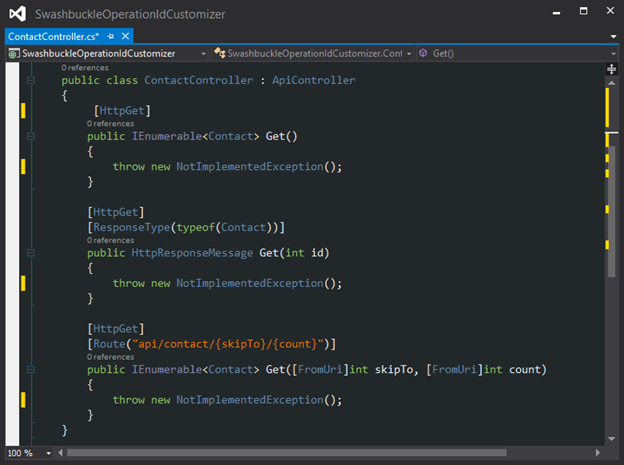
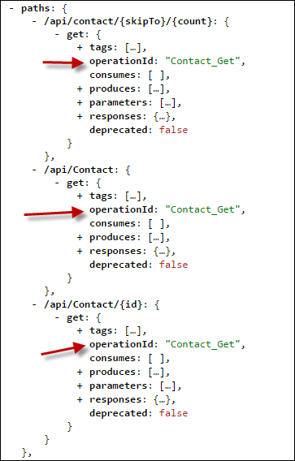
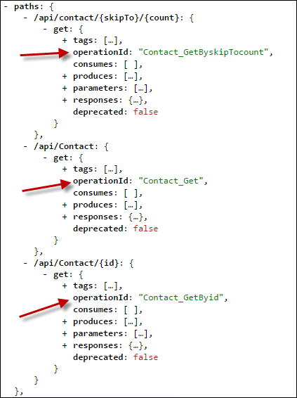
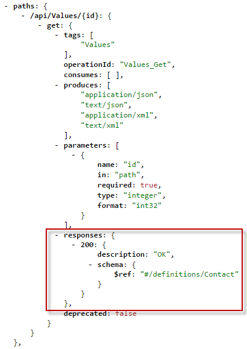
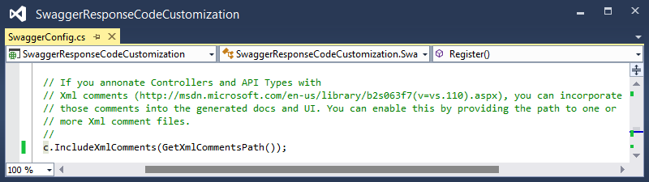
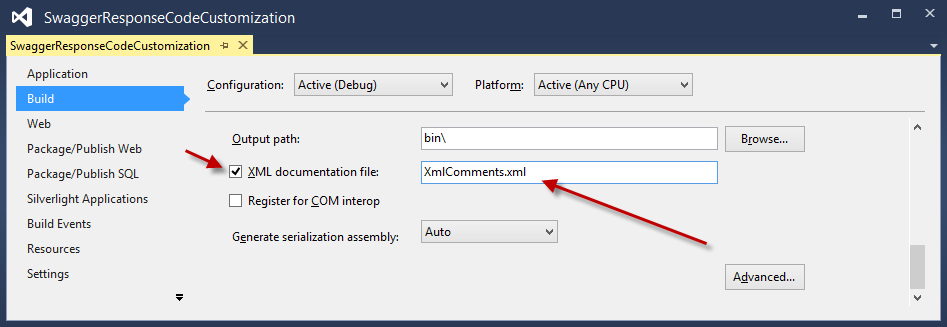
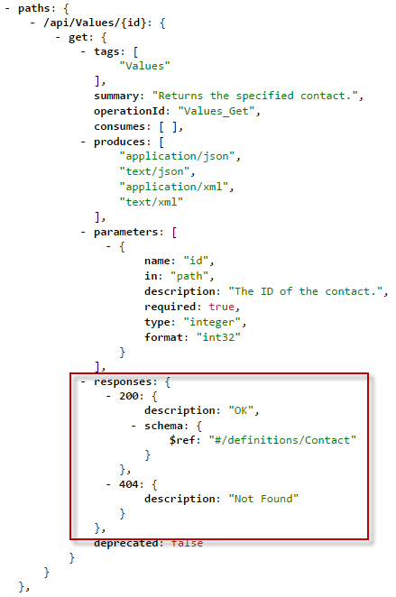
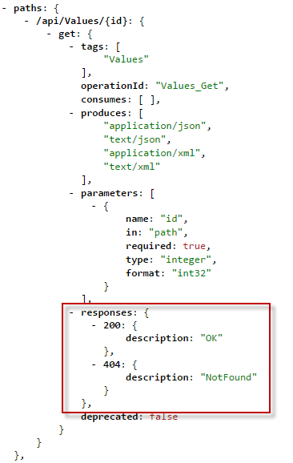

<properties 
	pageTitle="Customize Swashbuckle-generated API definitions" 
	description="Learn how to customize Swagger API definitions that are generated by Swashbuckle for an API app in Azure App Service." 
	services="app-service\api" 
	documentationCenter=".net" 
	authors="bradygaster" 
	manager="wpickett" 
	editor="jimbe"/>

<tags 
	ms.service="app-service-api" 
	ms.workload="web" 
	ms.tgt_pltfrm="dotnet" 
	ms.devlang="na" 
	ms.topic="article" 
	ms.date="02/22/2016" 
	ms.author="rachelap"/>

# Customize Swashbuckle-generated API definitions 

## Overview

This article explains how to customize Swashbuckle to handle common scenarios where you may want to alter the default behavior:

* Swashbuckle generates duplicate operation identifiers for overloads of controller methods
* Swashbuckle assumes that the only valid response from a method is HTTP 200 (OK) 
 
## Customize operation identifier generation

Swashbuckle generates Swagger operation identifiers by concatenating controller name and method name. This pattern creates a problem when you have multiple overloads of a method: Swashbuckle generates duplicate operation ids, which is invalid Swagger JSON.

For example, the following controller code causes Swashbuckle to generate three Contact_Get operation ids.

You can solve the problem manually by giving the methods unique names, such as the following for this example:

* Get
* GetById
* GetPage

The alternative is to extend Swashbuckle to make it automatically generate unique operation ids.

The following steps show how to customize Swashbuckle by using the *SwaggerConfig.cs* file that is included in the project by the Visual Studio API Apps Preview project template.  You can also customize Swashbuckle in a Web API project that you configure for deployment as an API app.

1. Create a custom `IOperationFilter` implementation 

	The `IOperationFilter` interface provides an extensibility point for Swashbuckle users who want to customize various aspects of the Swagger metadata process. The following code demonstrates one method of changing the operation-id-generation behavior. The code appends parameter names to the operation id name.  

		using Swashbuckle.Swagger;
		using System.Web.Http.Description;
		
		namespace ContactsList
		{
		    public class MultipleOperationsWithSameVerbFilter : IOperationFilter
		    {
		        public void Apply(
		            Operation operation,
		            SchemaRegistry schemaRegistry,
		            ApiDescription apiDescription)
		        {
		            if (operation.parameters != null)
		            {
		                operation.operationId += "By";
		                foreach (var parm in operation.parameters)
		                {
		                    operation.operationId += string.Format("{0}",parm.name);
		                }
		            }
		        }
		    }
		}

2. In *App_Start\SwaggerConfig.cs* file, call the `OperationFilter` method to cause Swashbuckle to use the new `IOperationFilter` implementation.

		c.OperationFilter<MultipleOperationsWithSameVerbFilter>();

	

	The *SwaggerConfig.cs* file that is dropped in by the Swashbuckle NuGet package contains many commented-out examples of extensibility points. The additional comments are not shown here. 

	After you make this change, your `IOperationFilter` implementation is used and causes unique operation ids to be generated.
 
	

	
## Allow response codes other than 200

By default, Swashbuckle assumes that an HTTP 200 (OK) response is the *only* legitimate response from a Web API method. In some cases, you may want to return other response codes without causing the client to raise an exception.  For example, the following Web API code demonstrates a scenario in which you would want the client to accept either a 200 or a 404 as valid responses.

	[ResponseType(typeof(Contact))]
    public HttpResponseMessage Get(int id)
    {
        var contacts = GetContacts();

        var requestedContact = contacts.FirstOrDefault(x => x.Id == id);

        if (requestedContact == null)
        {
            return Request.CreateResponse(HttpStatusCode.NotFound);
        }
        else
        {
            return Request.CreateResponse<Contact>(HttpStatusCode.OK, requestedContact);
        }
    }

In this scenario, the Swagger that Swashbuckle generates by default specifies only one legitimate HTTP status code, HTTP 200.

Since Visual Studio uses the Swagger API definition to generate code for the client, it creates client code that raises an exception for any response other than an HTTP 200. The code below is from a C# client generated for this sample Web API method.

	if (statusCode != HttpStatusCode.OK)
    {
        HttpOperationException<object> ex = new HttpOperationException<object>();
        ex.Request = httpRequest;
        ex.Response = httpResponse;
        ex.Body = null;
        if (shouldTrace)
        {
            ServiceClientTracing.Error(invocationId, ex);
        }
        throw ex;
    } 

Swashbuckle provides two ways of customizing the list of expected HTTP response codes that it generates, using XML comments or the `SwaggerResponse` attribute. The attribute is easier, but it is only available in Swashbuckle 5.1.5 or later. The API Apps preview new-project template in Visual Studio 2013 includes Swashbuckle version 5.0.0, so if you used the template and don't want to update Swashbuckle, your only option is to use XML comments. 

### Customize expected response codes using XML comments

Use this method to specify response codes if your Swashbuckle version is earlier than 5.1.5.

1. First, add XML documentation comments over the methods you wish to specify HTTP response codes for. Taking the sample Web API action shown above and applying the XML documentation to it would result in code like the following example. 

		/// 

		/// Returns the specified contact.
		/// 

		/// <param name="id">The ID of the contact.</param>
		/// <returns>A contact record with an HTTP 200, or null with an HTTP 404.</returns>
		/// <response code="200">OK</response>
		/// <response code="404">Not Found</response>
		[ResponseType(typeof(Contact))]
		public HttpResponseMessage Get(int id)
		{
		    var contacts = GetContacts();
		
		    var requestedContact = contacts.FirstOrDefault(x => x.Id == id);
		
		    if (requestedContact == null)
		    {
		        return Request.CreateResponse(HttpStatusCode.NotFound);
		    }
		    else
		    {
		        return Request.CreateResponse<Contact>(HttpStatusCode.OK, requestedContact);
		    }
		}

1. Add instructions in the *SwaggerConfig.cs* file to direct Swashbuckle to make use of the XML documentation file.

	* Open *SwaggerConfig.cs* and create a method on the *SwaggerConfig* class to specify the path to the documentation XML file. 

			private static string GetXmlCommentsPath()
			{
			    return string.Format(@"{0}\XmlComments.xml", 
			        System.AppDomain.CurrentDomain.BaseDirectory);
			}

	* Scroll down in the *SwaggerConfig.cs* file until you see the commented-out line of code resembling the screen shot below. 

		
	
	* Uncomment the line to enable the XML comments processing during Swagger generation. 
	
		
	
1. In order to generate the XML documentation file, go into the project's properties and enable the XML documentation file as shown in the screenshot below. 

	 

Once you perform these steps, the Swagger JSON generated by Swashbuckle will reflect the HTTP response codes that you specified in the XML comments. The screenshot below demonstrates this new JSON payload. 

When you use Visual Studio to regenerate the client code for your REST API, the C# code accepts both the HTTP OK and Not Found status codes without raising an exception, allowing your consuming code to make decisions on how to handle the return of a null Contact record. 

		if (statusCode != HttpStatusCode.OK && statusCode != HttpStatusCode.NotFound)
		{
		    HttpOperationException<object> ex = new HttpOperationException<object>();
		    ex.Request = httpRequest;
		    ex.Response = httpResponse;
		    ex.Body = null;
		    if (shouldTrace)
		    {
		        ServiceClientTracing.Error(invocationId, ex);
		    }
        	    throw ex;
		}

The code for this demonstration can be found in [this GitHub repository](https://github.com/Azure-Samples/app-service-api-dotnet-swashbuckle-swaggerresponse). Along with the Web API project marked up with XML documentation comments is a Console Application project that contains a generated client for this API. 

### Customize expected response codes using the SwaggerResponse attribute

The [SwaggerResponse](https://github.com/domaindrivendev/Swashbuckle/blob/master/Swashbuckle.Core/Swagger/Annotations/SwaggerResponseAttribute.cs) attribute is available in Swashbuckle 5.1.5 and later. In case you have an earlier version in your project, this section starts by explaining how to update the Swashbuckle NuGet package so that you can use this attribute.

1. In **Solution Explorer**, right-click your Web API project and click **Manage NuGet Packages**. 

	

1. Click the *Update* button next to the *Swashbuckle* NuGet package. 

	

1. Add the *SwaggerResponse* attributes to the Web API action methods for which you want to specify valid HTTP response codes. 

		[SwaggerResponse(HttpStatusCode.OK)]
		[SwaggerResponse(HttpStatusCode.NotFound)]
		[ResponseType(typeof(Contact))]
		public HttpResponseMessage Get(int id)
		{
		    var contacts = GetContacts();

		    var requestedContact = contacts.FirstOrDefault(x => x.Id == id);
		    if (requestedContact == null)
		    {
		        return Request.CreateResponse(HttpStatusCode.NotFound);
		    }
		    else
		    {
		        return Request.CreateResponse<Contact>(HttpStatusCode.OK, requestedContact);
		    }
		}

2. Add a `using` statement for the attribute's namespace:

		using Swashbuckle.Swagger.Annotations;
		
1. Browse to the */swagger/docs/v1* URL of your project and the various HTTP response codes will be visible in the Swagger JSON. 

	

The code for this demonstration can be found in [this GitHub repository](https://github.com/Azure-Samples/API-Apps-DotNet-Swashbuckle-Customization-MultipleResponseCodes-With-Attributes). Along with the Web API project decorated with the *SwaggerResponse* attribute is a Console Application project that contains a generated client for this API. 

## Next steps

This article has shown how to customize the way Swashbuckle generates operation ids and valid response codes. For more information, see [Swashbuckle on GitHub](https://github.com/domaindrivendev/Swashbuckle).
 
