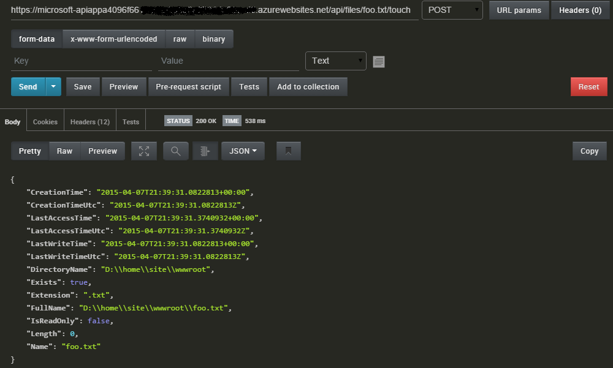
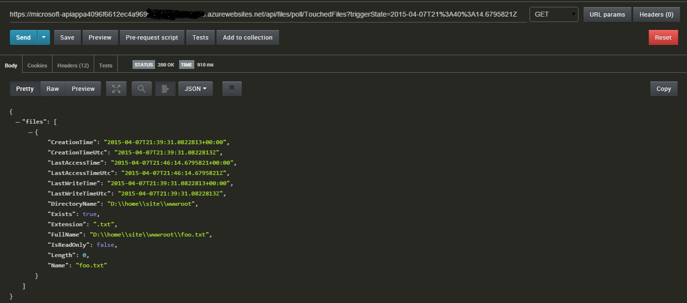
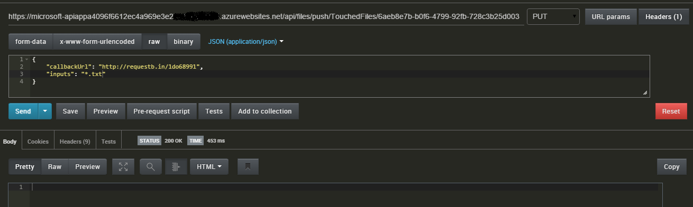
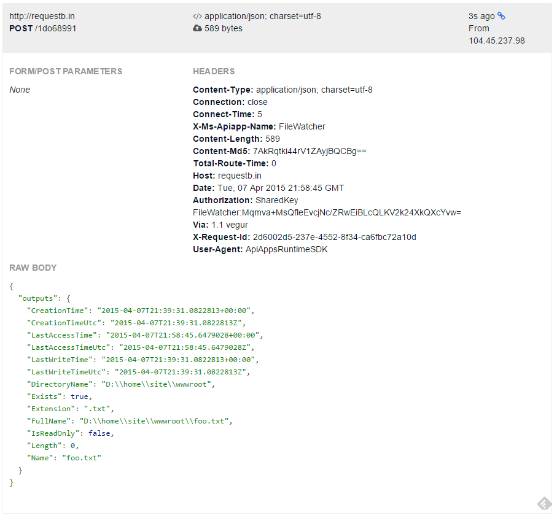
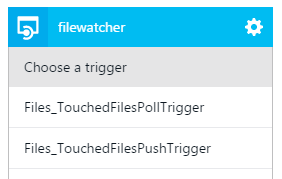
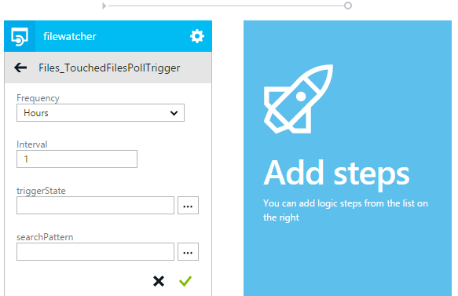
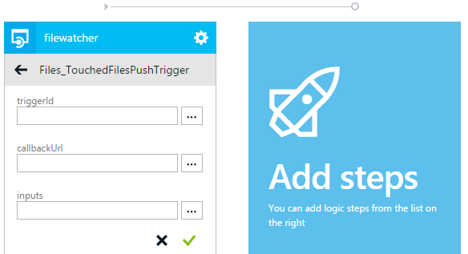

<properties 
	pageTitle="App Service API app triggers | Microsoft Azure" 
	description="How to implement triggers in an API App in Azure App Service" 
	services="logic-apps" 
	documentationCenter=".net" 
	authors="guangyang"
	manager="wpickett" 
	editor="jimbe"/>

<tags 
	ms.service="logic-apps" 
	ms.workload="na" 
	ms.tgt_pltfrm="dotnet" 
	ms.devlang="na" 
	ms.topic="article" 
	ms.date="03/16/2016" 
	ms.author="rachelap"/>

# Azure App Service API app triggers

>[AZURE.NOTE] This version of the article applies to API apps 2014-12-01-preview schema version.

## Overview

This article explains how to implement API app triggers and consume them from a Logic app.

All of the code snippets in this topic are copied from the [FileWatcher API App code sample](http://go.microsoft.com/fwlink/?LinkId=534802). 

Note that you'll need to download the following nuget package for the code in this article to build and run: [http://www.nuget.org/packages/Microsoft.Azure.AppService.ApiApps.Service/](http://www.nuget.org/packages/Microsoft.Azure.AppService.ApiApps.Service/).

## What are API app triggers?

It's a common scenario for an API app to fire an event so that clients of the API app can take the appropriate action in response to the event. The REST API based mechanism that supports this scenario is called an API app trigger. 

For example, let's say your client code is using the [Twitter Connector API app](../app-service-logic/app-service-logic-connector-twitter.md) and your code needs to perform an action based on new tweets that contain specific words. In this case, you might set up a poll or push trigger to facilitate this need.

## Poll trigger versus push trigger

Currently, two types of triggers are supported:

- Poll trigger - Client polls the API app for notification of an event having been fired 
- Push trigger - Client is notified by the API app when an event fires 

### Poll trigger

A poll trigger is implemented as a regular REST API and expects its clients (such as a Logic app) to poll it in order to get notification. While the client may maintain state, the poll trigger itself is stateless. 

The following information regarding the request and response packets illustrate some key aspects of the poll trigger contract:

- Request
    - HTTP method: GET
    - Parameters
        - triggerState - This optional parameter allows clients to specify their state so that the poll trigger can properly decide whether to return notification or not based on the specified state.
        - API-specific parameters
- Response
    - Status code **200** - Request is valid and there is a notification from the trigger. The content of the notification will be the response body. A "Retry-After" header in the response indicates that additional notification data must be retrieved with a subsequent request call.
    - Status code **202** - Request is valid, but there is no new notification from the trigger.
    - Status code **4xx** - Request is not valid. The client should not retry the request.
    - Status code **5xx** - Request has resulted in an internal server error and/or temporary issue. The client should retry the request.

The following code snippet is an example of how to implement a poll trigger.

    // Implement a poll trigger.
    [HttpGet]
    [Route("api/files/poll/TouchedFiles")]
    public HttpResponseMessage TouchedFilesPollTrigger(
        // triggerState is a UTC timestamp
        string triggerState,
        // Additional parameters
        string searchPattern = "*")
    {
        // Check to see whether there is any file touched after the timestamp.
        var lastTriggerTimeUtc = DateTime.Parse(triggerState).ToUniversalTime();
        var touchedFiles = Directory.EnumerateFiles(rootPath, searchPattern, SearchOption.AllDirectories)
            .Select(f => FileInfoWrapper.FromFileInfo(new FileInfo(f)))
            .Where(fi => fi.LastAccessTimeUtc > lastTriggerTimeUtc);

        // If there are files touched after the timestamp, return their information.
        if (touchedFiles != null && touchedFiles.Count() != 0)
        {
            // Extension method provided by the AppService service SDK.
            return this.Request.EventTriggered(new { files = touchedFiles });
        }
        // If there are no files touched after the timestamp, tell the caller to poll again after 1 mintue.
        else
        {
            // Extension method provided by the AppService service SDK.
            return this.Request.EventWaitPoll(new TimeSpan(0, 1, 0));
        }
    }

To test this poll trigger, follow these steps:

1. Deploy the API App with an authentication setting of **public anonymous**.
2. Call the **touch** operation to touch a file. The following image shows a sample request via Postman.
   
3. Call the poll trigger with the **triggerState** parameter set to a time stamp prior to Step #2. The following image shows the sample request via Postman.
   

### Push trigger

A push trigger is implemented as a regular REST API that pushes notifications to clients who have registered to be notified when specific events fire.

The following information regarding the request and response packets illustrate some key aspects of the push trigger contract.

- Request
    - HTTP method: PUT
    - Parameters
        - triggerId: required - Opaque string (such as a GUID) that represents the registration of a push trigger.
        - callbackUrl: required - URL of the callback to invoke when the event fires. The invocation is a simple POST HTTP call.
        - API-specific parameters
- Response
    - Status code **200** - Request to register client successful.
    - Status code **4xx** - Request is not valid. The client should not retry the request.
    - Status code **5xx** - Request has resulted in an internal server error and/or temporary issue. The client should retry the request.
- Callback
    - HTTP method: POST
    - Request body: Notification content.

The following code snippet is an example of how to implement a push trigger:

    // Implement a push trigger.
    [HttpPut]
    [Route("api/files/push/TouchedFiles/{triggerId}")]
    public HttpResponseMessage TouchedFilesPushTrigger(
        // triggerId is an opaque string.
        string triggerId,
        // A helper class provided by the AppService service SDK.
        // Here it defines the input of the push trigger is a string and the output to the callback is a FileInfoWrapper object.
        [FromBody]TriggerInput<string, FileInfoWrapper> triggerInput)
    {
        // Register the trigger to some trigger store.
        triggerStore.RegisterTrigger(triggerId, rootPath, triggerInput);

        // Extension method provided by the AppService service SDK indicating the registration is completed.
        return this.Request.PushTriggerRegistered(triggerInput.GetCallback());
    }

    // A simple in-memory trigger store.
    public class InMemoryTriggerStore
    {
        private static InMemoryTriggerStore instance;

        private IDictionary<string, FileSystemWatcher> _store;

        private InMemoryTriggerStore()
        {
            _store = new Dictionary<string, FileSystemWatcher>();
        }

        public static InMemoryTriggerStore Instance
        {
            get
            {
                if (instance == null)
                {
                    instance = new InMemoryTriggerStore();
                }
                return instance;
            }
        }

        // Register a push trigger.
        public void RegisterTrigger(string triggerId, string rootPath,
            TriggerInput<string, FileInfoWrapper> triggerInput)
        {
            // Use FileSystemWatcher to listen to file change event.
            var filter = string.IsNullOrEmpty(triggerInput.inputs) ? "*" : triggerInput.inputs;
            var watcher = new FileSystemWatcher(rootPath, filter);
            watcher.IncludeSubdirectories = true;
            watcher.EnableRaisingEvents = true;
            watcher.NotifyFilter = NotifyFilters.LastAccess;

            // When some file is changed, fire the push trigger.
            watcher.Changed +=
                (sender, e) => watcher_Changed(sender, e,
                    Runtime.FromAppSettings(),
                    triggerInput.GetCallback());

            // Assoicate the FileSystemWatcher object with the triggerId.
            _store[triggerId] = watcher;

        }

        // Fire the assoicated push trigger when some file is changed.
        void watcher_Changed(object sender, FileSystemEventArgs e,
            // AppService runtime object needed to invoke the callback.
            Runtime runtime,
            // The callback to invoke.
            ClientTriggerCallback<FileInfoWrapper> callback)
        {
            // Helper method provided by AppService service SDK to invoke a push trigger callback.
            callback.InvokeAsync(runtime, FileInfoWrapper.FromFileInfo(new FileInfo(e.FullPath)));
        }
    }

To test this poll trigger, follow these steps:

1. Deploy the API App with an authentication setting of **public anonymous**.
2. Browse to [http://requestb.in/](http://requestb.in/) to create a RequestBin which will serve as your callback URL.
3. Call the push trigger with a GUID as **triggerId** and the RequestBin URL as **callbackUrl**.
   
4. Call the **touch** operation to touch a file. The following image shows a sample request via Postman.
   
5. Check the RequestBin to confirm that the push trigger callback is invoked with property output.
   

### Describe triggers in API definition

After implementing the triggers and deploying your API app to Azure, navigate to the **API Definition** blade in the Azure preview portal and you'll see that triggers are automatically recognized in the UI, which is driven by the Swagger 2.0 API definition of the API app.

If you click the **Download Swagger** button and open the JSON file, you'll see results similar to the following:

    "/api/files/poll/TouchedFiles": {
      "get": {
        "operationId": "Files_TouchedFilesPollTrigger",
        ...
        "x-ms-scheduler-trigger": "poll"
      }
    },
    "/api/files/push/TouchedFiles/{triggerId}": {
      "put": {
        "operationId": "Files_TouchedFilesPushTrigger",
        ...
        "x-ms-scheduler-trigger": "push"
      }
    }

The extension property **x-ms-schedular-trigger** is how triggers are described in API definition, and is automatically added by the API app gateway when you request the API definition via the gateway if the request to one of the following criteria. (You can also add this property manually.)

- Poll trigger
    - If the HTTP method is **GET**.
    - If the **operationId** property contains the string **trigger**.
    - If the **parameters** property includes a parameter with a **name** property set to **triggerState**.
- Push trigger
    - If the HTTP method is **PUT**.
    - If the **operationId** property contains the string **trigger**.
    - If the **parameters** property includes a parameter with a **name** property set to **triggerId**.

## Use API app triggers in Logic apps

### List and configure API app triggers in the Logic apps designer

If you create a Logic app in the same resource group as the API app, you will be able to add it to the designer canvas simply by clicking it. The following images illustrate this:

## Optimize API app triggers for Logic apps

After you add triggers to an API app, there are a few things you can do to improve the experience when using the API app in a Logic app.

For instance, the **triggerState** parameter for poll triggers should be set to the following expression in the Logic app. This expression should evaluate the last invocation of the trigger from the Logic app, and return that value.  

	@coalesce(triggers()?.outputs?.body?['triggerState'], '')

NOTE: For an explanation of the functions used in the expression above, refer to the documentation on [Logic App Workflow Definition Language](https://msdn.microsoft.com/library/azure/dn948512.aspx).

Logic app users would need to provide the expression above for the **triggerState** parameter while using the trigger. It is possible to have this value preset by the Logic app designer through the extension property **x-ms-scheduler-recommendation**.  The **x-ms-visibility** extension property can be set to a value of *internal* so that the parameter itself is not shown on the designer.  The following snippet illustrates that.

    "/api/Messages/poll": {
      "get": {
	    "operationId": "Messages_NewMessageTrigger",
        "parameters": [
          {
            "name": "triggerState",
            "in": "query",
            "required": true,
            "x-ms-visibility": "internal",
            "x-ms-scheduler-recommendation": "@coalesce(triggers()?.outputs?.body?['triggerState'], '')",
            "type": "string"
          }
        ]
        ...
        "x-ms-scheduler-trigger": "poll"
      }
    }

For push triggers, the **triggerId** parameter must uniquely identify the Logic app. A recommended best practice is to set this property to the name of the workflow by using the following expression:

    @workflow().name

Using the **x-ms-scheduler-recommendation** and **x-ms-visibility** extension properties in its API definiton, the API app can convey to the Logic app designer to automatically set this expression for the user.

        "parameters":[  
          {  
            "name":"triggerId",
            "in":"path",
            "required":true,
            "x-ms-visibility":"internal",
            "x-ms-scheduler-recommendation":"@workflow().name",
            "type":"string"
          },

### Add extension properties in API defintion

Additional metadata information - such as the extension properties **x-ms-scheduler-recommendation** and **x-ms-visibility** - can be added in the API defintion in one of two ways: static or dynamic.

For static metadata, you can directly edit the */metadata/apiDefinition.swagger.json* file in your project and add the properties manually.

For API apps using dynamic metadata, you can edit the SwaggerConfig.cs file to add an operation filter which can add these extensions.

    GlobalConfiguration.Configuration 
        .EnableSwagger(c =>
            {
                ...
                c.OperationFilter<TriggerStateFilter>();
                ...
            }

The following is an example of how this class can be implemented to facilitate the dynamic metadata scenario.

    // Add extension properties on the triggerState parameter
    public class TriggerStateFilter : IOperationFilter
    {

        public void Apply(Operation operation, SchemaRegistry schemaRegistry, System.Web.Http.Description.ApiDescription apiDescription)
        {
            if (operation.operationId.IndexOf("Trigger", StringComparison.InvariantCultureIgnoreCase) >= 0)
            {
                // this is a possible trigger
                var triggerStateParam = operation.parameters.FirstOrDefault(x => x.name.Equals("triggerState"));
                if (triggerStateParam != null)
                {
                    if (triggerStateParam.vendorExtensions == null)
                    {
                        triggerStateParam.vendorExtensions = new Dictionary<string, object>();
                    }

                    // add 2 vendor extensions
                    // x-ms-visibility: set to 'internal' to signify this is an internal field
                    // x-ms-scheduler-recommendation: set to a value that logic app can use
                    triggerStateParam.vendorExtensions.Add("x-ms-visibility", "internal");
                    triggerStateParam.vendorExtensions.Add("x-ms-scheduler-recommendation",
                                                           "@coalesce(triggers()?.outputs?.body?['triggerState'], '')");
                }
            }
        }
    }
 
