<properties
	pageTitle="User authentication for API Apps in Azure App Service | Microsoft Azure"
	description="Learn how to protect an API app in Azure App Service by allowing access only to authenticated users."
	services="app-service\api"
	documentationCenter=".net"
	authors="tdykstra"
	manager="wpickett"
	editor=""/>

<tags
	ms.service="app-service-api"
	ms.workload="na"
	ms.tgt_pltfrm="dotnet"
	ms.devlang="na"
	ms.topic="article"
	ms.date="06/30/2016"
	ms.author="rachelap"/>

# User authentication for API Apps in Azure App Service

## Overview

This article shows how to protect an Azure API app so that only authenticated users can call it. The article assumes that you have read the [Azure App Service authentication overview](../app-service/app-service-authentication-overview.md).

You'll learn:

* How to configure an authentication provider, with details for Azure Active Directory (Azure AD).
* How to consume a protected API app by using the [Active Directory Authentication Library (ADAL) for JavaScript](https://github.com/AzureAD/azure-activedirectory-library-for-js).

The article contains two sections:

* The [How to configure user authentication in Azure App Service](#authconfig) section explains in general how to configure user authentication for any API app and applies equally to all frameworks supported by App Service, including .NET, Node.js, and Java.

* Starting with the [Continuing the .NET API Apps tutorials](#tutorialstart) section, the article guides you through configuring a sample application with a .NET back end and an AngularJS front end so that it uses Azure Active Directory for user authentication. 

##  How to configure user authentication in Azure App Service

This section provides general instructions that apply to any API app. For steps specific to the To Do List .NET sample application, go to [Continuing the .NET getting-started tutorials](#tutorialstart).

1. In the [Azure portal](https://portal.azure.com/), navigate to the **Settings** blade of the API app that you want to protect, find the **Features** section, and then click **Authentication/ Authorization**.

	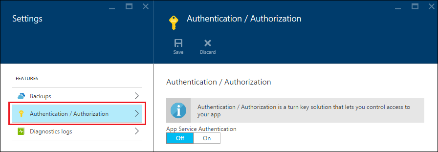

3. In the **Authentication / Authorization** blade, click **On**.

4. Select one of the options from the **Action to take when request is not authenticated** drop-down list.

	* If you want only authenticated calls to reach your API app, choose one of the **Log in with ...** options. This option enables you to protect the API app without writing any code that runs in it.

	* If you want all calls to reach your API app, choose **Allow request (no action)**. You can use this option to direct unauthenticated callers to a choice of authentication providers. With this option you have to write code to handle authorization.

	For more information, see [Authentication and authorization for API Apps in Azure App Service](app-service-api-authentication.md#multiple-protection-options).

5. Select one or more of the **Authentication Providers**.

	The image shows	choices that require all callers to be authenticated by Azure AD.
 
	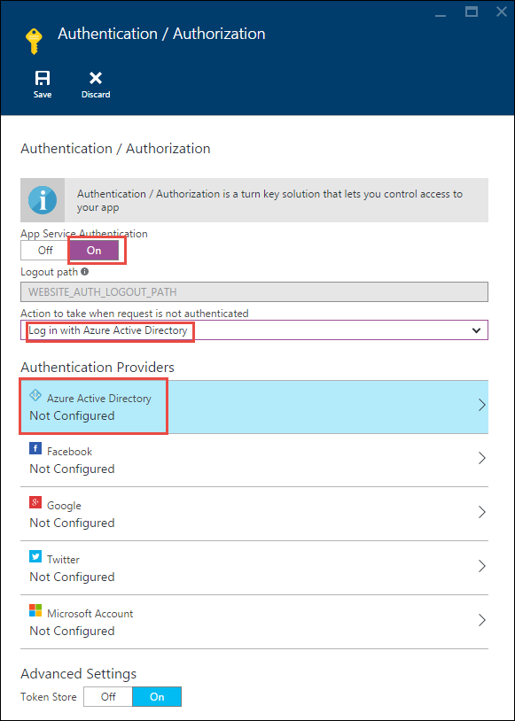

	When you choose an authentication provider, the portal displays a configuration blade for that provider. 

	For detailed instructions that explain how to configure the authentication provider configuration blades, see [How to configure your App Service application to use Azure Active Directory login](../app-service-mobile/app-service-mobile-how-to-configure-active-directory-authentication.md). (The link goes to an article about Azure AD, but the article itself contains tabs that link to articles for the other authentication providers.)

7. When you're done with the authentication provider configuration blade, click **OK**.

7. In the **Authentication / Authorization** blade, click **Save**.

When this is done, App Service authenticates all API calls before they reach the API app. The authentication services work the same for all languages that App service supports, including .NET, Node.js, and Java. 

To make authenticated API calls, the caller includes the authentication provider's OAuth 2.0 bearer token in the Authorization header of HTTP requests. The token can be acquired by using the authentication provider's SDK.

##  Continuing the .NET API Apps tutorials

If you are following the Node.js or Java tutorials for API apps, skip to the next article, [service principal authentication for API apps](app-service-api-dotnet-service-principal-auth.md). 

If you are following the .NET tutorial series for API apps and have already deployed the sample application as directed in the [first](app-service-api-dotnet-get-started.md) and [second](app-service-api-cors-consume-javascript.md) tutorials, skip to the [Set up authentication in App Service and Azure AD](#azureauth) section.

If you want to follow this tutorial without going through the first and second tutorials, do the following steps which explain how to get started by using an automated process to deploy the sample application.

>[AZURE.NOTE] The following steps get you to the same starting point as if you did the first two tutorials, with one exception: Visual Studio won't already know which web app or API app that each project gets deployed to. That means you won't have exact instructions in this tutorial that explain how to deploy to the right targets. If you're not comfortable with figuring out how to do the deployment steps on your own, it's better to follow the tutorial series from the [first tutorial](app-service-api-dotnet-get-started.md) than to start with this automated deployment process.

1. Make sure that you have all of the prerequisites listed in the [first tutorial](app-service-api-dotnet-get-started.md). In addition to the prerequisites listed, these authentication tutorials assume that you have worked with App Service web apps and API apps in Visual Studio and the Azure portal.

2. Click the **Deploy to Azure** button in the [To Do List sample repository readme file](https://github.com/azure-samples/app-service-api-dotnet-todo-list/blob/master/readme.md) to deploy the API apps and the web app. Make a note of the Azure resource group that gets created, as you can use this later to look up web app and API app names.
 
3. Download or clone the [To Do List sample repository](https://github.com/Azure-Samples/app-service-api-dotnet-todo-list) to get the code that you'll work with locally in Visual Studio.

##  Set up authentication in App Service and Azure AD

You now have the application running in Azure App Service without requiring that users be authenticated. In this section you add authentication by doing the following tasks:

* Configure App Service to require Azure Active Directory (Azure AD) authentication for calling the middle tier API app.
* Create an Azure AD application.
* Configure the Azure AD application to send the bearer token after logon to the AngularJS front end. 

If you run into problems while following the tutorial directions, see the [Troubleshooting](#troubleshooting) section at the end of the tutorial. 
 
### Configure authentication for the middle tier API app

1. In the [Azure portal](https://portal.azure.com/), navigate to the **Settings** blade of the API app that you created for the ToDoListAPI project, find the **Features** section, and then click **Authentication / Authorization**.

	

3. In the **Authentication / Authorization** blade, click **On**.

4. In the **Action to take when request is not authenticated** drop-down list, select **Log in with Azure Active Directory**.

	This option ensures that no unauathenticated requests will reach the API app. 

5. Under **Authentication Providers**, click **Azure Active Directory**.

	

6. In the **Azure Active Directory Settings** blade, click **Express**

	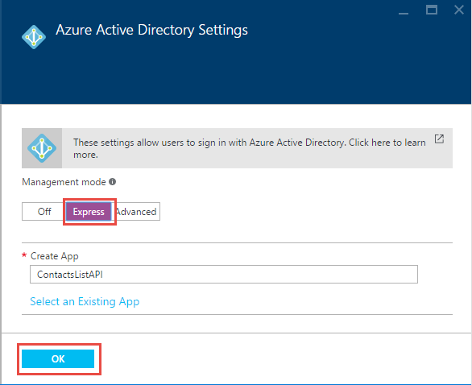

	With the **Express** option, App Service can automatically create an Azure AD application in your Azure AD [tenant](https://msdn.microsoft.com/en-us/library/azure/jj573650.aspx#BKMK_WhatIsAnAzureADTenant). 

	You don't have to create a tenant, because every Azure account automatically has one.

7. Under **Management mode**, click **Create New AD App** if it isn't already selected, and notice the value that is in the **Create App** text box; you'll look up this AAD application in the Azure classic portal later.

	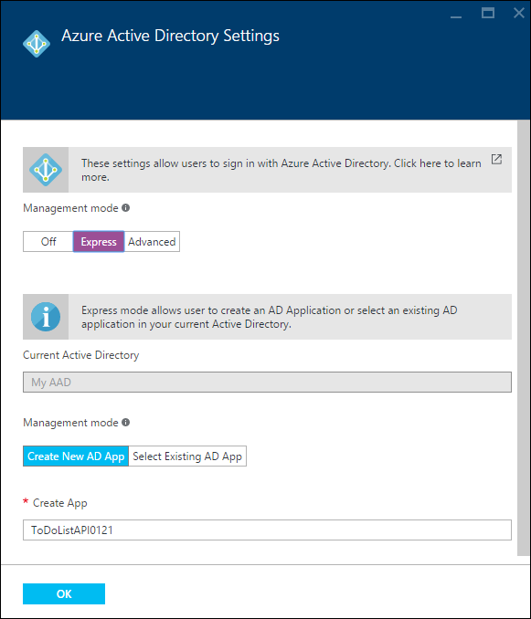

	Azure will automatically create an Azure AD application with the indicated name in your Azure AD tenant. By default, the Azure AD application is named the same as the API app. If you prefer, you can enter a different name.
 
7. Click **OK**.

7. In the **Authentication / Authorization** blade, click **Save**.

	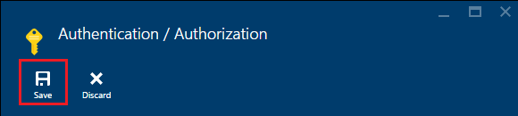

Now only users in your Azure AD tenant can call the API app.

### Optional: Test the API app

1. In a browser go to the URL of the API app: in the **API app** blade in the Azure portal, click the link under **URL**.  

	You are redirected to a login screen because unauthenticated requests are not allowed to reach the API app.

	If your browser goes to the "successfully created" page, the browser might already be logged on -- in that case, open an InPrivate or Incognito window and go to the API app's URL.

2. Log on using credentials for a user in your Azure AD tenant.

	When you're logged on, the "successfully created" page appears in the browser.

9. Close the browser.

### Configure the Azure AD application

When you configured Azure AD authentication, App Service created an Azure AD application for you. By default the new Azure AD application was configured to provide the bearer token to the API app's URL. In this section you configure the Azure AD application to provide the bearer token to the AngularJS front end instead of directly to the middle tier API app. The AngularJS front end will send the token to the API app when it calls the API app.

>[AZURE.NOTE] To keep the process as simple as possible, this tutorial uses a single Azure AD application for both the front end and the middle tier API app. Another option is to use two Azure AD applications. In that case you would have to give the front end's Azure AD application permission to call the middle tier's Azure AD application. This multi-application approach would give you more granular control over permissions to each tier.

11. In the [Azure classic portal](https://manage.windowsazure.com/), go to **Azure Active Directory**.

	You have to use the classic portal because certain Azure Active Directory settings that you need access to are not yet available in the current Azure portal.

12. On the **Directory** tab, click your AAD tenant.

	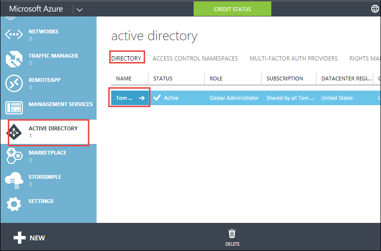

14. Click **Applications > Applications my company owns**, and then click the check mark.

	You might also have to refresh the page to see the new application.

15. In the list of applications, click the name of the one that Azure created for you when you enabled authentication for your API app.

	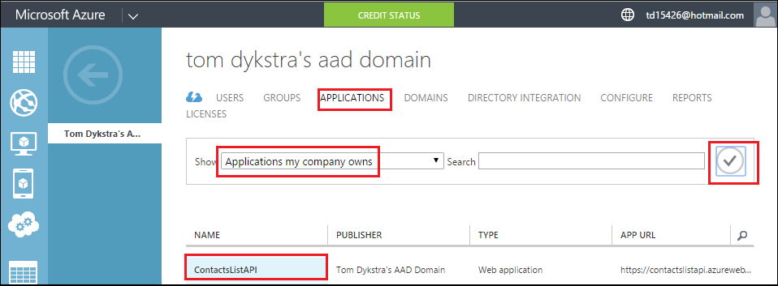

16. Click **Configure**.

	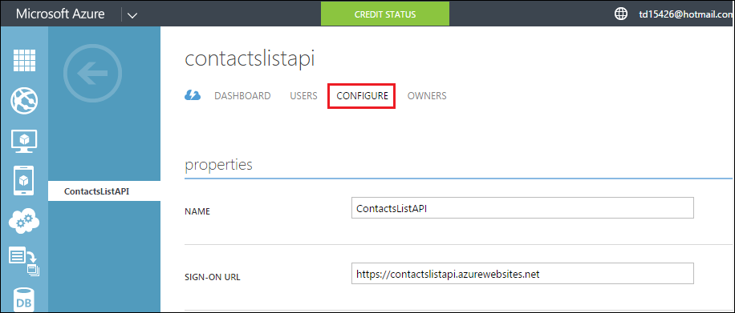

17. Set **Sign-on URL** to the URL for your AngularJS web app, no trailing slash.

	For example: https://todolistangular.azurewebsites.net

	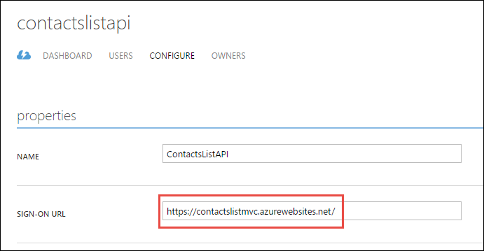

17. Set **Reply URL** to the URL for your web app, no trailing slash.

	For example: https://todolistsangular.azurewebsites.net

16. Click **Save**.

	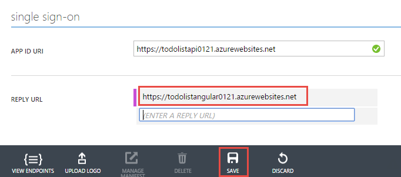

15. At the bottom of the page, click **Manage manifest > Download manifest**.

	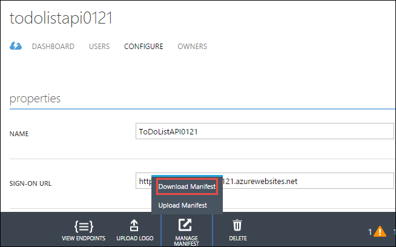

17. Download the file to a location where you can edit it.

16. In the downloaded manifest file, search for the  `oauth2AllowImplicitFlow` property. Change the value of this property from `false` to `true`, and then save the file.

	This setting is required for access from a JavaScript single-page application. It enables the Oauth 2.0 bearer token to be returned in the URL fragment.

16. Click **Manage manifest > Upload manifest**, and upload the file that you updated in the preceding step.

	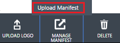

17. Copy the **Client ID** value and save it somewhere you can get it from later.

## Configure the ToDoListAngular project to use authentication

In this section you change the AngularJS front end so that it uses Active Directory Authentication Library (ADAL) for JS to acquire a bearer token for the logged-on user from Azure AD. The code will include the token in HTTP requests sent to the middle tier, as shown in the following diagram. 

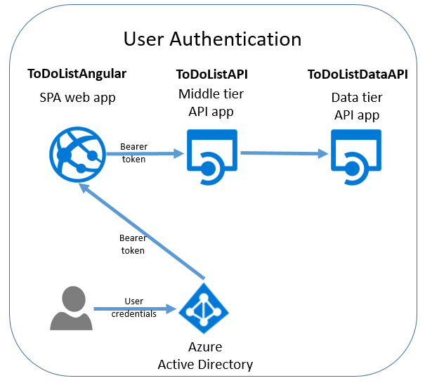

Make the following changes to files in the ToDoListAngular project.

1. Open the *index.html* file.

2. Uncomment the lines that reference the Active Directory Authentication Library (ADAL) for JS scripts.

		
		

1. Open the *app/scripts/app.js* file.

2. Comment out the block of code marked for "without authentication" and uncomment the block of code marked for "with authentication".

	This change references the ADAL JS authentication provider and provides configuration values to it. In the following steps you set the configuration values for your API app and Azure AD application.

8. In the code that sets the `endpoints` variable, set the API URL to the URL of the API app that you created for the ToDoListAPI project, and set the Azure AD application ID to the client ID that you copied from the Azure classic portal.

	The code is now similar to the following example.

		var endpoints = {
		    "https://todolistapi0121.azurewebsites.net/": "1cf55bc9-9ed8-4df31cf55bc9-9ed8-4df3"
		};

9. In the call to `adalProvider.init`, set `tenant` to your tenant name and `clientId` to same value you used in the previous step.

	The code is now similar to the following example.

		adalProvider.init(
		    {
		        instance: 'https://login.microsoftonline.com/', 
		        tenant: 'contoso.onmicrosoft.com',
		        clientId: '1cf55bc9-9ed8-4df31cf55bc9-9ed8-4df3',
		        extraQueryParameter: 'nux=1',
		        endpoints: endpoints
		    },
		    $httpProvider
		    );

	These changes to `app.js` specify that the calling code and the called API are in the same Azure AD application.

1. Open the *app/scripts/homeCtrl.js* file.

2. Comment out the block of code marked for "without authentication" and uncomment the block of code marked for "with authentication".

1. Open the *app/scripts/indexCtrl.js* file.

2. Comment out the block of code marked for "without authentication" and uncomment the block of code marked for "with authentication".

### Deploy the ToDoListAngular project to Azure

8. In **Solution Explorer**, right-click the ToDoListAngular project, and then click **Publish**.

9. Click **Publish**.

	Visual Studio deploys the project and opens a browser to the web app's base URL. This will show a 403 error page, which is normal for an attempt to go to a Web API base URL from a browser.

	You still have to make a change to the middle tier API app before you can test the application.

10. Close the browser.

## Configure the ToDoListAPI project to use authentication

Currently the ToDoListAPI project sends "*" as the `owner` value to ToDoListDataAPI. In this section you change the code to send the ID of the logged-on user.

Make the following changes in the ToDoListAPI project.

1. Open the *Controllers/ToDoListController.cs* file, and uncomment the line in each action method that sets `owner` to the Azure AD `NameIdentifier` claim value. For example:

		owner = ((ClaimsIdentity)User.Identity).FindFirst(ClaimTypes.NameIdentifier).Value;

	**Important**: Don't uncomment code in the `ToDoListDataAPI` method; you'll do that later for the service principal authentication tutorial.

### Deploy the ToDoListAPI project to Azure

8. In **Solution Explorer**, right-click the ToDoListAPI project, and then click **Publish**.

9. Click **Publish**.

	Visual Studio deploys the project and opens a browser to the API app's base URL.

10. Close the browser.

### Test the application

9. Go to the URL of the web app, **using HTTPS, not HTTP**.

8. Click the **To Do List** tab.

	You are prompted to log in.

9. Log in with the credentials of a user in your AAD tenant.

10. The **To Do List** page appears.

	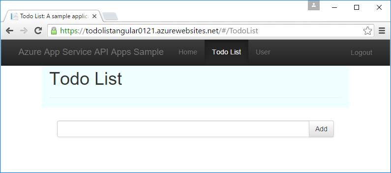

	No to-do items are displayed because until now they have all been for owner "*". Now the middle tier is requesting items for the logged-on user, and none have been created yet.

11. Add new to-do items to verify that the application is working.

12. In another browser window, go to the Swagger UI URL for the ToDoListDataAPI API app and click **ToDoList > Get**. Enter an asterisk for the `owner` parameter, and then click **Try it out**.

	The response shows that the new to-do items have the actual Azure AD user ID in the Owner property.

	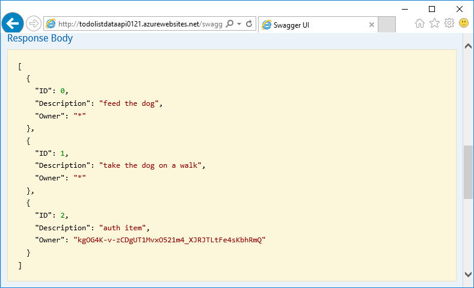

## Building the projects from scratch

The two Web API projects were created by using the **Azure API App** project template and replacing the default Values controller with a ToDoList controller. 

For information about how to  create an AngularJS single-page application with a Web API 2 back end, see  [Hands On Lab: Build a Single Page Application (SPA) with ASP.NET Web API and Angular.js](http://www.asp.net/web-api/overview/getting-started-with-aspnet-web-api/build-a-single-page-application-spa-with-aspnet-web-api-and-angularjs). For information about how to add Azure AD authentication code, see the following resources:

* [Securing AngularJS Single Page Apps with Azure AD](../active-directory/active-directory-devquickstarts-angular.md).
* [Introducing ADAL JS v1](http://www.cloudidentity.com/blog/2015/02/19/introducing-adal-js-v1/)

## Troubleshooting

[AZURE.INCLUDE [troubleshooting](../../includes/app-service-api-auth-troubleshooting.md)]

* Make sure that you don't confuse ToDoListAPI (middle tier) and ToDoListDataAPI (data tier). For example, verify that you added authentication to the middle tier API app, not the data tier. 
* Make sure that the AngularJS source code references the middle tier API app URL (ToDoListAPI, not ToDoListDataAPI)and the correct Azure AD client ID. 

## Next steps

In this tutorial you learned how to use App Service authentication for an API app and how to call the API app by using the ADAL JS library. In the next tutorial you'll learn how to [secure access to your API app for service-to-service scenarios](app-service-api-dotnet-service-principal-auth.md).

