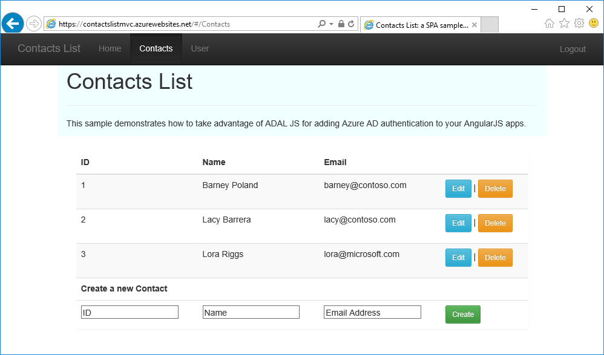
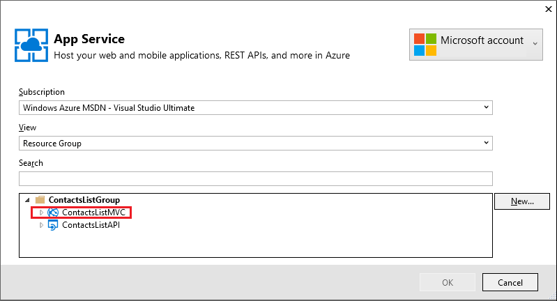
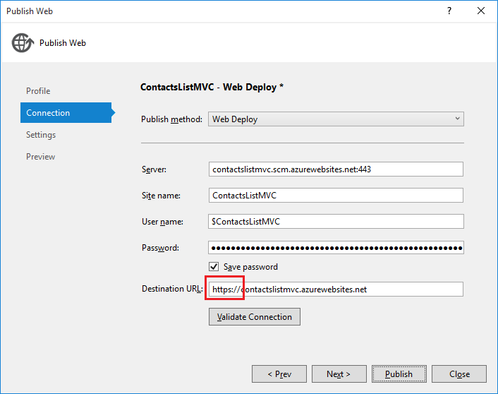

<properties
	pageTitle="User authentication for API Apps in Azure App Service | Microsoft Azure"
	description="Learn how to protect an API app in Azure App Service by allowing access only to authenticated users."
	services="app-service\api"
	documentationCenter=".net"
	authors="tdykstra"
	manager="wpickett"
	editor=""/>

<tags
	ms.service="app-service-api"
	ms.workload="na"
	ms.tgt_pltfrm="dotnet"
	ms.devlang="na"
	ms.topic="hero-article"
	ms.date="11/30/2015"
	ms.author="tdykstra"/>

# User authentication for API Apps in Azure App Service

[AZURE.INCLUDE [app-service-api-get-started-selector](../../includes/app-service-api-get-started-selector.md)]

## Overview

This tutorial shows how to use the authentication and authorization features of Azure App Service to protect an API app, and how to consume the API app on behalf of end users. The authentication provider shown in the tutorial is Azure Active Directory, the API is ASP.NET Web API, and the client is an AngularJS single page application running in a browser.

 
## Authentication and authorization in App Service

For an introduction to authentication features used in this tutorial, see the previous tutorial in this series, [authentication and authorization for API Apps in Azure App Service](app-service-api-dotnet-get-started.md).

## How to follow this tutorial

This tutorial builds on a sample application that you download and create an API app for in the [first tutorial of the API Apps and ASP.NET getting started series](app-service-api-dotnet-get-started.md).

## The ContactsList.Angular.AAD sample project

In the [ContactsList sample application](https://github.com/Azure-Samples/app-service-api-dotnet-contact-list), the ContactsList.Angular.AAD project is an AngularJS client that includes code for working with Azure Active Directory. The code is based on an AAD sample that can be found in the [Azure-Samples/active-directory-angularjs-singlepageapp-dotnet-webapi](https://github.com/Azure-Samples/active-directory-angularjs-singlepageapp-dotnet-webapi) repository.

The code in the ContactsList.Angular.AAD project is structured differently than the simpler ContactsLists.Angular project. The code that calls the API is in the *app/scripts/contactsSvc.js* file in the ContactsList.Angular.AAD project. 

		angular.module('contactsListApp')
		.factory('contactsSvc', ['$http', function ($http) {
		    //var apiEndpoint = "https://{your api app name}.azurewebsites.net";
		    var apiEndpoint = "https://localhost:44300";
		
		    $http.defaults.useXDomain = true;
		    delete $http.defaults.headers.common['X-Requested-With']; 
		
		    return {
		        getItems: function () {
		            return $http.get(apiEndpoint + '/api/contacts');
		        },
		        getItem : function(id){
		            return $http.get(apiEndpoint + '/api/contacts/' + id);
		        },
		        postItem : function(item){
		            return $http.post(apiEndpoint + '/api/contacts', item);
		        },
		        putItem : function(item){
		            return $http.put(apiEndpoint + '/api/contacts/', item);
		        },
		        deleteItem : function(id){
		            return $http({
		                method: 'DELETE',
		                url: apiEndpoint + '/api/contacts/' + id
		            });
		        }
		    };
		}]);

Here, the `Get` method is labeled `getItems`.  In the controller (*app/scripts/contactsCtrl.js*), `getItems` is wired up to `$scope.populate`.

		$scope.populate = function () {
		    contactsSvc.getItems().then(function (results) {
		        $scope.contactsList = results.data;
		        $scope.loadingMessage = "";
		    }, function (err) {
		        $scope.loadingMessage = "";
		        $scope.error = "Error: " + err;
		    });
		};

In the view (*app/views/Contacts.html*), $scope.populate is called on initialization.

		

The additional code for logging in and including an authorization token with API requests is provided by the [Azure Active Directory Authentication Library for JavaScript](https://github.com/AzureAD/azure-activedirectory-library-for-js), in the *adal.js* and *adal-angular.js* files. 

In the *app.js* file, the code passes configuration information and the `$http` provider to the `adalProvider.init` function. Configuration information includes the AAD application client ID that pertains to each API endpoint and the client ID that pertains to this AngularJS app. The `init` function adds interceptors to the `$http` provider, that these add the authorization token to requests.

		var endpoints = { 
		    //"https://{your api app name}.azurewebsites.net/": "{your client id}"
		    "https://localhost:44300/": "{your client id}"
		};

		adalProvider.init(
		    {
		        instance: 'https://login.microsoftonline.com/', 
		        tenant: '{your tenant url}',
		        clientId: '{your client id}',
		        extraQueryParameter: 'nux=1',
		        endpoints: endpoints
		        //cacheLocation: 'localStorage', // enable this for 
		    },
		    $httpProvider
		    );

## Set up authentication and authorization in Azure

1. In the [Azure portal](https://portal.azure.com/), navigate to the **API App** blade of the API app that you want to protect so that only authenticated users can call it. (For this tutorial, choose the API app to which you deployed the ContactsList.API project.)

2. Click **Settings**

2. Find the **Features** section, and then click **Authentication/ Authorization**.

	

3. In the **Authentication / Authorization** blade, click **On**.

4. In the **Action to take when request is not authenticated** drop-down list, select **Log in with Azure Active Directory**.

5. Under **Authentication Providers**, click **Azure Active Directory**.

	

6. In the **Azure Active Directory Settings** blade, click **Express**

	

	"Express" here means that Azure will automatically create an AAD application in your AAD tenant. Make a note of the name of the new AAD application, as you'll select it later when you go to the Azure classic portal to get the client ID of the new AAD application.

7. Click **OK**.

10. In the **Authentication / Authorization** blade, click **Save**.

8. To verify that the API app is now protected, go to the API app's URL + `/swagger` as you did in the first tutorial to use the Swagger UI. 

	This time you are redirected to a logon page.

	

11. In the [Azure classic portal](https://manage.windowsazure.com/), go to **Azure Active Directory**.

	You have to go to the classic portal because certain Azure Active Directory settings that you need access to are not yet available in the current Azure portal.

12. On the **Directory** tab, click your AAD tenant.

	

14. Click **Applications > Applications my company owns**, and then click the check mark.

	You might also have to refresh the page to see the new application.

15. In the list of applications, click the name of the one that Azure created for you when you enabled authentication for your API app.

	

16. Click **Configure**.

	

15. At the bottom of the page, click **Manage manifest > Download manifest**, and save the file in a location where you can edit it.

16. In the downloaded manifest file, search for the  `oauth2AllowImplicitFlow` property. Change the value of this property from `false` to `true`, and then save the file.

	This setting is required for access from a JavaScript single-page application. It enables the Oauth 2.0 bearer token to be returned in the URL fragment.

16. Click **Manage manifest > Upload manifest**, and upload the file that you updated in the preceding step.

17. Keep this page open so you can copy and paste values from it and update values on the page in later steps of the tutorial.

## Configure the ContactsList.Angular.AAD project to call the Azure API app

The following instructions explain how to deploy the application to Azure and run it there, but with minor changes you could run locally. The sample code contains localhost URL endpoints. If you want to run locally, set up the projects for SSL, use the localhost SSL URLs in project code, and use the localhost SSL URLs in the AAD application configuration. While running locally, the AngularJS code will only allow logged on users to call the API, but unauthenticated callers from other clients could call the API.

1. In the ContactsList.Angular.AAD project, open the *app/scripts/app.js* file.

8. In the code that sets the `endpoints` variable, comment out the localhost endpoint and uncomment the Azure endpoint.

10. Replace "yourclientid" with the actual value of the AAD application's client ID from the classic portal's **Configure** tab for the AAD application.

2. Replace "{your api app name}" with the name of the API app that you deployed the ContactsList.API project to.

	The code is now similar to the following example.

		var endpoints = {
		    "https://contactslistapi.azurewebsites.net/": "1cf55bc9-9ed8-4df31cf55bc9-9ed8-4df3"
		    //"https://localhost:44300/": "1cf55bc9-9ed8-4df31cf55bc9-9ed8-4df3"
		};

9. Also in *app.js*, in the call to `adalProvider.init`, replace "{your tenant url}" and "{your client id}" with the actual values.

	The code will look similar to the following example:

		adalProvider.init(
		    {
		        instance: 'https://login.microsoftonline.com/', 
		        tenant: 'contoso.onmicrosoft.com',
		        clientId: '1cf55bc9-9ed8-4df31cf55bc9-9ed8-4df3',
		        extraQueryParameter: 'nux=1',
		        endpoints: endpoints
		    },
		    $httpProvider
		    );

1. In the *app/scripts/contactsSvc.js* file, make the same endpoint URL change from localhost to API app URL that you did earlier in *app.js*.

	The code is now similar to the following example.

		var apiEndpoint = "https://contactslistapi.azurewebsites.net";
		//var apiEndpoint = "https://localhost:44300";

## Configure the AAD application for the Azure web app

1. In the **Configure** tab for the AAD application in the classic portal, in the **Sign-on URL** field, delete the URL that is already there and replace it with the web app's base URL, including the trailing slash. (Note that this is the URL of the web app that will run the AngularJS code, not the API app's URL.)

	

3. In the **Reply URL** field, replace the URL that is already there with the web app's base URL.

	

4. Click **Save**.

## Deploy the ContactsList.Angular.AAD project to Azure

8. In **Solution Explorer**, right-click the ContactsList.Angular.AAD project, and then click **Publish**.

9. Click **Microsoft Azure App Service**.

10. In the **App Service** dialog box, in the **Subscription** drop-down list, choose your subscription.

11. Expand the resource group that you created for this tutorial, and select the web app that you created in the second tutorial.

	

12. Click **OK**.

12. In the **Publish Web** wizard, click the **Connection** tab, and then in the **Destination URL** box change `http://` to `https://`

	

	This setting determines what URL the default browser will be opened to after a successful deployment.

12. In the **Publish Web** wizard, click the **Settings** tab, expand **File Publish Options**, and select the **Remove additional files at destination** check box.

7. Click **Publish**.

	Visual Studio deploys the project and opens a browser to the app's home page.

## Test the AngularJS web app in Azure

8. Click the **Contacts** tab.

	You are prompted to log in.

9. Log in with the credentials of a user in your AAD tenant.

10. The **Contacts** page appears.

	

The front-end can now call the API on behalf of an authenticated user, but unauthenticated users can't call the API.

## Next steps

In this tutorial you used App Service Authentication/Authorization to restrict access to an API app so that only authenticated users can call it. In the next tutorial in the series you'll learn how to [restrict access to your API app for service-to-service scenarios](app-service-api-dotnet-service-principal-auth.md).
