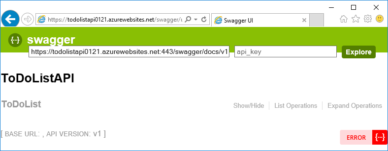

<properties
	pageTitle="User authentication for API Apps in Azure App Service | Microsoft Azure"
	description="Learn how to protect an API app in Azure App Service by allowing access only to authenticated users."
	services="app-service\api"
	documentationCenter=".net"
	authors="tdykstra"
	manager="wpickett"
	editor=""/>

<tags
	ms.service="app-service-api"
	ms.workload="na"
	ms.tgt_pltfrm="dotnet"
	ms.devlang="na"
	ms.topic="hero-article"
	ms.date="01/18/2016"
	ms.author="tdykstra"/>

# User authentication for API Apps in Azure App Service

[AZURE.INCLUDE [app-service-api-get-started-selector](../../includes/app-service-api-get-started-selector.md)]

## Overview

In this article you'll learn:

* How to protect an App Service API app so that only authenticated users can call it.
* How to configure an authentication provider, with details for Azure Active Directory (Azure AD).
* How to consume a protected API app by using the [Active Directory Authentication Library (ADAL) for JavaScript](https://github.com/AzureAD/azure-activedirectory-library-for-js).

The article contains two sections:

* The [How to configure user authentication in Azure App Service](#authconfig) section explains in general how to configure user authentication for any API app and applies equally to .NET, Node.js, and Java.

* The [remainder of the article](#tutorialstart) guides you through configuring a .NET sample application running in App Service so that it uses Azure Active Directory for user authentication. 

##  How to configure user authentication in Azure App Service

1. In the [Azure portal](https://portal.azure.com/), navigate to the **API App** blade of the API app that you want to protect, and then click **Settings**

2. In the **Settings** blade, find the **Features** section, and then click **Authentication/ Authorization**.

	

3. In the **Authentication / Authorization** blade, click **On**.

4. Select one of the options from the **Action to take when request is not authenticated** drop-down list.

	* If you want only authenticated calls to reach your API app, choose one of the **Log in with ...** options. This option enables you to protect the API app without writing any code that runs in it.

	* If you want all calls to reach your API app, choose **Allow request (no action)**. You can use this option to direct unauthenticated callers to a choice of authentication providers. With this option you have to write code to handle authorization.

	For more information, see [Authentication and authorization for API Apps in Azure App Service](app-service-api-authentication.md#multiple-protection-options).

5. Select one or more of the **Authentication Providers**.

	The image shows	choices that require all callers to be authenticated by Azure AD.
 
	

	When you choose an authentication provider, the portal displays a configuration blade for that provider. 

	For detailed instructions that explain how to configure the authentication provider configuration blades, see [How to configure your App Service application to use Azure Active Directory login](../app-service-mobile/app-service-mobile-how-to-configure-active-directory-authentication.md). (The link goes to an article about Azure AD, but the article itself contains tabs that link to articles for the other authentication providers.)

7. When you're done with the authentication provider configuration blade, click **OK**.

7. In the **Authentication / Authorization** blade, click **Save**.

When this is done, App Service authenticates all API calls before they reach the API app. The authentication services work the same for all languages that App service supports, including .NET, Node.js, and Java. 

To make authenticated API calls, the caller includes the authentication provider's OAuth 2.0 bearer token in the Authorization header of HTTP requests. The token can be acquired by using the authentication provider's SDK.

##  Continuing the .NET getting-started tutorials

If you are following the Node.js or Java getting-started series for API apps, skip to the next article, [service principal authentication for API apps](app-service-api-dotnet-service-principal-auth.md). 

If you are following the .NET getting-started series for API apps and have already deployed the sample application as directed in the [first](app-service-api-dotnet-get-started.md) and [second](app-service-api-cors-consume-javascript.md) tutorials, skip to the [Configure authentication](#azureauth) section.

If you didn't do the the first and second tutorials and you want to follow this one, see the [Prerequisites](app-service-api-dotnet-get-started.md#prerequisites) for the series, and then do the following steps to download and deploy the sample application. These instructions are an abbreviated version of what the first two tutorials have you do.

#### Download the sample application

1. Download the [Azure-Samples/app-service-api-dotnet-todo-list](https://github.com/Azure-Samples/app-service-api-dotnet-to-do-list) repository.

2. Open the ToDoList solution in Visual Studio 2015, and build the solution to restore the NuGet packages.

#### Deploy the ToDoListDataAPI project to a new API app

1. In the ToDoListDataAPI project, open the *App_Start/SwaggerConfig.cs* file, and uncomment the **EnableSwaggerUi** code.

1. In **Solution Explorer**, right-click the ToDoListDataAPI project, and then click **Publish**.

3.  In the **Profile** step of the **Publish Web** wizard, click **Microsoft Azure App Service**.

4. In the **App Service** dialog box, choose the Azure **Subscription** you want to use, and then click **New**.

3. In the **Hosting** tab of the **Create App Service** dialog box, click **Change Type**, and then click **API App**.

	**Note:** This step is easy to miss; make sure you don't miss it, or you will have to redo the entire sequence of deployment steps. 

4. Enter an **API App Name** such as ToDoListDataAPI plus a number to make it unique in the *azurewebsites.net* domain, for example:  ToDoListDataAPI1230.

6. In the **Resource Group** drop-down, enter a name such as TodoListGroup to create a new resource group. 

4. In the **App Service Plan** drop-down, click **New** and enter the required information on the **Configure App Service Plan** dialog box.

14. Click **Create**.

	The **Publish Web** wizard opens on the **Connection** tab.

8. Click **Publish**.

	The "API app successfully created" page appears in the browser. Close the browser.

#### Deploy the ToDoListAPI project to a new API app

1. In the ToDoListAPI project, open *Controllers\ToDoListController.cs* and change `http://localhost:45914` to `https://{your ToDoListDataAPI app name}.azurewebsites.net`.  For example, if you named the API app "ToDoListDataAPI0121", the code would look like this example: 

		private ToDoListDataAPI db = new ToDoListDataAPI(new Uri("https://todolistdataapi0121.azurewebsites.net"));

3. Follow the same procedure for deploying the ToDoListAPI project that you followed for the ToDoListDataAPI project. Don't forget to change the type to **API App**.

#### Deploy the ToDoListAngular project to a new web app

1. In the ToDoListAngular project, open the *app/scripts/todoListSvc.js* file.

2. Comment out the line that sets `apiEndpoint` to the localhost URL, uncomment the line that sets `apiEndPoint` to an azurewebsites.net URL, and replace the placeholder with the actual name of the API app you created for ToDoListAPI.  If you named the API app ToDoListAPI0121, the code now looks like the following example.

		var apiEndPoint = 'https://todolistapi0121.azurewebsites.net';
		//var apiEndPoint = 'http://localhost:45914'

3. Follow the same procedure for deploying the ToDoListAPI project that you followed for the ToDoListDataAPI project, **except do not change the type from Web App to API App**.

#### Configure CORS for the API app in Azure

8. Go to the [Azure portal](https://portal.azure.com/), and navigate to the API app that you created for the ToDoListAPI project.

10. In the **API app** blade, click **Settings**.

11. Find the **API** section, and then click **CORS**.

12. In the text box, enter the URL that you want to allow calls to come from, which for this tutorial is the URL of the web app that you created for the ToDoListAngular project. For example, enter "https://todolistangular.azurewebsites.net".

13. Click **Save**.

9. Open a browser to the HTTPS URL of the web app, and verify that you can view, add, edit, and delete to-do items. 

##  Set up authentication in Azure

At this point you have the application running in Azure App Service without requiring that users be authenticated. In this section you add authentication by doing the following tasks:

* Configure App Service to require Azure Active Directory (Azure AD) authentication for calling the middle tier API app.
* Create an Azure AD application.
* Configure the Azure AD application to send the bearer token after logon to the AngularJS front end. 

When you're done, the AngularJS front end will acquire a bearer token for the logged-on user from Azure AD and will include the token in HTTP requests sent to the middle tier, as shown in the following diagram. 

### Configure authentication in App Service

1. In the [Azure portal](https://portal.azure.com/), navigate to the **API App** blade of the API app that you created for the ToDoListAPI project.

2. Click **Settings**

2. In the **Settings** blade, find the **Features** section, and then click **Authentication / Authorization**.

	

3. In the **Authentication / Authorization** blade, click **On**.

4. In the **Action to take when request is not authenticated** drop-down list, select **Log in with Azure Active Directory**.

	This option ensures that no unauathenticated requests will reach the API app. 

5. Under **Authentication Providers**, click **Azure Active Directory**.

	

6. In the **Azure Active Directory Settings** blade, click **Express**

	

	With the **Express** option, App Service can automatically create an Azure AD application in your Azure AD [tenant](https://msdn.microsoft.com/en-us/library/azure/jj573650.aspx#BKMK_WhatIsAnAzureADTenant). 

	You don't have to create a tenant, because every Azure account automatically has one.

7. Under **Management mode**, click **Create New AD App**.

	The portal plugs the **Create App** input box with a default value. 
	
	

8. Make a note of the value that is in the **Create App** input box; you'll look up this AAD application in the Azure classic portal later.

	Azure will automatically create an Azure AD application in your Azure AD tenant. By default, the Azure AD application is named the same as the API app. If you prefer, you can enter a different name.
 
7. Click **OK**.

7. In the **Authentication / Authorization** blade, click **Save**.

Now only users in your Azure AD tenant can access the API app.

### Optional: Test the API app

1. In a browser go to the URL of the API app: in the **API app** blade in the Azure portal, click the link under **URL**.  

	You are redirected to a login screen because unauthenticated requests are not allowed to reach the API app.

	If your browser goes to the "successfully created" page, the browser might already be logged on -- in that case, open an InPrivate or Incognito window and go to the API app's URL.

2. Log on using credentials for a user in your Azure AD tenant.

	When you're logged on, the "successfully created" page appears in the browser.

2. In the browser address bar, add /swagger to the URL and press return.

	The full URL is now `https://{API app name}.azurewebsites.net/swagger/ui/index` and the page displays the Swagger UI.

	

2. Click **ToDoList > Get > Try it out**.

	The Swagger UI calls the ToDoListAPI Get method and displays the JSON results.

	You have now validated that the TodoListAPI API app requires that callers be authenticated.

9. Close the browser.

### Configure the Azure AD application

When you configured Azure AD authentication, App Service created an Azure AD application for you. By default the new Azure AD application was configured to provide the bearer token to the API app's URL. In this section you configure the Azure AD application to provide the bearer token to the AngularJS front end instead of directly to the middle tier API app. The AngularJS front end will send the token to the API app when it calls the API app.

11. In the [Azure classic portal](https://manage.windowsazure.com/), go to **Azure Active Directory**.

	You have to use the classic portal because certain Azure Active Directory settings that you need access to are not yet available in the current Azure portal.

12. On the **Directory** tab, click your AAD tenant.

	

14. Click **Applications > Applications my company owns**, and then click the check mark.

	You might also have to refresh the page to see the new application.

15. In the list of applications, click the name of the one that Azure created for you when you enabled authentication for your API app.

	

16. Click **Configure**.

	

17. Set **Sign-on URL** to the URL for your AngularJS web app, no trailing slash.

	For example: https://todolistangular.azurewebsites.net

	

17. Set **Reply URL** to the URL for your web app, no trailing slash.

	For example: https://todolistsangular.azurewebsites.net

16. Click **Save**.

	

15. At the bottom of the page, click **Manage manifest > Download manifest**.

	

17. Download the file to a location where you can edit it.

16. In the downloaded manifest file, search for the  `oauth2AllowImplicitFlow` property. Change the value of this property from `false` to `true`, and then save the file.

	This setting is required for access from a JavaScript single-page application. It enables the Oauth 2.0 bearer token to be returned in the URL fragment.

16. Click **Manage manifest > Upload manifest**, and upload the file that you updated in the preceding step.

17. Copy the **Client ID** value and save it somewhere you can get it from later.

## Configure the ToDoListAngular project to use authentication

Make the following changes to files in the ToDoListAngular project.

1. Open the *index.html* file.

2. Uncomment the lines that reference the Active Directory Authentication Library (ADAL) for JS scripts.

		
		

1. Open the *app/scripts/app.js* file.

2. Comment out the block of code marked for "without authentication" and uncomment the block of code marked for "with authentication".

	This change references the ADAL JS authentication provider and provides configuration values to it. In the following steps you set the configuration values for your API app and Azure AD application.

8. In the code that sets the `endpoints` variable, set the API URL to the URL of the API app that you created for the ToDoListAPI project, and set the Azure AD application ID to the client ID that you copied from the Azure classic portal.

	The code is now similar to the following example.

		var endpoints = {
		    "https://todolistapi.azurewebsites.net/": "1cf55bc9-9ed8-4df31cf55bc9-9ed8-4df3"
		};

9. In the call to `adalProvider.init`, set `tenant` to your tenant name and `clientId` to same value you used in the previous step.

	The code is now similar to the following example.

		adalProvider.init(
		    {
		        instance: 'https://login.microsoftonline.com/', 
		        tenant: 'contoso.onmicrosoft.com',
		        clientId: '1cf55bc9-9ed8-4df31cf55bc9-9ed8-4df3',
		        extraQueryParameter: 'nux=1',
		        endpoints: endpoints
		    },
		    $httpProvider
		    );

	These changes to `app.js` specify that the calling code and the called API are in the same Azure AD application.

1. Open the *app/scripts/homeCtrl.js* file.

2. Comment out the block of code marked for "without authentication" and uncomment the block of code marked for "with authentication".

1. Open the *app/scripts/indexCtrl.js* file.

2. Comment out the block of code marked for "without authentication" and uncomment the block of code marked for "with authentication".

### Deploy the ToDoListAngular project to Azure

8. In **Solution Explorer**, right-click the ToDoListAngular project, and then click **Publish**.

9. Click **Publish**.

	Visual Studio deploys the project and opens a browser to the web app's base URL, but you have to make a change to the middle tier API app before you can test the application.

10. Close the browser.

## Configure the ToDoListAPI project to use authentication

Currently the ToDoListAPI project sends "*" as the `owner` value to ToDoListDataAPI. In this section you change the code to send the ID of the logged-on user.

Make the following changes in the ToDoListAPI project.

1. Open the *Controllers/ToDoListController.cs* file, and uncomment the line in each action method that sets `owner` to the Azure AD `NameIdentifier` claim value. For example:

### Deploy the ToDoListAPI project to Azure

8. In **Solution Explorer**, right-click the ToDoListAPI project, and then click **Publish**.

9. Click **Publish**.

	Visual Studio deploys the project and opens a browser to the API app's base URL.

10. Close the browser.

### Test the application

9. Go to the URL of the web app, **using HTTPS, not HTTP**.

8. Click the **To Do List** tab.

	You are prompted to log in.

9. Log in with the credentials of a user in your AAD tenant.

10. The **To Do List** page appears.

	

	No to-do items are displayed because until now they have all been for owner "*". Now the middle tier is requesting items for the logged-on user, and none have been created yet.

11. Add new to-do items to verify that the application is working.

12. In another browser window, go to the Swagger UI URL for the ToDoListDataAPI API app and click **ToDoList > Get > Try it out**.

	The response shows that the new to-do items have the actual Azure AD user ID in the Owner property.

	

## Building the projects from scratch

The two Web API projects were created by using the **Azure API App** project template and replacing the default Values controller with a ToDoList controller. 

For information about how to  create an AngularJS single-page application with a Web API 2 back end, see  [Hands On Lab: Build a Single Page Application (SPA) with ASP.NET Web API and Angular.js](http://www.asp.net/web-api/overview/getting-started-with-aspnet-web-api/build-a-single-page-application-spa-with-aspnet-web-api-and-angularjs). For information about how to add Azure AD authentication code, see the following resources:

* [Securing AngularJS Single Page Apps with Azure AD](../active-directory/active-directory-devquickstarts-angular.md).
* [Introducing ADAL JS v1](http://www.cloudidentity.com/blog/2015/02/19/introducing-adal-js-v1/)

## Troubleshooting

Most of the time, errors you encounter will be the result of incorrect or inconsistent configuration settings.  Start by double-checking all settings in the Azure Active Directory configure tab, in the AngularJS source code, and on the CORS blade in the portal. In Azure AD, download the manifest again and make sure that `oauth2AllowImplicitFlow` was successfully changed to `true`. 

For some errors, you'll get more information about what's wrong by setting [customErrors mode to Off](../app-service-web/web-sites-dotnet-troubleshoot-visual-studio.md#remoteview) 

## Next steps

In this tutorial you learned how to use App Service authentication for an API app and how to call the API app by using the ADAL JS library. In the next tutorial you'll learn how to [secure access to your API app for service-to-service scenarios](app-service-api-dotnet-service-principal-auth.md).

