<properties 
	pageTitle="Connect to on-premises SQL Server from an API app in Azure App Service using Hybrid Connections" 
	description="Create an API app on Microsoft Azure and connect it to an on-premises SQL Server database"
	services="app-service\api" 
	documentationCenter="" 
	authors="TomArcher" 
	manager="wpickett" 
	editor="jimbe"/>

<tags 
	ms.service="app-service-api" 
	ms.workload="web" 
	ms.tgt_pltfrm="na" 
	ms.devlang="na" 
	ms.topic="article" 
	ms.date="07/29/2015" 
	ms.author="tarcher"/>

# Connect to on-premises SQL Server from an API app in Azure App Service using Hybrid Connections

Hybrid Connections can connect [Azure App Service](http://go.microsoft.com/fwlink/?LinkId=529714) API apps to on-premises resources that use a static TCP port. Supported resources include Microsoft SQL Server, MySQL, HTTP Web APIs, Mobile Services, and most custom Web Services. 

In this tutorial, you will learn how to create an App Service API app in the [Azure preview](http://go.microsoft.com/fwlink/?LinkId=529715) that connects to a local on-premises SQL Server database using the new Hybrid Connection feature. The tutorial assumes no prior experience using Azure or SQL Server.

>[AZURE.NOTE] If you want to get started with Azure App Service before signing up for an Azure account, go to [Try App Service](http://go.microsoft.com/fwlink/?LinkId=523751), where you can immediately create a short-lived starter web app in App Service. No credit cards required; no commitments.

## Prerequisites

To complete this tutorial, you'll need the following products. All are available in free versions, so you can start developing Azure solutions entirely for free.    

- **Azure subscription** - For a free subscription, see [Azure Free Trial](/pricing/free-trial/). 

- **Visual Studio** - To download a free trial version of Visual Studio 2013 or Visual Studio 2015, see [Visual Studio Downloads](http://www.visualstudio.com/downloads/download-visual-studio-vs). Install one of these before continuing. (The screen shots in this tutorial were taken using Visual Studio 2013)

- **SQL Server 2014 Express with Tools** - download Microsoft SQL Server Express for free at the [Microsoft Web Platform Database page](https://www.microsoft.com/en-us/download/details.aspx?id=42299). Later in this tutorial, you'll see how to [install SQL Server](#InstallSQLDB) to ensure that it is properly configured.

- **SQL Server Management Studio Express** - This is included with the SQL Server 2014 Express with Tools download mentioned above, but if you need to install it separately, you can download and install it from the [SQL Server Express download page](https://www.microsoft.com/en-us/download/details.aspx?id=42299).

The tutorial assumes that you have an Azure subscription, that you have installed Visual Studio 2013, and that you have installed or enabled .NET Framework 3.5. The tutorial shows you how to install SQL Server 2014 Express in a configuration that works well with the Azure Hybrid Connections feature (a default instance with a static TCP port). Before starting the tutorial, download (but, do not install) SQL Server 2014 Express with Tools from the location mentioned above if you do not have SQL Server installed.

### Notes
To use an on-premises SQL Server or SQL Server Express database with a hybrid connection, TCP/IP needs to be enabled on a static port. Default instances on SQL Server use static port 1433, whereas named instances do not. 

The computer on which you install the on-premises Hybrid Connection Manager agent:

- Must have outbound connectivity to Azure over:

> <table border="1">
    <tr>
       <th><strong>Port</strong></th>
        <th>Why</th>
    </tr>
    <tr>
        <td>80</td>
        <td><strong>Required</strong> for HTTP port for certificate validation and optionally for data connectivity.</td>
    </tr>
    <tr>
        <td>443</td>
        <td><strong>Optional</strong> for data connectivity. If outbound connectivity to 443 is unavailable, TCP port 80 is used.</td>
    </tr>
	<tr>
        <td>5671 and 9352</td>
        <td><strong>Recommended</strong> but Optional for data connectivity. Note this mode usually yields higher throughput. If outbound connectivity to these ports is unavailable, TCP port 443 is used.</td>
	</tr>
</table>

- Must be able to reach the *hostname*:*portnumber* of your on-premises resource. 

The steps in this article assume that you are using the browser from the computer that will host the on-premises hybrid connection agent.

If you already have SQL Server installed in a configuration and in an environment that meets the conditions described above, you can skip ahead and start with [Create a SQL Server database on-premises](#CreateSQLDB).

## Install SQL Server Express, enable TCP/IP, and create a SQL Server database on-premises

This section shows you how to install SQL Server Express, enable TCP/IP, and create a database so that your API app will work with the [Azure preview portal](https://portal.azure.com).

### Install SQL Server Express

1. To install SQL Server Express, download the either **SQLEXPRWT_x64_ENU.exe** (64-bit version) or **SQLEXPR_x86_ENU.exe** (32-bit version) file and extract it to the desired folder. 

2. Once you have extracted the SQL Server Express installation files, run **setup.exe**.

3. When the **SQL Server Installation Center** displays, choose **New SQL Server stand-alone installation or add features to an existing installation**. 

	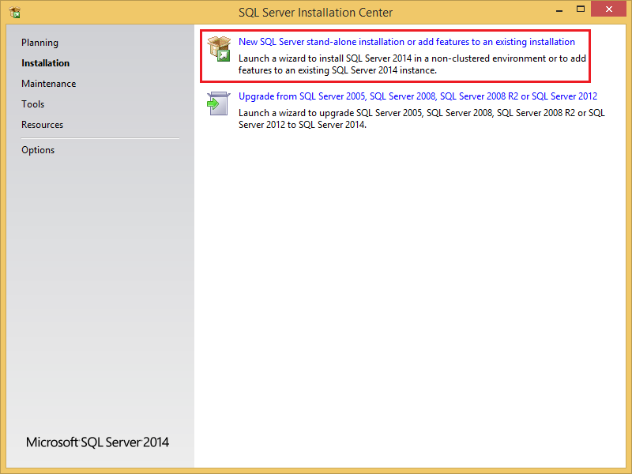

4. Follow the instructions, accepting the default choices and settings, until you get to the **Instance Configuration** page.
	
5. On the **Instance Configuration** page, choose **Default instance**, and click **Next**.
	
	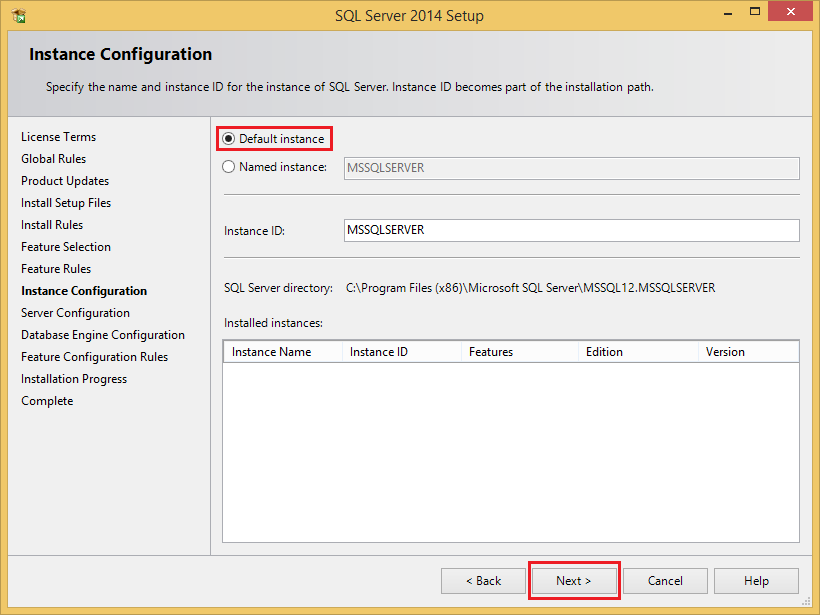
	
	The default instance of SQL Server listens for requests from SQL Server clients on static port 1433, which is what the Hybrid Connections feature requires. Named instances use dynamic ports and UDP, which are not supported by Hybrid Connections.
	
6. Accept the defaults on the **Server Configuration** page, and click **Next**.
	
7. On the **Database Engine Configuration** page, under **Authentication Mode**, choose **Mixed Mode (SQL Server authentication and Windows authentication)**, and provide a password.
	
	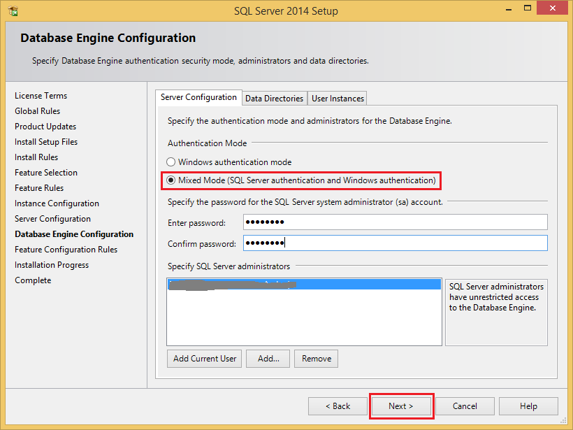
	
	In this tutorial, you will be using SQL Server authentication. Be sure to remember the password that you provide, because you will need it later.
	
8. Step through the rest of the wizard - accepting the defaults as you go - to complete the installation.

9. Close the **SQL Server Installation Center** dialog.

### Enable TCP/IP
To enable TCP/IP, you will use SQL Server Configuration Manager, which was installed when you installed SQL Server Express. Follow the steps in [Enable TCP/IP Network Protocol for SQL Server](http://technet.microsoft.com/library/hh231672%28v=sql.110%29.aspx) before continuing.

### Create a SQL Server database on-premises

1. In **SQL Server Management Studio**, connect to the SQL Server you just installed. For **Server type**, choose **Database Engine**. For **Server name**, you can use **localhost** or the name of the computer that you are using. Choose **SQL Server authentication**, and then log in with the `sa` user name, and the password that you created earlier.

	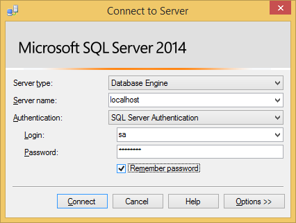
	
	If the **Connect to Server** dialog does not appear automatically, navigate to **Object Explorer** in the left pane, click **Connect**, and then click **Database Engine**.
	
2. To create a new database by using SQL Server Management Studio, right-click **Databases** in Object Explorer, and then click **New Database**.
	
	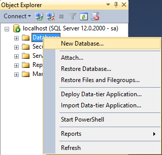
	
3. In the **New Database** dialog, enter `LocalDatabase` for the database name, and then click **OK**. 
	
	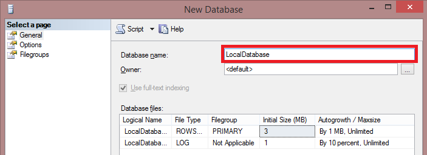
	
### Create and populate a SQL Server table

1. In the **SQL Server Management Studio** **Object Explorer**, expand the `LocalDatabase` entry.

	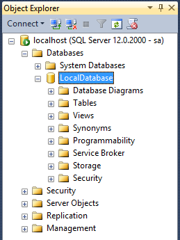

2. Right-click **Tables** and select the **Table...** option from the context menu.

	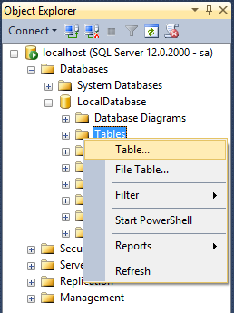

3. When the table designer grid appears, enter the column information as shown in the following figure.

	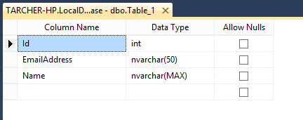

4. Press **&lt;Ctrl>S** to save the new table's definition. You will be prompted to enter a table name. Enter `Speakers` and press **OK**.

	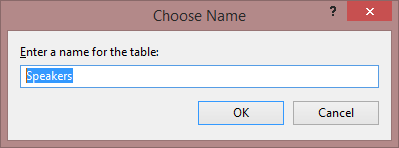

5. In **Object Explorer**, right-click the newly created `Speakers` table, and select **Edit top 200 rows** from the context menu.

	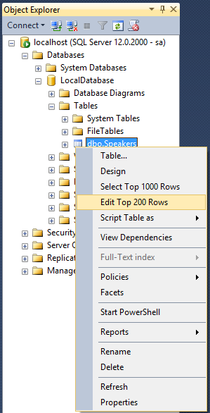

6. When the grid appears to enter/modify the table data, enter some test data as shown in the following figure.

	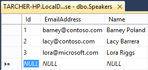

## Create and deploy the demo API app to Azure 

This section walks you through creating the demo API app.

1. Open Visual Studio 2013 and select **File > New > Project**. 

2. Select the **Visual C# > Web > ASP.NET Web Application** template, clear the **Add application insights to project** option, name the project *SpeakersList*, and then click **OK**.

	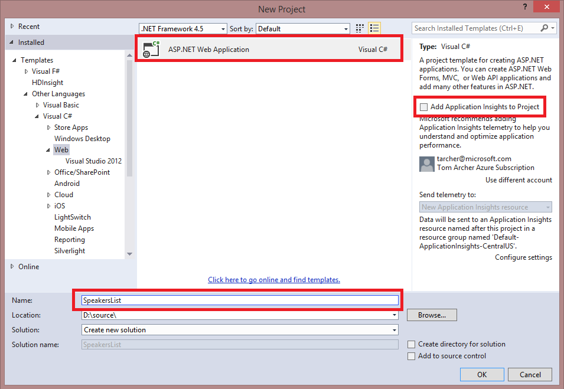

3. On the **New ASP.NET Project** dialog, select the **Azure API App** project template and then click **OK**.

	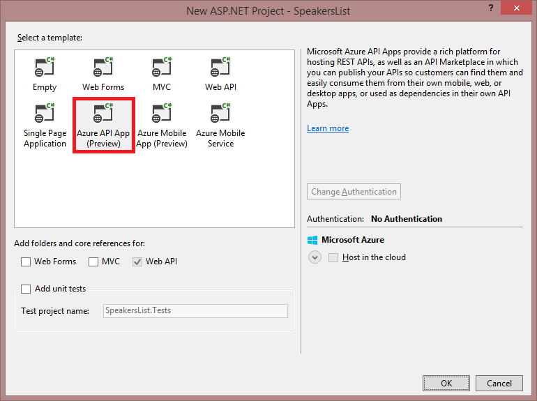

4. In the **Solution Explorer**, right-click the **Models** folder, and then select the **Add > Class...** context menu option. 

	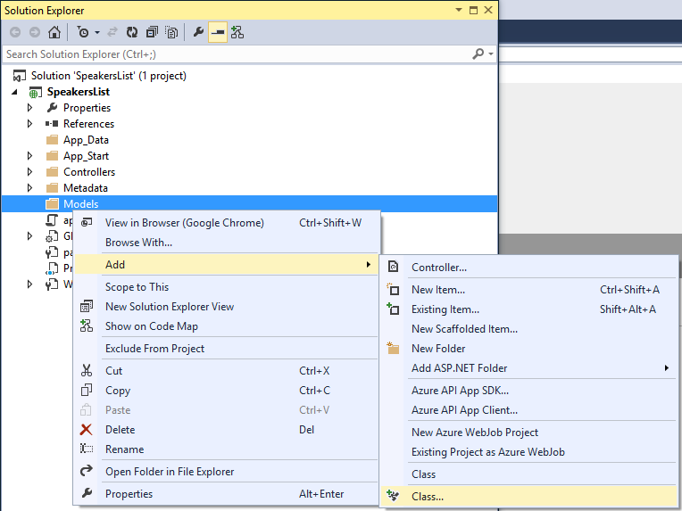 

5. Name the new file *Speaker.cs*, and then click **Add**. 

	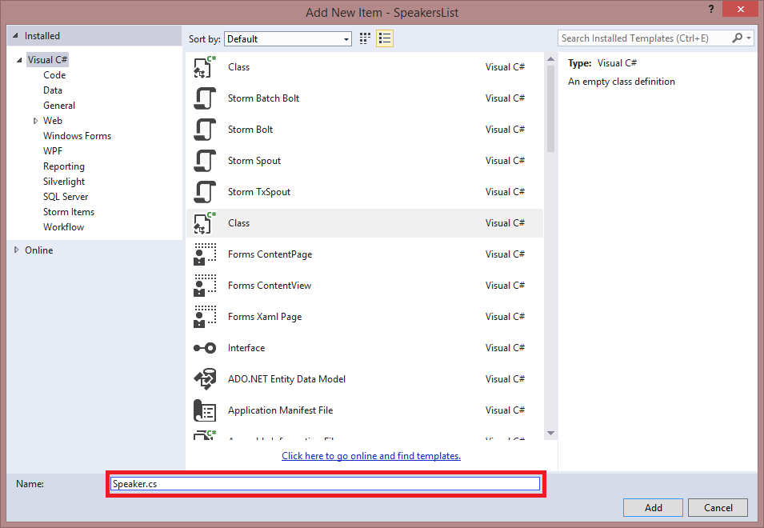 

6. Replace the entire contents of the `Speaker.cs` file with the following code. 

		namespace SpeakersList.Models
		{
			public class Speaker
			{
				public int Id { get; set; }
				public string Name { get; set; }
				public string EmailAddress { get; set; }
			}
		}

7. In the **Solution Explorer**, right-click the **Controllers** folder, and then select the **Add > Controller...** context menu option. 

	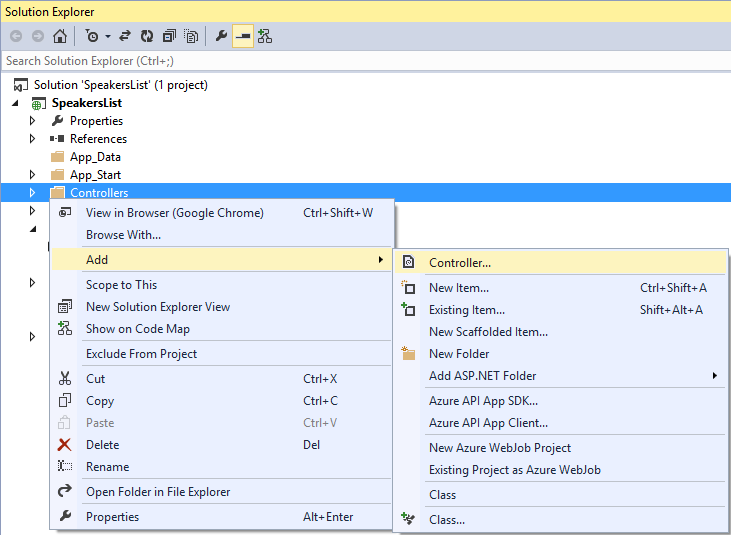 

8. In the **Add Scaffold** dialog, select the **Web API 2 Controller - Empty** option and click **Add**. 

	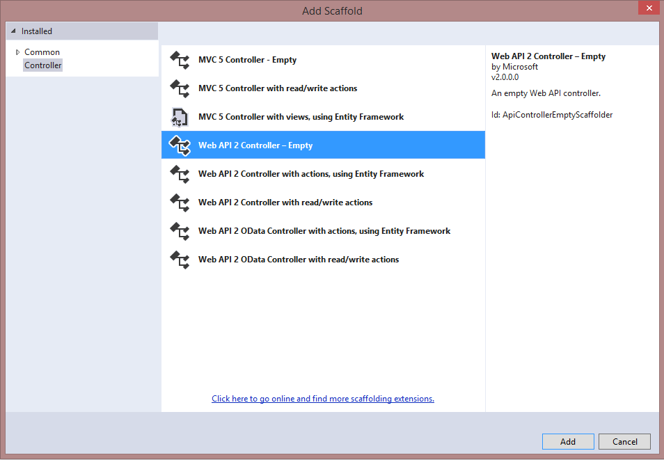 

9. Name the controller **SpeakersController** and click **Add**. 

	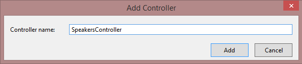 

10. Replace the code in the `SpeakersController.cs` file with the code below. Make sure to specify your own values for the &lt;serverName> and &lt;password> placeholders in the `connectionString`. The &lt;serverName> value is the machine name on which the SQL Server is located, and the &lt;password> value is the one you set when you installed and configured SQL Server.

	> [AZURE.NOTE] The following code snippet includes password information. This was done to keep the demo simple. In a real-world production environment, you should not store your credentials in code. Instead, refer to the [best practices for deploying passwords (and other sensitive data) to ASP.NET and Azure](http://www.asp.net/identity/overview/features-api/best-practices-for-deploying-passwords-and-other-sensitive-data-to-aspnet-and-azure).

		using System;
		using System.Collections.Generic;
		using System.Linq;
		using System.Net;
		using System.Net.Http;
		using System.Web.Http;
		using SpeakersList.Models;
		using System.Data.Sql;
		using System.Data.SqlClient;
		
		namespace SpeakersList.Controllers
		{
		    public class SpeakersController : ApiController
		    {
		        [HttpGet]
		        public IEnumerable<Speaker> Get()
		        {
					// Instantiate List object that will be populated and returned
					// from this method.
		            List<Speaker> speakers = new List<Speaker>();
	
					// Build database connection string.
		            string connectionString = "Server=<serverName>;" +
		                                      "Initial Catalog=LocalDatabase;" +
		                                      "User Id=sa;Password=<password>;" +
		                                      "Asynchronous Processing=true;";
		
					// Build query string to select all three columns from the Speakers table.
		            string queryString = "SELECT Id, EmailAddress, Name FROM dbo.Speakers;";

					// Instantiate the SqlConnection object using the connection string.
		            using (SqlConnection connection = new SqlConnection(connectionString))
		            {
						// Instantiate the SqlCommand object using the connection and query strings.
		                SqlCommand command = new SqlCommand(queryString, connection);

						// Open the connection to the database.
		                connection.Open();

						// Execute the command and return a SqlDataReader object
						// that can be iterated.
		                SqlDataReader reader = command.ExecuteReader();
		                try
		                {
							// Read a row from the SqlDataReader object
		                    while (reader.Read())
		                    {
								// For each row, use the returned data to instantiate
								// and add to the List a new Speaker object.
		                        speakers.Add(new Speaker 
		                            { 
		                                Id = Convert.ToInt32(reader[0]), 
		                                EmailAddress = reader[1].ToString(), 
		                                Name = reader[2].ToString() 
		                            }
		                        );
		                    }
		                }
		                finally
		                {
							// Close the SqlDataReader object.
		                    reader.Close();
		                }
		            }
					// Return the List of Speaker objects.
		            return speakers;
		        }
		    }
		}

### Enable Swagger UI

Enabling the Swagger UI will allow you to easily test your API app without having to write client code to call it.

1. Open the *App_Start/SwaggerConfig.cs* file, and search for **EnableSwaggerUI**:

	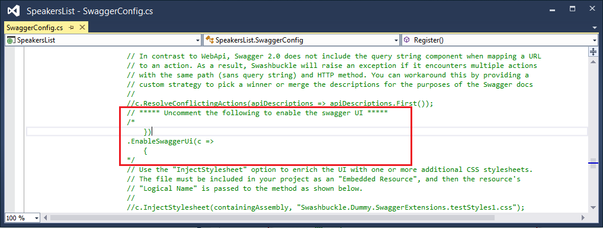 

2. Uncomment the following lines of code:

	        })
	    .EnableSwaggerUi(c =>
	        {

3. When you're done, verify that the file looks like the following image.

	 

### Test the API app

1. To view the API test page, run the app locally via **&lt;Ctrl>F5**. You should see an error similar to the following image.

	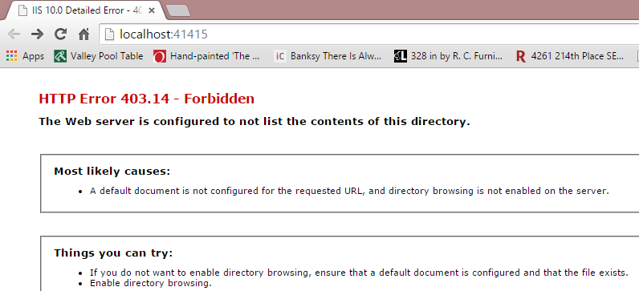 

2. In your browser's address bar, add `/swagger` to the end of the URL, and then click **&lt;Enter>**. This will display the Swagger UI you enabled in the previous section.  

	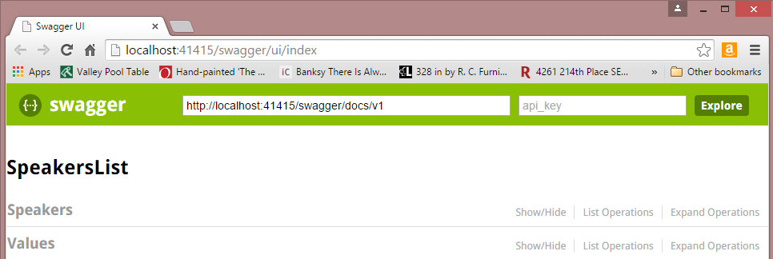 

3. Click the **Speakers** section to expand it.

4. Click **GET /api/speakers** to expand that section.

5. Click **Try it out!** to view the data you entered into the database earlier.

	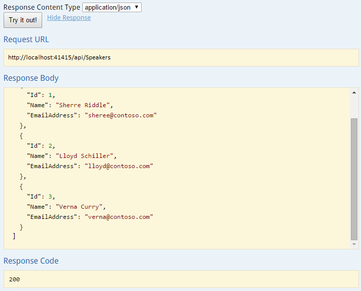 

### Deploying the API app

Now that you've tested the app locally, it's time to deploy the app to Azure.

1. In **Solution Explorer**, right-click the project (not the solution) and click **Publish...**. 

	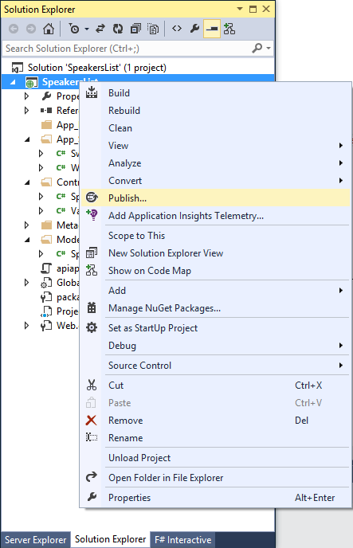

2. Click the **Profile** tab and click **Microsoft Azure API Apps (Preview)**. 

	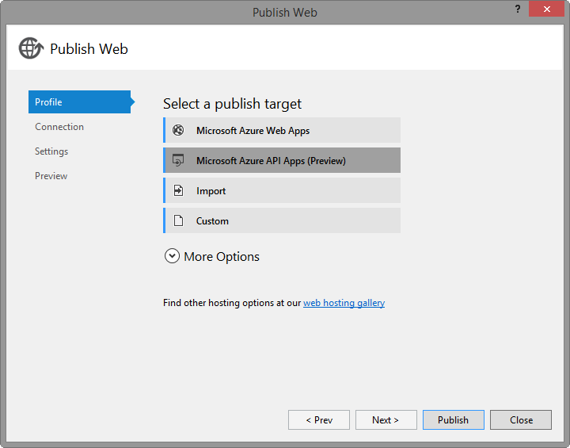

3. Click **New** to provision a new API app in your Azure subscription.

	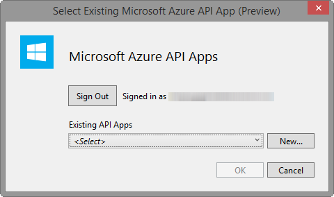

4. In the **Create an API App** dialog, enter the following:

	- Under **API App Name**, enter a name for the app. 
	- If you have multiple Azure subscriptions, select the one you want to use.
	- Under **App Service Plan**, select from your existing App Service plans, or select **Create new App Service plan** and enter the name of a new plan. 
	- Under **Resource Group**, select from your existing resource groups, or select **Create new resource group** and enter a name. The name must be unique; consider using the app name as a prefix and appending some personal information such as your Microsoft ID (without the @ sign).  
	- Under **Access Level**, select **Available to Anyone**. This option will make your API completely public, which is fine for this tutorial. You can restrict access later through the [Azure preview portal](https://portal.azure.com).
	- Select a region.

	Click **OK** to create the API app in your subscription. 

	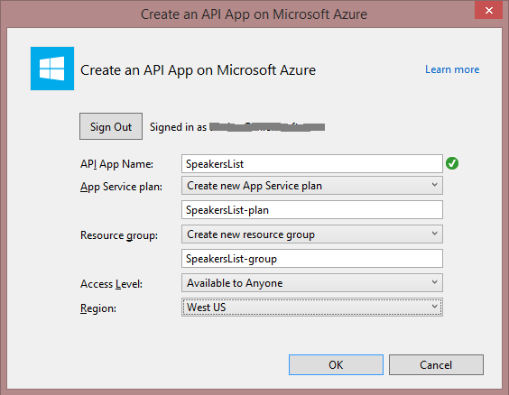

5. The process can take a few minutes, so Visual Studio shows a dialog notifying you that the process has initiated. Click **OK** to the confirmation dialog.

	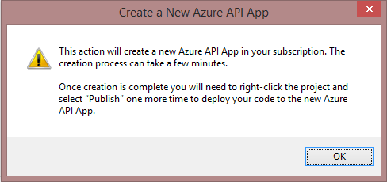

6. While the provisioning process is creating the resource group and API app in your Azure subscription, Visual Studio shows the progress in the **Azure App Service Activity** window. 

	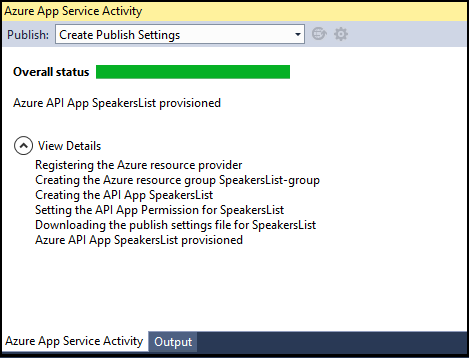

7. Once the API App is provisioned, right-click the project in **Solution Explorer** and select **Publish** to re-open the publish dialog. The publish profile created in the previous step should be pre-selected. Click **Publish** to begin the deployment process. 

	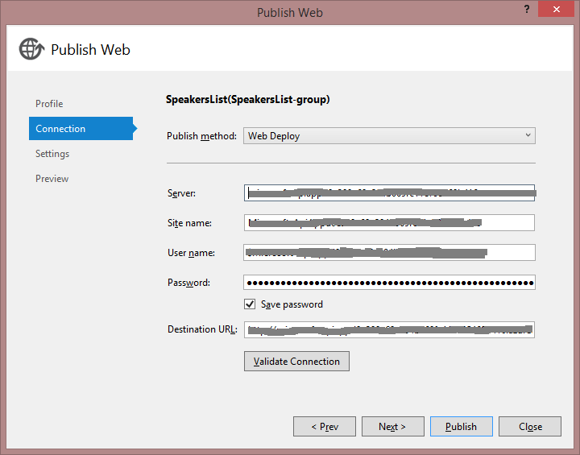

The **Azure App Service Activity** window shows the deployment progress, and will indicate when the publish process has completed. 

## Create a Hybrid Connection and a BizTalk Service ##

1. In your browser, navigate to the [Azure preview portal](https://portal.azure.com). 

2. Click the **Browse All** option on the left.

3. In the **Browse** blade, select **API Apps**.

4. In the **API Apps** blade, locate your API app and click it.

5. In your APII app's blade, click the value under **API app host**.  
 
	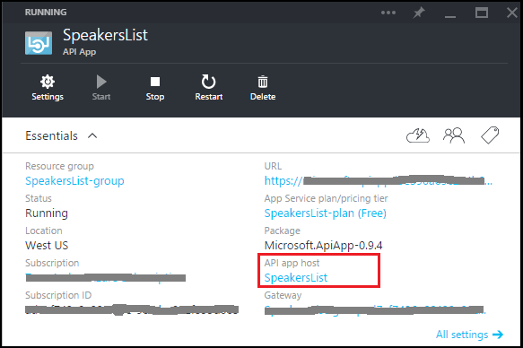

6. When the **API App Host** blade appears, scroll down to the **Networking** section and click **Hybrid connections**.
	
	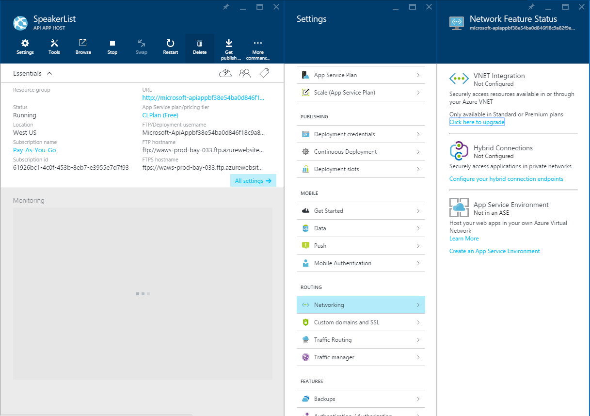
	
7. On the **Hybrid connections** blade, click **Add** > **New hybrid connection**.
	
8. On the **Create hybrid connection blade**:
	- For **Name**, provide a name for the connection.
	- For **Hostname**, enter the computer name of your SQL Server host computer.
	- For **Port**, enter `1433` (the default port for SQL Server).
	- Click **Biz Talk Service** and enter a name for the BizTalk service.
	
	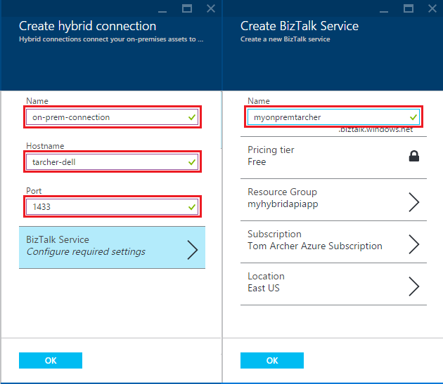
		
9. Click **OK** twice. 

	When the process completes, the **Notifications** area will flash a green **SUCCESS** and the **Hybrid connections** blade will show the new hybrid connection with the status as **Not connected**.
	
	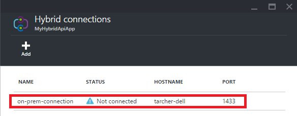
	
At this point, you have completed an important part of the cloud hybrid connection infrastructure. Next, you will create a corresponding on-premises piece.

## Install the on-premises Hybrid Connection Manager to complete the connection

[AZURE.INCLUDE [app-service-hybrid-connections-manager-install](../../includes/app-service-hybrid-connections-manager-install.md)]

Now that the hybrid connection infrastructure is complete, it's time to test the application.

## Test the completed API app on Azure

1. In the Azure preview portal, return to the API app host blade, and click the value under **URL**.
	
2. Once the API app's host page is displayed in your browser, append `/swagger` to the URL in your browser's address bar and click **&lt;Enter>**.
	
3. Click the **Speakers** section to expand it.

4. Click **GET /api/speakers** to expand that section.

5. Click **Try it out!** to view the data you entered into the database earlier.

	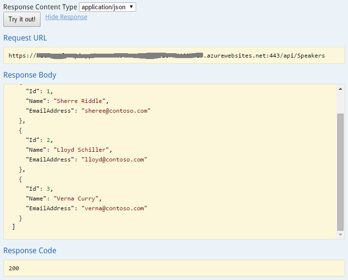 
	
**Congratulations!** You have created an API app that runs on Azure and uses a hybrid connection to connect to a local on-premises SQL Server database. 

## See Also
[Hybrid Connections overview](http://go.microsoft.com/fwlink/p/?LinkID=397274)

[Josh Twist introduces hybrid connections (Channel 9 video)](http://channel9.msdn.com/Shows/Azure-Friday/Josh-Twist-introduces-hybrid-connections)

[Hybrid Connections overview](/services/biztalk-services/)

[BizTalk Services: Dashboard, Monitor, Scale, Configure, and Hybrid Connection tabs](../biztalk-dashboard-monitor-scale-tabs/)

[Building a Real-World Hybrid Cloud with Seamless Application Portability (Channel 9 video)](http://channel9.msdn.com/events/TechEd/NorthAmerica/2014/DCIM-B323#fbid=)

[Connect to an on-premises SQL Server from an Azure mobile service using Hybrid Connections](../mobile-services-dotnet-backend-hybrid-connections-get-started.md)

[Connect to an on-premises SQL Server from Azure Mobile Services using Hybrid Connections (Channel 9 video)](http://channel9.msdn.com/Series/Windows-Azure-Mobile-Services/Connect-to-an-on-premises-SQL-Server-from-Azure-Mobile-Services-using-Hybrid-Connections)

[ASP.NET Identity Overview](http://www.asp.net/identity)

[AZURE.INCLUDE [app-service-web-whats-changed](../../includes/app-service-web-whats-changed.md)]
