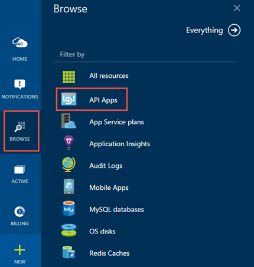
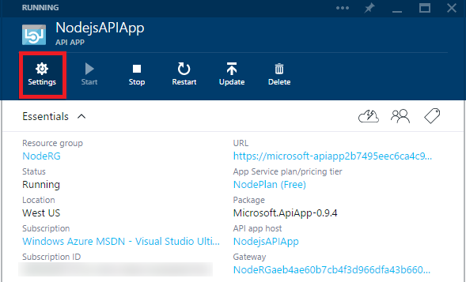
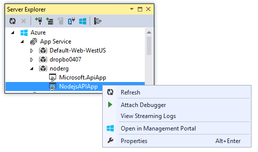

<properties 
	pageTitle="Manage and Monitor your built-in and custom API apps" 
	description="how to manage API apps by using the Azure preview portal and Visual Studio Server Explorer." 
	services="app-service\api" 
	documentationCenter="" 
	authors="tdykstra" 
	manager="wpickett" 
	editor="jimbe"/>

<tags 
	ms.service="app-service-api" 
	ms.workload="web" 
	ms.tgt_pltfrm="na" 
	ms.devlang="na"
	ms.topic="article" 
	ms.date="06/14/2015" 
	ms.author="tdykstra"/>

# Manage and Monitor your built-in and custom API apps

Use the Azure preview portal to perform API app management tasks. 

After you create your own API App or configure a built-in API App, you can use the portal to manage and monitor your API Apps. When creating your own API App, you can also do some management tasks in Server Explorer within Visual Studio. 

Some of the portal tasks include: 

- Configure authentication 
- Enable auto-scaling
- View logs
- See how many requests are made and see how much data is being used by your API app
- Backup your API App and create alerts
- Enable Tinfoil Security, and add users and roles.

This topic describes some of the different options. 

To see these built-in features, open your API App in the preview [Azure portal](http://go.microsoft.com/fwlink/p/?LinkID=525040). If the API App is on your startboard, select it to open the properties. You can also select **Browse**, select **API Apps**, and then select your API App: 

## Understanding API app architecture

In Azure App Service, every API app is a separate [web app](../app-service-web/app-service-web-overview.md) that has additional features for hosting web services. In the Azure preview portal, there is an **API app** blade for managing the API-specific features, and an **API App host** blade for managing its own underlying web app. 

Every resource group that contains at least one API app also includes a  *gateway*. The gateway acts as a proxy; handling authentication and other administrative functions for all API apps in a resource group. Like an API app, a gateway is a web app with extra functionality. There are two separate portal blades for managing the gateway: a **Gateway** blade for gateway-specific functions, and a **Gateway host** blade for managing its own underlying web app.

## Update the Settings of your custom API app

> [AZURE.NOTE] This section applies to custom API apps built by you. It does not apply to the  Microsoft built-in connectors and API apps available on the Marketplace. 

When you open your API App, you are in the API App blade. You can use **Settings** for additional configuration options: 

Some examples include: 

- **Configure access level** (**Settings** > **Application settings**) : The default value is internal, which means only API apps in the same resource group are allowed to call the API app. For more information, see [Protect an API app](app-service-api-dotnet-add-authentication.md).   
- **Configure update policy** (**Settings** > **Application settings**) : Default value is **On**.  This means that when a new version of the API app is published to the marketplace, your API app is automatically  updated to the new version if it is a non-breaking change.  
- **Configure authentication for outgoing calls from the API app** (**Settings** > **Authentication**) : If the API app makes calls to an external service that requires authentication, the required configuration values are entered here. For example, a Dropbox connector requires a client ID and a client secret to access the Dropbox service.
- **Configure [RBAC](../role-based-access-control-configure.md)** (**Settings** > **Users**) : User access that you configure here determines only who can access the API-app-specific features. To configure RBAC for the web app features, use the **API app host** blade. Normally you would want to keep the RBAC settings for the API app and the API app host in sync. If you give someone access to the API app but not the API app host, they won't be able to use the features on the **API app** blade that actually pertain to the API app host. The relationship between the **API app** blade and the **API app host** blade is explained below.
- **View API definition** (**API definition**) : The **Summary** section lists all of the methods exposed by the **API app**.

#### Comparing the API app and API app host 

Many of the tasks and features within the API app are also available when you select **API app host**: 

You can: 

- Stop, start, and restart the web app that hosts your custom API app. These tasks can also be done in **API app host**. The two blades share much of the same UI. 
- The monitoring information provided on the **API app** blade is the same as what **API app host** shows. 
- The only tasks in **API app** blade that are not duplicates from  **API app host** are previously listed, like configure the authentication and the other tasks listed.

You can use **API app host** for all of the tasks that you would do for any web app. For more information, see [Manage web apps in the portal](../app-service-web/web-sites-manage.md).

#### Comparing the Gateway and Gateway host tasks

In **Gateway**,  you can:

- **Authentication provider configuration for incoming calls to API apps** (**Settings** > **Identity**) : If the gateway needs to authenticate users before allowing them to call API apps in the resource group, the required configuration values are entered here. For more information, see [Configure and test a SaaS connector in Azure App Service](app-service-api-connnect-your-app-to-saas-connector.md). 
- **Configure [RBAC](../role-based-access-control-configure.md)** (**Settings** > **Users**) : The same comments above explaining the relationship between RBAC configuration entered on the API app and API app host blades applies to the Gateway and Gateway host blades.

You can use **Gateway Host** for all of the tasks that you would do for any web app. For more information, see [Manage web apps in the portal](../app-service-web/web-sites-manage.md).  

## See the properties you entered

When you open the API App, there are several features and tasks you can do, including: 

- Use the **Start** and **Stop** buttons to control the API App.
- When product updates are made to the underlying files used by your API App, you can click **Update** to get the latest versions. For example, if there is a fix or a security update, clicking **Update** automatically updates your API App to include this fix. 
- Select **Change Plan** to upgrade or downgrade based on the data usage of the API App. You can also use this feature to see your data usage.
- When you configure a built-in connector (like the SQL Connector), you can optionally enter a table name. A schema based on the table is automatically created and available when you click **Download Schemas**. You can then use this schema to create a transform or a map. 
- Select **API definition** to open the automatically-created Swagger file for your specific API app.

## Install the Hybrid Connection Manager

> [AZURE.NOTE] This section applies to the Microsoft built-in connectors and API apps available on the Marketplace. It does not apply to custom API apps built by you.

The Hybrid Connection Manager gives you the ability to connect to an on-premises system, like SQL Server or SAP. This hybrid connectivity uses Azure Service Bus to connect and control the security between your Azure resources and your on-premises resources.

See [Using the Hybrid Connection Manager in Azure App Service](../app-service-logic/app-service-logic-hybrid-connection-manager.md). 

## Monitor the performance
Performance metrics are built-in features and included with every API App, custom or built-in. These metrics are specific to your API App hosted in Azure.  

You can: 

- Select **Requests and errors** to add different performance metrics including commonly-known HTTP error codes, like 200, 400, or 500 HTTP status codes. You can also see response times,  see how many requests are made to the API App, and see how much data comes in and how much data goes out. Based on the performance metrics, you can create email Alerts if a metric exceeds a threshold of your choosing. 
- In **Usage**, you can see how much **CPU** is used by the API App, review the current **Usage Quota** in MB, and see your maximum data usage based on your cost tier. **Estimated spend**  can help you determine the potential costs of running your API App.
- View the application logs and other IIS logs, including web server logs and FREB logs.
- Select **Processes** to open Process Explorer. This shows your web instances and their properties, including thread count and memory usage.

Using these tools, you can determine if the App Service Plan should be scaled up or scaled down, based on your business needs. These features are built-in to the portal with no additional tools required. 

## Control the security

API Apps uses role-based security. These roles apply to the entire Azure experience, including API Apps and other Azure resources. The roles include:

Role | Description
--- | ---
Owner | Have full access to the management experience and can give access to other users or groups.
Contributor | Have full access to the management experience. Cannot give access to other users or groups.
Reader | Can view all resources except secrets.
User Access Administrator | Can view all resources, create/manage roles, and create/manage support tickets.

See [Role-based access control in the Microsoft Azure portal](../role-based-access-control-configure.md).

You can easily add users and assign them specific roles to your API App. The portal shows you the users that have access and their assigned role.

- Select **Users** to add a user, assign a role, and remove a user.
- Select **Roles** to see all the users in a specific role, add a user to a role, and remove a user from a role. 

## Access API apps in Server Explorer in Visual Studio

> [AZURE.NOTE] This section applies to custom API apps built by you. It does not apply to the  Microsoft built-in connectors and API apps available on the Marketplace. 

In Server Explorer in Visual Studio you can start a remote debugging session, view streaming logs, and click a menu entry that opens the API app blade in the portal.

To get to an API app in Server Explorer, click **Azure > App Service > [the resource group name] > [the API app name]**:

## Learn More

[What are API apps?](app-service-api-apps-why-best-platform.md) 
[Role-based access control in the Microsoft Azure portal](../role-based-access-control-configure.md) 
 