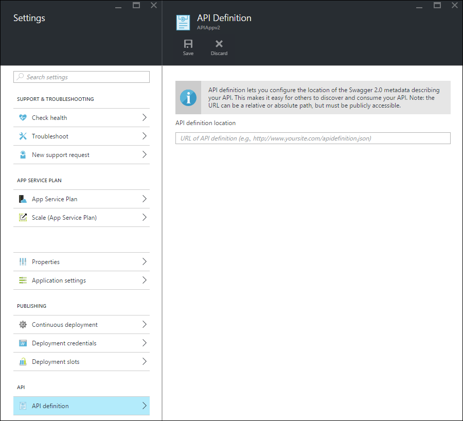

<properties
	pageTitle="App Service API Apps metadata for API discovery and code generation | Microsoft Azure"
	description="Learn how API Apps in Azure App Service use Swagger metadata to facilitate API discovery and code generation."
	services="app-service\api"
	documentationCenter=".net"
	authors="tdykstra"
	manager="wpickett"
	editor=""/>

<tags
	ms.service="app-service-api"
	ms.workload="na"
	ms.tgt_pltfrm="na"
	ms.devlang="na"
	ms.topic="article"
	ms.date="02/16/2016"
	ms.author="tdykstra"/>

# App Service API Apps metadata for API discovery and code generation 

Support for [Swagger 2.0](http://swagger.io/) API metadata is built into App Service API Apps. You don't have to use Swagger, but if you do use it, you can take advantage of API Apps features that make discovery and consumption easier.   

## Swagger endpoint

You can specify an endpoint that provides Swagger 2.0 JSON metadata for an API app in a property of the API app. The endpoint can be relative to the base URL of the API app or an absolute URL. Absolute URLs can point outside the API app. 

Many downstream clients (for example, Visual Studio code generation and PowerApps "Add API" flow), the URL must be publicly accessible (not protected by user or service authentication). This means that if you're using App Service authentication and want to expose the API definition from within your app itself, you need to use authentication option that allows anonymous traffic to reach your API. For more information, see [Authentication and authorization for App Service API Apps](app-service-api-authentication.md).

### Portal blade

In the [Azure portal](https://portal.azure.com/) the endpoint URL can be seen and changed on the **API Definition** blade.

### Azure Resource Manager property

You can also configure the API definition URL for an API app by using Azure Resource Manager tooling such as Azure PowerShell, CLI or [Resource Explorer](https://resources.azure.com/). 

Set the `apiDefinition` property on the Microsoft.Web/sites/config resource type for your <site name>/web resource. For example, in **Resource Explorer**, go to **subscriptions > {your subscription} > resourceGroups > {your resource group} > providers > Microsoft.Web > sites > {your site} > config > web**, and you'll see the cors property:

		"apiDefinition": {
		  "url": "https://contactslistapi.azurewebsites.net/swagger/docs/v1"
		}

### Default value

When you use Visual Studio to create an API app, the API definition endpoint is automatically set to the base URL of the API app plus `/swagger/docs/v1`. This is the default URL that the [Swashbuckle](https://www.nuget.org/packages/Swashbuckle) NuGet package uses to serve dynamically generated Swagger metadata for an ASP.NET Web API project. 

## Code generation

One of the benefits of integrating Swagger into Azure API apps is automatic code generation. Generated client classes make it easier to write code that calls an API app.

You can generate client code for an API app by using Visual Studio or from the command line. For information about how to generate client classes in Visual Studio for an ASP.NET Web API project, see [Get started with API Apps and ASP.NET](app-service-api-dotnet-get-started.md#codegen). For information about how to do it from the command line for all supported languages, see the readme file of the [Azure/autorest](https://github.com/azure/autorest) repository on GitHub.com.
 
## Next steps

For a step-by-step tutorial that guides you through creating, deploying, and consuming an API app, see [Get started with API Apps in Azure App Service](app-service-api-dotnet-get-started.md).
