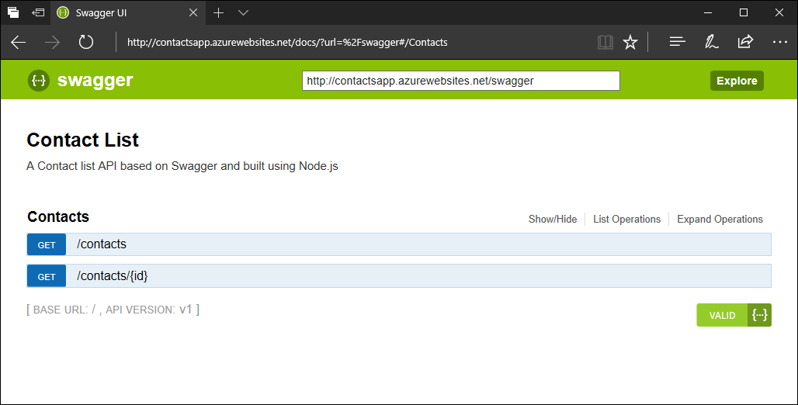

# Build a Node.js RESTful API and deploy it to an API app in Azure
[!INCLUDE [app-service-api-get-started-selector](../../includes/app-service-api-get-started-selector.md)]

This quickstart shows how to create an [Express](http://expressjs.com/) framework Node.js REST API using from a [Swagger](http://swagger.io/) definition and deploy it as an [API app](app-service-api-apps-why-best-platform.md)  on Azure. You create the app using command-line tools, configure resources with the [Azure CLI](https://docs.microsoft.com/cli/azure/get-started-with-azure-cli),  and deploy the app using Git.  When you've finished, you have a working sample REST API running on Azure.

## Prerequisites

* [Git](https://git-scm.com/)
* [Node.js and NPM](https://nodejs.org/)

[!INCLUDE [quickstarts-free-trial-note](../../includes/quickstarts-free-trial-note.md)]

[!INCLUDE [cloud-shell-try-it.md](../../includes/cloud-shell-try-it.md)]

If you choose to install and use the CLI locally, this topic requires that you are running the Azure CLI version 2.0 or later. Run `az --version` to find the version. If you need to install or upgrade, see [Install Azure CLI 2.0]( /cli/azure/install-azure-cli). 

## Prepare your environment

1. In a terminal window, run the following command to clone the sample to your local machine.

    ```bash
    git clone https://github.com/Azure-Samples/app-service-api-node-contact-list
    ```

2. Change to the directory that contains the sample code.

    ```bash
    cd app-service-api-node-contact-list
    ```

3. Install [Swaggerize](https://www.npmjs.com/package/swaggerize-express) on your local machine. Swaggerize is a tool that generates Node.js code for your REST API from a Swagger definition.

    ```bash
    npm install -g yo
    npm install -g generator-swaggerize
    ```

## Generate Node.js code 

This section of the tutorial models an API development workflow in which you create Swagger metadata first and use that to scaffold (auto-generate) server code for the API. 

Change directory to the *start* folder, then run `yo swaggerize`. Swaggerize creates a Node.js project for your API from the Swagger definition in *api.json*.

    ```bash
    cd start
    yo swaggerize --apiPath api.json --framework express
    ```

     When Swaggerize asks for a project name, use *ContactList*.
   
   ```bash
   Swaggerize Generator
   Tell us a bit about your application
   ? What would you like to call this project: ContactList
   ? Your name: Francis Totten
   ? Your github user name: fabfrank
   ? Your email: frank@fabrikam.net
   ```
   
## Customize the project code

1. Copy the *lib* folder into the *ContactList* folder created by `yo swaggerize`, then change directory into *ContactList*.

    ```bash
    cp -r lib/ ContactList/
    cd ContactList
    ```

2. Install the `jsonpath` and `swaggerize-ui` NPM modules. 

    ```bash
    npm install --save jsonpath swaggerize-ui
    ```

3. Replace the code in the *handlers/contacts.js* with the following code: 
    ```javascript
    'use strict';

    var repository = require('../lib/contactRepository');

    module.exports = {
        get: function contacts_get(req, res) {
            res.json(repository.all())
        }
    };
    ```
    This code uses the JSON data stored in *lib/contacts.json* served by *lib/contactRepository.js*. The new *contacts.js* code returns all contacts in the repository as a JSON payload. 

4. Replace the code in the **handlers/contacts/{id}.js** file with the following code:

    ```javascript
    'use strict';

    var repository = require('../../lib/contactRepository');

    module.exports = {
        get: function contacts_get(req, res) {
            res.json(repository.get(req.params['id']));
        }    
    };
    ```

    This code lets you use a path variable to return only the contact with a given ID.

5. Replace the code in **server.js** with the following code:

    ```javascript
    'use strict';

    var port = process.env.PORT || 8000; 

    var http = require('http');
    var express = require('express');
    var bodyParser = require('body-parser');
    var swaggerize = require('swaggerize-express');
    var swaggerUi = require('swaggerize-ui'); 
    var path = require('path');

    var app = express();

    var server = http.createServer(app);

    app.use(bodyParser.json());

    app.use(swaggerize({
        api: path.resolve('./config/swagger.json'),
        handlers: path.resolve('./handlers'),
        docspath: '/swagger' 
    }));

    // change four
    app.use('/docs', swaggerUi({
        docs: '/swagger'  
    }));

    server.listen(port, function () { 
    });
    ```   

    This code makes some small changes to let it work with Azure App Service and exposes an interactive web interface for your API.

### Test the API locally

1. Start up the Node.js app
    ```bash
    npm start
    ```
    
2. Browse to http://localhost:8000/contacts to view the JSON for the entire contact list.
   
   ```json
    {
        "id": 1,
        "name": "Barney Poland",
        "email": "barney@contoso.com"
    },
    {
        "id": 2,
        "name": "Lacy Barrera",
        "email": "lacy@contoso.com"
    },
    {
        "id": 3,
        "name": "Lora Riggs",
        "email": "lora@contoso.com"
    }
   ```

3. Browse to http://localhost:8000/contacts/2 to view the contact with an `id` of two.
   
    ```json
    { 
        "id": 2,
        "name": "Lacy Barrera",
        "email": "lacy@contoso.com"
    }
    ```

4. Test the API using the Swagger web interface at http://localhost:8000/docs.
   
    

## <a id="createapiapp"></a> Create an API App

In this section, you use the Azure CLI 2.0 to create the resources to host the API on Azure App Service. 

1.  Log in to your Azure subscription with the [az login](/cli/azure/#login) command and follow the on-screen directions.

    ```azurecli-interactive
    az login
    ```

2. If you have multiple Azure subscriptions, change the default subscription to the desired one.

    ````azurecli-interactive
    az account set --subscription <name or id>
    ````

3. [!INCLUDE [Create resource group](../../includes/app-service-api-create-resource-group.md)] 

4. [!INCLUDE [Create app service plan](../../includes/app-service-api-create-app-service-plan.md)]

5. [!INCLUDE [Create API app](../../includes/app-service-api-create-api-app.md)] 


## Deploy the API with Git

Deploy your code to the API app by pushing commits from your local Git repository to Azure App Service.

1. [!INCLUDE [Configure your deployment credentials](../../includes/app-service-api-configure-local-git.md)] 

2. Initialize a new repo in the *ContactList* directory. 

    ```bash
    git init .
    ```

3. Exclude the *node_modules* directory created by npm in an earlier step in the tutorial from Git. Create a new `.gitignore` file in the current directory and add the following text on a new line anywhere in the file.

    ```
    node_modules/
    ```
    Confirm the `node_modules` folder is being ignored with  `git status`.

4. Commit the changes to the repo.
    ```bash
    git add .
    git commit -m "initial version"
    ```

5. [!INCLUDE [Push to Azure](../../includes/app-service-api-git-push-to-azure.md)]  
 
## Test the API  in Azure

1. Open a browser to http://app_name.azurewebsites.net/contacts. You see the same JSON returned as when you made the request locally earlier in the tutorial.

   ```json
   {
       "id": 1,
       "name": "Barney Poland",
       "email": "barney@contoso.com"
   },
   {
       "id": 2,
       "name": "Lacy Barrera",
       "email": "lacy@contoso.com"
   },
   {
       "id": 3,
       "name": "Lora Riggs",
       "email": "lora@contoso.com"
   }
   ```

2. In a browser, go to the `http://app_name.azurewebsites.net/docs` endpoint to try out the Swagger UI running on Azure.

    

    You can now deploy updates to the sample API to Azure simply by pushing commits to the Azure Git repository.

## Clean up

To clean up the resources created in this quickstart, run the following Azure CLI command:

```azurecli-interactive
az group delete --name myResourceGroup
```

## Next step 
> [!div class="nextstepaction"]
> [Consume API apps from JavaScript clients with CORS](app-service-api-cors-consume-javascript.md)

